<!--yml

类别：未分类

日期：2024-05-18 13:45:32

-->

# 方向变化预测 | Quantivity

> 来源：[`quantivity.wordpress.com/2012/01/16/sign-direction-of-change-forecasting/#0001-01-01`](https://quantivity.wordpress.com/2012/01/16/sign-direction-of-change-forecasting/#0001-01-01)

[指数回报分解](https://quantivity.wordpress.com/2011/12/14/index-return-decomposition/)促使几位读者询问*预测回报符号*，如  分解变量所示。这是一个值得审查的有趣主题，快速查阅文献的直觉，并提供一些用于探索性分析的 R 代码。

这个主题在文献中被称为*方向变化*预测。毫无疑问，成功预测未来回报的符号对于交易是非常有趣的。传统上，只考虑单变量回报序列；[Anatolyev (2008)](http://www.nes.ru/~sanatoly/Papers/DepRatio.pdf) 是一个例外，通过依赖比建模两个或更多相关市场。这个文献倾向于有点晦涩，因为关于条件回报动态的常见未说明的风格假设。

这个主题的传统公式考虑了超过上限或下限 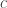 的回报的概率的估计，可选择地在前一时间步骤的信息集 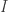 条件下：

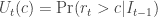

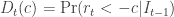

如果 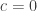，则概率会减少到预测正向或负向回报；对于交易， 的一个自然选择是往返交易成本：

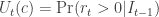

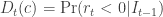

估计这些概率可以通过几种技术进行。一种方法是使用基于逻辑函数的 logit 模型：

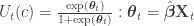

其中 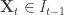 是来自前一时间步骤的解释变量。该模型的挑战是正确选择解释变量。

另一种方法是考虑以下单变量回报序列的功能分解：

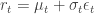

当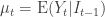时，条件期望值为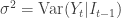，而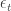是一个零均值、单位方差、条件分布函数为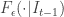的鞅。由此可得变化概率的方向表达式：

![U_t(c) = \text{Pr} \left[ (\mu_t + \sigma_t \epsilon_t) > c \right] = \text{Pr} \left[ \epsilon_t > \left( \frac{c - \mu_t}{\sigma_t} \right) \right] ](img/5a217bea741b4e94a59967cae9effe28.png)

![D_t(c) = \text{Pr} \left[ (\mu_t + \sigma_t \epsilon_t) < -c \right] = \text{Pr} \left[ \epsilon_t < \left( \frac{-c - \mu_t}{\sigma_t} \right) \right] ](img/1340ed7a5fc3a9ffc00553dad4735f7b.png)

具有相应条件期望：

![E \left[U_t(c) | I_{t-1} \right] = 1 - F_r(c | I_{t-1}) = 1 - F_{\epsilon} \left( \frac{c - \mu_t}{\sigma_t} | I_{t-1} \right) ](img/fc622942bec3329d45ee513239a781c8.png)

![E \left[D_t(c) | I_{t-1} \right] = F_r(c | I_{t-1}) = F_{\epsilon} \left( \frac{-c - \mu_t}{\sigma_t} | I_{t-1} \right) ](img/c1d512788180b38ef53d4eac92fba339.png)

当时，这些期望简化为以下形式，假设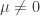（否则，期望是常数，因此不是很有趣）：

![E \left[U_t(c) | I_{t-1} \right] = 1 - F_{\epsilon} \left( \frac{- \mu_t}{\sigma_t} | I_{t-1} \right) ](img/bf794237745a9b7c6cb6e4611a5653d6.png)

![E \left[D_t(c) | I_{t-1} \right] = F_{\epsilon} \left( \frac{- \mu_t}{\sigma_t} | I_{t-1} \right) ](img/c1d46838dcfedbe72144d2f383e48788.png)

可通过计算经验分布函数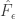（需要对参数分布假设）来明确评估这些期望值，其中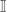是指示函数：

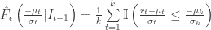

或者，此分解提出了上述模型中的 Logit 参数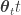的一个潜在表述，其中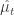由 Logit 估计，而是历史观察值：

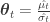

当然，非平凡的工作是生成下一步平均条件收益  和条件方差 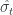 的预测估计。

对于模型化逻辑参数 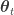 的另一种方法是应用二元自回归（BARMA），其 ARMA 直觉归因于 Startz (2006)，包括自回归参数和过去指示器值的滞后，由 [Anatolyev (2008)](http://www.nes.ru/~sanatoly/Papers/DepRatio.pdf) 提出：

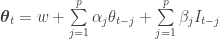

对估计技术的调查可能会在后续的帖子中考虑，具体取决于读者的兴趣。

* * *

与符号预测相关的一种探索性分析技术是可视化上涨/下跌运行、符号差异（*即* 上升-下降）以及收益系列对应的平均值。

```

returnRuns <- function(r, bound=0, doPlot=TRUE, startAvg=5, avgLen=-1)
{
  # Generate up/down runs and average runs for a return series, optionally
  # plotting them.
  #
  # Args:
  #   r: return series
  #   bound: symmetric upper and lower bound, aka c
  #   doPlot: flag indicating whether plots should be generated for runs
  #   startAvg: Number of average runs which should be excluded for
  #             eliminating unstable average with few leading observations
  #   avgLen: number of periods over which to generate average; of -1 for
  #           entire period
  #
  # Returns: none

  up <- cumsum(ifelse(r > bound, 1, 0))
  down <- cumsum(ifelse(r < -bound, 1, 0))

  if (doPlot)
  {
    plot(up, main='Signed Runs: Up & Down', ylim=range(up,down))
    lines(down, col='red')
    legend("topleft",legend=c("Up","Down"), fill=colors, cex=0.5)

    plot(up-down, main="Signed Run Difference (up-down)")
  }

  if (avgLen == -1)
  {
    avgUp <- xts(sapply(c(1:length(up)), function(i) {
      up[i]/i
    }), order.by=index(up))
    avgDown <- xts(sapply(c(1:length(down)), function(i) {
      down[i]/i
    }), order.by=index(up))
  } else
  {
    avgUp <- xts(sapply(c(avgLen:length(up)), function(i) {
      start <- i - avgLen + 1
      last(cumsum(ifelse(r[start:i] > bound, 1, 0))) / avgLen
    }), order.by=index(up[avgLen:length(up)]))
    avgDown <- xts(sapply(c(avgLen:length(down)), function(i) {
      start <- i - avgLen + 1
      last(cumsum(ifelse(r[start:i] < bound, 1, 0))) / avgLen
    }), order.by=index(up[avgLen:length(up)]))
  }

  if (doPlot)
  {
    n <- length(avgUp)
    plot(avgUp[startAvg:n], main=paste("Average Runs: Up & Down (",avgLen," periods)",sep=""), type='l', ylim=range(avgUp,avgDown))
    lines(avgDown[startAvg:n], col='red')
    legend("topleft",legend=c("Up","Down"), fill=colors, cex=0.5)
  }

  return (list(up=up, down=down, avgUp=avgUp, avgDown=avgDown))
}

```

例如，以下图表展示了从 2005 年到现在的 CRM 运行动态。第一个图表展示了上涨和下跌收益的累计和，表明负收益更为普遍：


第二个图表展示了符号累加和的差异，显示了上涨和下跌收益之间的时间动态。毫不奇怪，这种差异与 CRM 价格曲线密切相关：


第三个图表展示了整个时间范围内逐渐累积的上涨和下跌的平均概率：


* * *

以下是代表性的关于价格变动方向文献，忽略了早期关注评估市场效率的论文（*例如* 运行检验）：

+   [股票指数预测：分类与水平估计模型的比较](http://www.neurogest.com/papers/forecasting_stock_indices.pdf)，由 Leunga、Daoukb 和 Chenc (2000) 撰写

+   [金融、资产回报、市场定时和波动性动态](http://papers.ssrn.com/sol3/papers.cfm?abstract_id=306127)，由 Christoffersen 和 Diebold (2002) 撰写

+   [基于条件方差、偏度和峰度动态的变动方向预测：国际证据](http://papers.ssrn.com/sol3/papers.cfm?abstract_id=908317)，由 Christoffersen *等* (2004) 撰写

+   [股票价格变动方向可预测吗？统计理论与证据](http://www.ims.nus.edu.sg/Programs/econometrics/files/ymh_paper.pdf)，由 Hong 和 Chung (2003) 撰写

+   [评估变化方向预测：神经模糊模型 vs. 神经网络](http://papers.ssrn.com/sol3/papers.cfm?abstract_id=675623)，作者：Bekiros 和 Georgoutsos（2005 年）

+   [通过分解建模金融回报动态](http://www.cefir.ru/papers/WP95Anatolyev.pdf)，作者：Anatolyev 和 Gospodinov（2007 年）

+   [变化方向的日内预测与交易策略盈利能力](http://www.nes.ru/dataupload/files/programs/econ/preprints/2007/Deliya.pdf)，作者：Deliya（2007 年）

+   [使用依赖比例进行多市场变化方向建模](http://www.nes.ru/~sanatoly/Papers/DepRatio.pdf)，作者：Anatolyev（2008 年）

+   [用动态二元概率模型预测美国股市方向](http://ethesis.helsinki.fi/julkaisut/eri/hecer/disc/227/forecast.pdf)，作者：Nyberg（2008 年）

+   [贝叶斯学习用于 MLP 的变化方向金融时间序列预测](http://www.iaeng.org/publication/WCE2008/WCE2008_pp1160-1165.pdf)，作者：Skabar（2008 年）

+   [基于核的技术用于变化方向金融时间序列预测](http://www.springerlink.com/content/f53731054u1761w7/)，作者：Skabar（2008 年）

+   [金融回报的最优概率和方向预测](http://econlab.uom.gr/econdep/images/stories/tpanag/Thomacos_seminar.pdf)，作者：Thomakos 和 Wang（2009 年）

+   [非对称损失条件下收益方向的预测：直接和间接方法](http://www.cefir.ru/papers/WP136.pdf)，作者：Anatolyev 和 Kryzhanovskaya（2009 年）

+   [市场每天都在变化：来自交易方向记忆的证据](http://papers.ssrn.com/sol3/papers.cfm?abstract_id=1735352)，作者：Skouras 和 Axioglou（2011 年）

最后，Kinlay 在两篇关于[波动率符号预测](http://jonathankinlay.com/index.php/category/volatility-sign-prediction-forecasting-engle/)的文章中简要概述了这个主题。
