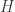

<!--yml

category: 未分类

date: 2024-05-18 13:48:18

-->

# Empirical Copulas and Hedge Basis Risk | Quantivity

> 来源：[`quantivity.wordpress.com/2011/10/10/empirical-copulas-and-proxy-cross-hedge-basis-risk/#0001-01-01`](https://quantivity.wordpress.com/2011/10/10/empirical-copulas-and-proxy-cross-hedge-basis-risk/#0001-01-01)

最近引入的[proxy hedge model](https://quantivity.wordpress.com/2011/10/02/proxy-cross-hedging)及其对应的[empirical proxy quantiles](https://quantivity.wordpress.com/2011/10/03/empirical-quantiles-proxy-cross-hedging-selection)与基础对冲之间的*联合协变*具有隐含的依赖关系。特别感兴趣的是在极端情况下（上升和下降均适用）理解*基础风险*的动态，这是由时变随机联合协变驱动的。

这篇文章通过[copulas](http://en.wikipedia.org/wiki/Copula_%28probability_theory%29)定量和可视化了这种联合协变和基础风险，包括使用 fat-tailed [学生-t](http://en.wikipedia.org/wiki/Student%27s_t-distribution)分布对边际和联合分布进行建模和经验拟合。Copulas 利用多维样本排序，因此在主题上与经验分位数类似。这个分析还试图举例说明了用 R 进行 copula 分析的实际用途。

对经典[依赖统计](http://en.wikipedia.org/wiki/Correlation_and_dependence)的不足进行简要回顾（如相关性和协方差）激发了对 copulas 和相关技术的使用：

+   **正态性**: 无论适用性如何，都假设了一种形式或另一种形式的联合正态性

+   **汇总统计**: [点估计](http://en.wikipedia.org/wiki/Point_estimation)将复杂的协变关系简化为单个数字

+   **边际-联合混淆**: 对边际和联合考虑混淆，而不是提供清晰和独立的分离

+   **可视化差**: 几乎没有可视化技术存在，减少了几何和拓扑直觉的可能性

以下美丽的分解由[Sklar (1959)](http://www.jstor.org/pss/4355880)解决了这些不足：


其中和是一维分布，是具有边缘分布和的二维分布函数，是一个 Copula。请注意，任何或所有的、和都可以经验拟合。建议对 Copulas 不熟悉的读者参考[Trivedi 和 Zimmer（2005）](http://http://bit.ly/pMjQR4)或[Cherubini *et al.*（2004）](http://books.google.com/books?id=0dyagVg20XQC)。

从概念上讲，这种技术为分析代理套期保值基础风险提供了几个有用的好处：

+   **机制**：任何联合分布都可以通过两个边缘和一个 Copula“粘合”双向地进行

+   **独特性**：在对当前目的合理的条件下，Copula 是唯一的

+   **完整性**：联合协变量可以完全由 Copula 独立地描述，与边际无关

+   **可视化**：Copulas 可以以轮廓图和密度图形式进行图形化呈现

毫不拖泥带水，以下图表通过*经验代理 Copula*（1254 个每日观测值）展示了知名科技股和 QQQ 线性收益的每日联合协变量的可视化结果，该 Copula 是通过[经验分位数和代理选择](https://quantivity.wordpress.com/2011/10/03/empirical-quantiles-proxy-cross-hedging-selection)引入的。注意，这些图表展示了与 CRM / QQQ 的边际密度*无关的联合协变量*：


左上角的图表展示了排名伪观测的散点图；右上角的图表展示了从拟合 Copula 中随机抽取的 1000 个样本的散点图；左下角的图表展示了经验 Copula 轮廓；右下角的图表展示了经验 Copula 的透视图。比较这种多样化的可视化方法与单一数字（*例如*相关性统计，其恰好等于`0.777`）之间的差异。

深入了解边际和 Copula 分布对于进一步理解这种关系是必要的。与标准惯例一致，假设所有分布都是带有经验拟合自由度的学生 t 分布。边际的参数为：

`CRM 位置 0.0003，尺度 0.0218，自由度 3.489

QQQ 位置 0.001，尺度 0.0100，自由度 2.767`

表明边缘分布与正态分布有很大差异，存在着较宽的尾部，这是由于自由度较小所致。这与 Schoeffel 在他[最近（2011 年）的文章](http://arxiv.org/abs/1110.1006)中对期货（注意频率和对数收益之间的差异）的 3 df 估计相匹配。

类似地，假定尾夸拉服从学生 t 分布，估计的自由度为`3.975`，相关系数为`0.6868`。经验代理尾夸拉的双变量关联度量为：

`tau 0.481

相关系数 0.669

尾指数：0.381 0.381`

表明这个尾夸拉也与正态分布明显偏离，尾部很厚。

总结：这些图表和拟合分布证实了从[先前的帖子](https://quantivity.wordpress.com/2011/10/03/empirical-quantiles-proxy-cross-hedging-selection)中观察到的结论：尽管 CRM 和 QQQ 具有协变性，但存在*高基差风险*——包括许多几乎逆相关的观察结果。换句话说，QQQ 代理很可能导致相当昂贵的对冲错误。

* * *

用于生成上述经验代理尾夸拉分析（以及可能在随后的帖子中涵盖的更多内容）的 R 代码：

```

require("copula")
require("fSeries")

exploreProxyDist <- function(p, doExcess=TRUE, partitions=1)
{
  # Analyze distribution and copula of proxy daily returns.
  #
  # Args:
  #   p: matrix of instrument price data, including valid colnames
  #   doExcess: flag indicating whether to perform analysis on excess returns, 
  #             in addition to raw returns
  #   partitions: if not 1, partition the returns and perform subanalysis
  #
  # Returns: None

  oldpar <- par(mfrow=c(2,2))
  n <- nrow(p)

  # first differences (not logged)
  pROC <- ROC(p, type="discrete", na.pad=FALSE)
  exploreProxyDistROC(pROC)

  if (partitions > 1)
  {
    frac <- floor(n / partitions)
    sapply(c(0:(partitions-1)), function(p) { cat("\n",
                                                (p+1),"-th partition:",((p*frac)+1), 
                                                ((p+1)*frac),"\n"); 
                                                partition <- pROC[((p*frac)+1):((p+1)*frac),]
                                                exploreProxyDistROC(partition) } )
  }

  if (doExcess)
  {
    cat("\nExcess Copula\n")

    # calculate excess returns, subtracting off market
    excess <- pROC[,1] - pROC[,2]
    excessROC <- cbind(excess, pROC[,2])

    par(oldpar)
    plot(cumprod(1+excess), main="Excess Cumulative Returns", ylab="Return")
    oldpar <- par(mfrow=c(2,2))

    exploreProxyDistROC(excessROC)

    if (partitions > 1)
    {
      frac <- floor(n / partitions)
      sapply(c(0:(partitions-1)), function(p) { cat("\n",
                                                  (p+1),"-th Excess Partition:",((p*frac)+1), 
                                                  ((p+1)*frac),"\n"); 
                                                  partition  <- excessROC[((p*frac)+1):((p+1)*frac),]
                                                  exploreProxyDistROC(partition) } )
    }
  }

  par(oldpar)
}

exploreProxyDistROC <- function(pROC)
{
  # Analyze distribution and copula of proxy daily returns.
  #
  # Args:
  #   p: matrix of instrument price data, including valid colnames
  #
  # Returns: list of copula fit and empirical copula

  n <- nrow(pROC)
  cnames <- colnames(pROC)

  # t-distribution fits
  p1Fit <- fitdistr(pROC[,1], "t")$estimate
  p2Fit <- fitdistr(pROC[,2], "t")$estimate

  cat(cnames[1], "location", p1Fit[1], "scale", p1Fit[2], "df", p1Fit[3], "\n")
  cat(cnames[2], "location", p2Fit[1], "scale", p2Fit[2], "df", p2Fit[3], "\n")

  # empirical copula
  tau <- cor(pROC, method="kendall")[2]
  t.cop <- tCopula(tau, dim=2, dispstr="un", df=3)
  psuedo <- apply(pROC, 2, rank) / (n + 1)
  plot(psuedo, main="Empirical Scatterplot", xlab=cnames[1], ylab=cnames[2])

  fit.mpl <- fitCopula(t.cop, psuedo, method="mpl", estimate.variance=FALSE)
  print(fit.mpl)

  # build empirical copula and plot
  empiricalCopula <- tCopula(fit.mpl@estimate[1], dim=2, dispstr="un", df=fit.mpl@estimate[2])
  plot(rcopula(empiricalCopula, 1000), main="Sampled Scatterplot", xlab=cnames[1], ylab=cnames[2])
  contour(empiricalCopula, pcopula, main="Empirical Contour", xlab=cnames[1], ylab=cnames[2])
  persp(empiricalCopula, dcopula, main="Empirical Perspective",
    xlab=cnames[1], ylab=cnames[2], zlab="Density")

  cat("Empirical tau:", kendallsTau(empiricalCopula), "\n")
  cat("Empirical rho:", spearmansRho(empiricalCopula), "\n")
  cat("Empirical tail index:", tailIndex(empiricalCopula), "\n")

  return (list(fit=fit.mpl, copula=empiricalCopula))
}

```
