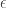
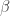

<!--yml

类别：未分类

日期：2024-05-18 13:48:30

-->

# 经验分位数和代理选择 | Quantivity

> 来源：[`quantivity.wordpress.com/2011/10/03/empirical-quantiles-proxy-cross-hedging-selection/#0001-01-01`](https://quantivity.wordpress.com/2011/10/03/empirical-quantiles-proxy-cross-hedging-selection/#0001-01-01)

之前的文章[Proxy / Cross Hedging](https://quantivity.wordpress.com/2011/10/02/proxy-cross-hedging/)中留下了一个重要问题：如何选择适当的对冲工具，特别是在几种替代方案之间选择时。在全面探索代理对冲的数据分析之前（在即将发布的文章中），值得仔细考虑这个问题。

解决这个问题的一种方法是通过*经验分位数*的可视化。

考虑一种用于中和价格的*理想代理*的定义特征：和的加权价格差异在*任意少量样本*（假设采样频率不大于重新平衡周期）上为零。困难的部分在于需要任意少量样本的要求；更正式地说，理想的时间序列必须满足以下条件：


而不是在中。

将此要求与统计学通常如何处理此问题进行对比，使用的技术基本上源自于[矩生成函数](http://en.wikipedia.org/wiki/Moment_generating_function)。测度理论将包括[几乎肯定相等](http://en.wikipedia.org/wiki/Random_variable#Almost_sure_equality)。然而，理想的代理要求不仅仅是两者的以上；它要求*经验分布相等*。因此，任何潜在的解决方案都必须以经验样本和和的*整个*分布为框架。

因此，问题归结为评估经验分布的联合比较和相等性。使用原始价格进行此操作是不自然的，因为两种工具使用不同的度量标准。相反，对两者都进行*线性*回报的转换（而不是对数），并转换为单一的回报度量。因此，通过使用离散导数运算符重构代理对冲模型：


可以生成和的经验分布，并将理想的代理重构为：


当这个等式成立时，经验分布严格相等，受到线性缩放的影响。现在，问题归结为在忽略的情况下评估分布的相等性。为此，我们借鉴了分位数分析（在[稳定性](https://quantivity.wordpress.com/2009/08/03/stability-by-quantile/)的背景下先前讨论过，并在[Koenker](http://www.econ.uiuc.edu/~roger/)的研究中得到了很好的例证）。具体来说，使用[分位数-分位数（QQ）图](http://en.wikipedia.org/wiki/Q-Q_plot)。

考虑两个经验分布和的 QQ，而不是传统的理论和经验比较。因此，这个图展示了经验分布相似性的期望可视化。最重要的是，由于以分位数为单位进行测量，缩放消失了。此外，这种方法是非参数的，不需要对任何工具提出分布假设。

通过这个 QQ，代理优劣的评估变得可见：

+   **最优性**：理想的代理对冲将具有一个通过所有观察点的 qq 线。

+   **分歧**：从最优性的分歧可以通过远离分位线的观察来体现，其与（0,0）原点的距离反映了其相应的出现频率。

例如，考虑以下*代理 QQ 图*：


该图绘制了一个著名高科技公司（CRM）与纳斯达克 100 指数（QQQ）的每日回报的*经验分位数*。实线虚线是`(0,1)`线，反映了分布相等。虚线的蓝色和红色椭圆是两个分布的位置离散椭圆（参考[Meucci 2010](http://papers.ssrn.com/sol3/papers.cfm?abstract_id=1548162)）。

因此，对这个图的视觉检查很快就排除了 QQQ 作为一个有效的代理：

+   所有分位数上的观察点都偏离了这条线，表明在所有分位数上都无效。

+   弥散椭圆明显旋转，表明主要成分存在严重的错位。

+   尾部的异常值展示了极端的分歧和非线性。

因此，QQQ 不仅是一个糟糕的代理，而且从尾部风险的角度来看，它可以说是一个危险的代理：CRM 的大幅波动将受到 QQQ 的严重对冲。所以标准的 QQQ 期货对冲声明就不值一提了。

特别值得注意的是，这些观察结果都来自于单个图。正如下一篇关于代理套期保值的完整探索性数据分析所将阐明的，这更值得注意，因为许多其他更受欢迎的可视化呈现了*相反*的结论。

对于对进一步研究感兴趣的读者，[Doyle (2010)](http://papers.ssrn.com/sol3/papers.cfm?abstract_id=1596602) 讨论了几个经验 QQ 图的进一步数学细微差别。

* * *

生成代理 QQ 图的 R 代码：

```

proxyQQPlot <- function(p)
{
  # Plot proxy QQ plot, including empirical quantiles and location dispersion ellipsoids.
  #
  # Args:
  #   p: xts of instrument price data, including valid colnames
  #
  # Returns: None

  p1ROC <- ROC(p[,1], type="discrete", na.pad=FALSE)
  p2ROC <- ROC(p[,2], type="discrete", na.pad=FALSE)

  qqplot(coredata(p2ROC), coredata(p1ROC), xlab=paste(colnames(p)[2], "Returns Quantiles"), ylab=paste(colnames(p)[1], "Returns Quantiles"), main="Empirical Returns QQ-Plot")
  abline(0,1,lty=2)
  grid(20)
  par(xpd=TRUE)
  d <- dataEllipse(as.vector(coredata(p2ROC)),as.vector(coredata(p1ROC)),draw=FALSE)
  lines(d[[1]], col=colors[2], lty=3)
  lines(d[[2]], col=colors[3], lty=3)
  par(xpd=FALSE)
}

```
