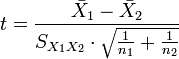
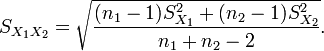
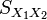

<!--yml

category: 未分类

date: 2024-05-12 18:44:13

-->

# 股权曲线分析：一个简单的统计测试 | CSSA

> 来源：[`cssanalytics.wordpress.com/2009/10/26/equity-curve-analysis-a-simple-statistical-test/#0001-01-01`](https://cssanalytics.wordpress.com/2009/10/26/equity-curve-analysis-a-simple-statistical-test/#0001-01-01)

**注意：** 本文提到的适用于此文章的更复杂的方法是一种回归应用，简要涉及在链接[`en.wikipedia.org/wiki/T_Test`](http://en.wikipedia.org/wiki/T_Test)中。

确定交易策略何时出现问题的一种方法是运行统计测试。概念上，当我使用术语“出现问题”时，我指的是策略的最近盈利能力与平均水平明显不同。然而，这也可能指的是一种策略相对于每笔交易的利润变得比平均水平更加波动。在股权曲线分析中，最近期与历史平均水平相比，“平均值”和“方差”分析都很重要。另一个可能的调查领域是交易赢利百分比与历史赢利百分比的比较。在本文中，我们将看看如何解决第一个问题，即平均盈利能力可能与平均水平明显不同的可能性。因此，我们将假设交易策略的方差或波动性与历史上的测量值相同。进入配对 t 检验，用于确定来自同一交易策略的两个样本是否与正常情况相似或统计上不同。在这种情况下，我使用了假设样本大小不等的方程，因为在大多数情况下，交易者会进行为期 5 或 10 年的回测，并且希望评估当前正在经历某种回撤或恶化的策略（即，您不会等待 5 或 10 年后再进行测试！）：

来自维基百科：[`en.wikipedia.org/wiki/T_Test`](http://en.wikipedia.org/wiki/T_Test)

样本大小不等，方差相等

仅当可以假设两个分布具有相同方差时才使用此检验。（当此假设被违反时，请参见下文。）用于测试均值是否不同的*t*统计量可计算如下：

其中

注意上述公式是对样本大小相等的情况进行概括的（用*n*[1]和*n*[2]替换*n*，你就会看到）。

 是两个样本的共同[标准差](https://cssanalytics.wordpress.com/wiki/Standard_deviation "标准差")的估计量：它是这样定义的，以便其平方是一个无偏估计量，无论种群均值是否相同。在这些公式中，*n* = 参与者数量，1 = 第一组，2 = 第二组。*n* − 1 是任一组的自由度数目，总样本大小减去两个（即，*n*[1] + *n*[2] − 2）是总自由度数目，用于显著性检验。

请注意，这也可以用来确定例如两个均值回归系统如 DV2 和 RSI2 是否显著不同。t 检验存在一些问题，对我来说，正态性的假设——即给定交易策略正态分布——显然是一个问题。这种错误的假设在过去给量化交易员带来了许多问题。对你的账户最危险的是等待太久才关闭策略可能引入的延迟。可以做出的一种调整是在策略“统计显著不同于平均值”之前采取某种形式的移动止损或逐步减少策略的敞口。其他问题涉及在只有一个“体制”期间进行回测时引入的条件性偏差形式，例如上涨趋势，这自然会扰乱测试，因为交易策略在不同的“体制”中表现往往截然不同。事先知道某些策略在体制变化发生时表现不佳，可以“预警”停止使用它，从而帮助您避免回撤。一个例子是在两个上涨日后卖空，这通常表现良好，应该预期在新的“上涨趋势”开始时表现更差，也许由 200 日移动平均线或其他指标定义。在这方面的常识可能是一种更主动的风险管理形式，与通过交易权益曲线实现的反应性管理相比。例如，当市场低于其平均值 3 个标准偏差时，它最终会反弹，因此在此时减少卖空策略的敞口可能比等待回撤发生更好。这也是为什么超买和超卖的均值回归原理的使用是有价值的。
