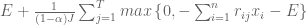
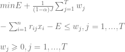

<!--yml

分类：未分类

日期：2024-05-18 14:48:05

-->

# 预期的缺失（CVaR）和条件风险降幅（CDaR）风险度量 | 系统性投资者

> 来源：[`systematicinvestor.wordpress.com/2011/10/25/expected-shortfall-cvar-and-conditional-drawdown-at-risk-cdar-risk-measures/#0001-01-01`](https://systematicinvestor.wordpress.com/2011/10/25/expected-shortfall-cvar-and-conditional-drawdown-at-risk-cdar-risk-measures/#0001-01-01)

在 [最大损失和平均绝对偏差风险度量](https://systematicinvestor.wordpress.com/2011/10/14/maximum-loss-and-mean-absolute-deviation-risk-measures/) 文章中，我开始讨论我们可以用来构建[有效边界](http://en.wikipedia.org/wiki/Efficient_Frontier)的替代风险度量。我想讨论的另一种替代风险度量是[预期的缺失（CVaR）](http://en.wikipedia.org/wiki/Expected_shortfall)和条件风险降幅（CDaR）。我将使用 [Krokhmal, P., S. Uryasev, and G. Zrazhevsky (2001)](http://papers.ssrn.com/sol3/papers.cfm?abstract_id=297639) 和 [Enn Kuutan](http://www.mie.utoronto.ca/undergrad/thesis-catalog/files/351.pdf) 文章中介绍的方法来构建最优化投资组合。

让 x.i，i = 1,…，n 为投资组合中工具的权重。我们假设有 j = 1,…，T 的等概率返回情景可用。我将使用历史资产收益作为情景。让我们用 r.ij 表示情景 j 中第 i 个资产的回报。该投资组合的条件价值风险（CVaR）（第 30-32 页）可以写作



它可以被表述为一个线性规划问题



这个线性规划问题可以很容易地实现

```

min.cvar.portfolio <- function
(
	ia,		# input assumptions
	constraints	# constraints
)
{
	n = ia$n
	nt = nrow(ia$hist.returns)

	alpha = ia$parameters.alpha

	# objective : Conditional Value at Risk (CVaR)
	#  E + 1/(1-a) * 1/T * [ SUM  w.j ]
	f.obj = c( rep(0, n), (1/(1-alpha))* (1/nt) * rep(1, nt), 1 )

	# adjust constraints, add w.j, E
	constraints = add.variables(nt + 1, constraints, lb = c(rep(0,nt),-Inf))

	#  -E - [ SUM <over i> r.ij * x.i ] < w.j, for each j = 1,...,T 
	a = rbind( matrix(0, n, nt), diag(nt), 1)
		a[1 : n, ] = t(ia$hist.returns)
	constraints = add.constraints(a, rep(0, nt), '>=', constraints)			

	# setup linear programming	
	f.con = constraints$A
	f.dir = c(rep('=', constraints$meq), rep('>=', len(constraints$b) - constraints$meq))
	f.rhs = constraints$b

	# find optimal solution
	x = NA
	sol = try(solve.LP.bounds('min', f.obj, t(f.con), f.dir, f.rhs, 
					lb = constraints$lb, ub = constraints$ub), TRUE)

	if(!inherits(sol, 'try-error')) {
		x = sol$solution[1:n]

	}

	return( x )
}

```

该投资组合的条件风险降幅（CDaR）（第 32-33 页）概念与 CVaR 非常相似。我们不是使用投资组合收益来确定缺口，而是使用投资组合的风险降幅。条件风险降幅（CDaR）可以写作

![E + \frac{1}{(1 - \alpha) J}\sum_{j=1}^{T}max\left \{ 0,   \max_{1\leq k\leq j} \left ( \sum_{i=1}^{n} \left [ \sum_{s=1}^{k}r_{is} \right ] x_{i} \right ) - \sum_{i=1}^{n} \left [ \sum_{s=1}^{j}r_{is} \right ]x_{i}-E\right \}](img/a71404c3da98d48d87678911aa179d00.png)

它可以被表述为一个线性规划问题

![min_{}{} E + \frac{1}{(1 - \alpha) J}\sum_{j=1}^{T}w_{j}  \newline\newline  u_{j}-\sum_{i=1}^{n} \left [ \sum_{s=1}^{j}r_{is} \right ]x_{i}-E\leq w_{j}, j=1,...,T  \newline\newline  \sum_{i=1}^{n} \left [ \sum_{s=1}^{j}r_{is} \right ]x_{i}\leq u_{j}, j=1,...,T  \newline\newline  u_{j-1}\leqslant u_{j} , j=1,...,T  \newline\newline  w_{j}\geqslant 0, j=1,...,T](img/c67fe74ef995e9827ad9f5db0c4d16de.png)

```

min.cdar.portfolio <- function
(
	ia,		# input assumptions
	constraints	# constraints
)
{
	n = ia$n
	nt = nrow(ia$hist.returns)

	alpha = ia$parameters.alpha

	# objective : Conditional Drawdown at Risk (CDaR)
	#  E + 1/(1-a) * 1/T * [ SUM  w.j ]
	f.obj = c( rep(0, n), (1/(1-alpha))* (1/nt) * rep(1, nt), 1, rep(0, nt) )

	# adjust constraints, add w.j, E, u.j
	constraints = add.variables(2*nt + 1, constraints, lb = c(rep(0,nt), rep(-Inf,nt+1)))

	#  u.j - [ SUM <over i> [ SUM <over j> r.ij ] * x.i ] - E < w.j, for each j = 1,...,T 
	a = rbind( matrix(0, n, nt), diag(nt), 1, -diag(nt))
		a[1 : n, ] = t(apply( t(ia$hist.returns), 1, cumsum))	
	constraints = add.constraints(a, rep(0, nt), '>=', constraints)					

	#  [ SUM <over i> [ SUM <over j> r.ij ] * x.i ] < u.j, for each j = 1,...,T 
	a = rbind( matrix(0, n, nt), 0*diag(nt), 0, diag(nt))
		a[1 : n, ] = -t(apply( t(ia$hist.returns), 1, cumsum))
	constraints = add.constraints(a, rep(0, nt), '>=', constraints)

	#  u.j-1 < u.j, for each j = 1,...,T - portfolio high water mark is increasing		
	temp = diag(nt);
		temp[-nt,-1]=-diag((nt-1))
		diag(temp) = 1			

	a = rbind( matrix(0, n, nt), 0*diag(nt), 0, temp)
		a = a[,-1]		
	constraints = add.constraints(a, rep(0, (nt-1)), '>=', constraints)

	# setup linear programming	
	f.con = constraints$A
	f.dir = c(rep('=', constraints$meq), rep('>=', len(constraints$b) - constraints$meq))
	f.rhs = constraints$b

	# find optimal solution
	x = NA
	sol = try(solve.LP.bounds('min', f.obj, t(f.con), f.dir, f.rhs, 
					lb = constraints$lb, ub = constraints$ub), TRUE)

	if(!inherits(sol, 'try-error')) {
		x = sol$solution[1:n]

	}

	return( x )
}

```

让我们使用[资产配置简介](https://systematicinvestor.wordpress.com/2011/10/13/introduction-to-asset-allocation/)中介绍的历史输入假设，分析使用不同风险度量计算的有效边界：

```

# load Systematic Investor Toolbox
setInternet2(TRUE)
source(gzcon(url('https://github.com/systematicinvestor/SIT/raw/master/sit.gz', 'rb')))

#--------------------------------------------------------------------------
# Create Efficient Frontier
#--------------------------------------------------------------------------
	ia = aa.test.create.ia()
	n = ia$n		

	# 0 <= x.i <= 0.8 
	constraints = new.constraints(n, lb = 0, ub = 0.8)

	# SUM x.i = 1
	constraints = add.constraints(rep(1, n), 1, type = '=', constraints)		

	# Alpha for used for CVaR and CDaR
	# http://www.investopedia.com/articles/04/092904.asp
	ia$parameters.alpha = 0.95

	# create efficient frontier(s)
	ef.risk = 		portopt(ia, constraints, 50, 'Risk')
	ef.cvar = 		portopt(ia, constraints, 50, 'CVaR', 	min.cvar.portfolio)
	ef.cdar = 		portopt(ia, constraints, 50, 'CDaR', 	min.cdar.portfolio)

	# Plot multiple Efficient Frontiers
	layout( matrix(1:4, nrow = 2) )
	plot.ef(ia, list(ef.risk, ef.cvar, ef.cdar), portfolio.risk, F)	
	plot.ef(ia, list(ef.risk, ef.cvar, ef.cdar), portfolio.cvar, F)	
	plot.ef(ia, list(ef.risk, ef.cvar, ef.cdar), portfolio.cdar, F)	

	# Plot multiple Transition Maps
	layout( matrix(1:4, nrow = 2) )
	plot.transition.map(ef.risk)
	plot.transition.map(ef.cvar)
	plot.transition.map(ef.cdar)

```


使用 Expected shortfall (CVaR)和标准偏差风险度量构建的有效边界看起来相似。使用 Conditional Drawdown at Risk (CDaR)构建的有效边界在控制回撤方面优于其他风险度量。

在下一篇文章中，我将讨论如何在构建有效边界过程中结合多个风险度量。

要查看此示例的完整源代码，请查看 [aa.cvar.test() function in aa.test.r at github](https://github.com/systematicinvestor/SIT/blob/master/R/aa.test.r)。
