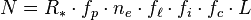
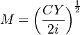

<!--yml

分类: 未分类

日期: 2024-05-12 20:03:24

-->

# 福肯博客:经济学数学和德雷克方程

> 来源: [`falkenblog.blogspot.com/2013/08/economath-and-drake-equation.html#0001-01-01`](http://falkenblog.blogspot.com/2013/08/economath-and-drake-equation.html#0001-01-01)

上周有几篇文章探讨现代经济学过于强调数学建模的假设。大多数人说是的(

[戴夫·亨德森](http://econlog.econlib.org/archives/2013/08/the_tragedy_of.html#comments)

,

[布赖恩·卡普兰](http://econlog.econlib.org/archives/2013/08/economath_fails.html#comments)

,

[诺亚评论员](http://noahpinionblog.blogspot.com/2013/08/a-few-words-about-math.html)

,

[罗宾·汉森](http://www.overcomingbias.com/2013/08/math-over-used-but-useful.html)

,这

[纽约时报](http://opinionator.blogs.nytimes.com/2013/08/24/what-is-economics-good-for/)

),尽管克鲁格曼说不。

克鲁格曼的经验非常贴切,因为他获得诺贝尔奖的规模收益递增模型是一个很好的含糊经济学建模的例子:它的论点在成为数百年前幼稚产业论证的基础之前就被人知晓,而在克鲁格曼之后也没有更容易应用。试想底特律,这是在 20 世纪初应用于汽车行业的地区规模收益递增的一个热门例子:那些允许它在 20 世纪初实现规模收益递增,而后在本世纪晚期转为规模收益递减的关键条件是什么?他没有说明。

克鲁格曼

[回应](http://krugman.blogs.nytimes.com/2013/08/22/more-economath/?_r=0)

他认为他的理论改变了辩论,因为它证明了--在某些参数设定下--规模收益递增

*可以*

这可能是降低贸易壁垒的一个论点!虽然是真的,但这只是一种可能性,而不是概率,那些相信规模收益递增的人往往更倾向于相信选择性关税,也就是说,他们不是用克鲁格曼的模型来支持自由贸易,而是支持增加保护。所以,它并没有改变辩论,而且与他的说法相反,即他的新贸易理论"可能是进出口论证中减少贸易限制的主要依据";他的新模型根本没有改变辩论,只是增加了另一个晦涩的引用供猜疑者使用。规模收益递增仍然是 1)一种边缘论点,以及 2)主要用来支持贸易限制,正如在 20 世纪之前克鲁格曼的新贸易理论模型出现之前一样。

克鲁格曼是一个非常聪明的人,但事实是他无法看到这一点突出了我们告诉自己的最大谎言,因为他显然有能力发现他人的细微不一致和缺陷(他是一个对自己的对手进行精心辩护的人)。

我认为经济学中很多数学就像把得到的结果误认为是因果关系一样，人们看到相关性（飞机和货物）并假定某种本质就是这些相关性之一（例如，建立飞机模型，货物也会出现）。 因此，就像天真的人认为一首好诗的本质是押韵，天真的经济学家认为建立假设好像在演导出狄拉克方程或特殊相对论一样是科学的本质。 不幸的是，经济方程很少能成功预测这种情况。

考虑

[德雷克方程](http://www.seti.org/drakeequation)

。

在哪里

N = 我们银河系中可能进行通信的文明数量

*R*^*

= 我们银河系每年平均的恒星形成数量

*f*[p]

= 那些恒星中具有行星的比例

n

[p]

= 每个太阳系中适合生命的环境数量

等等。

这些项中没有一个是已知的，大多数甚至无法估计。 结果，德雷克方程可以从一百亿到零任何值。 可以暗示任何东西的表达式不暗示任何东西。 我的意思是，这个公式值得写下来，但它与狄拉克方程或牛顿定律非常不同，尽管在某种程度上存在相似性。

我记得以前教过一门货币和银行学的课程，一个有趣的方式来使孩子们了解经济模型是向他们展示

[鲍莫尔-托宾货币需求模型](http://en.wikipedia.org/wiki/Baumol%E2%80%93Tobin_model)

。 这可以从一些简单的假设中推导出来，并将微积分应用于个人应用的最大化函数，得到方程：

在哪里

M=货币需求

C=取款的成本

Y=总收入

i=利率

所有都非常严谨和整洁。然而，它无法预测利率或货币总额的大小。它在经验上是空洞的，因为它根本不符合数据。

这是其中一个更具体的方程。 大多数方程都像这个货币需求方程一样：

基本上只是讨论函数中应该有什么参数，然后这些参数的导数。 因此，第一个参数是'永久收入' Y

[p]

，这里的第一导数是正的。 然而，参数可以波动很大，甚至可能是内生的。 最终，无理论向量自回归模型在预测任何这些变量方面做得更好。

然而，尽管数学在创造良好的科学方面存在不足，但社会学家表明缺乏严谨似乎也不会更好。 我认为这突显了没有比认为方法可以弥补缺乏常识的幻觉更大的幻觉。 最终，除了非常聪明之外，没有别的方法。
