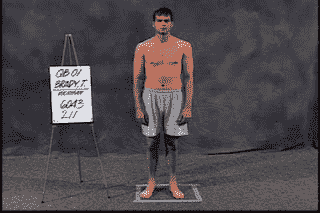

<!--yml

分类：未分类

日期：2024 年 5 月 12 日 20:09:16

-->

# Falkenblog：汤姆·布雷迪突出算法的缺陷

> 来源：[`falkenblog.blogspot.com/2013/02/tom-brady-highlights-algorithm.html#0001-01-01`](http://falkenblog.blogspot.com/2013/02/tom-brady-highlights-algorithm.html#0001-01-01)

NFL 选秀组合相当有趣，因为基于《替身球星》类型的输入来预测结果非常吸引人。每个被一些新统计数字激动的人，都有另一个人注意到这些数据并不能捕捉到最重要的东西。答案一如既往，是要同时使用指标和主观专家分析。

一个有趣的新信号就是。

[一个运动员的臀部](http://www.sbnation.com/nfl/2013/2/23/4021074/mike-mayock-likes-big-butts?utm_source=sbnation&utm_medium=nextclicks&utm_campaign=articlebottom)

然而，越大越好。看着我指导的小运动员，一个突出的后部对于这些青春期前儿童的天生力量是最好的指标。你的臀大肌是你最大的肌肉，所以我猜，如果你要专注于一种肌肉，最好看这种肌肉而不是肱二头肌或三头肌。

](https://blogger.googleusercontent.com/img/b/R29vZ2xl/AVvXsEiOiN6nVJgsoBVv6tpQ33ZUV6-ByVop0QcQi4gIrlYPcU6VL506-3OIxOZhyphenhyphennrWZMAN_0BdinUgGnMYYfsQuuTPRxvPr1HE4rVefq_SEHEBXfVwvUitAZeYyo8sbIsMvGoentHDng/s1600/brady.jpg)

汤姆·布雷迪是 NFL 中最好的四分卫之一，也是一个引人注目的建模问题。在 NFL 选秀中，他的成绩几乎是最差的：40 码冲刺用时 5.3 秒，垂直跳跃 24.5 英寸。如果速度是你的输入之一，且你的算法是某种排序，可能你会因为他的速度和跳跃能力处于第 1 百分位而淘汰布雷迪。如果你的算法更像是线性加权，他可能在其他维度上进行补偿。

总的来说，我倾向于喜欢一连串的筛选器，而不是线性加权规则，尽管在大投资组合上我发现这些很少会产生很大的差异性。然而，知道我可能会错过某种类型的汤姆·布雷迪，让我重新考虑了一下这一点。然后有人注意到，速度虽然一般重要，但一个合理规定的四分卫模型会给予它足够低的权重使其不会成为筛选器中的条件（例如，乔·蒙塔纳的速度很慢）。这让我感到有些安慰。

还有一个想法是，与投资组合不同，挑选一个四分卫就像挑选一支单一的股票，对此，也许一连串的筛选器并不是最佳的。
