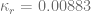
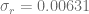
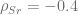
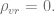
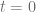
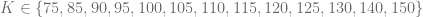
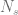
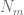
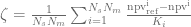
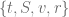

<!--yml

category: 未分类

日期：2024-05-17 23:39:21

-->

# Heston-Hull-White 模型的有限差分方案 - HPC-QuantLib

> 来源：[`hpcquantlib.wordpress.com/2011/09/11/finite-difference-schemes-for-the-heston-hull-white-model/#0001-01-01`](https://hpcquantlib.wordpress.com/2011/09/11/finite-difference-schemes-for-the-heston-hull-white-model/#0001-01-01)

混合 Heston-Hull-White 模型是为了分析随机利率对结构化股票票据（如自动赎回债券）的影响而量身定制的。

不幸的是，对于欧式期权，仅在至少两个相关性为零时才存在半闭合解决方案，而这在一般情况下是不现实的。这种模型的一组半闭合近似可以在[这里](http://mpra.ub.uni-muenchen.de/24174/1/MPRA_paper_24174.pdf) [1] 找到。 [QuantLib](http://www.quantlib.org)为 Heston-Hull-White 模型提供了美式、百慕大和欧式期权的有限差分定价引擎。这种定价引擎支持现金股利、通过半闭合 Heston 模型控制变量和使用一个向后求解器运行定价同一到期日的欧式期权的不同行权价（在模型校准期间特别有用，可大大加快速度。）。

Heston-Hull-White 模型是测试基于操作分裂的有限差分方案效率的良好试验场所，这些方案实现在[QuantLib](http://www.quantlib.org)：

+   Douglas

+   Craig-Sneyd

+   Modified Craig-Sneyd

+   Hundsdorfer-Verwer

+   Modified Hundsdorfer-Verwer

这些操作分裂方法在[这里](http://www.math.ualberta.ca/ijnam/Volume-7-2010/No-2-10/2010-02-06.pdf) [2]中描述。该测试场包括从不同出版物中获取的 Heston 模型的十组参数集。

![\begin{array}{|c|c|c|c|c|c|c|c|c|} \hline {\rm 模型} & v_0 & \kappa_v & \theta_v & \sigma_v & \rho_{Sv} & r & q & \mbox{参考} \\ \hline \hline {\rm't\ Hout\ 案例 1}& 0.04& 1.5& 0.04& 0.3& -0.9& 0.025& 0.0 &[2]\\ {\rm't\ Hout\ 案例 2} & 0.12& 3.0& 0.12& 0.04& 0.6& 0.01& 0.04 &[2]\\ {\rm't\ Hout\ 案例 3}& 0.0707&0.6067& 0.0707& 0.2928& -0.7571& 0.03& 0.0 & [2]\\ {\rm't\ Hout\ 案例 4}& 0.06& 2.5& 0.06& 0.5& -0.1& 0.0507& 0.0469 &[2]\\ {\rm Ikonen\ Toivanen}& 0.0625& 5& 0.16& 0.9& 0.1& 0.1& 0.0 &[3]\\ {\rm Kahl\ J\ddot{a}ckel}& 0.16& 1.0& 0.16& 2.0& -0.8& 0.0& 0.0 &[4]\\ {\rm 股票案例 }& 0.07& 2.0& 0.04& 0.55& -0.8& 0.03& 0.035 &\\ {\rm 高相关性}& 0.07& 1.0& 0.04& 0.55& 0.9& 0.02& 0.04& \\ {\rm small\ \sigma_v}& 0.07& 1.0& 0.04& 0.001& -0.75& 0.04& 0.03& \\ \kappa_v=\sigma_v\rho_{Sv}& 0.07& 0.4& 0.04& 0.5& 0.8& 0.03& 0.03 &\\ \hline \end{array}](img/8a1d96b49959d026fd532132c20528a2.png)

Hull-White 参数设置为和。 股票利率相关性为，利率和随机波动性不相关 基准看涨期权的到期日为 5 年，t 时刻标的价格是，可能的行权价格是

.

基准值是参考值和不同执行价格的平均相对差异，以及模型。

下面的图表显示了基于半封闭 Heston 模型的“股票案例”对不同网格大小的结果  。和基于控制变量的结果。显然，Douglas 方案是最差的表现者，（修改后的）Craig-Sneyd 和修改后的 Hundsdorfer-Verwer 方案是赢家。

 十个模型的总体平均值由两个“病态”参数集“Ikonen-Toivanen”和“Kahl-Jäckel”主导。再次，Douglas 方案无法与其他方案竞争。其他方案之间的差异相当小，除了最大网格，修改后的 Hundsdorfer-Verwer 方案表现不佳。

下图显示了在“股票案例”Heston 模型和修改后的 Craig-Sneyd 方案中，使用控制变量和不使用控制变量的相对定价误差。通常情况下，使用控制变量可以将相对定价误差减少 15 倍。

源代码在[这里](http://hpc-quantlib.de/src/fdmscheme.zip)可得。它依赖于[QuantLib 1.1](http://quantlib.org/download.shtml)或更高版本。如果你想生成图表，还需要[R](http://www.r-project.org/)。

[1] L. A. Grzelak, C. W. Oosterleea, Lech A., [关于带随机利率的 Heston 模型。](http://mpra.ub.uni-muenchen.de/24174/1/MPRA_paper_24174.pdf)

[2] K.J. in ‘t Hout, S. Foulon，[具有相关性的 Heston 模型期权定价的 ADI 有限差分方案。](http://www.math.ualberta.ca/ijnam/Volume-7-2010/No-2-10/2010-02-06.pdf) Int. J. Numer. Anal. Mod. **7**, 303-320 (2010).

[3]  S. Ikonen, J. Toivanen, [随机波动率美式期权的算子分裂方法。](http://users.jyu.fi/~tene/papers/Ikonen.pdf)

[4] C. Kahl, P. Jäckel，[Heston 模型中不是那么复杂的对数。](http://www2.math.uni-wuppertal.de/~kahl/publications/NotSoComplexLogarithmsInTheHestonModel.pdf)
