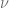

<!--yml

category: 未分类

date: 2024-05-13 00:15:22

-->

# SABR 模型的有限差分求解器 - HPC-QuantLib

> 来源：[`hpcquantlib.wordpress.com/2019/01/11/finite-difference-solver-for-the-sabr-model/#0001-01-01`](https://hpcquantlib.wordpress.com/2019/01/11/finite-difference-solver-for-the-sabr-model/#0001-01-01)

尽管基于一个相当简单的随机微分方程

相应的偏微分方程

对于使用变量转换、以及伊藤引理和费曼-卡尔公式导出的 SABR 模型，进行数值求解相当困难。部分问题在于底层的过程，如果为零，则对应到一个常弹性方差（CEV）模型。这个模型根据的值和边界条件表现出多种不同的行为。作者在[1]中对这个主题进行了全面的概述。为了限制可能的模型数量，让我们定义

and assume absorbing boundary conditions at  if . 针对有限差分方案的一个实现，第一步是找到离散化网格的有效限制。这些限制可以从底层过程的累积分布函数中推导出来。

.

请注意在第一种情况下 出现在非中心卡方分布 的非中心参数中，因此只能通过数值根查找算法来计算其逆。Sankaran 的非中心卡方分布近似可用于加速此方法[2]。在第二种情况下 方程的逆可计算如下:

![F_t= \left[{t \left({\chi'}²\right)}^{-1} \left(1-q; \delta, \frac{X_0}{t}\right)  \alpha²(1-\beta)²\right]^{\frac{1}{2(1-\beta)}}](img/86867f2fe848ba93436b6c130fa2f9b7.png)

可以使用 boost 库进行计算。此外，围绕重要点进行自适应网格细化和在到期日[3]的特殊点周围进行单元平均的实施改善了 CEV 有限差分方案的准确性。只有在或等效的情况下 才是一个局部鞅。在这种情况下，看涨期权权价平价如下[1]:

并且作为实现边界条件和有限差分方案的试金石。

方差方向 符合布朗运动，因此离散化是直接的。像 Craig-Sneyd 或 Hundsdorfer-Verwer [4]这样的操作分割方案是专门设计来解决二维偏微分方程的。

有限差分求解器现在可用于将不同的近似与正确的模型行为进行比较，也可用于将其与高精度的 Monte-Carlo 模拟[2]进行比较。模型配置[5]

应充当一个测试平台。如下图所示，蒙特卡洛结果与有限差分方法的结果非常接近。Hagan 等标准公式以及 Le Floc’h-Kennedy [6]对数正态公式与正确的隐含波动率存在显著偏差。

近似不是无套利的。小行权价格的概率密度转为负数。如下图所示，Hagan 的公式对比 Le Floc’h-Kennedy 公式具有更大的行权价格，展示了这种行为。如预期的，有限差分解决方案不会产生负概率。

关于 Floc’h-Kennedy 近似的说明，该公式在 ATM 行权水平附近变得数值不稳定，因此在货币性上使用二阶泰勒展开

以下图表展示了二阶泰勒展开和使用 IEEE-754 双精度评估的公式之间的差异。

源代码是 PR＃589 的一部分，可在[此处](https://github.com/lballabio/QuantLib/pull/589)获取。

[1] D.R. Brecher, A.E. Lindsay: [CEV 过程的结果，过去和现在。](https://www.fincad.com/sites/default/files/wysiwyg/Resources-Wiki/cev-process-working-paper.pdf)

[2] B. Chen, C.W. Oosterlee, H. Weide, [SABR 的高效无偏模拟方案](http://ta.twi.tudelft.nl/mf/users/oosterle/oosterlee/SABRMC.pdf) [随机波动率模型。](http://ta.twi.tudelft.nl/mf/users/oosterle/oosterlee/SABRMC.pdf)

[3] K. in’t Hout: [详细解释金融中的数值偏微分方程](https://www.palgrave.com/de/book/9781137435682)

[4] K. in’t Hout, S. Foulon: [ADI 有限差分方案用于具有相关性的 Heston 模型的期权定价。](http://www.math.ualberta.ca/ijnam/Volume-7-2010/No-2-10/2010-02-06.pdf)

[5] P. Hagan, D. Kumar, A. Lesnieski, D. Woodward: [无套利 SABR.](http://janroman.dhis.org/finance/SABR/Arbitrage-Free%20SABR.pdf)

[6] F. Le Floc’h, G. Kennedy: [通过简单展开明确 SABR 校准](https://papers.ssrn.com/sol3/papers.cfm?abstract_id=2467231).
