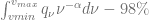

<!--yml

类别：未分类

日期：2024 年 5 月 17 日 23:38:39

-->

# Fokker-Planck 方程，费勒约束和边界条件–HPC-QuantLib

> 来源：[`hpcquantlib.wordpress.com/2013/05/04/fokker-planck-equation-feller-constraint-and-boundary-conditions/#0001-01-01`](https://hpcquantlib.wordpress.com/2013/05/04/fokker-planck-equation-feller-constraint-and-boundary-conditions/#0001-01-01)

Fokker-Planck 正向方程是校准随机波动模型的局部波动率扩展的重要工具，例如 Heston 模型的局部波动率扩展。但是边界条件的处理——特别是在零瞬时方差时——是非常困难的，如果费勒约束

对于方差的平方根过程 

被违反。相应的 Fokker-Planck 正向方程

*

描述了概率密度函数*p*的时间演变和在原点处的边界  如果费勒约束被违反，即可能立即达到。在这种情况下，Fokker-Planck 方程[1]的稳态解

随！[`hpcquantlib.wordpress.com/2013/05/04/fokker-planck-equation-feller-constraint-and-boundary-conditions/#0001-01-01`](https://hpcquantlib.wordpress.com/2013/05/04/fokker-planck-equation-feller-constraint-and-boundary-conditions/#0001-01-01)

和原点处的零流边界条件

![\left.\left[ \frac{\sigma²}{2}\frac{\partial}{\partial \nu} (\nu p) + \kappa(\nu-\theta)p\right]\right|_{\nu=0} = 0 ](img/0a363d806048f3f15d07d14e9f90bfd1.png)

变得难以在数值上进行跟踪。将偏微分方程重写为  有助于缓解问题[2]。

*q*中对应的零流边界条件读作如下

![\left.\left[ \nu\frac{\sigma²}{2}\frac{\partial}{\partial \nu} q + \kappa\nu q\right]\right|_{\nu=0} = 0 ](img/1d9af5d4fcf08f5782f5c8f3da45a731.png)

为了应用边界条件，第一步是在非均匀网格上在空间方向上离散化变换后的 Fokker-Planck 方程 

![\frac{\partial q_i}{\partial t} = \alpha_iq_{i-1}+\beta_iq_i+\gamma_iq_{i+1]} ](img/052394286b32b6291c58862678e83ba2.png)

with

接下来的步骤是使用二阶前向离散化[3]来离散化零流边界条件导数。

![\left.\left[ \nu\frac{\sigma²}{2}\frac{\partial}{\partial \nu} q + \kappa\nu q\right]\right|_{\nu=\nu_{i-1}} \approx a_iq_{i-1} + b_iq_{i} + c_iq_{i+1} = 0 ](img/01399fbc2ae0d6d714bf008fc437b389.png)

with

现在边界处的值可以用和的形式表达。

这个方程可以用于从转换后的福克-普朗克方程的离散化中去除边界值。同样的方法可以用于上边界的零流边界条件，也可以用于原始福克-普朗克方程。

方块根过程的以下参数将用于测试不同的边界条件。

均匀网格有 100 或 1000 个网格点，并且福克-普朗克方程的稳态解被选为网格点上的起始配置。边界通过累积分布函数的逆来定义，使得

.

网格覆盖了 98%的分布，如果边界条件满足且没有离散化误差，则该值随时间不会改变。 为了测试离散化误差的量级，我们让初始解在 Crank-Nicolson 方案中使用 100 个时间步长演化一年。 结果解  被插值为三次样条，得到函数 。 值

作为边界条件的离散化误差的质量指标。

如下图所示，如果  很小，那么原始的 Fokker-Planck 方程比在 中的变换的 Fokker-Planck 方程显示出更小的离散化误差。 但是，如果  变大，尤其是如果 Feller 约束被违反，那么变换的 Fokker-Planck 方程的解显然优于原始解。 根据这个例子的经验法则，如果 ，应使用原始的 Fokker-Planck 方程，否则应使用变换后的方程。

可以用相同的技术来解决 Heston 模型的 Fokker-Planck 方程。 数值测试的代码可在最新的[QuantLib](http://www.quantlib.org)版本中从 SVN[trunk](http://sourceforge.net/p/quantlib/code/HEAD/tree/)获取。 该图基于测试 FDHestonTest :: testSquareRootEvolveWithStationaryDensity。

[1] A. Dragulescu, V. Yakovenko, [Heston 模型中随机波动性的收益概率分布](http://arxiv.org/pdf/cond-mat/0203046)

[2] V. Lucic, [通过 PDE 方法计算混合模型中密度的边界条件](http://papers.ssrn.com/sol3/papers.cfm?abstract_id=1191962)

[3] P. Lermusiaux, [数值流体力学](http://ocw.mit.edu/courses/mechanical-engineering/2-29-numerical-fluid-mechanics-fall-2011/index.htm)，讲座笔记 14，第 5 页*
