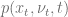
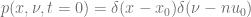
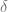
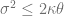
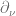
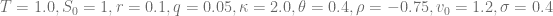
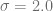

<!--yml

类别：未分类

日期：2024-05-17 23:32:07

-->

# Heston 模型的 Fokker-Planck 正向方程–HPC-QuantLib

> 来源：[`hpcquantlib.wordpress.com/2013/02/10/fokker-planck-forward-equation-for-the-heston-model/#0001-01-01`](https://hpcquantlib.wordpress.com/2013/02/10/fokker-planck-forward-equation-for-the-heston-model/#0001-01-01)

考虑 Heston 模型的随机微分方程，用于描述对数价格的动态 

Fokker-Planck 正向偏微分方程描述了概率密度函数的时间演变 

具有初始条件

其中  表示狄拉克δ分布。针对此问题的半封闭解法在[1]中提出。解决 Fokker-Planck 正向方程时，特别要注意边界条件，特别是费勒约束时

被违反。在这种情况下，边界处的原点  瞬间可达。在原点应用费勒零通量边界条件的泛化 [2]。

![左边[ \frac{\sigma²}{2}\frac{\partial}{\partial \nu} (\nu p) + \kappa(\nu-\theta)p + \rho\nu\sigma\frac{\partial p}{\partial x}\right]\right|_{\nu=0} = 0, \ \forall x\in \mathbb{R}^+ ](img/4858e2cc2e2eb5d9e31ece43e33931b2.png)

可以使用三点前向差分公式计算对于  的偏导数  的二阶精确近似 [3]。

下图展示了该模型的正向方程的解。

狄拉克约束在下被违反，这完全改变了解决方案的形状。

这个例子的代码在[这里](http://hpc-quantlib.de/src/heston_fpe.zip)可以找到，基于最新的[QuantLib](http://quantlib.org)版本来自 SVN 的[trunk](http://sourceforge.net/p/quantlib/code/HEAD/tree/)。它还依赖于[RInside](http://dirk.eddelbuettel.com/code/rinside.html)和[Rcpp](http://cran.r-project.org/web/packages/Rcpp/index.html)来生成图表。另外，zip 文件还包含一个关于时间演变解决方案的短视频剪辑。

[1] A. Dragulescu, V. Yakovenko, [Heston 模型中随机波动率的回报概率分布](https://arxiv.org/pdf/cond-mat/0203046)

[2] V. Lucic, [混合模型中通过 PDE 方法计算密度的边界条件](http://papers.ssrn.com/sol3/papers.cfm?abstract_id=1191962)

[3] K. A. Kopecky, [数值微分](http://www.karenkopecky.net/Teaching/eco613614/Notes_NumericalDifferentiation.pdf)
