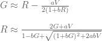
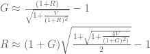

<!--yml

category: 未分类

date: 2024-05-18 14:47:22

-->

# 几何有效前沿 | 系统化投资者

> 来源：[`systematicinvestor.wordpress.com/2011/11/09/geometric-efficient-frontier/#0001-01-01`](https://systematicinvestor.wordpress.com/2011/11/09/geometric-efficient-frontier/#0001-01-01)

对于投资者来说什么是重要的？ 回报率是榜单上最重要的部分。 在均值-方差有效前沿上显示的预期回报率能完整呈现图景吗？ 如果投资者的投资周期长于一个周期，比如 5 年，那么投资组合绩效的真实度量是 [几何收益率](http://zh.wikipedia.org/wiki/收益率)，它始终小于或等于均值-方差有效前沿 Y 轴上画出的[算术收益率](http://zh.wikipedia.org/wiki/收益率)。

有关算术与几何收益的详细讨论请参阅 Pat Burns 的[两种回报的故事](http://www.portfolioprobe.com/2010/10/04/a-tale-of-two-returns/) 博客文章以及 Quantivity 的[为什么使用对数收益率](http://quantivity.wordpress.com/2011/02/21/why-log-returns/) 博客文章。

我将使用 [W. Bernstein 和 D. Wilkinson(1997) 的《分散化、再平衡和几何平均值前沿》](http://www.effisols.com/basics/rebal.pdf) 论文中提出的例子和方法来创建几何有效前沿。

首先让我们检查有效前沿的均值-方差组合，并计算它们的历史几何收益率：

```

# load Systematic Investor Toolbox
setInternet2(TRUE)
source(gzcon(url('https://github.com/systematicinvestor/SIT/raw/master/sit.gz', 'rb')))

#--------------------------------------------------------------------------
# Create Efficient Frontier
#--------------------------------------------------------------------------
	ia = aa.test.create.ia.rebal()
	n = ia$n

	# -1 <= x.i <= 1
	constraints = new.constraints(n, lb = 0, ub = 1)

	# SUM x.i = 1
	constraints = add.constraints(rep(1, n), 1, type = '=', constraints)

	# create efficient frontier(s)
	ef.risk = portopt(ia, constraints, 50, 'Arithmetic', equally.spaced.risk = T)

	# compute historical geometrical returns
	ef.risk.geometric = ef.risk
		ef.risk.geometric$name = 'Geometric'
		ef.risk.geometric$return = portfolio.geometric.return(ef.risk$weight, ia)

	# Plot multiple Efficient Frontiers and Transition Maps
	plot.ef(ia, list(ef.risk, ef.risk.geometric), portfolio.risk, T)

```


标记为“几何”的有效前沿位于“算术”有效前沿下方，并且在 21.6% 风险水平处拥有最大的几何均值。 所有风险大于 21.6% 的投资组合对于多周期投资的投资者来说是非有效的。

[W. Bernstein 和 D. Wilkinson(1997) 的《分散化、再平衡和几何平均值前沿》](http://www.effisols.com/basics/rebal.pdf) 论文讨论了用算术均值近似历史几何均值计算的四种方法。 所有计算都基于算术（R）和几何（G）均值之间的以下近似关系（第 8 页）：



为了复制论文中的结果，我将遵循第 14 页上概述的几何有效前沿构建方法。 A(0,1) 和 A(1,1) 几何有效前沿是由使用算术均值作为输入的经典马科维茨有效前沿构建的。 为了计算投资组合的几何均值，我使用上述近似公式。

G(0,1) 和 G(1,1) 几何有效前沿是从传统的马科维茨有效前沿构建的，它使用单个伪算术平均值作为输入。换句话说，我先将单个几何平均数转换为伪算术平均数，然后再将它们用于优化。计算组合几何平均数时，我使用上述近似值，与 A(0,1) 和 A(1,1) 一样。

```

###############################################################################
# Functions to convert between Arithmetic and Geometric means
###############################################################################
# page 8, DIVERSIFICATION, REBALANCING, AND THE GEOMETRIC MEAN FRONTIER by W. Bernstein and D. Wilkinson (1997)
###############################################################################
geom2aritm <- function(G, V, a, b) 
{ 
	(2*G + a*V²) / (1 - b*G + sqrt((1+b*G)² + 2*a*b*V²)) 
}

aritm2geom <- function(R, V, a, b) 
{ 
	R - a*V² / (2*(1 + b*R)) 
}

	#--------------------------------------------------------------------------
	# Following paper's notation : A(1,0) and A(1,1) page 8, 14
	#--------------------------------------------------------------------------
	# A(1,0)
	ef.risk.A10 = ef.risk
		ef.risk.A10$name = 'A(1;0)'
		ef.risk.A10$return = apply( cbind(ef.risk$return, ef.risk$risk), 1,
					function(x) aritm2geom(x[1], x[2], 1, 0) )
	# A(1,1)
	ef.risk.A11 = ef.risk
		ef.risk.A11$name = 'A(1;1)'
		ef.risk.A11$return = apply( cbind(ef.risk$return, ef.risk$risk), 1,
					function(x) aritm2geom(x[1], x[2], 1, 1) )
	# G(1,0)
	ia.G = ia
	ia.G$expected.return = apply( cbind(ia$geometric.return, ia$risk), 1,
					function(x) geom2aritm(x[1], x[2], 1, 0) )
	ef.risk.G10 = portopt(ia.G, constraints, 50, 'G(1;0)',equally.spaced.risk = T)
		ef.risk.G10$return = apply( cbind(ef.risk.G10$return, ef.risk.G10$risk), 1,
					function(x) aritm2geom(x[1], x[2], 1, 0) )
	# G(1,1)
	ia.G$expected.return = apply( cbind(ia$geometric.return, ia$risk), 1,
					function(x) geom2aritm(x[1], x[2], 1, 1) )
	ef.risk.G11 = portopt(ia.G, constraints, 50, 'G(1;1)',equally.spaced.risk = T)
		ef.risk.G11$return = apply( cbind(ef.risk.G11$return, ef.risk.G11$risk), 1,
					function(x) aritm2geom(x[1], x[2], 1, 1) )

	# Plot multiple Efficient Frontiers
	layout( matrix(1:4, nrow = 2) )
	plot.ef(ia, list(ef.risk, ef.risk.geometric, ef.risk.A10), portfolio.risk, F)
	plot.ef(ia, list(ef.risk, ef.risk.geometric, ef.risk.A11), portfolio.risk, F)
	plot.ef(ia, list(ef.risk, ef.risk.geometric, ef.risk.G10), portfolio.risk, F)
	plot.ef(ia, list(ef.risk, ef.risk.geometric, ef.risk.G11), portfolio.risk, F)

```


结果与论文第 27 页的结果非常接近。

但我们可以做得更好，在最近的一篇论文[《关于 D. Mindlin（2011）所著《算术与几何回报之间的关系》》](http://www.cdiadvisors.com/papers/CDIArithmeticVsGeometric.pdf)中，作者对四种近似方法进行了详细评估以实现算术回报和几何回报之间的转换。最终的优胜者是关系（A4）（第 8 页）：



让我们比较在同样的框架下 A4 方法给出的几何平均值近似值：

```

###############################################################################
# Functions to convert between Arithmetic and Geometric means
###############################################################################
# page 14, A4, On the Relationship between Arithmetic and Geometric Returns by D. Mindlin
###############################################################################
geom2aritm4 <- function(G, V) 
{ 
	(1+G)*sqrt(1/2 + 1/2*sqrt(1 + 4*V²/(1+G)²)) - 1 
}

aritm2geom4 <- function(R, V) 
{ 
	(1+R)/(sqrt(1 + V²/(1+R)²)) - 1 
}

	#--------------------------------------------------------------------------
	# Use A4 method to convert between Arithmetic and Geometric means
	#--------------------------------------------------------------------------
	# A
	ef.risk.A4 = ef.risk
		ef.risk.A4$name = 'Risk A4'
		ef.risk.A4$return = apply( cbind(ef.risk$return, ef.risk$risk), 1,
								function(x) aritm2geom4(x[1], x[2]) )

	# G
	ia.G = ia
	ia.G$expected.return = apply( cbind(ia$geometric.return, ia$risk), 1,
								function(x) geom2aritm4(x[1], x[2]) )
	ef.risk.G4 = portopt(ia.G, constraints, 50, 'Risk G4',equally.spaced.risk = T)
		ef.risk.G4$return = apply( cbind(ef.risk.G4$return, ef.risk.G4$risk), 1,
								function(x) aritm2geom4(x[1], x[2]) )

	# Plot multiple Efficient Frontiers
	layout( matrix(1:2, nrow = 2) )
	plot.ef(ia, list(ef.risk, ef.risk.geometric, ef.risk.A4), portfolio.risk, F)
	plot.ef(ia, list(ef.risk, ef.risk.geometric, ef.risk.G4), portfolio.risk, F)

```


结果与几何有效前沿非常接近，并且优于 A(1,0), A(1,1), G(1,0), G(1,1) 的近似值。

以上所有讨论都是基于由算术有效前沿构成的几何有效前沿。但是我们为什么认为几何有效前沿和算术有效前沿将拥有相同的组合呢？

让我们创建真实的几何有效前沿。我不知道解决此问题的线性规划方法，所以我将使用一个基于[Prof. Dr. Peter Spellucci](http://www.mathematik.tu-darmstadt.de/fbereiche/numerik/staff/spellucci/spellucci.html)开发的 donlp2 示例开发和版权的非线性规划求解器[Rdonlp2](http://arumat.net/Rdonlp2/tutorial.html)。以下代码可能在您的计算机上无法正常执行，因为 Rdonlp2 只适用于 R 版本 2.9 或更低版本。

```

	#--------------------------------------------------------------------------
	# Create True Geometric Efficient Frontier
	#--------------------------------------------------------------------------
	ef.true.geometric = ef.risk
		ef.true.geometric$name = 'True Geometric'
		constraints$x0 = ef.risk$weight[1,]

	for(i in 1:len(ef.risk$risk)) {
		cat('i =', i, '\n')
		ef.true.geometric$weight[i,] = max.geometric.return.portfolio(ia, constraints, ef.risk$risk[i], ef.risk$risk[i])
			constraints$x0 = ef.true.geometric$weight[i,]
	}

	ef.true.geometric$return = portfolio.geometric.return(ef.true.geometric$weight, ia)

	# Plot multiple Efficient Frontiers
	layout( matrix(1:4, nrow = 2) )
	plot.ef(ia, list(ef.risk.geometric, ef.risk, ef.true.geometric), portfolio.risk, T, T)
	plot.ef(ia, list(ef.true.geometric, ef.risk, ef.risk.geometric), portfolio.risk, T, T)

```


max.geometric.return.portfolio() 函数的源代码在本文的末尾。

真实的几何有效前沿和由算术有效前沿组成的几何有效前沿看起来是相同的。这一结论也得到了论文[Elton, M. Gruber (1974)关于《利用对数正态回报分布最大化几何平均数》](http://pages.stern.nyu.edu/~eelton/papers/74-dec.pdf)的支持。以下是摘要内容：

[在本文中，我们讨论了几何平均数作为投资组合选择标准的相关性。在投资组合回报呈对数正态分布时，提出了寻找具有最高几何平均数的投资组合的程序。该算法的发展涉及**证明在算术平均值方差空间中，具有最大几何平均值的投资组合位于有效前沿上**。](http://mansci.journal.informs.org/content/21/4/483.short)

最后一步是检查通过非线性优化找到的投资组合是否为全局最大值。我将创建 1,000,000 个满足约束条件的随机投资组合，并在同一图表上绘制真正的几何有效前沿和随机投资组合。

```

	#--------------------------------------------------------------------------
	# Double check that NonLinear Optimization finds global maximums by
	# creating random portfolios that satisfy constraints. 
	# Plot True Geometric Efficient Frontier and random portfolios, check
	# that all portfolios lie below the efficient frontier.
	#--------------------------------------------------------------------------	
	# Generate random portfolios
	ef.random = list()
		ef.random$name = 'Random'
		ef.random$weight = randfixedsum(1000000, n, 1, 0, 1)

		ef.random$risk = portfolio.risk(ef.random$weight, ia)		
		ef.random$return = portfolio.geometric.return(ef.random$weight, ia)		

	# Plot True Geometric Efficient Frontier and random portfolios
	layout(1)
	plot(100*ef.random$risk, 100*ef.random$return, type='p', pch=20,
			xlim = 100*range(ef.random$risk, ef.true.geometric$risk),
			ylim = 100*range(ef.random$return, ef.true.geometric$return),
			main = 'True Geometric Efficient Frontier vs Random Portfolios',
			xlab = 'portfolio.risk',
			ylab = 'Return'			
		)
	lines(100*ef.true.geometric$risk, 100*ef.true.geometric$return, type='l', lwd=2,col = 'red')

```


非线性优化找到了全局最大值：所有随机投资组合（黑点）都位于真正的几何有效前沿（红线）下方。为了生成随机投资组合，我使用了[Roger Stafford 创建的 randfixedsum 函数（具有固定和的随机向量）](http://www.mathworks.com/matlabcentral/fileexchange/9700-random-vectors-with-fixed-sum)。randfixedsum 函数随机均匀地生成具有指定总和和指定区间内的值的向量。

*我在这篇文章中想传达的信息是始终要检查几何有效前沿，该前沿由算术有效前沿上的投资组合构成，并确保你在投资组合风险中得到补偿。也就是说，你承担的风险越大，你的投资组合的几何回报就会越大。*

要查看此示例的完整源代码，请查看[github 上的 aa.test.r 中的 aa.arithmetic.geometric.test()函数](https://github.com/systematicinvestor/SIT/blob/master/R/aa.test.r)。

max.geometric.return.portfolio()函数的源代码：

```

max.geometric.return.portfolio <- function 
(
	ia,		# input assumptions
	constraints,	# constraints
	min.risk,
	max.risk
)
{
	n = ia$n
	nt = nrow(ia$hist.returns)

	require(Rdonlp2)

	# Geometric return
	fn <- function(x){
		portfolio.returns = x %*% t(ia$hist.returns)	
		prod(1 + portfolio.returns)
	}

	# control structure, fnscale - set -1 for maximization
	cntl <- donlp2.control(silent = T, fnscale = -1, iterma =10000, nstep = 100, epsx = 1e-10)	
	# lower/upper bounds
	par.l = constraints$lb
	par.u = constraints$ub

	# intial guess
	p = rep(1, nrow(constraints$A))
	if(!is.null(constraints$x0)) p = constraints$x0

	# linear constraints
	A = t(constraints$A)
	lin.l = constraints$b
	lin.u = constraints$b
	lin.u[ -c(1:constraints$meq) ] = +Inf

	# Nonlinear constraints
	nlcon1 <- function(x){
		sqrt(t(x) %*% ia$cov %*% x)
	}

	# find solution
	sol = donlp2(p, fn, par.lower=par.l, par.upper=par.u,
			A=A, lin.u=lin.u, lin.l=lin.l, control=cntl,
			nlin=list(nlcon1),
			nlin.upper=c(max.risk),
			nlin.lower=c(min.risk)
			)

	x = sol$par

	return( x )
}

```
