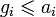
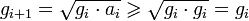
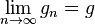
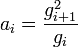
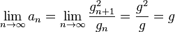

<!--yml

类别：未分类

日期：2024-05-12 18:46:08

-->

# 几何平均回报和算术平均回报分歧振荡器（GAMDO）| CSSA

> 来源：[`cssanalytics.wordpress.com/2009/09/25/geometric-and-arithmetic-mean-divergence-oscillator-gamdo/#0001-01-01`](https://cssanalytics.wordpress.com/2009/09/25/geometric-and-arithmetic-mean-divergence-oscillator-gamdo/#0001-01-01)

*注：使用累积动量作为价格代理的帖子将由于其复杂性而保留到以后。*

几何平均是由不同的动量或价格回报复合得出的平均数。相比之下，算术平均只是不同动量或价格回报的平均数。几何回报通常与算术平均回报有很大不同，这种分歧是宝贵信息的来源。在极限情况下，几何平均和算术应该收敛。这意味着如果一个偏离另一个太远，它很可能会恢复正常。这在短期系列中尤其真实，那里几何平均和算术平均之间的正分歧对未来股价是负面的。相比之下，在长期价格系列中出现正分歧则实际上对未来股价是有利的。这段摘录来源于维基百科 [`en.wikipedia.org/wiki/Arithmetic-geometric_mean`](http://en.wikipedia.org/wiki/Arithmetic-geometric_mean) ：

通过[算术和几何均值不等式](https://cssanalytics.wordpress.com/wiki/Inequality_of_arithmetic_and_geometric_means "Inequality of arithmetic and geometric means")我们可以得出：

因此

即 *g[i]* 序列是非递减的。此外，很容易看出它也被 *x* 和 *y* 中较大的一个上界所限制（这是由两个数字的算术平均数和几何平均数都在它们之间这一事实得出的）。因此，根据玻尔查诺-魏尔斯特拉斯定理，*g[i]* 存在一个收敛子序列。然而，由于该序列是非递减的，我们可以得出该序列本身是收敛的，因此存在一个 *g* 使得：

然而，我们也可以看到：

所以：

令人惊讶的是，这个简单的概念支撑着一个短期振荡器，实际上在 1955 年以来的 S&P500 指数中表现优异，但不包括 1997-2009 年！在买入信号之前的平均每周回报为-0.3%，在卖出信号时，每周回报为 0.42%。 **当振荡器低于 0.5（超卖时），市场从 1955 年至 2009 年的复合回报率为 6%，不包括股息。当振荡器高于 0.5（超买时），市场的回报率为 0.0016%**！

振荡器的创建涉及对过去 5 天的百分比回报（或 1 日 ROC）进行算术平均。 通过简单地将 1 加到百分比回报，并在过去的 5 天内获取该系列的乘积（累积回报），创建了几何回报。 通过从累积回报中减去 1 来得到该振荡器的几何回报。 然后我们通过几何回报减去算术回报来找到差距。 该差距平滑两次，使用 3 天平均值来创建平滑信号（请注意，原始差距会产生相同方向的信号）。 最后，通过取 1 年回溯的系列的 PERCENTRANK 来“限制”该平滑差距。

*明天继续……*
