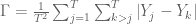

<!--yml

category: 未分类

日期：2024 年 5 月 18 日 14:41:41

-->

# Gini 有效前沿|系统性投资者

> 来源：[`systematicinvestor.wordpress.com/2012/03/24/gini-efficient-frontier/#0001-01-01`](https://systematicinvestor.wordpress.com/2012/03/24/gini-efficient-frontier/#0001-01-01)

[David Varadi](http://cssanalytics.wordpress.com/)最近写了两篇关于[Gini 系数](http://en.wikipedia.org/wiki/Gini_coefficient)的博文：[我梦见了 Gini](http://cssanalytics.wordpress.com/2012/02/24/i-dream-of-gini/)，和[均值 Gini 优化](http://cssanalytics.wordpress.com/2012/02/25/mean-gini-optimization/)。 我想展示如何利用 Gini 风险度量构建有效前沿，并将其与我之前讨论的替代风险度量进行比较。

我将使用[Gini 均值差异](http://en.wikipedia.org/wiki/Mean_difference)风险度量-每对收益的差异的均值来构建 Mean-Gini 有效前沿。 我将使用“Mean Gini 有效集的生成”中 J. Okunev（1991）论文中提出的方法来构建最优投资组合。

让 x.i，i= 1,…，N 分别表示组合中工具的权重。 我们用 r.it 表示第 i 个资产在 t 时期的收益，其中 i= 1,…，N，t= 1,…，T。 组合的 Gini 均值差异（第 5 页）可表示为：



它可以被表述为一个线性规划问题


这个线性规划问题可以很容易地实现

```

min.gini.portfolio <- function
(
	ia,		# input assumptions
	constraints	# constraints
)
{
	n = ia$n
	nt = nrow(ia$hist.returns)

	# objective : Gini mean difference - the mean of the difference between every possible pair of returns
	#  1/(T²) * [ SUM <over j = 1,...,T , k>j> a.long.jk + a.short.jk ]
	f.obj = c(rep(0, n), (1/(nt²)) * rep(1, nt*(nt-1)))

	# adjust constraints, add a.long.jk , a.short.jk
	constraints = add.variables(nt*(nt-1), constraints, lb=0)

	# [ SUM <over i> x.i * (r.ij - r.ik) ] - a.long.jk + a.short.jk = 0
	# for each j = 1,...,T , k>j	
	a = matrix(0, n + nt*(nt-1), nt*(nt-1)/2)
		diag(a[(n+1) : (n + nt*(nt-1)/2), ]) = -1
		diag(a[(n+1+nt*(nt-1)/2) : (n + nt*(nt-1)), ]) = 1
	hist.returns = as.matrix(ia$hist.returns)

	i.start = 0
	for(t in 1:(nt-1)) {
		index = (i.start+1) : (i.start + nt -t)
		for(i in 1:n) {
			a[i, index] = ( hist.returns[t,i] - hist.returns[,i] ) [ (t+1) : nt ] 
		}
		i.start = i.start + nt -t		
	}
	constraints = add.constraints(a, 0, '=', constraints)

	# setup linear programming	
	f.con = constraints$A
	f.dir = c(rep('=', constraints$meq), rep('>=', len(constraints$b) - constraints$meq))
	f.rhs = constraints$b

	# find optimal solution
	x = NA
	sol = try(solve.LP.bounds('min', f.obj, t(f.con), f.dir, f.rhs, 
					lb = constraints$lb, ub = constraints$ub), TRUE)

	if(!inherits(sol, 'try-error')) {
		x = sol$solution[1:n]
	}

	return( x )
}

```

让我们查看使用样本历史输入假设计算的 Gini 和标准差风险度量下的有效前沿。

```

###############################################################################
# Load Systematic Investor Toolbox (SIT)
# https://systematicinvestor.wordpress.com/systematic-investor-toolbox/
###############################################################################
con = gzcon(url('http://www.systematicportfolio.com/sit.gz', 'rb'))
    source(con)
close(con)

	#--------------------------------------------------------------------------
	# Create Efficient Frontier
	#--------------------------------------------------------------------------
	ia = aa.test.create.ia.rebal()
	n = ia$n		

	# 0 <= x.i <= 1 
	constraints = new.constraints(n, lb = 0, ub = 1)

	# SUM x.i = 1
	constraints = add.constraints(rep(1, n), 1, type = '=', constraints)		

	# create efficient frontier(s)
	ef.risk = portopt(ia, constraints, 50, 'Risk')
	ef.gini = portopt(ia, constraints, 50, 'GINI', min.gini.portfolio)

	#--------------------------------------------------------------------------
	# Create Plots
	#--------------------------------------------------------------------------
	layout( matrix(1:4, nrow = 2) )
	plot.ef(ia, list(ef.risk, ef.gini), portfolio.risk, F)	
	plot.ef(ia, list(ef.risk, ef.gini), portfolio.gini.coefficient, F)	

	plot.transition.map(ef.risk)
	plot.transition.map(ef.gini)

```


Gini 有效边界几乎与标准差有效边界相同，标记为‘风险’。 这并不令人意外，因为用于样本输入假设的资产收益表现良好。 如果资产收益包含大的异常值，则 Gini 风险度量将是最合适的。

要查看此示例的完整源代码，请查看[github 上的 aa.test.r 中的 aa.gini.test()函数](https://github.com/systematicinvestor/SIT/blob/master/R/aa.test.r)。

接下来，我将基尼风险测度添加到了我在[回测资产配置组合](https://systematicinvestor.wordpress.com/2012/03/19/backtesting-asset-allocation-portfolios/)文章中考察的资产配置策略中。


基尼配置组合和最小方差配置组合表现非常相似

要查看此示例的完整源代码，请查看[github 上的 bt.test.r 中的 bt.aa.test()函数](https://github.com/systematicinvestor/SIT/blob/master/R/bt.test.r)。
