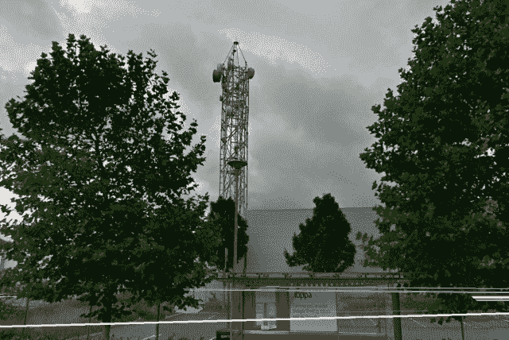
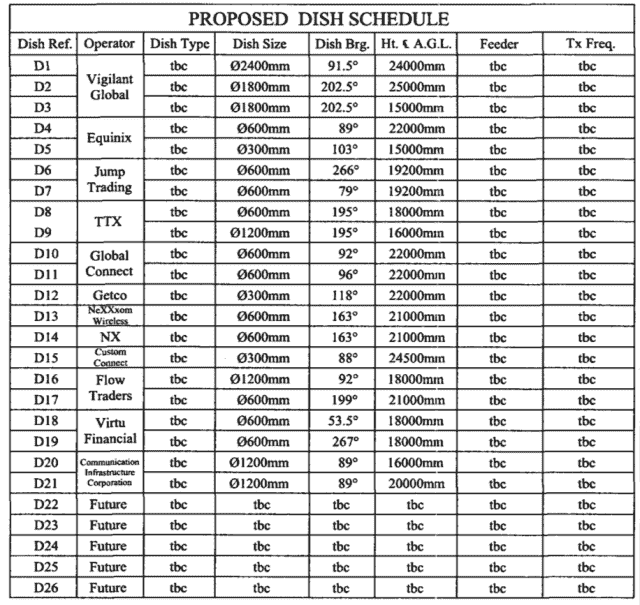

<!--yml

category: 未分类

date: 2024-05-18 14:10:47

-->

# HFT（不）在香蕉乐园 | 第四部分 - 马瓦和朋友

> 来源：[`sniperinmahwah.wordpress.com/2016/07/27/hft-not-in-the-banana-land-part-4/#0001-01-01`](https://sniperinmahwah.wordpress.com/2016/07/27/hft-not-in-the-banana-land-part-4/#0001-01-01)

这个博客有一段时间没更新（太忙了），但这并不意味着“香蕉乐园的 HFT”系列已经结束。相反：在 Richborough，由 Vigilant Global/DRW 和 New Line Networks (KCG/Jump)之间的激烈斗争已成为了名副其实的“[小镇对抗大型 HFT 塔](http://blog.themistrading.com/2016/02/the-case-of-the-small-english-town-vs-the-large-hft/)”，现在应该改名为“小镇对抗**两个**大型 HFT 塔”，因为 Vigilant Global 和 New Line Networks 现在正努力在同一地区竞争建造 300 米的塔，距离只有一公里，- 近日在芝加哥，第三方非常担心的最近[表示](http://www.mckay-brothers.com/exchanges-vs-networks/)：“*这太疯狂了*”。香蕉乐园（以及比利时）最近发生了什么非常迷人；发生了很多事情，很难总结，但我将尽量在下一集中对当前的情况进行不太长、清晰的总结。

在 Richborough 的 Vigilant Global 和 New Line Network，Eiffel Towers 的战斗正在进行中。

（顺便说一句，当 Themis 的 Joe Saluzzi 发布了“[小镇对抗大型 HFT 的案例...](http://blog.themistrading.com/2016/02/the-case-of-the-small-english-town-vs-the-large-hft/)”时，他的推特被@RemcoLenterman 点赞，并被@nanexllc 转发，这真是*a tour de force*。恭喜 Joe，被 Remco 和 Nanex 认可是一个相当大的挑战）。

###### **斯洛夫**

所有在伦敦和法兰克福之间建立网络的高频交易公司（如 Vigilant、Optiver 等）或微波提供商（如 Custom Connect）至少需要处理伦敦的两个不同地点（除了 LHC 和 Interxion）：巴斯尔登（ICE/NYSE/Euronext 交易所所在地）和斯劳（Equinix LD4，例如 BATS (ex-)Chi-X 的匹配引擎所在地）。在伦敦地铁区域，波段不是微波而是毫米波（MMW）。毫米波比微波更快，但由于信号损失更高，不适用于长距离传输，因此两点之间的路径仅为数公里（与微波可以达到 100 公里的路径相比）。这意味着在斯劳和巴斯尔登之间有*大量*的毫米波接收器。这也意味着每个位置都很重要，如果需要，比如说，建立一个杆塔。根据 McKay Brothers 的[网站](http://www.quincy-data.com/product-page/)，毫米波信号在两个数据中心之间传输不到*一毫秒*（确切地说是 273 微秒）。每微秒都很重要。

伦敦的微波网络。直线路径是白色的。（请注意，此地图不是最新的）

回到 2013 年 2 月，Equinix 决定在他们的数据中心旁边修建一个 25 米的杆塔。规划申请在[这里](http://www.sbcplanning.co.uk/sbcp/slough01/planapp/A27C89E7/A27C89E7.pdf#pagemode=thumbs)，其中一部分很有趣：“*Equinix 全球数据中心和国际业务交流目前通过光纤电缆连接。然而，在英国，金属和电缆盗窃在近年来几乎蔓延成流行病。在过去的几年里，这已经成为增长最快的国家威胁之一，据内政大臣和英国财政部估计，仅金属/电缆替换的年度成本大约为 10 亿英镑。这些无数的光纤切割不仅给 Equinix 及其客户，特别是在英国金融服务部门，造成了服务速度大幅下降，而且由于英国是世界上全球化程度最高的经济体之一，而伦敦市更是全球三大经济指挥中心之一，这是不可接受的。事实上，由于金融服务对英国 GDP 的贡献占据较大比例，任何服务的减缓或潜在的中断都属于国家重要事项。因此，Equinix 的许多客户现在正在实施无线网络以避免任何此类故障和随后的重要服务丢失和 GDP 减少*。”如果我理解正确，高频交易商决定使用无线网络，因为一些恶棍电缆小偷减少了英国的国内生产总值...好故事。

Equinix/LD4 数据中心支架上的高速交易者

该应用程序包括了我在开始调查 HFT 网络时错过的一个有趣的文档，其中列出了在 Equinix 支架上安装（或应该安装）天线的不同“运营商”的名字：

如预期的那样，我们遇到了一些熟悉的名字：Vigilant Global、Jump Trading、Global Connect/Flow Traders、Getco - 现在是 KCG -、Custom Connect 和 Virtu Financial，但似乎 Virtu 在欧洲从未建立过专有无线网络。我不知道 TTX 是谁 - TTX Trading LLP，一个在 2015 年被 [解散](https://beta.companieshouse.gov.uk/company/OC366902/filing-history)的英国公司？或者另一个 [TTX Trading](https://offshoreleaks.icij.org/nodes/10140705) ？不管怎样，这张表格日期是 2013 年，没有包括其他熟悉的名字/运营商/公司，比如 McKay Brothers、Optiver 或 Tixos。Tixos 是一个有趣的例子。他们只在 Slough-Basildon 路线上运行，没有完整的伦敦-法兰克福网络，所以我怀疑 Tixos 对股票比对衍生品更感兴趣。当我开始弄清楚是谁在我们头上传送超低延迟的波时，Tixos 是唯一一个我无法识别的网络。Tixos 似乎既不是一个交易公司，也不是一个公开的微/毫/波提供商。我怀疑 Tixos 是一个为单一市场制造商/高频交易者提供服务的私人无线提供商（我是对的）。但关于这个英国公司的 [公开数据](https://beta.companieshouse.gov.uk/company/08659771/filing-history) 中并没有提到与交易相关的名字。由于 *tixos* 在希腊语中的意思是“墙”，我认为 Tixos 背后的公司来自 *华尔* 街（我错了）。我向我的行业联系人打听，有些人知道答案，但不想告诉我（这是他们和我的常规有趣的游戏：我得自己找到信息 ;）。在某个时候，我从伦敦得到了线索，说：“看看 [Modern Markets 的人](http://modernmarketsinitiative.org/about/about-modern-markets-initiative/)”。有趣。

因此，Equinix 建立了一个支架，并出租空间给不同的 HFT 相关公司。但一些其他交易所可能没有，也许是因为它们有高屋顶（纯属猜测），就像法兰克福的德国证券交易所。

夜晚法兰克福德国证券交易所数据中心的屋顶。感谢 [censured] 提供照片。

###### 巴西尔登

正如在巴西尔登看到的那样，可以通过一位金融工程师的推特看到（现在这个屋顶上有更多的天线）：

我两次去了巴西尔登，但天线阵列位于屋顶中央 — 一次是和（法语不好的）电视记者一起去的，我问他们能否带一架无人机，这样他们就可以拍摄碟子，但他们拒绝了 — 太糟糕了。现在让我们谈谈体育。因为高频交易公司喜欢体育。以下是欧洲期权交易所周围区域的地图：

这个区域有两个体育场：[巴西尔登运动与休闲俱乐部](https://www.facebook.com/Basildon-Sport-and-Leisure-Club-166215233431941/)和[巴西尔登橄榄球俱乐部](http://www.pitchero.com/clubs/basildon/contact/)。回到 2013 年 8 月，Jump Trading 提交了一份[规划申请](http://planning.basildon.gov.uk/online-applications/applicationDetails.do?activeTab=documents&keyVal=MODTE0CQ32000)，在巴西尔登运动与休闲俱乐部的一个场地上建造一座 20 米高的支架 — 如果你找不到恰好在你需要的地方有建筑物或塔，你只需建造自己的设施。“*提议安装碟子的方向将反映微波传输链路的方向，并促进跨英国境外的高速数据传输，使英国企业在全球经济中更具竞争力*”。

巴西尔登的 Jump Trading 20 米高的支架

[Ofcom 授权](http://spectruminfo.ofcom.org.uk/spectrumInfo/licences?service=Fixed+Links&code=301010&freqStart=&freqStop=&unit=GHz&ngrloc=&offset=&nw=%2851.58944283871291%2C+0.4777336120605469%29&ne=%2851.58944283871291%2C+0.4799652099609375%29&se=%2851.58805634325151%2C+0.4799652099609375%29&sw=%2851.58805634325151%2C+0.4777336120605469%29&googloc=%2851.58874959627155%2C+0.4788494110107422%29&googoffset=0.1&submit=Submit+search)在 2013 年授予 Jump（并于 2015 年授予 New Line Networks），显示从这个新支架到欧洲期权交易所数据中心的路径，以及到斯劳的三条可能路径：

“*网站所有者计划未来重新开发该网站，因此，拟议的电信设备只签定了为期 2 年的租约*” Jump 说。没错：该公司在 2015 年 7 月提交了新的[申请](http://planning.basildon.gov.uk/online-applications/applicationDetails.do?activeTab=documents&keyVal=NOEEF0CQ06B00)（“*更新规划许可*”等），并再次表示“*物业所有者计划未来有可能重新开发该网站*”。

与此同时，2014 年 10 月，另一家高频交易公司对当地的体育中心表现出兴趣，并提交了一份[申请](http://planning.basildon.gov.uk/online-applications/applicationDetails.do?activeTab=documents&keyVal=NCRD61CQFUQ00)，计划在巴西尔登橄榄球俱乐部的场地上建造一座高达 35 米的铁塔（比 Jump 的高 15 米）。这家竞争对手的名字是谁？Vigilant Global。现在 Richborough 正在发生的事情只是 Basildon 之前发生的事情的续集 - 不过这次更高的塔。Vigilant 在文件中表示，“*通过这个站点，Vigilant Global 致力于通过对当地橄榄球俱乐部进行补偿来为社区做出贡献*... *如果这个申请被拒绝，对于 Vigilant Global 的财务回报的负面影响将通过经济效应对当地社区产生类似的影响*... *在该站点的北部约 300 米处，Selex 体育休闲俱乐部的场地内已经存在一个类似性质的 20 米格栅塔” - * 你好 Jump - 但 Vigilant 补充说 Jump 的塔是“*不适合此提议的结构，因为它太低，无法达到所需的网络路径的视线*”（注意 Vigilant 从未写过不适合的塔是竞争对手的所有权 - 需谨慎）。带着这座新的 35 米高的塔，在巴西尔登，Vigilant 离巴西尔登和斯劳之间的完美直线越来越近。做得好。

Jump 和 Vigilant 在巴西尔登。巴西尔登和斯劳斯之间的直线是白色的。

当地的景观现在应该是这样的：

高频交易（HFT）之前。高频交易之后。

（与高高的、非常优雅的拉索塔相比，这座小塔相当丑，但这是个人品味的问题）。但故事还没结束。2016 年 1 月，Jump 决定反击，并通过新线网络提交了新的[申请](http://planning.basildon.gov.uk/online-applications/applicationDetails.do?activeTab=documents&keyVal=O1KHV0CQJJ100)，称他们希望改善他们的支架：“*现在需要临时许可以建造更大的结构，以改善网络并在有限时间内提供新链接*”。 “更大的结构”意味着新支架将有 34 米高（尽管比警惕塔低 1 米）。生活在香蕉土地周围的居民会喜欢这一部分：“*2015 年 2 月 5 日，为 4 个直径 0.6 米的电信天线、1 个设备柜和附属开发项目批准了一个 35 米高的格子塔*” – 警惕支架。“考虑过共享这个站点” – 警惕和 Jump/NLN 有过一点讨论吗？“*然而，由于房东已与租户签订了独家合同* [警惕]*该站点不可供共享” – 很可惜。这个故事到此为止。（2016 年 4 月，Jump/NLN 撤回了申请，看来他们放弃了他们的新支架）。

这些小支架中有些是临时的，如果 HFT 公司找到了更好的位置/路径，它们将被移除。但 Jump/NLN 和警惕力图在香蕉土地周围建造的 300 米高的支架将会留在那里（至少 25 年）。这是完全不同的故事。“*我们不愿意支持那里的任何支架，并建议将其移到像高盛公司 CEO 的花园之类的地方！！*” 一位 Richborough 的居民在评论中写道。这场斗争将会激烈。敬请关注，祝夏日愉快。
