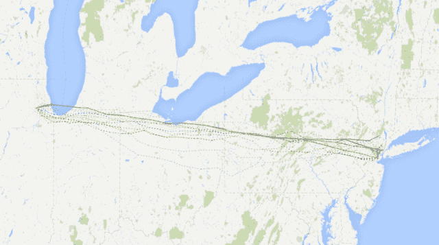
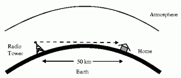
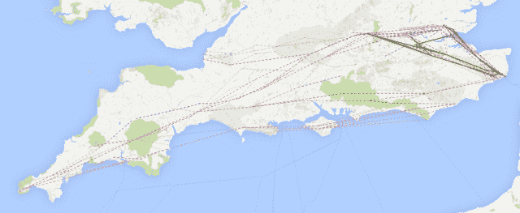

<!--yml

类别：未分类

日期：2024-05-18 14:16:02

-->

# 我家门前的高频交易（HFT）- I – 马瓦狙击手和朋友

> 来源：[`sniperinmahwah.wordpress.com/2014/09/22/hft-in-my-backyard-part-i/#0001-01-01`](https://sniperinmahwah.wordpress.com/2014/09/22/hft-in-my-backyard-part-i/#0001-01-01)

###### 简介

一到夏天，比利时就有自然的人类迁徙，从法语瓦隆到该国的佛兰德区海岸。在这里，*à la mer du Nord*，人们在白色沙滩上放松，骑行着著名的“cuistax”四轮自行车。比利时西海岸对许多人来说是一个（海上）家园，所以我无法拒绝陪同我家的两位当地成员一周*à la mer du Nord*。我决定这次不带几十本书，只带了一份名为“经纪人是否可以拥有一切？”的[有争议](http://blog.themistrading.com/new-academic-paper-is-the-equivalent-of-94-christie-schultz-study/) [论文](http://papers.ssrn.com/sol3/papers.cfm?abstract_id=2367462)，但太阳太烈了，我决定在沙滩上喝莫吉托酒。

我唯一进行的旅行是到[弗尔内](https://www.google.fr/maps/place/Furnes,+Belgique/@51.041575,2.671375,12z/data=!3m1!4b1!4m2!3m1!1s0x47dcbdf9fd87a221:0xfd76e102ea40b1c3)，一个典型的佛兰德城市，在那里我品尝了一些当地啤酒。一周后，我回到布鲁塞尔，在 2014 年 7 月 16 日，彭博发布了一则关于一家芝加哥擅自交易公司以 500 万欧元购买一座古老塔楼的消息....就在弗尔内。真是巧合！自 2012 年以来，我一直研究并撰写关于高频交易（HFT）的内容，并非常了解一些快速参与者使用的微波网络，但是我不知道截至 2013 年 1 月，跳水交易公司在比利时拥有一座高塔-在我家门前。就地理位置而言，比利时正处于这个问题的中心。我决定调查欧洲这里大型 HFT 参与者拥有或使用的微波网络，作为我的节日作业。如果跳水公司拥有一座塔，那么竞争者就到处都是-只是一个问题*在哪里*。我对于这些塔的问题是“是否我可以拥有它们所有”，因此我的调查，也许是迷恋，开始了。我发现了太多要讨论的事情，所以我把我的故事分成了五部分。本系列的第一部分我们将称为“高频交易（HFT）微波网络的绘图”-即使“我如何成为土豆田领域专家”也是准确的。

###### 从芝加哥到比利时，一座塔的简史

我的[书](http://www.zones-sensibles.org/livres/6-5)的第一部分，*6*，主要讲述了在 REG NMS 时代前后高频交易机器的崛起。通过对 Electronic Communication Networks，例如 Island 的涌现进行绘制，我意识到芝加哥市场的历史与这些技术的崛起紧密相连，比起华尔街 SOES 劫匪的故事更加有趣。因此，这本书的第二和最后一部分，*5*，着重于芝加哥，特别是从旧的人类交易场转变为现在的电脑化生态系统的过程（或人和电脑共存的大型数据中心）。

芝加哥交易所的历史是任何对商品和金融市场的电脑化感兴趣的人的一个真实案例研究。我曾经写到过电报在芝加哥的传入；第一个电报“推文”是在芝加哥与首个有组织的交易所芝加哥期货交易所（CBOT）成立的仅仅三个月之前抵达的。我甚至在 19 世纪的一些芝加哥报纸上发现了词组“闪单”，用来描述交易者使用快速私人电报线买入他们知道价格会在接下来的几秒钟内上涨的商品，所以他们可以以比他们几秒前购买的更高价转售出去 - 听起来熟悉吗？

还有许多其他有趣的现代实践的前辈。例如，在维尔讷（Veurne）这座微波塔存在之前，芝加哥期货交易所便以为着眼点。它最初的位置是城市中最高的房子，当交易所在 1885 年被迫建造自己的大楼时，这个大楼既是伊利诺伊州最高的物业，也是芝加哥第一个使用电力的建筑。弗兰克·诺里斯在他的小说[*The Pit*](http://www.gutenberg.org/ebooks/4382)中描述道：“*灯火通明的办公大楼，雨的阴暗，天空中的光芒，以及在这一切之下高高耸立着的期货交易所大楼，黑色，庄严，庞大，像一只下颚长在地基上的巨大斯芬克斯雕像，没有声音，夜晚和雨幕下的无生命迹象*”。

在 20 世纪 20 年代，董事会成员投票决定兴建一个新建筑，成为“资本主义的大教堂”，并与建筑师、交易商以及一些主要的电报公司展开讨论，以找到改善交易场所社交空间的最佳方式。交易商对过多的噪音感到不满，而西联电报和 RCA 等电报公司则在游说安装大量快速线路。1930 年建成在拉萨尔街附近的[芝加哥商品交易所大楼](http://en.wikipedia.org/wiki/Chicago_Board_of_Trade_Building)拥有超过 4300 公里的电话线和 24 万公里的电报线路——机器崛起的第一步。它高耸在芝加哥上空，直到 1965 年，一尊面无表情的农业女神瑟雷斯的雕像装点着它的顶部。

交易所的核心是交易场所，因此技术也有了相应的进步。第一个交易货物场所是在 1878 年由鲁本·S·詹宁斯[申请专利](http://www.google.com/patents/US203837)，很快芝加哥商品交易所就在没有向詹宁斯支付费用的情况下建造了不同的交易场所。这位发明家试图起诉芝加哥商品交易所，但失败了，他的专利被法官否认。詹宁斯设计了这个交易场所，这样一个交易商可以在最佳条件下看到和听到另一位交易商。因此交易场所的台阶不同，站在最高的台阶上的交易商能够有更好的“天际线”，并且比中/底部的交易商更快地看到对手，进行交易。这一切都与速度有关。

高度成为促进速度的重要因素。一个交易商的身高成为一种优势，这也是一些交易商曾是前篮球或橄榄球运动员的原因之一——“*[身高较高的交易商更容易被看到](http://www.sps.ed.ac.uk/__data/assets/pdf_file/0006/93867/Merc21b.pdf)*”。在 1990 年代，一些交易商在交易场所穿高跟鞋以交易更快，然而由于缺乏平衡而不可避免地导致受伤。这促使芝加哥商品交易所（CME）于 2000 年 11 月实施规定，规定最高鞋跟高度为两英寸。鞋跟高度的标准化是为了在交易场所上平衡速度的竞争优势。最近，伦敦金属交易所（LME）的最后一个欧洲开口委托交易场所或交易环境对站立交易商处以罚款，违反规定者： “*站立交易者会导致不公平的竞争优势，并可能阻碍其他交易者和 LME 评定委员会成员的视线*” ，一名英国交易所发言人说。

无论人们穿多高的高跟鞋，计算机的速度都高于人类，所以到了 20 世纪 80 年代和 90 年代，交易所的电脑化变得猖獗起来。唐纳德·麦肯齐在《《机械化的墨客：芝加哥商品交易所和高频交易的崛起》(http://www.sps.ed.ac.uk/__data/assets/pdf_file/0006/93867/Merc21b.pdf)中记录的一个故事描述了我认为是人类和电子交易之间过渡的一个关键时刻。在 CME 于 1997 年推出 E-Mini 合同后，交易所在坑口上方建立了一个半圆形的平台，安装了 Globex 终端的第一批用户。“*‘大个子和小个子’就这样诞生了*，”麦肯齐写道。“*沟通*“坑口交易的标普 500 期货和 E-Mini，后者是它的五分之一大小。一对交易员合作，一个在坑里，一个坐在上面的 Globex 终端旁，通过手势或无线电耳机进行交流*。”自 20 世纪 30 年代以来由人类交易员使用的旧[手势信号](http://tradingpithistory.com)（称为“arbs”，比大喊大叫要快）现在指向天空，仿佛是为了吸引谷神星的注意。新的神不是雕像，而是没有面孔的计算机，Ceres Trading 如今成为了一家高频交易公司。

一位 CME 标普 500 坑口的前交易员向麦肯齐描述了物理平台：“*当你去交易所，你看到了那些几乎是塔楼一样，几乎到了天花板，有一群人坐在那里用终端交易吗？那就是交易 E-Minis 的人……其中一些人做得非常非常非常好，非常出色*。”请注意，这位前交易员在这里使用了“塔楼”一词，因为许多高频交易公司都是从这个平台起步的。Getco 的创始人丹尼尔·蒂尔尼和斯蒂芬·舒勒在那里，但重新阅读麦肯齐的文章后，我意识到另外两个交易员正在塔楼上用 Globex 终端工作：保罗·古里纳斯和比尔·迪索玛。他们在 1999 年创立的公司就是 Jump Trading。甚至在微波网络出现之前，一切都与塔楼有关。这是[照片](http://www.bloomberg.com/news/2014-07-23/don-t-tell-anybody-about-this-story-on-hft-power-jump-trading.html) 保罗·古里纳斯在 CME 坑口工作的照片。

###### 微波和高频交易 101

简单地说，交易商是算法，交易所是数据中心。多数，如果不是所有的交易商都在离交易所匹配引擎相同的距离进行协同。匹配可能发生在几十微秒内。在这个新的高频交易生态系统中，信息 - 比如两个交易所之间 - 需要传输地非常快。这导致一些高频交易的竞争者使用比通常的光纤更快的技术，其中最新的就是微波。微波实际上是一种旧技术，似乎有一些显著的缺点：不喜欢雨雾，带宽有限，只有光纤的 10％，这需要重写现有的算法。然而，微波提供了更容易的启动和更直接的路线。无需像光纤运营商 Spread Networks 那样在阿勒格尼山脉下穿山穿洞，由 Donald MacKenzie、Daniel Beunza、/Yuval Millo 记录。

和 Juan Pablo Pardo-Guerra 在这篇 [论文](http://www.sps.ed.ac.uk/__data/assets/pdf_file/0003/78186/LiquidityResub8.pdf) 中。

只需在塔上安装天线，并找到点 A 和点 B 之间的最短路径，结束。市场订单通过空气传输的速度要比通过地下光纤快。以下地图展示了新泽西数据中心和芝加哥之间的微波网络（如果你想了解更多关于新泽西-芝加哥网络的信息，请阅读这篇 [论文](http://arxiv.org/abs/1302.5966)）。

一些新泽西-芝加哥微波网络。摘自 McKay 兄弟/Quincy 数据交易展 2014 年演讲

 但要记住地球是一个球体。你可以从点 A（新泽西交易所）到点 B（芝加哥交易所），但你必须考虑到地球的曲率。即使使用定制的天线，你也必须面对自然（这就是为什么作为人类学家，我花了很多时间在这些网络上工作：一切都是关于控制自然）。如果你想走得更远，你需要高耸的塔来绕过地球的曲率。但高塔很少 - 所以他们很昂贵。而且，如果两点/天线之间只有一棵树（或一片叶子），网络就会瘫痪。路径需要是无障碍的。

让我们来总结一下。微波需要天线，天线需要塔。塔需要尽可能靠近两个点/交易所之间的直线。各个竞争者必须找到他们所需的塔，以建立两个点之间最短的路径。事实上：有时你无法安装你的天线，因为已经有人先到了（某些塔无法处理大量的天线，而且有些塔被其他运营商占据 - 移动运营商、国家广播运营商等等。因此，当你考虑 HFT 微波网络时，你需要聪明一些 - 竞争者可能已经占据了你需要的塔。HFT 很难。

###### 地图

七月初，Jump 和豪滕姆塔的彭博文章发布后，我意识到我的家离欧洲两个主要地点之间的直线（伦敦和法兰克福）很近（四公里）（我是一个透明的人，所以我把家放在了地图上）。在芝加哥最近的一个[演示](https://www.youtube.com/watch?v=fGGSLUAZbRo)，麦凯兄弟的联席总裁斯蒂芬·泰克展示了这张地图，显示了一些 HFT 玩家在英国拥有或使用的微波网络：

英国的微波网络。@麦凯兄弟

你看不到任何东西，也没有名字。所以我试图把所有的塔以及一些名字都列出来。找到塔很容易；绘制路径就复杂了，因为大多数高频交易参与者尝试不同的可能性 - Jump 在抵达豪滕姆塔之前在比利时/法国和英格兰之间有一条路径，但现在他们可以直接到达拉姆斯盖特和巴西尔登。我的地图不仅显示了一些真实路径，还显示了各种尝试克服空间的尝试：

我稍后会告诉你我是如何设计这张地图的（还有我疯狂参观了豪滕姆跳塔），简单来说：我所发现的 99%都是公开的。只要试试 Big Brother，又称 Google（只需点击标记，就会找到所有公开文件的链接）。此外，我还与在该行业工作的人交谈过，他们很公正，帮助我了解这个非常非常非常小的世界。他们让我去做这项工作。这张地图只是一个可能性的网络，最短路径就是圣杯 - 此外，有些运营商跳跃从一个塔到另一个塔。在这个世界中，所有运营商都知道竞争对手在哪里。没有秘密。我只是找到了一些公司所在的位置，或可能会在的位置。

你不能只用照片进入这个世界。所以我做了所有高频交易者所做的事情：一个 Google Earth 文件，一个我能找到的所有塔的地图。[在这里](http://www.theatre-operations.com/wp-content/uploads/2015/02/MAP_HFT_EU_09022015.kmz_.zip)是地图。打开它，然后缩放。字幕将在第五部分——第一部分只是一个介绍。

###### 结束语

感谢[Zerohedge](http://www.zerohedge.com/news/2014-09-21/presenting-two-tier-market-mapping-europes-microwave-tower-network)和[Themis Trading.](http://blog.themistrading.com/hi-manoj/)
