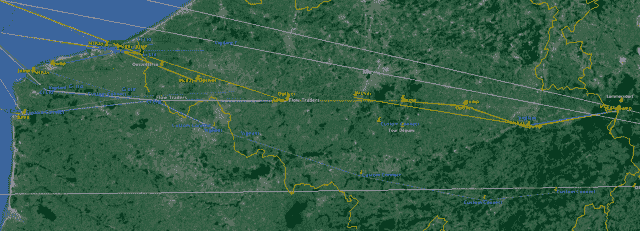

<!--yml

分类：未分类

日期：2024 年 05 月 18 日 14:19:44

-->

# 我的后院里的高频交易- II-马瓦狙击手和朋友们

> 来源：[`sniperinmahwah.wordpress.com/2014/09/25/hft-in-my-backyard-ii/#0001-01-01`](https://sniperinmahwah.wordpress.com/2014/09/25/hft-in-my-backyard-ii/#0001-01-01)

这太疯狂了：超过 28,000 名访客阅读了[第一部分](https://sniperinmahwah.wordpress.com/2014/09/25/hft-in-my-backyard-i/)的“我的后院里的高频交易”。其中一些不可避免地是机器人，但我的日志显示，大多数是来自银行交易台、技术提供商等人类读者。谁能想到一个简单的[地图](http://www.theatre-operations.com/HFT_EU_09.22.2014.kmz)会引起如此大的兴趣？毕竟，自 2010 年以来，微波就一直被用于高频交易。由于有这么多读者想了解这些网络，现在请允许我继续我的故事。为了让你清楚地了解地图上的内容以及如何找到所有这些塔，让我们回到 Houtem。

###### 

###### 从法兰克福到伦敦...还有芝加哥

在美国，纽约证券交易所（NYSE）目前位于新泽西州的马瓦（Mahwah）。对于原住在那里的 Lenape 人来说，mahwah 一词意味着“道路交汇之地”-这正是当今交易所的完美描述。在 NYSE，共同定位的交易员在一个数据中心见面，微波路径在屋顶汇聚。在欧洲，英格兰近伦敦有两个主要数据中心：东部的巴西尔登，是纽交所设立欧洲联交所/里夫交易所和高盛的黑池 Sigma-X 的地方；西部的斯劳，是包含 BATS 交易所的 LD4 数据中心。德国的法兰克福是 Equinix FR2 数据中心所在地，托管德国交易所和 Eurex。

在微波领域，有两种竞争者。第一种是 HFT 专营交易公司：总部位于芝加哥的[Jump Trading](http://www.jumptrading.com)（又称世界级无线电）、荷兰公司[Optiver](http://www.optiver.com)和[Flow Traders](http://www.flowtraders.com)（又称全球连接）、以及[DRW](http://drw.com)（又称 Vigilant Global）。其中一些公司将它们的部分带宽出售给其他客户。第二种是实际服务提供商：[McKay Brothers](http://www.mckay-brothers.com)、[Custom Connect](http://custom-connect.net)，以及近年在欧盟兴起的 NeXXCom 或 Latent Networks。它们的客户包括银行、对冲基金，甚至其他 HFT 公司。像 McKay 这样的公司只对法兰克福-伦敦路径感兴趣，而像 Optiver、Flow Traders、Jump 和 Vigilant 这样的公司也加入了[大西洋横跨 1](http://en.wikipedia.org/wiki/Atlantic_Crossing_1)在英格兰康沃尔郡 Whitesand Band 的海缆着陆站，以便允许数据通过大西洋直接传输到芝加哥，利用美国的微波网络。我们先从 Jump Trading 开始。

###### 一场史诗般的拍卖会

与传言相反，由[Bloomberg](http://www.bloomberg.com/news/print/2014-07-15/wall-street-grabs-nato-towers-in-traders-speed-of-light-quest.html)介绍的 Houtem 塔既不是被北约使用，也不是它的所有者；相反，这座塔是在 1970 年代由美国军队兴建和为其服务的。这座塔（以及比利时另外两座塔中的一座，其中一座现在也被 Jump 使用）在 2006 年被[出售](http://www.defense.gov/Releases/Release.aspx?ReleaseID=9245)给了比利时。“国防部今天宣布决定停用和归还三个微波无线电中继站给比利时（…）关闭这些站点预计每年可节省超过 84000 美元，这也根据对比当前的年度运营和维护成本与替代商业通信成本的年度比较所得出的。”美国国防部写道。2012 年，比利时财政部以同样的节省资金为理由拍卖了这座塔。

**[销售](http://www.servicespatrimoniaux.be/interfpatrnl/Green/Immeubles/Brugge/BruggeVeurneReiger/BruggeVeurneReiger.html)**发生在 2012 年 12 月 18 日的弗尔内。虽然拍卖商现在已经退休，并且我的要求他的电话号码被服务 patrimoniaux 办公室拒绝，我跟参加拍卖的人员有所交流。只有八个人参加了：拍卖商，他的助手，一名政府官员和五位潜在购买者——其中包括两到三个美国人和一位 Jump 公司代表，还有一家大型比利时律师事务所，可能是代表竞争对手，以及一个单独的观察者。 潜在买家在之前都在现场访问了 Houtem 塔，所以参加拍卖的时候他们都知道塔的状况不佳，需要进行改造，我的消息来源估计获胜者需要花费 100 万美元。起始价是 25.5 万欧元，但比利时政府愿意的价格是 40 万欧元。前 30 分钟的涨价幅度是 5000 欧元，但之后价格上涨到 70 万欧元后，涨价幅度相应增加到 1 万欧元。

拍卖商不知道买家的真实身份或者为什么他们对一座破旧的老塔会有如此浓厚兴趣；这个出乎意料的高价格让他紧张得满头大汗，要求休息。在洗手间里整理一下心情，他静静地呼了口气，惊讶地说，“这到底是怎么回事……”拍卖继续进行，出价上升到 100 万欧元，150 万欧元，200 万欧元。此时，拍卖商又请求再次暂停。最终，在三个半小时后，这座塔以 500 万欧元的价格售出。一位与会者迅速离开，因为他的车停在了警察局前，已经过期很久了。另外一位落败的竞拍者走向 Jump 公司询问，“我们可以安排吗？”意思是他们公司将购买带宽或者在 Houtem 塔上租用一些信号资源。我真希望能当时在场亲眼目睹，来确认我对当天在佛兰德深处的拍卖会上哪家竞争对手试图与 Jump 进行交易的猜测。

###### 对 Houtem 塔的疯狂参观

因为我在七月初的假期错过了这座塔，我决定在九月初和家人回到 Houtem。我与来自微波行业的不同人士交谈，涉及从 Jump 的竞争对手到技术提供商，他们解释了我可能如何进行我在田野中的工作。我学会了保密，将车停得离塔远一点，带上望远镜和相机，检查手机的 GPS，然后步行 - 由于多数塔楼都在土豆地里，所以人不得不步行很远。在不同的塔楼进行了几次探险后，我得到了熟练的技巧，然后我有信心接近我访问的对象。在 Houtem，我把车停在了农场附近，沿着毗邻比利时-法国边界的“路德米特”路走了一段。接近目标地点时，我注意到一辆货车和一名工人在塔的地下室。我对自己说，“不太好”，一个情报员应该一直低调。我开始偷偷地为 Houtem 塔拍照：

当工人来到田野里烧东西时，我走近了：

栏杆上没有“禁止入内”的标志，所以我当然要进去看看，没想到有个意外收获 - 工人把所有的门都开着！63 岁的母亲一直在防守，盯着工人，而我则进入各个房间，拍下了设备的照片，直到，就在我面前，有一个作为紧急停止按钮的大红色按钮。意识到只需按下它我就能切断 Jump 的微波网络，真是太惊人了。但我不想打扰 Jump 和 Perseus 的客户，况且，微波网络有光纤备份，所以任何破坏行为都是无用的。给 Jump 的律师们的留言：不要起诉我。我知道我在“私人领地”上，所以我不会发布我拍的照片，除了这一张：

看到一个 243 米高塔的极小地下室是很有意思的。这些样的塔楼是工程奇迹。在这里，基础的直径仅为 25 厘米，而结构之所以屹立不倒，完全归功于 48 根钢索。好吧，我必须再发一张照片，因为这个视角太棒了：

我更感兴趣的是试图跳上塔楼而不是切断电源，但工人回来了，所以我悄悄地消失了。

该塔楼已经进行了全面翻修，从上到下都是崭新的索线，但我的目标是检查天线。当彭博社的报道出来时，塔楼顶部有两个天线：

© 彭博社

我的照片显示了三个天线，因此 Jump 在 7 月初和 9 月初之间增加了一个天线：

这让我想到了拍卖师困扰的问题：为什么？为什么 Jump 要为霍特姆塔支付如此昂贵的价格？第一个原因是高度；高频交易玩家需要高塔来获得速度，而霍特姆塔是比利时第四高的塔。下面的列表扩展了维基百科对比利时最高建筑物的列表，包括我的高频交易公司条目：

由于霍特姆塔在 1974 年至 2006 年间由美国军方所有，我翻出了由美国商务部于 1979 年发布的这份 [文件](http://permanent.access.gpo.gov/gpo29426/79-30_ocr.pdf) 标题为“频道之间 5 GHz 微波链接的信号水平分布和衰落事件分析”。文章包含了以下两个图表：

(顺带一提，Jump 在这条 87.8 公里路径上使用的频率为 7.448400 至 7.48401 GHz。)

所有高速交易竞争者都必须从法国或比利时横渡英吉利海峡到英格兰。他们主要前往多佛尔北部的斯威格特，那里有两座旧塔楼，分别供 Optiver、麦凯和 Vigilant 使用，或者前往多佛尔南部的霍格姆，Latent 和 Custom Connect 都设有天线：

斯温盖特塔楼位于著名的多佛白崖，海拔约 141 米。然而，大多数高频交易竞争者从敦刻尔克连接到斯温盖特，敦刻尔克海拔为 0 米：

在敦刻尔克，天线安装在 Reuze 塔上：

对于逻辑，让我们回到修正美国商务部的图表：

不要深入物理学，微波不会直线传播。根据大气条件的不同，它们会以更多或更少的弯曲，大多是向下的。通常情况下，这会使塔的传播范围超出[欧氏几何学](http://en.wikipedia.org/wiki/Horizon)所能得出的直接结果。Jump 的塔只提供了非常有限的优势，因为额外的距离与其高度的平方根成正比，而其价格的增长是高度的不止是线性的。我没有找到任何人能够理解为什么 Jump 支付了如此巨大的价格。

我不知道 Jump 在购买这座塔之前是否已经在敦刻尔克，或者是否他们使用了加来（Mollien，50°57’23.31″N | 1°52’19.86″E）的另一座塔来连接 Swingate。我知道他们当前在比利时的微波路径分为两部分从 Houtem 开始：Houtem-Swingate 路径使得通往伦敦西部的 Slough，而 Houtem-Ramsgate 路径允许通往伦敦东部的 Basildon。

###### **沃夫尔塔**

Jump 还利用了比利时的其他塔。在比利时的电台监管部门缺乏透明度，但我找到了[dossier](http://cadastreantenne.issep.be/Dossiers8/5214/RP1-RAP-12-01777-BEP.pdf)，然后是[dossier](http://cadastreantenne.issep.be/Dossiers8/5217/RP1-RAP-12-01787-AMJ.pdf)，再然后是[dossier](http://cadastreantenne.issep.be/Dossiers8/5216/RP1-RAP-12-01781-BEP.pdf)，再然后是[dossier](http://cadastreantenne.issep.be/Dossiers8/5215/RP1-RAP-13-00833-BEP.pdf)，这使我能够拼凑出一些路径：

在 Flobecq，另一座老美军塔上，他们与 Flow Traders 和 Optiver 共同定位：

在汉纳特，他们只与 Optiver 共享设施。比较[这](http://cadastreantenne.issep.be/Dossiers8/5216/RP1-RAP-12-01781-BEP.pdf) [两个](http://cadastreantenne.issep.be/Dossiers8/5216/RP1-RAP-13-00827-BEP.pdf) 文档显示，Jump 在 2012 年 2 月和 2013 年 2 月之间在汉纳特增加了第三个天线，也许是在购买了 Houtem 塔之后。在列日，Jump 独占一座塔，而 Vigilant 和 McKay 则在 1.07 公里内：

我只参观了另一座位于布鲁塞尔附近 Wavre 的塔，Wavre 塔是比利时第三高的建筑。我再次把车停放在塔下，走过田野。一些技术人员正在 250 米高的塔顶工作，但他们在我站立的地面上看起来很微小。与需要拉线维持挺立的 Houtem 塔不同，Wavre 塔是一个美丽的“直立结构”：

Wavre 同时也被极限运动“跳伞跳”爱好者使用。[这里](http://fr.wikipedia.org/wiki/Base_jump)你可以看到两个疯狂的人从塔上跳下—希望他们在跌落过程中没有损坏 Jump 的天线：

我前往 Wavre 塔的原因是，它在去年春天遭到破坏时曾在比利时引起轰动。在 2014 年 5 月 24 日的清晨，一些人放火，导致塔楼遭到严重破坏——这个法国的[视频](http://www.rtbf.be/video/detail_pylone-rtbf-de-wavre-incendie-vers-quelles-solutions?id=1930036)拍摄中实际上显示了朝上跳图盘。该塔是比利时国家电视/广播运营商 RTBF 的财产，但也支撑许多移动运营商使用的天线。这场火灾受到了如此多的媒体关注，因为 5 月 24 日是比利时的重要选举日，警方怀疑这场火灾是否与选举有关。RTBF 迅速建立了一个临时塔来安装移动、电视和广播天线，但朝上跳的天线留在高塔上，因为 50 米的临时塔不够高。

在我参观 Wavre 塔时，地面上仍有一些烧毁的部分：

所有的电缆都烧毁了，一段时间内导致 Jump 网络失效。我想知道警方是否审讯过任何 Jump 的竞争对手，或者任何知道交易公司在瓦夫塔上的人。截至九月初，所有电缆都是新的，所以 Jump 网络可能状况良好。以下是 Jump 拥有的三个大天线，其中两个指向 Hannut，另一个朝着 Flobecq 或 Oostvleteren：

###### 高度和速度

我很想知道 Jump、Optiver、尤其是 Vigilant 是否真的在纽黑文和怀特岛之间使用这些路径：

在 Houtem 塔拍卖会上问道“我们能安排吗？”的 Jump 竞争对手也许不是要在塔上安装天线，而是可能要共享带宽。尽管财务微波网络的小世界像他自己的塔那样沉默，我已经发现 Jump 正在与[Perseus](http://perseustelecom.com/perseus-to-address-trading-and-microwave-technology-at-hifreq-trade-2013/)和另一个我不能公开的数据提供商共享网络。事实如下：

+   一个微波链路可以将带宽分割为 10Mbps 的增量。

+   微波链路的聚合带宽达到 100Mbps。通过这些链路发送的每一个 64 字节数据包需要 6 微秒和一些时间来串行化。

+   每个参与者向服务发送 64 字节的交易数据帧。

+   在 10Mbps 时，客户端只能每隔 60 微秒发送 1 个数据包。

现在，想象一下服务中的每个客户几乎在同一时间发送数据，这是一个可能发生的场景，由于一个客户在下一个客户发送数据的纳秒或微秒之前，以此类推。在这个思想实验中，客户一先行，用 6 微秒串行化到 100Mbps 微波链路。客户二在发送他们的交易数据 2 微秒后，所以他们等待 4 微秒进行串行化，然后又等待 6 微秒来实际串行化。客户三在客户二后 1 微秒发送交易数据，等待 3 微秒 Customer 1，然后是 6 微秒 Customer 2，然后再是 6 微秒来实际串行化。客户四更快；在客户三之后 1 纳秒发送他们的数据。然后等待 2.999 微秒 Customer 1，然后又是 6Microseconds Customer 2，然后是再 3 微秒 Customer 3，最后再是 6 微秒来实际串行化。

这个例子说明了网络所有者在共享带宽协议中速度的优势。Jump 与 Perseus 分享带宽。虽然 Perseus 有额外的客户，但没有一个能够像 Jump 那样快。然而，这并不意味着 Jump 是 HFT 世界中最快的运营商。尽管他们在战略位置购买了一座高塔，但他们仍然不像竞争对手那样快……嗯，我会在第三部分详细介绍 HFT 竞争对手中最快的。

© 彭博社

###### 结语

谢谢 Katie。
