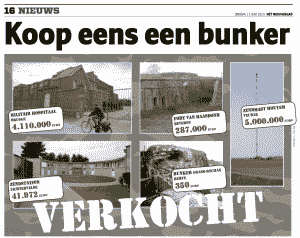
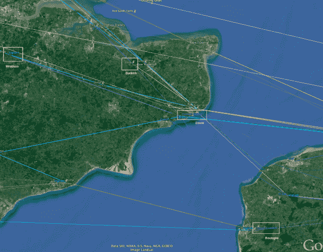
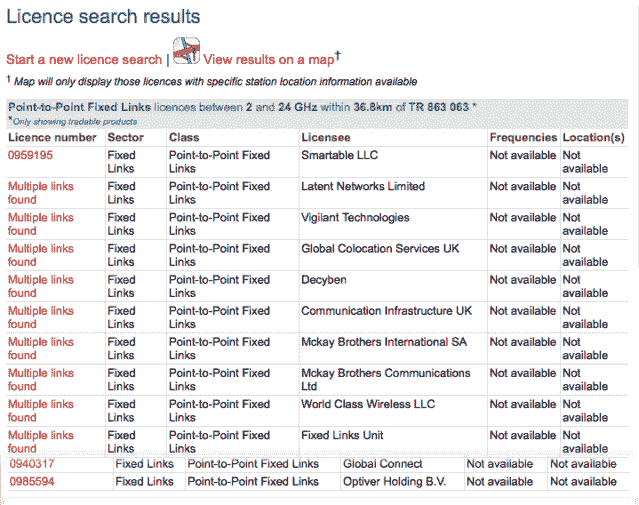

<!--yml

category: 未分类

date: 2024-05-18 14:19:06

-->

# HFT in my backyard – III – Sniper In Mahwah & friends

> 来源：[`sniperinmahwah.wordpress.com/2014/10/02/hft-in-my-backyard-iii/#0001-01-01`](https://sniperinmahwah.wordpress.com/2014/10/02/hft-in-my-backyard-iii/#0001-01-01)

###### INTRO

上周五晚上，我通过电话得到了一个线索，“*你应该明天早上去 Houtem 塔。调整可能会对网络有所改善*。”不幸的是，我无法及时回到 Houtem。但如果看到承包商添加或重新调整碟子，或者操作设备，那将是不可思议的。星期六他们到底做了什么，谁知道！尽管[似乎](http://www.janverfaillie.be/Pers/2013-06-11_HetNieuwsblad.pdf) 比利时政府在 2013 年花费了 500 万欧元购买 Houtem 塔，但这个购买对 Jump 来说是否划算的问题仍然存在。这些塔在用于 HFT 之前的军事[历史](https://www.wikileaks.org/plusd/cables/1973BRUSSE01930_b.html) 是令人着迷的。

要了解有关 Houtem 塔的更多信息，请查看[这些照片](https://www.facebook.com/media/set/?set=a.718402394868445.1073741843.234984306543592&type=1)，查看[this Google Group](https://groups.google.com/forum/#!topic/be.radio/vCyR0XGTOQA)，并阅读有关第一通讯维护中队卸载所有设备、天线和相关硬件的报告：*“比利时弗尔讷的 Houtem 塔高 799 英尺。军人不仅必须爬上这座庞大的塔，而且如果支撑线断裂并且朝着正确的方向倒下，一部分塔将会落在法国。尽管许多技术人员不会怀念爬到塔顶的辛苦，但由于它是一项挑战，大多数人都很遗憾看到它消失*”。美国空军驻德国拉姆施泰因的“[电缆和天线维护工匠](https://www.linkedin.com/profile/view?id=283424761&authType=NAME_SEARCH&authToken=IyDW&locale=en_US&srchid=761093101411906956974&srchindex=1&srchtotal=1&trk=vsrp_people_res_name&trkInfo=VSRPsearchId%3A761093101411906956974%2CVSRPtargetId%3A283424761%2CVSRPcmpt%3Aprimary)”在他的 LinkedIn 个人资料中无意中透露，早在 HFT 之前，Houtem 塔就是关于高频率的：“*领导了在 Houtem，比利时的 800 英尺水平进行微波天线罩更换的团队项目。*[我] 安装和维护微波、超高频、甚高频和高频天线系统、电缆、连接器及其结构。”"[美国空军电缆和天线技工”的 Facebook 页面](https://www.facebook.com/81545200950/photos/a.127454680950.115565.81545200950/10152148558085951/?type=1) 还包括轶事以及我找到的唯一一张从塔顶拍摄的照片：

从 HFT 微波行业中，我也听说了很多故事。 两个竞争对手同时访问同一座塔，并刻意避免眼神交流。一个为不同竞争对手工作的承包商抱怨说，“*所有这些美国人都在要高塔……这样的塔根本不存在！*” 当然，一些存在，并且现在被高频交易者使用。有这样一个关于 Jump 的轶事：“*他们在比利时的一个建筑物上等待控制该建筑物的当局来给他们许可。 这花了一段时间。 所以他们在现场放了一座轮式塔。 这让一些人很生气。 但是然后这座塔开始移动了。 所以他们开始在车边浇混凝土。 警察被派出来，他们不得不停下*。” 我不知道这是不是真的，但这很有趣 – *se non è vero è bene trovato*。 我还听说过一个承包商应该为一家公司在已经装有另一家 HFT 公司的天线的塔上安装一个接收器。工人犯了一个错误，把新天线对向了竞争对手的塔！

研究这些微波网络最有价值的是这本书*[The Death of a Pirate. British Radio and the Making of the Information Age](http://www.adrianjohns.com/death/) （法文版请戳[这里](http://www.zones-sensibles.org/livres/adrian-johns-la-mort-dun-pirate/)）。这本必读之作主要关注着上个世纪 60 年代位于船只上的著名英国海盗电台，但也涉及到了安装在令人难以置信的[Shivering Sands Army Forts](http://en.wikipedia.org/wiki/Shivering_Sands_Army_Fort)上的电台，这些堡垒是[Maunsell army Forts](http://en.wikipedia.org/wiki/Maunsell_Forts#Maunsell_army_forts)的一部分，用于第二次世界大战期间的防空。由于这些巍峨的建筑，天线比船只上的稳定且*更高*。通过扎根于这些旧的堡垒，包括 Screaming Lord Sutch's Radio City 在内的广播公司可以利用其巨大高度触及更多听众，从而通过广告获得更多收入。重要的是高度。

 下面是 Shivering Sands 和 Red Sands 堡垒的[具体位置](http://www.benvenutiasealand.it/mappa-dei-forti/)：

 看看 Shivering Sands 堡垒是如何正好处于纽约证券交易所在巴斯尔登和法兰克福德意志交易所之间的直线上的。Optiver 和 McKay Brothers 可能也有一条非常接近 Red Sands 的路径（但我表示怀疑）。我想知道任何高频交易参与者是否考虑利用这些老堡垒。将老海盗无线电天线替换为[大安德鲁天线](http://planning.cornwall.gov.uk:8181/rpp/index.asp?caseref=PA13/00320) Jump Trading 青睐的设备将是令人惊奇的。种子提供商[海盗湾](http://thepiratebay.se)已经尝试在北部另一个堡垒上安装服务器，这个著名的[西兰公国](http://en.wikipedia.org/wiki/Principality_of_Sealand)来将其改造成"[数据避风港](http://en.wikipedia.org/wiki/Data_haven)"。

*The Death of a Pirate*中最有趣的讨论是第一批广播海盗的历史。他们不是在国际水域使用波浪赚钱的流行广播员，而是那些动手弄英国广播公司（BBC）接收器，以收听非 BBC 节目（比如诺曼底广播电台）的人。对我来说，波浪是大自然的果实，是共同的财富。当第一批海盗出现时，国家迅速垄断了这些果实，然后被迫予以管理。最初成立于 1865 年的国际电信联盟（ITU），最初是作为国际电报公约成立的，负责分配波段。如今，高频交易商必须为使用微波付费给国家监管机构。如果一家公司想要从法国穿越英吉利海峡，就必须向国家监管机构申请频率。由于该地区的大多数频率已被预订或占用，穿越英吉利海峡并不是一件容易的事——一个竞争对手曾经在穿越海峡时遇到了一些困难。高频交易很困难，而海盗也许并没有死去。

###### CUSTOM CONNECT

根据 [Bloomberg](http://www.bloomberg.com/news/print/2014-07-15/wall-street-grabs-nato-towers-in-traders-speed-of-light-quest.html)，“‘*Custom Connect*的网络是欧洲主要金融中心之间的第一个微波链接，多家交易公司可以付费使用 *[…] *约有 25 家公司使用 Custom Connect 网络，包括投资银行和高频交易公司的交易部门，’* *said CC 的共同所有者 Jan Willem Meijer.* ‘*这个网络的建设成本约为 500 万欧元（680 万美元），依赖于欧洲的 13 座塔’”。Jump 以一个 Houtem 的塔塔的价格购买了整个网络。我对 Custom Connect (CC)的调查于七月初开始。我正在访问 CC 网站的时候，有一次弹出了一个聊天窗口，有人问我需要帮助。那个人是 Jan Willem Meijer。当我告诉他我想知道 CC 的塔在哪里时，他回答说，“*我不能透露。机密*”。真可惜。然而，在 CC 网站上，有一个来自*[De Volkstrand](http://custom-connect.net/assets/misc/press-releases/De_Volkskrant_Custom%20Connect.pdf)*的文章（英文版[在这里](http://custom-connect.net/news/de-volkskrant)），含有一张地图。

© De Volkskrant | April 30, 2014

虽然这并不是一个真正精确的地图，但很有趣。比利时在数据透明度方面是最低的国家，但我能够使用各种*档案*(http://cadastreantenne.issep.be/Dossiers8/5415/RP1-RAP-13-00204-BEP.pdf)*找到一些装有 CC 卫星接收器的塔。别的一些则是通过法国国家频率管理局（ANFR）的官方地图*Cartoradio*（http://www.cartoradio.fr/cartoradio/web/）*定位的，法国国家监管机构之一，受到 Arcep 监管。如果你点击正确的塔，将出现“Custom Connect”、“Global Connect”、“Latent Networks”等名称以及所有关于卫星接收器的细节。*方位角*(http://www.google.com/url?q=http%3A%2F%2Fen.wikipedia.org%2Fwiki%2FAzimuth&sa=D&sntz=1&usg=AFQjCNGUg3XIJUewlVcevIl1cD4TKgBMBQ)特别重要，因为它们告诉我们信号的方向。这使我能够在 Google Earth 上绘制我的第一条路径：

通过将*Volkstrand*文章的地图与我的地图进行比较，发现了闪电之牙（在上图中描绘为白色矩形）的问题。定制连接[应该在这个塔上拥有两个天线](http://cadastreantenne.issep.be/Dossiers8/5415/RP1-RAP-13-00204-BEP.pdf)，但这个塔位于我所画路径的北部。我没有数据来将这个塔连接到另一个塔，所以我敢打赌定制连接将使用闪电之牙塔建立一个新的网络，来取代比利时南部的那个网络。当然，这只是一个经过推断的猜测，但在可能性范围内。现在让我们来看看定制连接网络的横越海峡：

定制连接在 Mont Lambert，布洛涅-苏尔-美尔附近有一座 107.2 米的绞柱塔上（全球眼在那里很可能也有天线），根据[Cartoradio](http://www.cartoradio.fr/cartoradio/web/)的数据，这两个天线的方位角为 327.2 度。这表示定制连接信号传送到多佛南部的另一座绞柱塔。定制连接还在英格兰的 Wrotham 和敦刻尔克拥有天线，但在写这篇文章之前重新审阅我的文件时，有一些令人不安的地方引起了我的注意。

当我在 7 月份通过绘制 CC 路径来开始我的地图时，我并没有意识到在[Ofcom](http://www.ofcom.org.uk)网站上可以找到多宝贵的数据。Ofcom 是英国的监管机构，它将无线电波分配给广播电台、电视广播公司、移动运营商…以及高频交易者等客户。Ofcom 的地图帮助我查看运营商们申请使用频率的位置，这反过来又帮助我找到在英格兰可能被这些运营商使用的塔。一位竞争对手给了我一个提示，使用 Ofcom 的地图来寻找用于横越海峡的许可证。点击[此处](http://spectruminfo.ofcom.org.uk/spectrumInfo/licences?service=Fixed+Links&code=301010&freqStart=2&freqStop=24&unit=GHz&ngrloc=&offset=&nw=%2851.11731684874898%2C+1.5325927734375%29&ne=%2851.11731684874898%2C+2.5872802734375%29&se=%2850.450509053586615%2C+2.5872802734375%29&sw=%2850.450509053586615%2C+1.5325927734375%29&googloc=%2850.78510168548186%2C+2.0599365234375%29&googoffset=36.8&submit=Submit+search)查看在法国北部和比利时使用 2-26 千兆赫范围的由英国发放的许可证的运营商名单（这被高频交易者使用）。

你可以发现 Vigilant Global（又名 Smartable LLC）、McKay Brothers（又名 Decyben）、Jump Trading（又名 World Class Wireless）、Flow Traders（又名 Global Connect）、Optiver 和 Latent Networks，但没有 Custom Connect，这很奇怪。我决定比较不同监管机构提供的数据。我从法国 ANFR 下载了所有可用的公共[数据](http://www.theatre-operations.com/ANFR-59-62.zip)。这些文件列出了所有塔和所有运营商使用（或未使用）的所有天线。我进行了一些调查，并意识到所有的 Custom Connect 天线在法国都标有这个标签：“*天线被授权但未激活*”。非常奇怪。

我进行了更深入的调研，发现在 Wrotham 为 CC 接收到批准的许可在`2014 年 7 月`，但是网路据说自`2013 年 3 月`就开始运营了；考虑到 Wrotham 位于 Dover-Slough 路径的中间，这是否意味着在`2014 年 7 月或 8 月`之前 Custom Connect 没有多佛-斯劳连接？这意味着 CC 只是在法兰克福和巴斯尔登之间提供了一个网络。更重要的是：Dunkirk 的 CC 接收到批准的许可在`2014 年 1 月`——这是个问题，因为 Dunkirk 在多佛-巴斯尔登之间，这个网络据说自`2013 年 3 月`就开始运营了。而且，Dunkirk 中没有“Custom Connect”这个名称的 Ofcom 授权。他们怎么发送信号到巴斯尔登呢？最有趣的是多佛塔的[规划申请](http://planning.dover.gov.uk/online-applications/applicationDetails.do?activeTab=documents&keyVal=DCAPR_224609)：

©多佛区政府

首先，许可证于 2014 年 7 月 25 日提交，尚未获批准-文件显示 CC 想要去除指向布洛涅的天线，增加指向罗瑟姆的天线，并保留指向敦刻尔克的天线。其次，文件还显示两个新的天线将具有 109°方位角，因此它们不会指向布洛涅，而是指向更北边的某个地方。最后：Ofcom 的[数据库](http://spectruminfo.ofcom.org.uk/spectrumInfo/licences?service=Fixed+Links&code=301010&freqStart=2&freqStop=24&unit=GHz&ngrloc=&offset=&nw=%2851.11301985367974%2C+1.2463688850402832%29&ne=%2851.11301985367974%2C+1.249244213104248%29&se=%2851.11121472716214%2C+1.249244213104248%29&sw=%2851.11121472716214%2C+1.2463688850402832%29&googloc=%2851.1121172992349%2C+1.2478065490722656%29&googoffset=0.1&submit=Submit+search)告诉我们 CC 在多佛拥有两个许可证- 0996747 和 0956492。许可证编号 0996747 需要将信号从多佛发送到罗瑟姆，而你可以在… 巴斯尔登定位许可证 0956492。所有这些听起来很奇怪。我怀疑从多佛直接到巴斯尔登建立路径是否可能- 如果可能的话，为什么所有的竞争对手都需要多出至少一座塔楼在多佛和巴斯尔登之间？更何况，如果 CC 拥有多佛-巴斯尔登路径的许可证，那么关于敦刻尔克塔的规划申请呢？这一点毫无意义（我无法深入技术细节，但懂行的人会明白：使用 CC 在多佛和巴斯尔登的频率分配是不可能在敦刻尔克获得许可证的，因为敦刻尔克塔与巴斯尔登和多佛属于同一奇偶性。）所以情况是：

我与微波行业的人交谈过。有人告诉我，即使没有许可证，也可以跨越频道，但那将会很艰难，而且不太合法。我也听说有传言称竞争对手在邓克尔克塔上未经许可安装了天线（有人说可能是 Custom Connect）。但传言就是传言，我更喜欢事实。话虽如此，这不会是高频交易参与者偷偷安装天线的第一次。有一次 Jump 在著名的 Swingate 塔上安装非法天线，并谦逊地[道歉](http://planning.dover.gov.uk/online-applications/files/E997135014F4091378DD3AF44F29F01C/pdf/12_00732-PLANNING_STATEMENT-214045.pdf)：“*提出给 World Class Wireless 的两个最大的天线实际上是在提交规划申请之前安装的。WCW 和 Arqiva *(塔的所有者)* 非常抱歉疏忽了这一点，并没有对议会表示不敬*”。哈哈。邓克尔克塔和 Swingate 塔都属于 1937 年建造的著名的[Chain Home](http://en.wikipedia.org/wiki/Chain_Home)系统的一部分（我将在第五部分详细介绍）；它们对英国皇家空军在二战期间非常重要，现在它们是英国历史的一部分。在这些历史古迹上未经许可安装天线是一种“*重罪*”。这些建筑是英国的皇冠宝石 - 尊重一下，伙计们！

我不清楚邓克尔克的非法菜肴，但我可以确定 CC 在那里没有收音机许可证。至于频道，在不同竞争对手那里，我已经找到了所有所需的许可证，除了 Custom Connect - 或许他们藏得很好，使用其他名称等。我再次访问了 Custom Connect 的网站，希望聊天窗口会打开，但没有人。但我发现了一个非常惊人的细节。该公司的座右铭似乎是史蒂夫·乔布斯曾经说过的一句话。查看 Olav van Doorn（Custom Connect 的另一位合伙人）的[LinkedIn 档案](http://nl.linkedin.com/in/olavvandoorn)。公司的描述从这两句话开始：“*‘宁做海盗，不做水兵’**（史蒂夫·乔布斯）。没有什么比这更能描述 Custom Connect 是什么样子的*”！

什么？Custom Connect 在进行盗版业务？不可能……我以为无线电海盗早已不存在！在我三个月的调查中，我听说有一些人试图盗用频率，但这些都可能是神话。我无法相信世界上最快的现代网络之一会盗用无线电频率。不可能。但那将是令人惊讶的：1937 年建立的 Maunsell 军事要塞在 1960 年代曾被海盗无线电使用；所以如果在邓东克和斯温盖特发现海盗，我也不会感到惊讶，因为这座塔也建于 1937 年，用于同样的军事目的。Custom Connect 有许多神秘之处 - 数据可能是缺失的 - 但无法否认的是 Jump Trading 曾经在斯温盖特塔上安装了违法天线。海盗并未消失。

###### OPTIVER

当我在地图上绘制我第一条路径时，我不知道会遇到谁。我很确定会遇到 McKay Brothers（我知道他们在建立网络），但是我先遇到了一些之前从未听说过的公司。其中之一是通信基础设施有限公司。这可能是一个类似 Custom Connect 的网络提供商，而不是一家自营交易公司。我在角落处到法国各地都找到他们。在我调查时收到了一封匿名电子邮件，上面写着：“*通信基础设施是一个没有客户，只有许可证可以卖给像......*” - 等等。稍等片刻。我还不会公布“*骗子*”的名字，因为这家公司将会作为第四部分的嘉宾明确。但我可以确认：通信基础设施在英国要求了很多许可证，但我没有找到任何规划申请。我甚至怀疑他们是否安装了天线（在法国，其中一些“*未激活*”）。[更新，2014 年 10 月 6 日：他们至少有一个获得规划申请，[在这里](http://pa.midkent.gov.uk/online-applications/applicationDetails.do?activeTab=documents&keyVal=ZZZVS3KJTA534) | 对错误表示抱歉]。现在是一个空壳吗？

我还了解到[NexxCom](http://www.nexxcomwireless.com)，他们在新泽西和芝加哥之间建立了一个微波[网络](http://www.nexxcomwireless.com/2012/02/06/high-frequency-trading-nexxcom-wireless-claims-major-speed-advantage/)。我在康沃尔发现了他们，就在微波路径的最末端。在欧洲有两种竞争对手：一些人只关心将伦敦和法兰克福连接起来（Custom Connect，McKay Brothers）；另一些决定将他们的网络扩展到芝加哥（Vigilant，Optiver，Jump Trading，Flow Traders，Comm. Infra 和 NexxCom），因此他们必须前往南康沃尔，在那里他们可以见到[大西洋穿越 1 号](http://en.wikipedia.org/wiki/Atlantic_Crossing_1)（AC1）的登陆站 - 从那里，数据通过光纤发送到美国。但在两年内康沃尔将不再重要，所以我并不真正理解为什么 NexxCom 在去年二月在 Four Lanes 提交了规划许可。（我听说 NexxCom 可能得到了一家高频交易公司的支持，但我不知道名字。）

一个相当严肃的大竞争对手——远比[通信基础设施](https://wiki.example.org/communication_infrastructure)或[NexxCom](https://wiki.example.org/nexxcom)更为严肃——是荷兰道琼斯平均指数交易员公司[Optiver](http://www.optiver.com)。Optiver 在行业中拥有一些优雅的路径和良好的声誉。有人说他们可能是最快的——成为最快的是很酷的，但保持最快不容易。Optiver 有两个穿越海峡的许可证，并且与 Custom Connect 和 McKay Brothers 在敦刻尔克共同定位。我访问了比利时的[Hannut](http://cadastreantenne.issep.be/Dossiers8/5639/RP1-RAP-14-00930-AMJ.pdf)塔，并拍摄了他们的机柜：

Optiver 在康沃尔拥有有趣的路径（他们在芝加哥也设有办公室）。

###### FLOW TRADERS

在任何法律文件中都找不到“Flow Traders”（荷兰另一个[公司](http://www.flowtraders.com)）这个名字，你只会在“Global Connect”这个名字。我以前从未听说过“Global Connect”，但邮寄地址是 Jacob Bontiusplaats 9, 1018 LL Amsterdam，Flow Traders 的所在地。我没有关于 Flow 的特别事情要告诉。有人说他们是第一个在伦敦和法兰克福之间建立微波网络的欧洲公司（他们也有穿越海峡的许可证）。和 Optiver 一样，Flow Traders 在康沃尔也有路径。在阿姆斯特丹还有第三家大型的荷兰公司[IMC](http://www.imc.nl/financialmarkets)，但我找不到 IMC 有微波网络的证据，即使在这个 LinkedIn[页面](https://www.linkedin.com/jobs2/view/11284658)上发表于 2014 年 1 月 31 日，我们了解到该公司“*寻求技术项目经理或首席工程师，以改进我们在建立用于在全球主要金融场所之间传输金融市场数据的最快网络路径上的努力*”。新的竞争对手可能很快会出现在我的地图上。

###### [警惕全球](http://www.vigilantglobal.com)

这就是[警惕全球](http://www.vigilantglobal.com)，一家总部位于蒙特利尔的专有交易公司。Vigilant 现在是[DRW](http://drw.com)的子公司。行业内的一位人士曾经坦白：“*警惕是我最好的竞争对手*”。另一位说：“*我真的很钦佩 Vigilant/DRW。他们是第一批。他们似乎非常擅长这一切*”。是的，Vigilant 是第一个在欧洲建立网络的公司。他们可能在 2011 年开始了他们的网络，甚至可能是在 2010 年（在法兰克福 Equinix 数据中心有一个有趣的轶事）。通过绘制地图，我理解了为什么行业内的一些人钦佩 Vigilant：他们真的很厉害。

安·布洛科尔赫斯特[写道](http://www.annrbrocklehurst.com/2013/06/vigilant-global-builds-new-wireless-network-in-europe-north-america.html)关于 Vigilant 在试图在[本菲特](http://www.echo-news.co.uk/news/10467922.Councillors_throw_out_plans_for_more_antennae_on_Benfleet_Water_Tower/)安装天线时遇到的困难，但我不认为这是一个大问题。Vigilant 为什么这么好呢？首先，他们在安装天线之前不需要很多许可证（Jump 经常要求很多频率，但通常他们根本不使用，尽管他们必须付给英国监管机构）。我认为 Vigilant 工程师在请求许可证之前非常仔细地检查了所有可能性。其次，他们拥有一些非常漂亮的路径。我非常好奇 Vigilant 是否真的建立了从布洛涅到康沃尔的这些路径：

这些都是又长又复杂的路径（微波不喜欢潮湿也不喜欢雾）。但它们最好的移动可能就是这条路径：

要理解这一切，你必须牢记一点，那就是正在进行一条新的光纤电缆，连接英国和美国：臭名昭著的赫比尼亚电缆（我将在第五部分详细介绍这个计划的悠久而有趣的历史）。据说赫比尼亚电缆应该比 AC1 电缆节省六毫秒，这就是为什么我书名是*6*。但赫比尼亚的登陆站（在萨默塞特的布里恩）离 AC1 的登陆站（在康沃尔的怀特桑德湾）很远：

赫比尼亚电缆将于两年后开通。如果高频交易商能够通过新的光纤节省六毫秒，他们将不再使用 AC1 电缆了。如果不利用新的更快的电缆，拥有这么快微波网络就太愚蠢了。这意味着所有通往康沃尔的路径将在两年后失效。地图将会是这样的：

Jump Trading、Vigilant 和 Flow Traders 已经预订了许可证/频率，以在斯劳和布里恩之间建立新的路径（Optiver 可能也在周围），Vigilant 已经预料到了赫比尼亚电缆，采用了这条又长又漂亮的路径：

我很想和设计这些路径的警惕工程师聊一聊。这些人确实拥有优秀的神经网络。

###### 麦凯兄弟

让我们以[麦凯兄弟](http://www.mckay-brothers.com)结束。即使第一个芝加哥-新泽西微波网络是由 Alex Pilosov 的[Windy Apple Technologies](http://www.windyappletech.com)建造的，每个人都认为麦凯兄弟是美国最快的。在 Aviat Networks 发布的[文件](http://aviatnetworks.files.wordpress.com/2013/09/a-low-latency-mw-regulations-19sep13.pdf)中（Aviat 为美国和欧盟的大多数（如果不是所有）高频交易玩家提供技术），你可以读到这样的内容：“*麦凯兄弟 LLC 芝加哥至纽约之间的低延迟网络—世界上最繁忙的低延迟金融网络路线……*”。麦凯现在是欧洲的一位强劲竞争对手。他们的网络[仍在进行中](http://www.mckay-brothers.com/wp-content/uploads/2011/11/Map-for-web.jpg)但我已经找到了他们放置天线的塔。其中他们最好的路径是在比利时列日和圣皮特尔斯 leuw 之间。这是我找到的唯一一个比利时文件，其中包含了一位私人运营商放置天线的所有细节（我解析了超过 18,000 个[文件](http://cadastreantenne.issep.be)来找到它）：

这就是我能够在比利时两座最高的塔之间画出 96.3 公里长的路径：

SPL2 这座[Sint Pieters Leeuw](http://en.wikipedia.org/wiki/Sint-Pieters-Leeuw_Tower)塔是比利时最高的建筑物（300 米）。美凯拥有美国最快的微波网络，我并不奇怪会在这座最高的建筑上找到他们的天线，这是一个新的“*资本主义的大教堂*”。我去参观了这座建筑并拍摄了美凯的天线。再次，这座塔周围都是土豆田，在塔的地下室有一个小围栏，一头小牛安静地盯着我拍摄塔。这座美丽的[建筑](http://en.norkring.be/transmitter-park/sint-pieters-leeuw/)是由[Norkring](http://en.norkring.be)拥有的。Norkring 是一家在佛兰德和布鲁塞尔管理 24 座发射塔的网络提供商。他们甚至提供机房租赁：“*在八个地点，Norkring 比利时提供所有设施，可以容纳电信运营商、地方广播公司、紧急服务、电视运营商、警察或任何其他希望建立无线网络的团体。我们的发射塔上可以安装多达 300 米高的天线。*”我不知道这些八座塔在哪里（你在 Norkring 的网站上找不到这些信息），但有人告诉我 Vigilant 可能会使用一座（或者更多）Norkring 塔。其他 HFT 参与者也可能会使用[Norkring 网络](http://en.norkring.be/transmitter-park/all-transmision-masts-charted/)。

© Norkring

但 Sint Pieters Leeuw 塔最有趣的部分是这些令人难以置信的楼梯。我被邀请参加一部关于 HFT 和市场微结构的法国纪录片，我认为最好的拍摄场所就在那里：

关于 McKay Brothers（以及母公司 Quincy Data）的最后一件事：它们是透明的。他们是唯一公布“*客户端端口到客户端端口*”两项指标的提供商。客户端端口到客户端端口意味着延迟（*例如* 巴西尔登和法兰克福之间的 2.195 毫秒，但是 McKay 很快将会更快）是在共同放置的服务器之间计算的（在纽约证券交易所的设施内的一个放置服务器到法兰克福 Equinix 数据中心内的另一个放置服务器）。我认为他们是唯一公布这些延迟的人。而且，McKay Brothers 的联合首席执行官 Stéphane Tyc 主张市场行业更透明（看看他最近发布的最后一篇[白皮书](https://sniperinmahwah.wordpress.com/2014/09/19/hft-the-missing-data/)，关于更好的执行）。我认为 McKay Brothers 的目标是在微波网络的小世界中“拉平竞争场”。他们处于比利时最高的建筑中，但他们会是最快的吗？所有的赌注都取消了。

###### 结语

还有一个网络遗漏了：潜在网络（Latent Networks）。我以前从未听说过他们，但我找到了一些“他们”的塔。我试图获取关于他们的信息，但是这家公司背后的人却尽一切可能隐藏起来。所以我决定深入挖掘。然后第一封匿名邮件出现在我的邮箱中。然后芝加哥一个大型高频交易公司的名字出现了 - 不是 Jump Trading。然后我和一个袋鼠建立了奇怪的关系。我将专门介绍第四部分给潜在网络。敬请关注。
