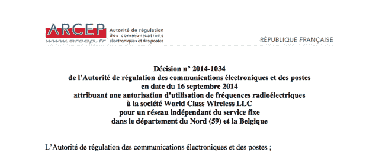
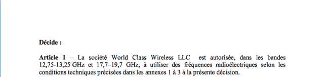

<!--yml

分类: 未分类

日期：2024 年 5 月 18 日 14:19:54

-->

# 我后院的高频交易 | 插曲 – 马瓦狙击手及其朋友们

> 来源：[`sniperinmahwah.wordpress.com/2014/09/26/hft-in-my-backyard-interlude/#0001-01-01`](https://sniperinmahwah.wordpress.com/2014/09/26/hft-in-my-backyard-interlude/#0001-01-01)

###### (最后更新：2014 年 9 月 27 日，上午 9:05)

在发布我的故事第三部分之前，关于我在第一部分中发布的微波网络[地图](http://www.theatre-operations.com/HFT_EU_09.22.2014.kmz "欧洲高频交易微波网络")我想多说几句。已经有超过~~2,475~~ ~~2,883~~ 3,010 人下载它。这个数字是非常惊人的。我没有想到这个地图会引起如此多的兴趣。我原以为只有行业内的几百人会感兴趣。我将在第六部分详细介绍这幅地图的“制作过程”，但由于有很多人感兴趣，我必须澄清一两个问题。我要明确指出，这个地图是一种可能性的网络。一些路径（在两个塔之间）是已经证实并且被使用的；其他一些是可能性，或者是旧路径，或者是未来的路径，或者是被测试的路径。有时候很容易找到真正的路径，但我和某些竞争对手进行了足够的交谈后了解到，即使你访问*所有*的塔，检查天线，记录方位角等等，画出*完美*的地图几乎是不可能的事情。这是情报员的工作，而不是人类学家的工作。在 Google 地球文件里，路径有不同的透明度：粗线路径是 100%确定的 - 快来看看链接，它们会带你进入微波的寂静世界。仅举一个例子： 更有甚者，一些微波网络仍在建设中；其他一些可能很快就会改变一个路径，从一座塔跳到另一座塔去。Jump Trading 在 2013 年 1 月购买 Houtem 塔之前就在比利时（Oostvleteren）用过天线。所以，这幅地图仍在建设中，我一有了新信息便改进它，并且（几乎）每天更新文件。如果你想要及时了解，查看最新的文件。上次更新时间：两小时前。稍后我会详细讨论绘制这幅地图所需的数据混乱问题。我（还有 HFT 的竞争对手）不得不与三个国家的监管机构打交道（英格兰、法国、比利时）。例如，以 Jump Trading 为例，又名 World Class Wireless（WCW）。与所有其他运营商一样，他们必须向法国监管机构 [Arcep](http://arcep.fr) 申请在法国使用某些频率。即使他们不在法国使用天线，如果某个路径横跨法国，他们也需要授权 （而 Houtem-Swingate 路径只在法国运行）。因此，通过查看监管机构发布的公共文件，你可以追踪 WCW 的活动。昨天，我在发布完第二部分后的几微秒内意识到在 2014 年 9 月 16 日发布在 Arcep 网站上的一份新文件：[document](http://www.arcep.fr/uploads/tx_gsavis/14-1034.pdf)。以下是两个屏幕截图：   我现在对这些法律文件相当熟悉。文件告诉我们 WCW 被授权在比利时和法国之间使用两个频段 - 12.75-13.25GHz 和 17.7-19.7GHz - 这有些糟糕，但 Arcep 并没有发布附件（其中规定了所有位置），但是如果你对微波熟悉，你会知道使用 12-19GHz 频段理论上不能做超过 60/70 公里的路径。这就是为什么这份文件很有意思。为什么 Jump Trading 要在法国和比利时之间建一条短路径？他们在 Houtem 有高耸的塔，因此他们有完美的路径穿过海峡深入比利时。那么为什么他们要在比利时和法国申请新的频率？一种解释是：Jump 仍在使用一些天线在 Oostvleteren，新授权只对这座塔有效。这意味着：Jump 可能建立两个不同的网络 - 这并非不可能。另一个解释是：他们将在 Houtem 塔上安装新的天线。也许，但问题依然存在：因为有了 Arcep 的文件，我们知道这些天线将用于法国和比利时之间的路径 （即使有些可能使用 18-19GHz 频段穿过海峡，这里不是讨论英格兰）。  一种可能是：Jump Trading 想要到达他们在布洛涅使用的天线：     

当我完成这篇简短的文章时，我收到了一个消息：Jump Trading 可能会在 2014 年 9 月 27 日（星期六）的早晨在 Houtem 塔工作。我不能在那里，但我想对那些住在 Houtem 附近的读者说：去那里，带上相机。第三部分将于下周一或下周二上线。感谢您的阅读。
