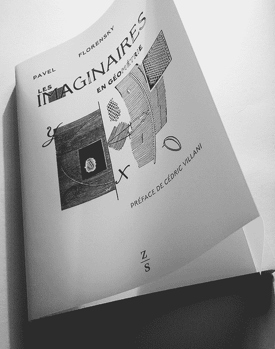

<!--yml

category: 未分类

date: 2024-05-18 14:10:04

-->

# HFT in my backyard | S02E00 – Sniper In Mahwah & friends

> 来源：[`sniperinmahwah.wordpress.com/2016/12/23/hft-in-my-backyard-s02e00/#0001-01-01`](https://sniperinmahwah.wordpress.com/2016/12/23/hft-in-my-backyard-s02e00/#0001-01-01)

#### THE INTRO

##### **巴黎**

“生活不只有 HFT，而且转瞬即逝”。我完全同意[@MarcosCarreira](https://twitter.com/MarcosCarreira)在他的[评论](http://mcarreira.typepad.com/mc_notes/2016/12/market-microstructure-paris-2016-part-2.html)中所说的这句话，这篇评论是关于两周前在巴黎举办的[市场微观结构-面对多种观点](http://market-microstructure.institutlouisbachelier.org/Program.aspx?lng=EN#.WFFU_3dMCEJ)的活动的。两年前我参加过这个会议（我甚至在发言晚宴上发表了一次小演讲，很荣幸被邀请谈论“中世纪的市场微观结构”-今年的发言晚宴的演讲者是[唐纳德·麦肯齐](http://www.sps.ed.ac.uk/staff/sociology/mackenzie_donald)），于是我又回到了法国首都，两天时间聆听一些有趣的（但有点复杂）关于“信息效率引发不稳定性”或“高频交易与极端价格波动”或“分析股市的交叉影响：经验分析”之类的演讲。如果你喜欢金融、市场结构和 数学，这个会议是*最佳去处*；如果你不理解过长的数学公式（和我一样），这个地方也是最佳去处，因为可以有机会与参与市场（结构）行业的人见面（阅读 Marcos 的[评论](http://mcarreira.typepad.com/mc_notes/2016/12/market-microstructure-paris-2016-part-2.html)了解更多关于今年巴黎发生了什么）。

两年前我最美好的时刻是和微波供应商麦凯兄弟公司的首席执行官 Stéphane Tyc（高频交易“军备竞赛”中最优秀的参与者之一）以及来自芝加哥的学者 Eric Budish（想要通过[拍卖](https://faculty.chicagobooth.edu/eric.budish/research/HFT-FrequentBatchAuctions.pdf)来减缓市场）共进的一次咖啡 - 这两个人显然在高频交易上有着完全不同的看法，但聊天相当具有挑战性。今年我见到了 Sebastian，他在德意志证券交易所/Eurex 担任工程师，负责交易所的撮合引擎（撮合引擎就像旧的交易场所：买卖双方在尽可能接近引擎的地方碰面）。见到一个推特账号背后的真实面孔总是令人高兴。我们一起吃了午餐，讨论了这些引擎的设计 - 对我来说，这里的主要问题在于信息传播：当一笔交易发生时，大多数情况下买卖双方在交易被公开传播给其他参与者之前（有时是远远地）就已经得知了这笔交易。似乎 Eurex 想要缩小这个差距（查看这个技术性的[文件](http://www.eurexchange.com/blob/238346/5e2ce06990dd2a2e108fd2030dfcf5a2/data/presentation_insights-into-trading-system-dynamics_en.pdf)）。 （这个问题不是一个小问题：我最近了解到，因为软件升级的原因，一个在英国的交易所让涉及交易的买家和卖家知道了这笔交易发生之后*70 微秒*，而其他参与者要等很久，这是很长的时间，这种情况不应该存在）。Sebastian 还介绍了他在 CME 集团工作的两位同事，他们也是撮合引擎的工程师（看来他们在巴黎相当低调），所以下一天我和三位工程师一起吃了午餐，有机会更多地了解了他们设计这个关键而技术性极高的位于资本主义核心的撮合引擎。非常有趣。很不错的家伙，很不错的午餐。

更重要的是：通过听各种关于高频交易的讨论，工程师们（再一次）意识到数据问题有多么严重。许多学者抱怨因为无法从交易所获得最新数据（考虑到交易所通过向生成数据的人出售数据而赚取的不可告人的金额，他们显然不会免费向其他人提供数据）；我们甚至开玩笑说一些学者仍然依赖纳斯达克（现在不再）臭名昭著的数据集，用于分析 2008 年和 2009 年的高频交易活动（这是毫无意义的）。非常好的消息是（至少这是他们个人的看法），他们愿意向学者提供更多的数据（“我们将尽量提供更好地数据集给学者，并提供如何使用它们的指导”）。万岁。最重要的是获得来自*不止一个交易所*的数据，因为几乎不可能只靠来自一个场所的数据来了解市场上发生的事情（交易员可能在这里撤出流动性，在那里增加流动性等）。对于交易员和学者来说，数据就是一切。

**莫斯科**

谈到数学，阅读法文的人可能会对这本[书](http://www.zones-sensibles.org/pavel-florensky-les-imaginaires-en-geometrie/)感兴趣，其英文名为*几何中的虚数*：*Les Imaginaires en géométrie*。作者是 Pavel Florensky（1882-1937）。Florensky 是一位非常迷人的俄罗斯数学家和东正教神父（请参阅[维基百科](https://en.wikipedia.org/wiki/Pavel_Florensky)），他在莫斯科学习数学时写了这本书的大部分内容，但最后一部分是在莫斯科庆祝意大利诗人但丁逝世 500 周年的 20 年后完成的。这本书充满了我不理解的数学公式，但简而言之，正如维基百科所指出的，“它致力于对阿尔伯特·爱因斯坦的相对论的几何解释。除其他内容外，他宣称，相对论预测的虚数几何，用于超光速运动的物体，是上帝之国的几何。由于在该作品中提到上帝之国，他被苏联当局指控煽动。”——更糟糕的是：这本书是 Florensky 被送往劳改营的原因之一，他在那里度过了多年的生活，最终遭到一枪毙命。一个悲伤的故事。

这本书的[前言](http://www.zones-sensibles.org/wp-content/uploads/2016/10/preface_web.pdf)是由数学家 Cédric Villani (2010 年菲尔兹奖得主)所撰写（Cédric 写道：“通过试图在科学和精神之间进行综合，让我们鼓掌欢迎那种拒绝成为一块砖头乖乖地堆在一个美好的建筑中的热烈思想的勇气”），而且物理学家[Pierre Vanhove](http://ipht.cea.fr/Pisp/pierre.vanhove/)撰写了一篇长篇 [介绍](http://www.zones-sensibles.org/wp-content/uploads/2016/10/introduction_web.pdf)（他主要研究微扰和非微扰弦理论等课题）。皮埃尔（Pierre）是这本书从俄文翻译成法文的最后一位介入者——其惊人的故事是这本翻译最早在 1926 年由花轮斯基的一位朋友开始着手，因此花了近一个世纪才完成！即便你不能理解所有公式，这是一本引人入胜的书。如果有懂俄语的量化金融从业者感兴趣，[这里](http://www.runivers.ru/upload/iblock/25d/florensky.pdf)是俄文原文链接。一个允许超光速 c 的世界不可能不引起高频交易员的兴趣……

##### **Richborough**

我并没有忘记我还有一个“[香蕉乡的高频交易](https://sniperinmahwah.wordpress.com/2016/01/26/hft-in-the-banana-land/)”的衍生内容要完成。到目前为止，我对 Vigilant Global 和 Jump/KCG/New Line Networks 之间正在进行的 Richborough（英国）巨型 305 米（或 322 米——你稍后会看到这有很大的区别）争夺战一直很缄默。当地居民和大多数地方公共机构都不希望在他们的后院里建立这样的旗杆。但最终的决定权将由多佛区议会做出，而议会并不需要遵循从不同选区发出的意见。我已经连续几个月关注这里发生的事情，显然我读了所有的规划申请文件（[这里](https://planning.dover.gov.uk/online-applications/applicationDetails.do?activeTab=documents&keyVal=DCAPR_229267)和[那里](https://planning.dover.gov.uk/online-applications/applicationDetails.do?activeTab=documents&keyVal=DCAPR_228292)），并与一位名叫 Bass de Banaan 的当地活动人士频频电邮互动，他反对这些旗杆，并努力了解这里发生的一切等等。一旦多佛区议会确定了讨论（决定？）旗杆的日期，我就会发布“香蕉乡的高频交易”的倒数第二集。与此同时，关于这场争夺战的文章应该会出现在*Square Mile*杂志（英国）上，并且很快会在*Het Financieele Dagblad*（荷兰）网站上出现一篇多媒体文章。

从 Richborough Fort – 内部。没有旗杆的风景。

Richborough Fort 的累积拼接照片 - 碉堡内部。左侧是旧线公司的风景，右侧是 Vigilant Global 的天线。

##### 我的后院

"我的后院中的 HFT 系列"存在的问题是：我有太多数据，但没有足够的时间来写完整的关于连接伦敦和法兰克福的微波网络的故事。另一个问题是新的网络出现了（或很快会出现），所以这是一个永远不会结束的故事。生命如此短暂，我正在从事更有趣的事情，到了 2017 年 2 月，我会[更忙碌](https://gargantua.polytechnique.fr/siatel-web/linkto/mICYYYUJp7YK)，所以我没有时间做一个很长的第二季节——我只会尝试总结一些有趣/惊人/严肃/有趣/奇怪/不酷的事情，最多 10 集。但是我决定写一本书（或者半本书）关于这一传奇——我将在接下来的一集中详细说明。我得到了太多数据的原因之一是我有了新的朋友——在电信领域工作的人们——他们帮助我找到了法国的新 HFT 天线（人情报和现场工作效果很好）。其中一位甚至下载了（英国监管者）Ofcom 数据，创建了一个[地图](https://carte-fh.lafibre.info//index.php?zone=uk)，其中包含了所有的英国无线网络；如果只保留 HFT 微波连接，看起来是这样的：

点击放大

（从斯劳到科克的长绿色 Aviat 网络是特别重要的；但这是另一集的事情）其中一个新朋友与[联系](https://openinframap.org/#lat=51.0820&lng=0.9915&z=9)，他“喜欢基础设施”，并且 Russ 在他的[Open Infrastructure Map](https://openinframap.org/#lat=51.0820&lng=0.9915&z=9)上“增加了一个实验性的微波（HFT）层，展示了由交易公司运营的英国微波连接”，在此是英吉利海峡地区的图示：

点击放大

很多人正在努力绘制这些网络地图，那是很好的，我不再孤单。至于我，我将以第一集的方式开启"我的后院中的 HFT"第二季，讲述最近出现的一个新网络；它不再关于法兰克福 - 伦敦，而是关于伦敦 - 苏黎世（和/或米兰？）。似乎有两家荷兰交易公司正在这条新路上（至少目前是如此）：一家（名字以 F 开头）有一个完整的网络，另一家（名字以 O 开头）刚刚开始。朝着新的地平线（无论是 2 个、6 个还是 12 个）迈进是有趣的。

点击放大

我将在一月初开始第二季，并且我会尝试在一月底结束，这样我就可以继续前进。这是一个很忙碌和疲惫的一年，现在是时候休息一下了。祝大家圣诞快乐。

##### 来自耶鲁的圣诞礼物

感谢 Greg Laughlin 给我们分享这个非常友善的博客[post](http://oklo.org/2016/12/22/6543/);链接 Opicino de Canistris 的地图和 James Lovelock 的盖亚假说，这是一个优秀且充满感觉的直觉。

*Hanc blogis exiguitas non caperet*是如此真实...正如作家 Jose Luis Borges 曾经写过的，“最终文本的概念只属于宗教或枯竭”。这就是为什么现在是真正的休息时间。
