<!--yml

分类: 未分类

日期: 2024 年 05 月 18 日 14:16:22

-->

# 我后院的高频交易 | 最后的塔 - Sniper In Mahwah & 朋友

> 来源：[`sniperinmahwah.wordpress.com/2015/02/03/hft-in-my-backyard-the-last-tower/#0001-01-01`](https://sniperinmahwah.wordpress.com/2015/02/03/hft-in-my-backyard-the-last-tower/#0001-01-01)

在完成这个系列之前，我不得不注意到我后院中的一座塔。这座塔可能有助于回答关于 Vigilant Global 的一个问题。由于比利时没有关于塔/天线/频率许可等公开数据，只能进行推测（以及一些实地考察）。问题是关于海峡（再次）。大多数高频交易竞争对手在 Swingate（英国）和敦刻尔克（法国）之间跨越海峡 - 除了 Jump，因为他们购买了豪特姆的高“北约”塔。但关于 Vigilant 的数据并不清晰。他们在法国北部有两座塔的 Ofcom 许可证：敦刻尔克（他们可能与 Optiver、Latent、McKay Brothers 共存）和 Coudekerque。

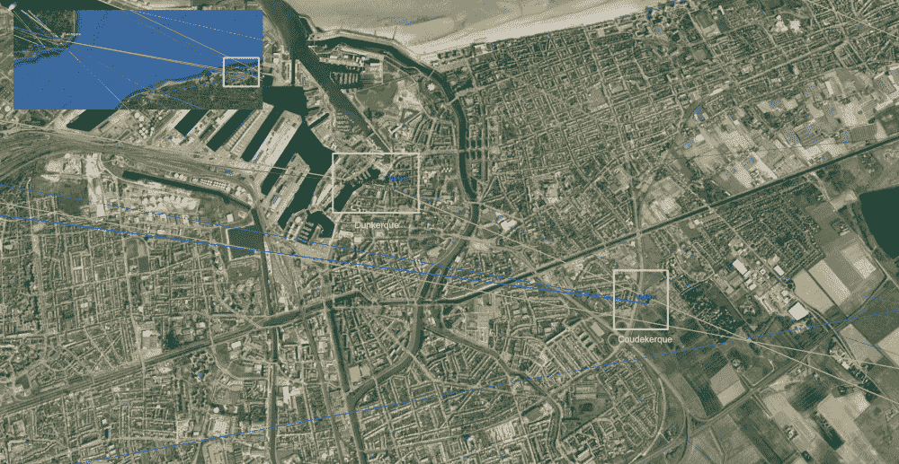

敦刻尔克[许可证](http://spectruminfo.ofcom.org.uk/spectrumInfo/licences?googloc=(51.0389181051126%2c+2.378668785095215)&code=all&se=(51.03761606823887%2c+2.380739450454712)&googoffset=0.1&nw=(51.04022010539774%2c+2.3765981197357178)&freqStop=24&unit=GHz&ne=(51.04022010539774%2c+2.380739450454712)&service=Fixed+Links&freqStart=2&sw=(51.03761606823887%2c+2.3765981197357178)&submit=Submit+search&groupKey=2)通过斯温盖特的规划[申请](http://planning.dover.gov.uk/online-applications/applicationDetails.do?activeTab=documents&keyVal=DCAPR_220195)支持，意味着 Vigilant 在敦刻尔克-斯温盖特路径上有一个许可。库德克尔克[许可证](http://spectruminfo.ofcom.org.uk/spectrumInfo/licences?googloc=(51.03005442370071%2c+2.4068909883499146)&code=301010&se=(51.02992116036919%2c+2.407102882862091)&googoffset=0.0&nw=(51.030187686649064%2c+2.406679093837738)&unit=GHz&ne=(51.030187686649064%2c+2.407102882862091)&service=Fixed+Links&sw=(51.02992116036919%2c+2.406679093837738)&submit=Submit+search&groupKey=1)(几个月后颁发)用于库德克尔克-多佛路径，但是如果你能在多佛找到一份 Latent/Getco 的 [规划](http://planning.dover.gov.uk/online-applications/applicationDetails.do?activeTab=documents&keyVal=DCAPR_222231) 和另一份 [规划](http://planning.dover.gov.uk/online-applications/applicationDetails.do?activeTab=documents&keyVal=DCAPR_224609) Custom Connect 的，Vigilant 就没有许可。 在法国规管机构网站[Cartoradio](http://www.cartoradio.fr)上，可以验证 Ofcom 的数据，但有时运营商的名称被标记为“*station étrangère*”（外国运营商），因此你真的不知道背后是谁。不过在敦刻尔克，通过推断，由于我们有关于 McKay 和 Latent 的 Arcep 数据及其名称，那里的“外国运营商”可能是 Optiver 或 Vigilant。 让我感兴趣的是根据 Cartoradio 的数据，在敦刻尔克（Optiver 或 Vigilant）和库德克尔克（肯定是 Vigilant）的外国运营商都申请了指向比利时塔的方位（敦刻尔克是 91.5°，库德克尔克是 90.6°），这是特殊的。 特殊在于**这是比利时[最高](http://en.wikipedia.org/wiki/List_of_tallest_structures_in_Belgium)的建筑**。是我背后最高的建筑物。考虑到高度可能很关键（参见[第一部分](https://sniperinmahwah.wordpress.com/2014/09/22/hft-in-my-backyard-part-i/)），并考虑到我从一位比利时电信消息人士那里得到的提示（“*有两个参与方进行了谈判，并且设备安装在 Oostvleteren、Sint Pieters Leeuw 和很可能也在 Egem 的塔上*”），我想查明谁将在这座高塔上 - 这里有某种阴茎符号。

这个 305 米的钢管塔位于西佛兰德省 Egem（Pittem），建于[1973 年](http://en.wikipedia.org/wiki/VRT_Zendstation_Egem)（与 Houtem 一样的年份），是[Norkring](http://www.norkring.be/zenderpark/zendmasten-in-kaart/)网络的一部分。Norkring 拥有 Oostvleteren 塔（根据我的消息人士可能有竞争对手）和 Sint Pieters Leeuw 塔（McKay 在那里放置[天线](http://cadastreantenne.issep.be/Dossiers11/5651/RP1-RAP-14-01364-BEP.pdf)，支持我消息人士的数据）。我决定在乡间佛兰德再进行最后一次旅行。寻找这样一座高塔非常容易：您不需要地图或 GPS，只需仰望天空即可。这座塔可以从很远的地方看到：

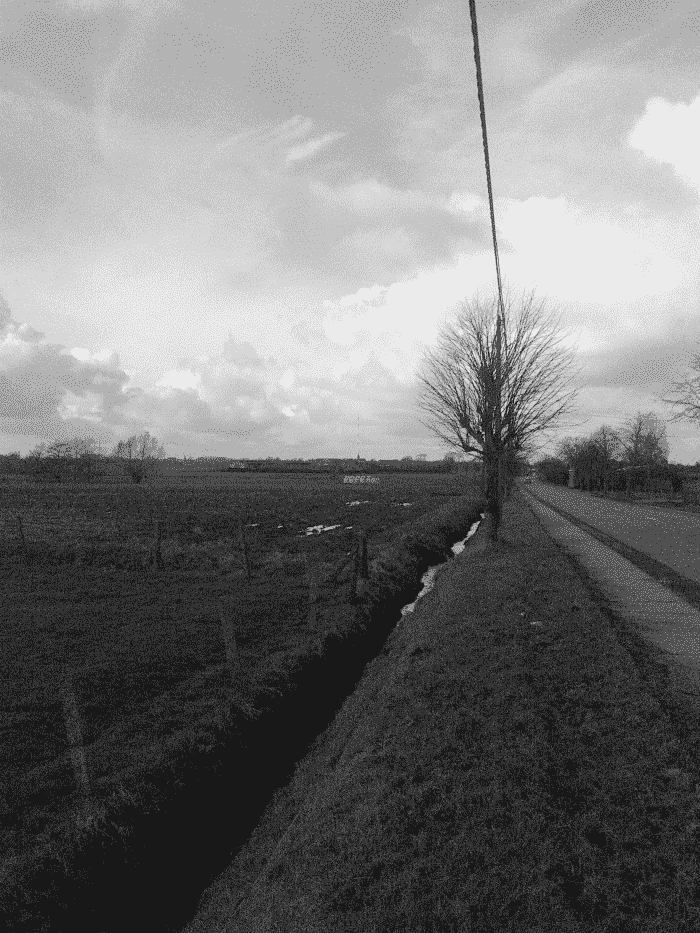

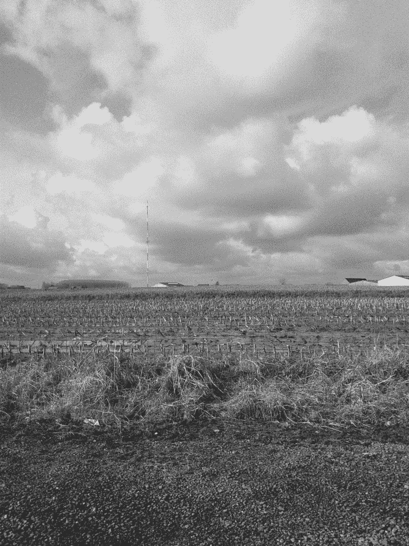

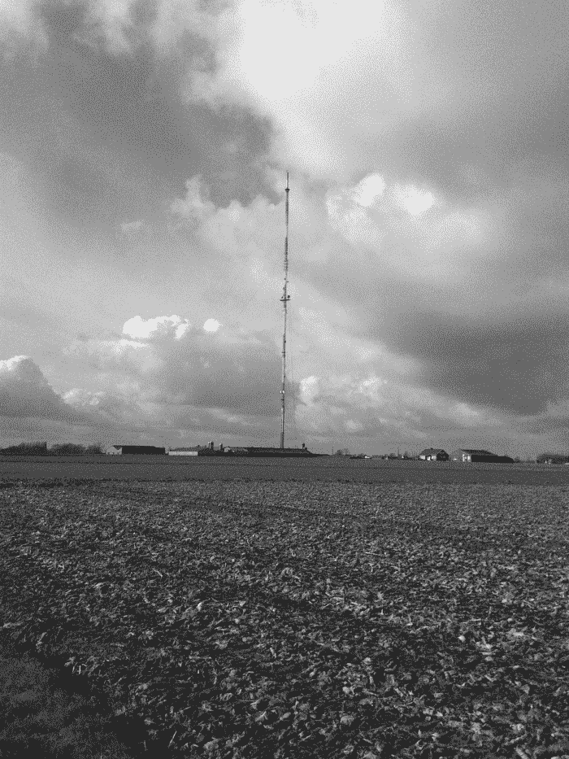

这里的氛围非常安静，我又一次遇到了我的朋友们：

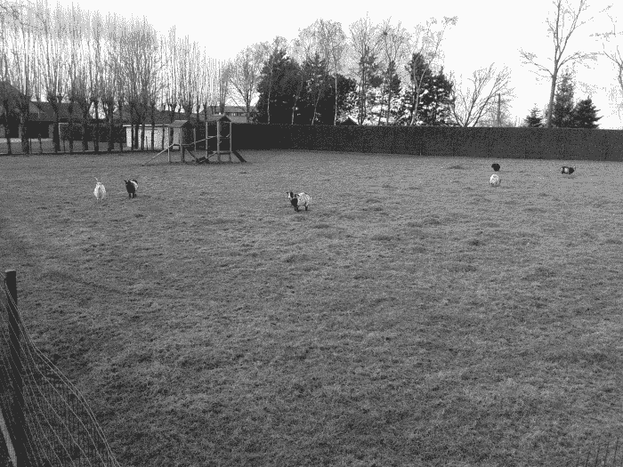

这是比利时最高的建筑：

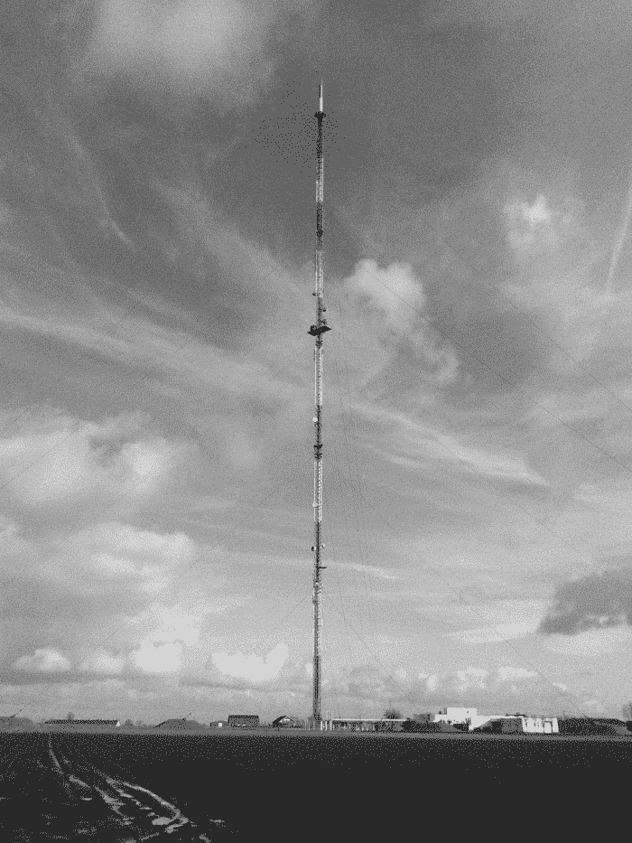

这个塔上有许多（主要用于电视和广播通信）天线，但在[Antenna Site Archive](http://theantennasitearchive.com/belgium-pittem-vliegveldweg-pictures.html)网站上可以找到 2011 年拍摄的不同照片，就在 HFT 微波网络出现之前。通过比较 2011 年的照片和我在 Egem 拍摄的照片，可以看到新的天线被安装在塔上，其中大部分是 Andrews 的天线。这很有趣，因为各种微波竞争对手都使用这种天线。根据 Arcep 网站上找到的方位角，我能够从 Egem 画出一些路径（通往 Dunkerque 和 Coudekerque），而有两个 Andrews 天线似乎与这些方位角完美吻合（还有第三个较低的天线指向比利时的 Veurne，但我对此不太确定）。

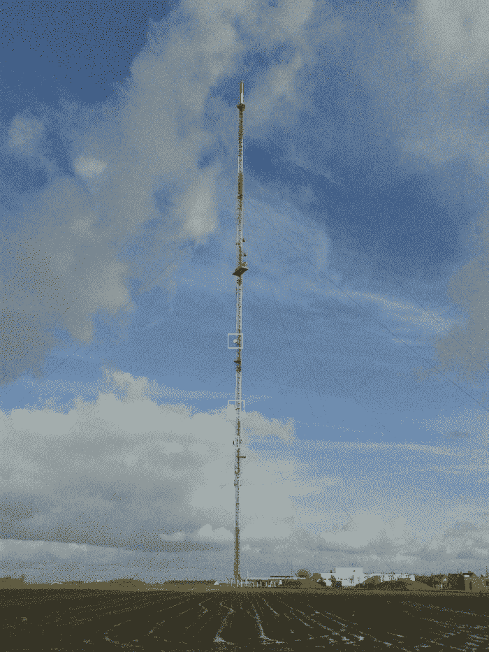

验证方位角并不容易（我只是一个*业余爱好者*），但由于两个更高的天线安装高度不同并且方位角不完全相同，我打赌它们是由两个不同的竞争对手所拥有（或一个竞争对手具有两条不同的路径，但对此我表示怀疑）。这会证实我的电信消息人士告诉我的关于“*与两个方面的谈判”*。另一侧的塔上有三个 Andrews 天线。它们非常高，以至于很难猜测方位角，但似乎有两个具有相同的方位角，指向比利时的一个地点：

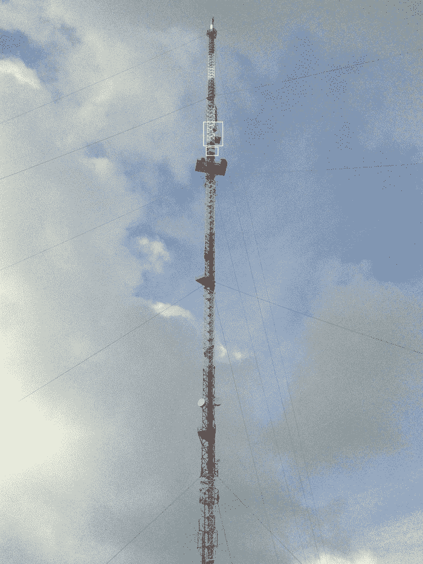

这三个天线可能确认了 Egem 有两个不同的竞争对手。值得注意的是，这些天线的安装高度比指向法国的天线要高得多，这意味着它们可能指向另一座非常高的塔。鉴于我对这三个天线的方位角的猜测，如果它们指向奥芬德圣皮特斯李尤（Sint Pieters Leeuw），我不会感到惊讶，因为那是比利时的第二高建筑。这将证实一个消息人士告诉我的信息：“*最后的建议：找一下比利时 Norkring 的地图。Vigilant 非常喜欢 Norkring*。”如果我们对此进行一些推测，从法国到圣皮特斯李尤的 Vigilant 路径将经过 Egem：

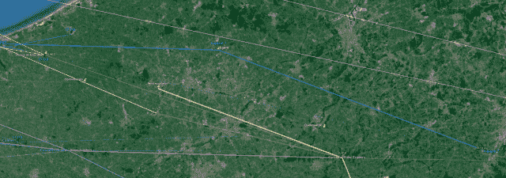

但推测并不等同于事实，我很可能永远也无法确定 HFT 微波竞争对手在我家后院最高楼上有多少个天线。

Egem 非常寒冷，而且我没有手套，所以参观后我试图找一家咖啡店。我开着车，开了几米，左转，然后看到了一个“食堂开放”的标志。“*完美*”，我对自己说……但当我到达咖啡馆前时，一切都变得糟糕了。有一个奇怪的人体模特，等着顾客：

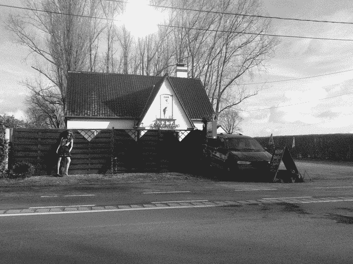

人体模特似乎正走在一个人头上…

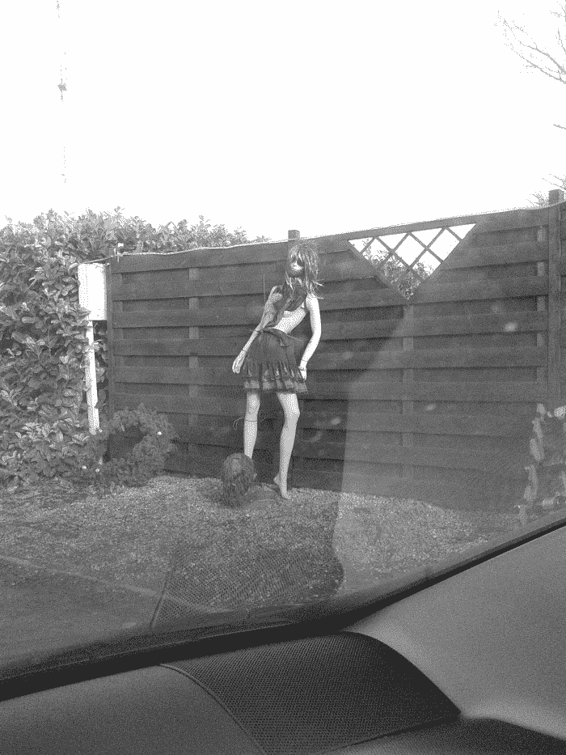

我再看了“酒吧”，然后我意识到这不是一家咖啡店。一点也不（你可以猜到背景左边的塔的电缆）：

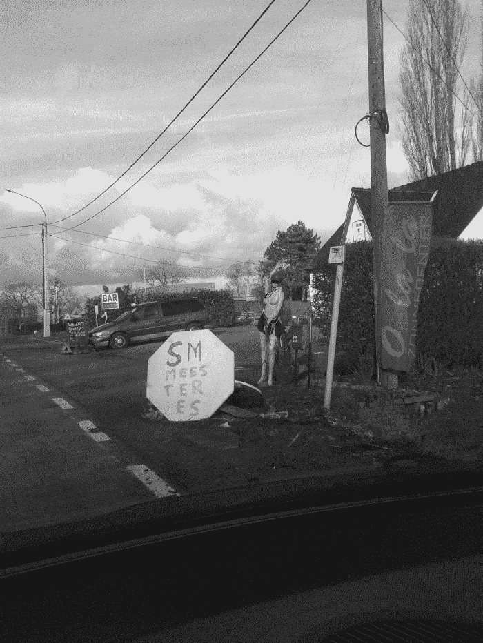

这是一家专门从事 SM 的妓院！这个地方将是下一部*查基*的完美取景地：

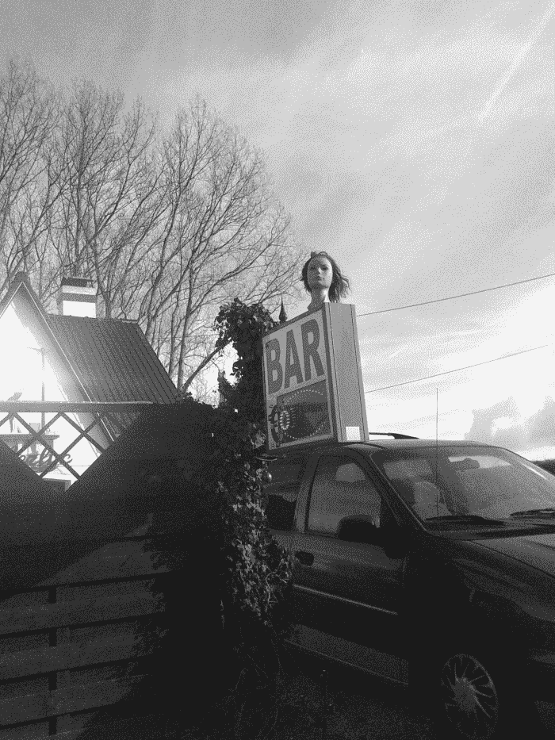

突然间，气氛变得令人毛骨悚然。非常可疑。我回家，泡了一杯咖啡，并在 Google 地球/街景上查了这个奇怪的地方。我想看看 Google 镜头是否拍到了恐怖的洋娃娃，但 2010 年这个地方只是一个“俱乐部”（*即*没有 SM 的妓院）。然而，Google 地球的截图太惊人了：

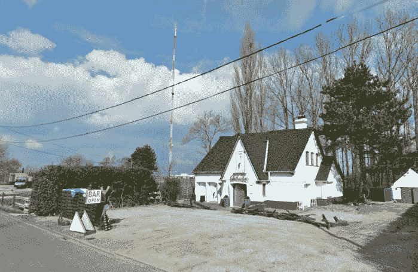

在比利时最高的塔不远处，有一个妓院。这讽刺。
