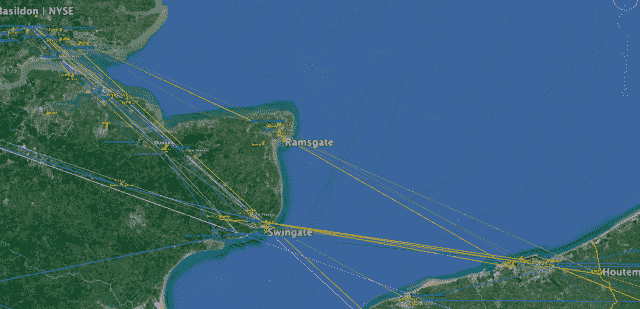
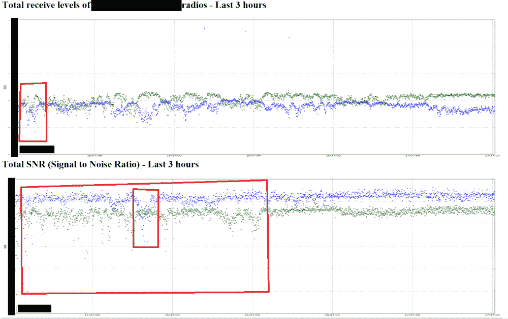
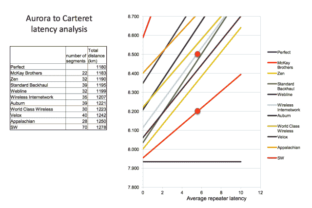
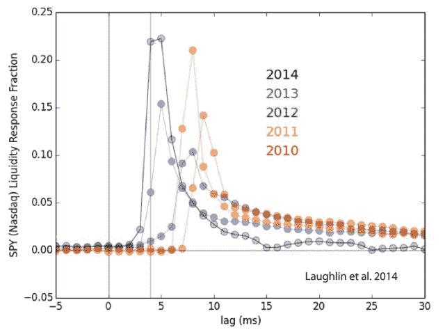
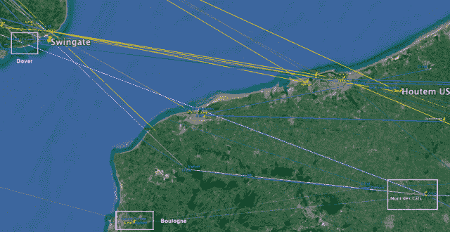
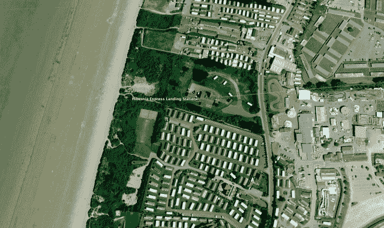
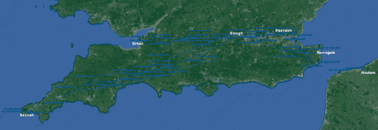

<!--yml

category: 未分类

date: 2024-05-18 14:15:13

-->

# HFT in my backyard | VI – Sniper In Mahwah & friends

> 来源：[`sniperinmahwah.wordpress.com/2015/04/13/hft-in-my-backyard-vi-2/#0001-01-01`](https://sniperinmahwah.wordpress.com/2015/04/13/hft-in-my-backyard-vi-2/#0001-01-01)

*仔细想想，这真是一个纠缠不清的小茅屋产业。每个人都认识每个人。

众所周知，每个人都清楚每个人在做什么，但没有人谈论。

我的一个消息来源。

这是“HFT in my backard”系列第一季的最后一集。我之前太忙了，无法发布它（我在业余时间从事 HFT 工作）。此外，我意识到我积累了很多数据，真的写不完我现在桌上有关高频交易公司使用的微波网络的所有东西。我的书的第一部分标题是 *6*，然后我加上了第二部分 *5*，鉴于我获得的所有数据，我可以轻松写一本关于这些网络的新续集 *4*，但我担心我没有时间。这部最后一集更像是各种主题的杂烩（“Miscellanea”）而不是结论。带有一个有趣的悬念。

##### 事实和不准确之处

这项关于微波的调查主要得益于在线公开数据的丰富。除了我访问过的塔（主要在比利时）和一些从业者提供的建议之外，公开文件虽然很有用，但并不意味着你已经发现了“真相” - 这里的真相指的是：准确了解竞争对手在哪里安装了碟，以及它们设计的确切路径，从一座塔/数据中心到另一座。通过查看 Ofcom [网站](http://spectruminfo.ofcom.org.uk/spectrumInfo/) （英国）或 [ANFR](http://www.cartoradio.fr/cartoradio/web/) 网站（法国），你可以了解竞争对手在这里和那里保留的频率，但这并不意味着他们真的在这里那里放置了碟，因此你必须将许可证与规划申请进行比较（如果在线可获得），等等。有些国家（如英国）非常透明，但其他国家则是黑暗的水池（比利时）。此外，即使竞争对手同时拥有频率许可证和塔的批准许可，也并不意味着他真的在这个位置使用 - 也许他已经换了别的地方等等。有时，你必须进行猜测，而交易就是关于猜测的。有时你是对的，但有时你不是，有时你赚钱了，但有时你亏钱了… 微波网络也是如此。更重要的是，其中一些网络仍在进行中，其他一些网络正试图获得比以前更好的路径。它们会移动，因此非常难有一张显示真实路径的最终地图 - 顺便说一句，我发现字 *trade* 在 14 世纪的初衷意义是*路径*。

此外，在调查网络时，你必须处理很多技术细节，我知道可能有些技术细节上出现了错误。这一切都是为了表明，即使具有良好的公共数据并且与给了我一些提示的 HFT/微波行业人员进行了公平讨论，要确定竞争对手设计的真实和最终的路线是非常困难的，从人类学的角度来看，这里最有趣的是 HFT 如何塑造地理，以及公司如何处理自然以实现最佳路径，比竞争对手更快。

##### 再次提到频道

我在前面的几集中讨论了该频道（你可能需要用微波穿越它时会出现的困难；对频率的猜测等），所以让我们从海开始吧。正如我在[第二部分](https://sniperinmahwah.wordpress.com/2014/09/25/hft-in-my-backyard-ii/)中所写的，Jump 公司在 2013 年初购买了老军事 Houtem 塔（这也是该系列的开端），使该公司能够拥有比没有机会拥有如此高塔的竞争对手更高的碟子。借助这个支架，Jump 可以直接穿过兰姆斯盖特到达巴西尔登，并绕过旧的英国皇家空军斯温格特塔（他们节省了大约 6 公里，*即*大约 20 微秒）。

我后来意识到当我开始研究微波时，同时 BBC 发布了一部关于巴西尔登和微波网络的短片[电影](http://www.bbc.co.uk/programmes/p026qp2x)，其中有一些 HFT 碟子在斯温格特的雾中迷失的图片：

最后一张照片很有趣：这是一艘船穿越着英吉利海峡。我听说大型集装箱船可能会阻断法国/比利时和英国之间的微波信号。每天有很多船只从（或者去）鹿特丹港航行穿越频道。下面是来自 marinetraffic.com 的一张快照，显示了 2015 年 9 月 9 日星期二 8:30 中欧时间范围内频道周围的一些船只：

有高 Houtem 塔， 几乎没有可能堵塞跳信号。 相比之下，一些竞争者可能会在这些船上出现问题。 看起来跳 **不是/将不是**唯一的公司通过绕过 Swingate 渡过海峡。 其他竞争者在队伍中 - Optiver 和 McKay 兄弟，至少：

Optiver 和 McKay 都在顿开尔 (法国) 和兰姆斯盖特 (UK) 拥有 Ofcom 许可证（Vigilant 也在兰姆斯盖特拥有[许可证](http://spectruminfo.ofcom.org.uk/spectrumInfo/licences?googloc=(51.313990274072026%2c+1.3369739055633545)&unit=GHz&ne=(51.314982763360646%2c+1.338561773300171)&service=Fixed+Links&code=301010&se=(51.31299776331298%2c+1.338561773300171)&googoffset=0.1&nw=(51.314982763360646%2c+1.335386037826538)&sw=(51.31299776331298%2c+1.335386037826538)&groupKey=1&licenceNum=1031173&submit=Find%20)），所以我敢打赌所有的公司总有一天会使用这条路线穿过海峡（如果他们不这样做，他们可能很难击败跳）。 在顿开尔，Optiver 似乎想要在波利米里欧洲法国（一家石化工业公司）拥有的“烟囱”之一上[安装](http://spectruminfo.ofcom.org.uk/spectrumInfo/licences?googloc=(51.030693744987936%2c+2.246881127357483)&code=301010&se=(51.03049132231546%2c+2.24720299243927)&googoffset=0.0&nw=(51.03089616677629%2c+2.246559262275696)&unit=GHz&ne=(51.03089616677629%2c+2.24720299243927)&service=Fixed+Links&sw=(51.03049132231546%2c+2.246559262275696)&submit=Submit+search&groupKey=1) 的碟子：

两公里外，麦凯在 Arcelor Mittal (一家钢铁公司) 拥有的电梯处获得了 [许可证](http://spectruminfo.ofcom.org.uk/spectrumInfo/licences?service=Fixed+Links&code=301010&freqStart=&freqStop=&unit=GHz&ngrloc=&offset=&nw=%2851.0422910874577%2C+2.2773778438568115%29&ne=%2851.0422910874577%2C+2.2784078121185303%29&se=%2851.04164349389535%2C+2.2784078121185303%29&sw=%2851.04164349389535%2C+2.2773778438568115%29&googloc=%2851.04196729180808%2C+2.277892827987671%29&googoffset=0.0&submit=Submit+search)：

另一张照片显示了电梯底部，那里有一艘船在等待货物。

这艘船并不算太高，但如果一艘非常高的船停在麦凯的碟子前——看起来高达 70 到 80 米？也是个问题，船不是唯一的阻碍——一群鸟也可能干扰信号。这是一张快照（一家 HFT 公司给我的）显示噪音可能优先于信号。如果噪音比信号多，你的微波网络就挂了（这就是为什么 HFT 公司总是需要纤维作为骨干）。

##### 信息传输与历史

McKay 将碟子放在电梯上的事实是相当惊人的（如果你了解一点芝加哥大宗商品市场的历史，那么你会意识到风城周围的粮食仓库的工业历史与电报的历史有关）。关于美国微波网络以及 HFT 公司在新泽西和芝加哥之间使用的网络可以写很多。在[Laughlin et al.，2012](http://papers.ssrn.com/sol3/papers.cfm?abstract_id=2227519)的地图上，可以*看到*HFT 如何重塑直线微波网络。新泽西-芝加哥-华盛顿走廊清晰可见：

我没有对这些网络进行调查，但在这个[博客](http://meanderful.blogspot.be/2014/08/historic-us-microwave-links-and-ny-to.html)上，有一个关于纽约到芝加哥之间第一个微波网络建成的有趣故事，那是在 1949 年：

技术已经发生了变化：在 1949 年，你需要 34 座塔在两个城市之间，但在 2015 年，最好的 HFT 供应商/公司只需使用 22 次跳跃：

© 麦凯兄弟

奥本（数据系统）这样的公司需要的塔比 1949 年首次建成的网络（该公司是第一个申请许可频率的公司，但是最后一个开展网络的公司）更多，这是很有意思的。关于美国网络还有其他令人惊奇的故事：[在这里]（http://www.villadom.com/VTNews/2014/Z4/Aug/140813z4/files/3.html）你可以阅读到 2014 年新泽西州马瓦市树立的新通信天线，以允许麦凯和奥本（等等）安装天线。在这份官方[文件]（http://www.mahwahtwp.org/Bids/MTB%2313-17_Recommendation-PM.pdf）中，我们了解到，2013 年，该镇收到了几份“在 30 英尺高的杆上放置通信设备”的“*竞标*”。奥本提出了 64,000 美元，Jump 提供了 35,000 美元，Anova 也是 35,000 美元，但赢家是名为 Wireless Holdings Network 的“[一家数据公司]（http://patch.com/new-jersey/mahwah/data-tower-expansion-to-earn-township-246k-per-year）”，该公司提出了每年支付 246,024 美元（！）的年费来放置天线。在此之前，该杆每年仅[赚取]（http://www.northjersey.com/story-archives/cell-tower-in-mahwah-to-get-higher-1.603061）40,000 美元，因此我们在这里有了 HFT 具有一些真正的社会和公共价值的最终证据。我不知道谁在 Wireless Holdings Network 背后，但似乎该公司隶属于 SMG Holdings，而 SMG Holdings 又拥有一个名为 Anova-Tech 的[子公司]（http://www.bloomberg.com/research/stocks/private/snapshot.asp?privcapId=58804413），而 Anova 在新泽西的一些交易所之间提供[激光网络]（http://www.anova-tech.com/Low%20Latency%20Media.html）。这是多么有趣。即使激光和微波一样快，激光网络具有更高的带宽，但它们受天气影响更大（如果有浓雾，激光束将不会传播超过几百米）。如果 Wireless Holdings Network/Anova 同意向马瓦镇支付巨额年费，是因为他们在这个塔上放置了激光天线吗？还是因为他们希望确保在这个塔上，所以付出了代价？——纯粹的猜测。

在新泽西州的兰道夫（Randolph），麦凯在一个塔上安装了天线，奥本也想在那里，但是兰道夫镇拒绝了奥本的规划申请，所以奥本感到嫉妒，并且[起诉](https://sniperinmahwah.wordpress.com/wp-content/uploads/2015/04/auburnagainstmahwah.pdf)了这个城镇，辩称如果兰道夫市批准了麦凯的安装，就没有理由拒绝奥本的安装。天线之战。还有其他[故事](http://www.westorange.org/Archive/ViewFile/Item/148)，但美利坚合众国不是我的后院，所以我并没有真正关注。话虽如此，关于高频交易公司在芝加哥商品交易所数据中心（伊利诺伊州奥罗拉）利用漏洞的有一个有趣的故事。 *华尔街日报*的斯科特·帕特森（Scott Patterson）[在 2013 年 5 月](http://www.wsj.com/articles/SB10001424127887323798104578455032466082920)写过这个案例，2014 年对芝加哥商品交易所 [提起了诉讼](http://wallstreetonparade.com/2014/07/lawsuit-stunner-half-of-futures-trades-in-chicago-are-illegal-wash-trades/)。简而言之，“*某些客户在收到他们的交易确认和信息在公共数据源中可获取之间存在几毫秒的延迟*”，一位 CME 女发言人说道。高频交易公司在其他参与者之前收到信息的事实备受争议 - 市场对此有不同的政策：例如，欧陆交易所（法兰克福）向所有参与者公开发送交易确认，而不仅仅是（即在之前）发送订单的公司。在这里，CME 漏洞给了高频交易公司 1 到 10 毫秒的优势，并且通过微波数据可以在芝加哥和新泽西之间传输，大约需要 4 毫秒，这意味着一个算法可能决定根据来自芝加哥的信息交易纳斯达克，但*在芝加哥甚至不是公开的*。这是反映了 CME 与纳斯达克之间响应时间演变的图表：

© Greg Laughlin

根据我的一位消息来源，“*当今的快速响应主要是由于 CME 似乎大大减少了匹配时间戳与交易所网关打印之间不可预测的延迟*”（这意味着 CME 可能 - 但只能部分地 - 解决了漏洞问题）。 “*这可能增加了对第二层次微波网络的经济可行性的压力，同时增加了最快网络的价值*”。

##### 常见问题

在结束对我后院周围最近的微波移动的第一个季度之前，进行一个快速的问答环节-因为我收到了很多关于网络各种问题的电子邮件。显然，我并没有所有的答案（这是不言而喻的），但有时我会有线索。

+   *为什么我们在你的地图上找不到像 Virtu 这样的大型 HFT 公司的名字？* 我不知道。可能是因为他们不建立自己的网络（与 Optiver 或 Flow Traders 不同）。他们可能使用微波网络供应商。给麦凯兄弟打电话，甚至是 Custom Connect。

+   *你是受麦凯兄弟雇佣的吗？*

    嗯...不。一些读者（主要是来自 HFT 行业的人，我想）纳闷为什么我对麦凯兄弟这么客气。我不认为我特别赞扬过麦凯兄弟，但是 1) 作为一个微波网络供应商，麦凯是最透明的公司：他们公开发布他们的“真实”[延迟](http://www.mckay-brothers.com/product-page/#latencies)，更重要的是，他们的母公司兼姊妹公司昆西数据（Quincy Data）也公开销售他们的[产品](http://www.quincy-data.com/product-page/)（例如：关于法兰克福欧洲期货交易所的债券期货的数据）；其他公司（例如网络供应商 Perseus[,](http://perseustelecom.com/perseus-first-to-offer-trans-atlantic-wireless-access-33-84ms-milliseconds-new-york-to-frankfurt/)，他们转售 Jump 网络的带宽）也会公布延迟，但不是必要的准确度-而且，没有关于所涉及的数据/产品的细节。 2) 虽然麦凯在奥克兰有办公室，但麦凯也是一家法国公司，在巴黎有办公室，作为一个法国人，我捍卫法国工业;) 3) 话虽如此，我是完全透明的：在调查微波领域之前，我认识了麦凯兄弟的联合创始人斯特凡·泰克（Stéphane Tyc）（当斯特凡在 2013 年发表了有关[联邦劫案](https://sniperinmahwah.wordpress.com/2013/12/04/the-fed-robbery-new-evidence/)的白皮书时，我在斯特凡和 Nanex 的 Eric Hunsader 之间起了一种“中间人”的作用），但这并不意味着我宣传麦凯兄弟的网络。4) 斯特凡·泰克有关于[最佳执行](http://www.finra.org/sites/default/files/notice_comment_file_ref/p602283.pdf)和交易报告透明度的有趣想法，即使他的“自由主义风格”（我的话）并不总是讨人喜欢。

+   *是否可能黑客侵入微波信号？* 我怀疑。

+   *海盗情况如何？* 这次调查主要是关于地理、自然和速度。但我知道，法国监管机构 Arcep/ANFR 在 2014 年 9 月检查了一些站点，他们想要确定那些请求频率的人真的在这里或那里安装了天线（在许可证过期之前他们有合法的 18 个月时间进行）。似乎比如说 CIC 在法国没有天线。在 Monts des Cats（Custom Connect 和 Flow Traders 所在地），有 14 个链接/许可证没有使用（意思是运营商请求了频率，但没有安装设备，一种类似占塔/频率的行为？）。这次现场检查使法国监管机构能够对许可证进行“*清理*”（他们将在明年 6 月检查其他高频交易天线）并确认[Custom Connect](https://sniperinmahwah.wordpress.com/2014/10/06/hft-in-my-backyard-more-on-piracy/)在蒙代卡特和多佛之间有一条直接路径（这是跨海峡最长的路径，即 106 公里）。

    

+   *为什么一些高频交易需要比其他交易者提前几毫秒获取信息？* 这是一个$0.001 问题。第一个答案：这完全取决于数据，因为价格是来自各个地方的信息的综合，而一些产品似乎对延迟更为敏感。其他答案：我正在研究这个问题。

+   *有关不同的伦敦地点呢？* 我之前并没有详细介绍伦敦大都会地区。在伦敦及周边地区（巴斯尔登-斯劳路线），网络使用[毫米波](http://en.wikipedia.org/wiki/Extremely_high_frequency)（其频率范围与微波不同）。伦敦有不同的位置：巴斯尔登、斯劳、伦敦证券交易所和汤姆逊路透 LHC（添加 Interxion）。伦敦地铁网络非常密集，我的地图远非准确（我只是在 Ofcom 网站上选了一些路径），需要更多的工作才能得到这些网络的完整地图（而且我不会做）。

    

+   *Getco 为了跨越海峡付了多少给 Latent？*

    在[第四部分](https://sniperinmahwah.wordpress.com/2014/11/03/htf-in-my-backyard-iv/)中，我提到 Getco（在其 Global Colocation Services 子公司名下）[购买](http://spectruminfo.ofcom.org.uk/spectrumInfo/trades?after=dd%2Fmm%2Fyyyy&before=dd%2Fmm%2Fyyyy&seller=&buyer=Global+Colocation+Services+UK&service=all&submit=Filter+results)了 Latent Networks 的一些路径，包括多佛/敦刻尔克路线。鉴于海峡地区频率的猜测，我非常好奇知道这笔交易的金额，于是我写信给 Ofcom，得到了一个友好的答复，称他们不知道交易的价格——这只是买方和卖方之间的私事。我们将永远不会知道。

+   *欧洲还存在其他的或者未来的微波网络吗？* 是的。一家名为 12 Horizons 的公司[在 2014 年 6 月表示](http://www.12horizons.com/press/)，已经搭建了法兰克福（Eurex）和苏黎世（SIX）之间的微波网络。该网络看上去很真实（有时公司宣布某事，但实际上只是为了广告宣传——例如，Anova[宣布](http://www.extremetech.com/extreme/176551-new-laser-network-between-nyse-and-nasdaq-will-allow-high-frequency-traders-to-make-even-more-money)2013 年已经在伦敦和法兰克福之间建立了激光网络，但事实并非如此）。我在德国和瑞士对这些塔的数据进行了模糊搜索，但没有找到任何相关的信息。我知道在这一走廊上有老的军事微波塔，因此如果得知它们现在被高频交易商使用，我不会感到惊讶。在这份麦凯兄弟公司的演示中，你会看到一些可能的未来微波路线（用虚线表示）。

##### **船只，飞机和项目快递**

在[第五部分](https://sniperinmahwah.wordpress.com/2015/01/14/hft-in-my-backyard-v/)中，我推测了跨大西洋传输的未来。在欧美之间建立一个无线网络并非易事，但一些人确实在努力推进这一目标——漂浮岛屿？ 对流层气球？（顺便说一句，令人惊讶的事实：几年前，岛屿的设计者约书亚·莱文曾想象过一个系统，其中几十架塞斯纳飞机载着微波中继器飞行在空中；这些飞机会飞得非常高[~ 5000 英尺]，它们之间的直射距离将超过 100 英里。保持飞机在空中飞行将是一个挑战，但根据莱文的说法，“*比所有这些微波塔要快得多，便宜得多*”）。我打赌，我们将会比预期更快地了解一些无线跨大西洋网络（例如查看这篇[文章](http://www.bloomberg.com/news/articles/2015-01-17/elon-musk-and-spacex-plan-a-space-internet)关于 SpaceX）。全球范围内无线网络的部署是一个迷人的问题。“*随着地球自身和其计算机之间通过无线电链路和光纤构成了越来越紧密的低延迟网络，浮动“电丽芙人假说”看起来不再像一个特定伸展任务，而更像是生物有机体现在在地球上维持生命条件的复杂自我调节系统一样*”，Greg Laughlin 曾准确地[写道](http://oklo.org/2015/02/22/electra/)，扩展了 20 世纪 70 年代詹姆斯·洛夫洛克发明的“盖亚假说”。“*有机体与地球上无机环境相互作用，形成一个自我调节的复杂系统，有助于维持地球上的生命条件*”。这是人类学的一个重要观点。

目前还没有跨大西洋无线网络。在 [Part V](https://sniperinmahwah.wordpress.com/2015/01/14/hft-in-my-backyard-v/) 中，我推测了新的 Hibernia Project Express 电缆，据说可以在欧洲和美国之间节约大约 6 毫秒。这条电缆早就宣布，并且正在进行中。我们知道英国的着陆站在 Brean，但我在着站位置上犯了一个错误。我之前发布的照片不是 Hibernia 着陆站，而是 Vodafone 的着陆站：

Vodafone 在 Brean 的着陆站

我被事实欺骗了，Jump、Vigilant 和 New Line Networks 在房子周围保留了微波频率。我不知道 Hibernia 站的确切位置在哪里，但这并不重要，因为公司不允许客户从着陆站接收电路然后通过微波重新路由它们。据我所知，Express 电缆首先将在位于新泽西塞考克斯（New Jersey）的 NY4 数据中心和位于斯劳（UK）的 LD4 数据中心之间提供 – 就是这样。客户无法在 Brean 着陆站和 Slough 设施之间使用微波。这意味着所有在两个位置之间预订频率的竞争对手都必须等一等。

##### 新线网络悬念

无线网络建立了 6 个月，我无法共享我在欧洲 HFT 微波网络调查期间积累的所有东西。我将密切关注这些网络（主要因为绘制 HFT 世界非常令人惊讶）。在写这个最后一集之前，我从来没有想过会出现一个新的竞争对手：New Line Networks (NLN)。我在之前的 [post](https://sniperinmahwah.wordpress.com/2015/02/19/hft-in-my-backyard-new-line-networks/) 中谈到了这一点，我只想补充一些评论。New Line Networks 是 Jump Trading（以 World Class Wireless 的名义）和 KCG（通过他们的 Geodesic Networks 子公司）之间的合资企业。“*KCG Holdings, Inc. (NYSE: KCG) 今天宣布，其子公司 Geodesic Networks, LLC 和 World Class Wireless, LLC 创建了一个合资企业 New Line Networks LLC。New Line Networks 将探索利用基础设施投资的机会，包括向行业参与者和第三方供应商转售网络带宽。通过这一企业，New Line Networks 将合并互补的网络和通信基础设施，同时向市场提供额外的数据传输带宽*” —— 这是 2015 年 2 月 12 日的公告。芝加哥的两家主要 HFT 公司共同建立一个新网络是一个意外事件。

NLN 的第一个举动是在 2015 年 2 月[购买](http://spectruminfo.ofcom.org.uk/spectrumInfo/trades?groupTradeRef=TNR-2015-02-041)英国通信基础设施公司的所有许可证。这很有趣，因为通信基础设施公司是这里最早的微波网络之一（至少他们保留了很多许可证），后来这家公司在 2014 年 3 月被[Perseus 收购](https://www.aihitdata.com/company/01260007/COMMUNICATION-INFRASTRUCTURE-UK/history)。要注意的是 Perseus 向客户转售 Jump 网络的带宽，所以我认为如果 Perseus 接管了通信基础设施公司，那是因为他们想要拥有自己的网络，这样他们就不再需要使用 Jump 网络了。那么我们是不是应该理解 Perseus 放弃了这个项目？如果不是，那为什么他们将所有的通信基础设施许可证都卖给了 New Line Networks 呢？NLN 的第二步行动是在 2015 年 3 月：他们[购买](http://spectruminfo.ofcom.org.uk/spectrumInfo/trades?groupTradeRef=TNR-2015-03-043)了 Jump 的 104 个 Ofcom 许可证。有了 Communication Infrastructure 和 Jump 的许可证，New Line Networks 在安装在所有塔上的天线后可能在英国拥有一个完整的网络，至少在英国，我在法国的公共网站上没有找到“New Line Networks”这个名字（还没找到？）。

如上图所示，NLN 将使用现在著名的比利时 Houtem 塔（路径经 Ramsgate 再到 Basildon）；NLN 购买了一些通向 Brean 的路径，即使 Hibernia Project Express 电缆不允许在那里使用微波，这也是为什么 NLN 还有通往英国康沃尔 Sennen 的路径（见[第五部分](https://sniperinmahwah.wordpress.com/2015/01/14/hft-in-my-backyard-v/)）。NLN 将使用 Houtem 塔的事实也许可以解释为什么 Jump 以 500 万美元购买了它——这并不便宜，但现在是通过 New Line 网络进行货币化的时候了？再次纯属猜测。

有人告诉我，New Line Networks 的销售代表正在 HFT 的小圈子里寻找客户。NLN 现在是 Perseus 和 McKay Brothers（以及 Custom Connect）的直接竞争对手。最令人惊讶的是，两家 HFT 交易公司现在向他们的 HFT 竞争对手出售微波通信，而 McKay 声称“*私人独立，**与任何交易公司或交易所无关*”，正如他们网站上所说的（加粗为我所加）。我不知道该怎么想——他们是在尝试“打劫”McKay 的客户吗？一位 HFT 微波领域的老手告诉我，“*HFT 公司之间的任何联盟都很令人惊讶…因为这不是行业运作的方式*”；另一位承认“*New Line Networks 创建卡特尔的举动非常令人不安*”。“卡特尔”可能是个强烈的词，但也许并不完全脱离事实。我不知道，但这是一个意料之外的悬念。

最有趣的是，所有 Jump 和 Getco 的创始人在 1998-1999 年在芝加哥商品交易所的交易区上方建立的电子交易平台/塔上开始电子交易。([第一部分](https://sniperinmahwah.wordpress.com/2014/09/25/hft-in-my-backyard-ii/))，在那里，他们的计算机和算法第一次真正能够与人类交易者进行竞争，*面对面*，在 Globex 的帮助下。如果（对于*一些*人来说）高频交易领域是在 2007 年开始的，那么我们可以说，在芝加哥，在 20 世纪 90 年代末，早期的 HFT 公司很可能*开始算*被套利的电脑价格（在塔上）和人类价格（在交易区）的。其中一些公司通过使用无线耳机来实现：一名为该公司工作的交易员在交易区交易，并将交易区的价格传输给另一名在 Globex 上交易的“交易员”。没有无线耳机，没有无线电波，套利就是不可能的。芝加哥期货交易区将在 2015 年 7 月 2 日关闭，但一些前交易员现在已经转向了最先进的微波网络，在我的后院，寻找高塔以尽快获取数据，借助波浪试图在伦敦和法兰克福之间“套利”价格。这就是一位人类学家漫游乡村的方式，*聆听*着风轻轻拂过塔的声音，一种和现在建立的电子交易区数据中心里的声音并不相去甚远的声音-计算机正在被冷却的呼吸。信不信由你，但在 HFT 中是有诗意的。现在是时候继续前进了。下一系列将讨论*僧侣*，因为在美国军队在豪滕建造充满男子气概的塔之前，他们早就建立了塔。这就是所谓的教堂尖塔。
