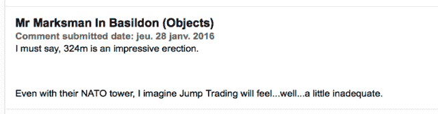
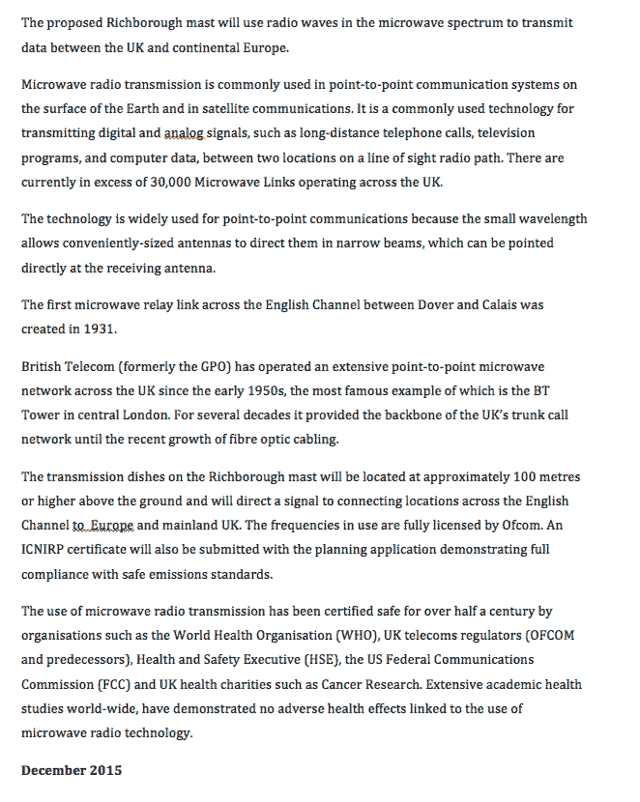
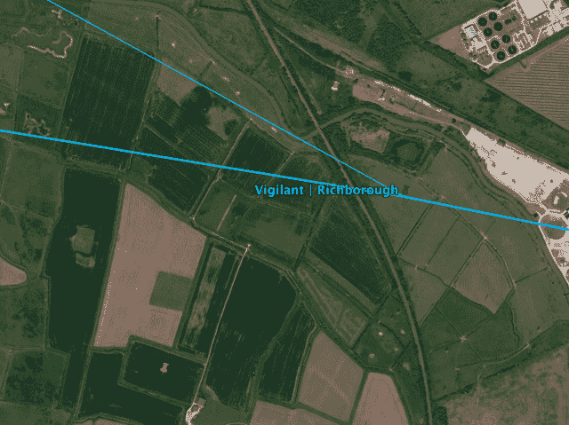

<!--yml

类别：未分类

日期：2024-05-18 14:13:04

-->

# 香蕉国的 HFT | 第二部分 - 马华狙击手和朋友们

> 来源：[`sniperinmahwah.wordpress.com/2016/02/01/hft-in-the-banana-land-part-2/#0001-01-01`](https://sniperinmahwah.wordpress.com/2016/02/01/hft-in-the-banana-land-part-2/#0001-01-01)

高频交易世界总是充满惊喜，特别是当漫游在一些地方，矮或高的塔上被 HFT 交易者的天线所占据时。当我（并在 1 月 4 日发布推文）发现了 Vigilant 寻求在里士满建造的 324 米高桅杆时，我并不知道三周前一些当地居民已开始了这个项目，而他们在 HFT 世界上占据了一席之地。考虑到来自 Ash 的最新消息，我决定“[HFT in the Banana Land](https://sniperinmahwah.wordpress.com/2016/01/26/hft-in-the-banana-land/)”将是“HFT in my backyard”的衍生篇。毕竟，如此巨大的桅杆绝对有足够的长篇故事。所以，这就是“HFT in the Banana Land, Part 2”。

首先，我对“香蕉国”的称呼是错误的：它并不是来自原里士满电站的伪热带，而是来自 Vigilant 想要建造桅杆的（弯曲的）区域形状。香蕉国位于 Ash Parish 的北/东端：

###### 

看来 Vigilant 选取的这片地块的北部就有一个矿磨和两座现存的桅杆（这里用白色圈出）：

Ash 的一位当地居民拍了一些照片（一个拉线塔和一个混凝土塔）并发送给我，以便我能检查是否已经有 HFT 天线在那里：

但是如意料所及，并没有菜肴在那里。这些桅杆的高度肯定不适合横跨英吉利海峡 - 我认为这些旧的桅杆可能被用作在当地的电台，供栖息在该地区的候鸟使用，而已经没有其他用途了。

###### 规划申请

“香蕉土地上的 HFT” 的[第一部分](https://sniperinmahwah.wordpress.com/2016/01/26/hft-in-the-banana-land/)是在 1 月 18 日之前写的，但直到 1 月 26 日才发布在网上（我正在等待关于频道中不同弗雷涅尔区交会的一些技术细节）。这就是为什么我错过了这一点：与我在这个衍生产品的第一部分中写的相反，全面的规划申请已经在线上了。它在[这里](https://planning.dover.gov.uk/online-applications/applicationDetails.do?activeTab=summary&keyVal=DCAPR_228292)。尽管我现在对提交用于在塔上安装天线的规划申请非常熟悉，但 Vigilant 的申请非常庞大；在现有塔上安装天线比建立一座 324 米高的塔要容易得多，因此有很多文件：

如果我说我已经从头到尾读过所有这些技术文件，那是撒谎，但我确实查看了“天线台的建设规划”，在那里我们可以找到有关 Vigilant 想要放置在塔上的天线的更多细节：

首先，我们了解到 Vigilant 将使用四个天线（分别位于 320m、310m、300m 和 290m），向比利时发送微波信号，这些天线相当大（其中两个直径为 3.7 米，这是我第一次看到用于 HFT 目的如此大的天线）。其次，我们可以看到，Vigilant 也打算在塔的另一侧（射向 299° 方位）放置天线（分别位于 320m 和 310m）。这两个天线并未包含在预先规划的申请中，看起来指向巴西尔登（而这是预料中的 – 在 Richborough 这样的塔上，通过两条路径去巴西尔登应该很容易）：

这里和那里都有很多其他规格，特别是在“社区参与声明”文件中，Vigilant 解释了（比他们的[网站](http://www.richboroughmast.co.uk)上更详细地解释）当地社区如何从天线中受益（我在“香蕉土地上的 HFT” [第一部分](https://sniperinmahwah.wordpress.com/2016/01/26/hft-in-the-banana-land/)中简要介绍了这一点）。如果你有时间浪费，你也可以[读一读](https://planning.dover.gov.uk/online-applications/applicationDetails.do?activeTab=summary&keyVal=DCAPR_228292)所有的环境说明书（如果你想了解更多关于候鸟的情况），但那太长了。

###### 致命的视频

在“社区参与声明”中，你可以找到 Vigilant 于 9 月 25 日和 26 日与当地居民举办的一次会议的图片（你可以在[Richboroughmast.co.uk](http://www.richboroughmast.co.uk/)上下载展示板）。  

除了这两次公开会议外，亚殊议会于 2015 年 10 月在其[网页](http://www.ashpc.kentparishes.gov.uk/default.cfm?pid=news&newsid=11281)上宣布，“*Cascade Communications Ltd 作为 Vigilant Global 的媒体代表，将在 11 月 2 日星期一下午 6:45 - 7:30 在艾许村会议厅图书馆为议会委员提供关于天线方案的概述。据了解，Vigilant Global 代表将出席会议。会议的主要焦点是提供问答机会，公众欢迎参加*”。九月份的两次公开会议似乎讨论了天线的益处，“*关于 Vigilant 将如何处理天线的问题*”，根据居民的说法，因此他们中的一些人希望了解更多关于 Vigilant Global 的活动。

根据英国法律，居民有权在理事会会议上拍摄录像，与 Vigilant Global 的会议被录制了下来，但别问我是怎么得到的。一直以来，在我对 HFT 微波网络的调查中，我最大的挫败感来自于我错过了 2013 年 12 月霍特姆举行的（臭名昭著的）拍卖会，当时来自芝加哥的大型 HFT 参与者和来自比利时的知名律所为了购买霍特姆塔而进行了数小时的战斗（比利时政府提出的起拍价仅为€255,000，但几个小时后获胜者 Jump Trading 愿意支付$5,000,000）。我当时真的希望自己能够在拍卖会上，就在佛兰芒的乡下，但现在我有了一段视频，我可以看到世界上最大的 HFT 公司之一 DRW，通过他们的子公司 Vigilant Global，正试图与一些议会成员和居民进行交易。拍摄者要求我不要在网上分享这段视频，但由于会议是公开的，我有权描述，并且，最重要的是给出一些问答的文字记录——而且有些答案难以置信。这次会议是在艾许图书馆的小房间里举行的，那里是每次议员会议的举办地（一个 4 乘 6 米的房间），而天线是当天会议的第一个议题。

亚殊议会办公室

这段视频为 33 分钟的静态画面（摄像机放在桌子上）。Ash 理事会成员在场，还有一些居民，以及 Cascade Communications（这里是 PR 先生）的一位成员和 Vigilant 的一位代表（这里是 Vigilant 先生）。请记住这段视频是在三个月前拍摄的，即 2015 年 11 月 2 日，这是在我听说 Richborough 的 Vigilant 塔之前的两个月，并且在我写《香蕉乡的高频交易》第一部分之前的两个半月。[我的评论用括号括起来。]首先，PR 先生再次重复了《Richboroughmast.co.uk》提供的信息：发电站的历史，我在《第一部分》中提到的 Nemo Link，“香蕉乡”（笑），英国和欧洲大陆之间的点对点通信，对多佛社区广播的好处等。从 06:44 开始，介绍了建筑情况（塔，太阳能电池板等）。从 09:18 开始，都是关于设备的内容（人员等）。从 10:00 开始，PR 先生和 Vigilant 先生解释了为什么他们需要如此巨大的塔。

[14:49] 有位居民问 Vigilant 先生他们会不会在塔上使用微波，Vigilant 先生这样回答：“*我们会使用无线电波……但我怕我不是工程师，但如果你有具体问题，我可以把你的问题带给我们的传输组……*”，居民回答道：“*我已经发送了邮件，但没有收到回复……*”。14:39 时，同一位居民问是否“*会用于高频交易*”，Vigilant 先生回答：“*它将用于传输数据……高频交易可能只占 Vigilant 活动的 3 或 4%……因为我们还有房地产业务……*”[嗯嗯……3-4%？如果只有 3-4%的高频交易活动，那花费数百万美元建造一座塔是否可信呢？有点奇怪。]居民的下一个问题：“*这座塔会用于高频交易吗？*”Vigilant 先生的回答：“*我需要与交易员核实后再回来……*”[???]。

15:57 时情况变得更糟。

+   **居民**：“*这座塔是伦敦到法兰克福的 HFT 网络的一部分吗？*”[鉴于 Vigilant 在其公开文件中从未提到 HFT，我意识到这位居民是消息灵通的]

+   **Vigilant 先生**：“*这是英国和比利时之间的网络，是的*”[WFT]

+   **居民**：“*它不会通往法兰克福吗？*”

+   **Vigilant 先生**：“*我不确定它经过哪里……*”[WTF bis]

+   **居民**：“*嗯……所以你对高频交易了解不够，我明白了……*”[pow pow pow，先生 Vigilant 被打败了]

+   **居民**：“*比利时的哪里？*”

+   **Vigilant 先生**：“*我想我们已经提供了一张地图……或者肯定在规划申请中会有地图*”[好吧。所以，现在有一张网络地图了吗？如果有，显然不在规划申请中]

+   **居民**：“*你们已经在大陆和英格兰之间建立了一个连接? 由什么建立的，我想是经由两个姐妹……*”【两个姐妹是指在多佛附近的 Swingate 的两座塔，有些 HFT 放了收发器；从这我开始想到 1）这个居民对 HFT 微波网络做了大量研究，或者 2）他在博客上找到了一些信息】

+   **细心的 V 先生**：“*不,不……*”【哦... Nova Scotia [application](https://planning.dover.gov.uk/online-applications/files/028F9965896FBC6892BD99EEFECADA93/pdf/15_00191-ELEVATIONS-276533.pdf)呢?】

+   **居民**：“*V 先生，Dunkerque 有一个塔吗?或者那里有发射器吗?*”

+   **细心的 V 先生**：“*Duinkerk 市中心的那个塔? 不,我们在那儿没有任何设备*”【嗯... 可能吧】

+   **居民**：“*那比利时 Houtem 的是呢?*”【Houtem!】

+   **细心的 V 先生**：“*恐怕我不可以对此发表评论……*”【？？？】

+   […]

+   **居民**：“*用于高频交易的最快通信方式是什么?*”

+   **细心的 V 先生**：“*我要去问一问...*” 【嗯?】

+   **居民:**：“*我可以向你保证：这是微波*”【没错】

让我们就停在这里（屠杀）吧。当“Houtem”这个名字被提到时，就清楚地表明这位居民读过“HFT in my backyard”。他在一封电子邮件中确认了这一点：“*作为一个业余爱好者，我关注金融市场已经 20 多年了. 并不是为了赚钱，只是想了解这个世界是如何运转的。在 2015 年 9 月之前我就阅读过你的网站。我就是那个问关于微波的人。的确，我在你的博客上找到了有关 Houtem 的无线电塔和 Duinkerk 的信息。还有我在你的博客上找到了去 Frankfurt 的链接。通过阅读你的博客，我明白了我必须拍摄这次会议。所有的议员们，我都发了一个指向你的博客的链接，所以他们都非常了解 HFT 和这个网络是什么。我不反对赚大钱的公司和银行，我只想要透明度。*”

亲爱的上帝...... 我在 1 月 4 日就推文这个无线电塔时，我就在想我是否暴露了 V 先生公开宣称他的公司是一家 HFT 公司而让他陷入了尴尬境地。但并没有。亚什市的一些居民和议员在我第一次听说这个塔的两个月前就对 V 先生公司的活动有所了解（我非常确定那个发给我 Richborough 网站链接的人就是那个居民）。这就证明了博主发布的信息可以帮助社区；信息真的很重要 — 毕竟，如果 V 先生想要在竞争对手之前建造这座塔，那就是关于在竞争对手之前获取信息。很可能就是因为“我的后院里的 HFT”另一个来自巴西尔登的居民在回应[网页](https://planning.dover.gov.uk/online-applications/applicationDetails.do?activeTab=neighbourComments&keyVal=DCAPR_228292)上嘲笑 Jump Trading:

我来自阿什的匿名居民补充道：“*我真的不明白为什么他们没有准备[这次会议]*”。这不只是“他们没有准备”: 这次会议是一场（不那么突如其来的）崩溃。为什么维吉兰特先生否认了关于微波的事情？考虑到有关斯温盖特、豪滕姆、敦刻尔克、法兰克福等问题的准确提问，维吉兰特先生应该明白站在他面前的人们非常清楚他的公司在做些什么。我很抱歉让维吉兰特先生陷入如此困难的境地，但否认公开信息绝不是明智之举（哪怕没有我的博客，正如当地人写信告诉我，“*只需简单的谷歌搜索就会发现维吉兰特全球是一家高频交易公司，他们使用微波进行通信*”）。由于维吉兰特先生未能回答理事会成员的问题，理事会要求书面答复，[于 1 月 22 日由阿什理事会发布](http://www.ashpc.kentparishes.gov.uk/default.cfm?pid=news&newsid=11281)：

至少这次他们承认使用了微波，但为什么他们仍然不承认他们的信号不仅会跨越英吉利海峡，还会跨越我的后院呢？很奇怪。不管怎样，我真的很好奇一个公司怎么可能在设计微波网络方面这么厉害，但在公共关系方面这么差劲。我会在第四部分专门讨论一些技术问题（会议期间提出）关于微波调节（似乎一些居民对安全存在问题）。与此同时，一个小趣闻：英吉利海峡的另一边，我的一个 Twitter 粉丝写信给我：“*我们拥有敦刻尔克塔最顶层的公寓*”。太巧了！“*现在让我们想出一种变现的方法吧*”。哈哈。他可能会给我一些关于他在那里居住的祖母的消息，她已经让人们使用这套公寓进行可行性研究... 最后但同样重要的是，今天在阿什将举行新的理事会会议，晚上 6:30。理事会成员将决定何时开会决定关于维吉兰特天线（可能会在 2 月底前）。这并非不可能让我得到一部新视频。

###### 悬念

我将在第三部分详细介绍黄色和红色图钉的故事，绝对值得一读。敬请关注。
