<!--[yml

category: 未分类

date: 2024-05-18 14:09:50

-->

# 香蕉土地中的高频交易 | 第五部分–Mahwah 狙击手和朋友们

> 来源：[`sniperinmahwah.wordpress.com/2017/01/26/hft-in-the-banana-land-part-5/#0001-01-01`](https://sniperinmahwah.wordpress.com/2017/01/26/hft-in-the-banana-land-part-5/#0001-01-01)

[*本帖子献给 Bass de Banaan*]

微秒级别的之后《香蕉土地中的高频交易》[第四集](https://sniperinmahwah.wordpress.com/2016/07/27/hft-not-in-the-banana-land-part-4/)，这里是第五集。自 2016 年 1 月以来，在香蕉土地周围发生了很多事情。在发布第 3 集两个月后，Richborough 发生了新事件，另一家与高频交易有关的公司 New Line Networks（或称 NLN，是一家高频交易公司 Jump Trading 和 KCG（前 Getco）共同拥有的电信联合企业）申请建造了一座 305 米高的大塔，这座塔靠近 Vigilant 的塔。NLN 于 2016 年 5 月 4 日提交了申请，比 Vigilant 提前了四个月来到香蕉地。关于两家高频交易公司在英国这个安静角落的正面竞争，在报纸上已经有很多报道了，所以让我们尽量做得简洁些。两份申请将在今天下午 6 点由多佛地区议会在多佛的规划委员会会议上审议，我刚到达那里。

##### 高频交易之战在香蕉土地上

Vigilant 是第一家申请在 Richborough 的所谓“香蕉土地”上竖立一座 325 米高塔的公司。来自蒙特利尔的公司决定在那里建造这座塔，因为香蕉土地靠近连接斯洛和里奇伯鲁的直线（参见前文）。Vigilant 的塔将竖立在老里奇伯鲁发电站的冷却塔附近（这些塔在 2012 年被拆除，但在下图中你可以看到它们，前景是里奇伯鲁罗马要塞）。看来 Vigilant 选择这个地区是因为这里仍然是工业区，这意味着该公司试图减轻塔对景观的影响（用一座极细的塔取代了旧的大塔——相当聪明）。

然后 New Line Networks 带来了另一座塔，稍微小一些（305 米），它将竖立在名为 King Ends 农场（KEF）的地方，这个地方距离旧发电站 1 公里。这意味着两家高频交易公司希望在同一地区竖立两座几乎相同的塔（一座巨大的塔似乎是一个疯狂的项目，两座巨大的塔显然太多了）。

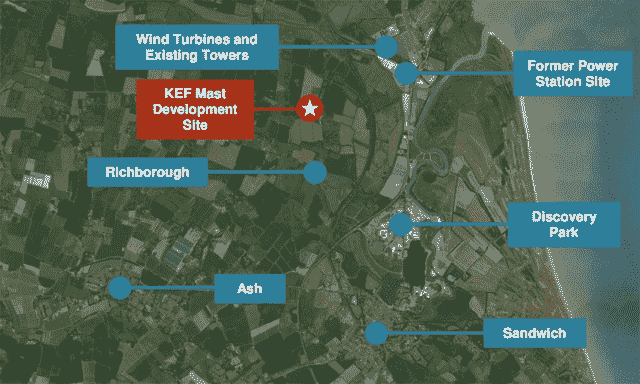

© NLN

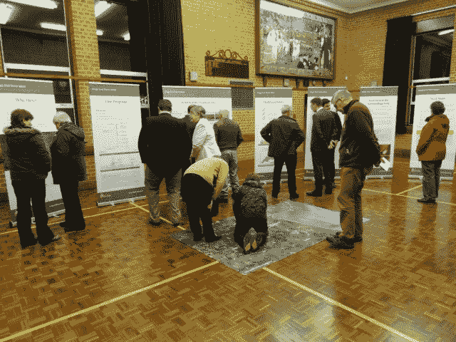

NLN 组织的一次会议说服当地居民 © NLN Networks

随着 NLN 申请建设自己的电信塔，Richborough 地区开始了“新艾菲尔铁塔”之争。阅读这两家公司在多佛区议会网站上提交的所有文件（[Vigilant](https://planning.dover.gov.uk/online-applications/applicationDetails.do?activeTab=summary&keyVal=DCAPR_228292) 和 [NLN](https://planning.dover.gov.uk/online-applications/applicationDetails.do?activeTab=summary&keyVal=DCAPR_229267)），为了捍卫并攻击对手竞争项目（大约一年的战斗）。最有趣的是当地居民/政客/当局/机构对这些巨大塔的看法，而大多数居民如预期的那样不希望它们出现在自己的后院。还有很多有趣的（有时是有趣的）评论，比如：“*这样的电信塔将成为一个眼中钉*”，“*高频交易对市场产生了负面影响，导致闪崩*”，以及“*还有关于这样一座大型构造的视觉影响的担忧，考虑到 Richborough 罗马堡垒的临近以及如果曼斯顿重新开放为机场可能带来的未来不良影响”等等。最终，警惕公司申请获得了 124 条公开评论（反对：101 条；支持：21 条），而 NLN 获得了 202 条评论（反对：182 条；支持：14 条）。在某个时候，我对 NLN 电信塔发表了一个讽刺性评论，当它在 2016 年 3 月出现时，我只是写道“*我爱你！*”，你知道吗？NLN 认为那是一条“支持评论”！非常滑稽。

因此，绝大多数人不想在 Richborough 地区建一个（或两个）巨大的电信塔。当地教区也被要求采取立场，有些反对，有些支持（但支持者也表示：“*然而，多佛区议会敦促计划建设电信塔的企业合作，从而减少总电信塔数*”。需要注意的是，如果这是多佛区议会（DDC）议员们今晚将决定关于电信塔的问题，他们不必遵循教区议会的意见。此外，许多“机构”（英格兰历史局、自然英格兰等）也写了评论，比如，电信塔的建设将影响一个名为*蒲公英草*的当地植物。Richborough 罗马堡垒也存在问题（“*环境声明确定了电信塔对 Richborough 罗马堡垒游客和访客的潜在重大影响*”），还有一些关于曼斯顿机场可能重新开放的问题（电信塔将妨碍飞行员），新的名为 Nemo 的国家电网项目的其他问题（参见以前的事件）等等。简而言之，两家公司都必须提交大量文件以满足需求-例如，2016 年 6 月 9 日，警惕公司提交了数十份新文件，回答了首轮评论/问题，这是一项相当庞大的工作，他们做得很好-祝贺他们。

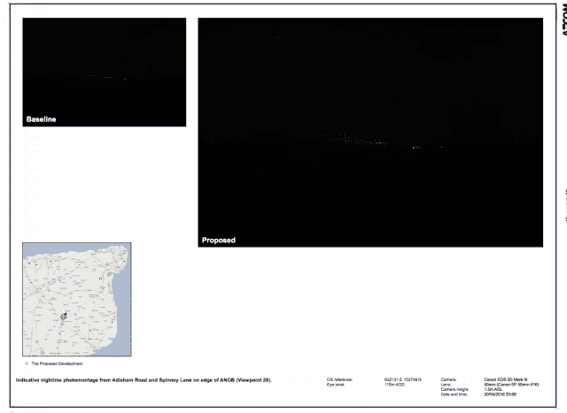

这是 Vigilant 在 DDC 网站上提交的数十个文件中的一个文件的数十个页面之一。左边是无 HFT 的景观；右边是有 325 米高塔的景观。

当然，Vigilant 和 NLN 都有一个主要的论点：“对当地社区的利益” – 主要是：钱。新的支持塔将为社区提供许多利益：为 Academy FM 提供广播设备；为 Phoenix Centre 提供宽带连接；为 Sandwich Technology School 提供教育支持；以及为罗马要塞改善游客体验提供 10 万英镑的财政支持（实际上，罗马要塞的官员不希望要塔围绕要塞，但如果 DDC 允许建造一座塔，他们会接受这笔钱）。Vigilant 表示，至少将有 200 万英镑“转移到”当地社区“在项目的整个生命期内”，*即* 20 年。这意味着每月 8333.33 英镑，如果你仔细想一想并不算很多 – 当然，我假设公司也必须支付在他们寻找地点建立支持塔的地主的租金 – 我找不到这方面的数据，但是将每个月的 8333.33 英镑与 Vigilant 和 NLN 每个月在比利时 Oostduinerke 支付的 20,000 欧元（Vigilant）和 40,000 欧元（NLN）的费用进行比较，用于在现有建筑物上安装卫星接收器（如果你想了解更多关于 NLN 支持塔的经济利益，请阅读[此](https://planning.dover.gov.uk/online-applications/files/A13A5589D7CA339E38166A14F737C457/pdf/16_00524-NATHANIEL_LITCHFIELD_AND_PARTNERS-1253774.pdf)）。也就是说，无论 DDC 议员今晚决定（还是不决定），Vigilant 都已经向当地学校捐赠了成千上万美元，这是一种友善的姿态。

如果居民、环保人士和飞行员不得不对抗建立的支持塔，Vigilant 和 NLN 也必须对抗彼此。例如，在 2016 年 12 月 2 日，Vigilant 向 DDC 发送一份文件，其中批评了 NLN 的支持塔，称 NLN 忘记在其支持塔上提出航空警示灯（以防 Manston 机场重新开放），NLN 选择的位置对候鸟来说不好，NLN 的支持塔会靠近 Richborough 罗马要塞等等。游戏就是这样：我们可以预期到两个几乎相同的支持塔不会被允许在完全相同的区域内，更好的项目预计会获胜，所以 Vigilant 和 NLN 不得不对抗。我们会在今天晚些时候看到谁会获胜，如果有获胜者的话。

噢，对了：除了真实的本地经济利益外，Richborough 的一个交易公司拥有风帆的好处是什么？简单问题，简单回答：约`5 微秒`。这意味着 DDC 议员将不得不决定是否，就像一个竞争对手所说的，“*盯着一个 320 米高的风帆 20 年是否值得帮助交易公司赢得 5 微秒*”。棘手的问题。让我们过分简单化，假设在香蕉国土地上设置一个风帆的总成本将是 500-600 万英镑（建设、社区外展和福利、碟子、法律事务等）；这意味着省下*百万分之一秒*的成本约为 100 万英镑。这对于如此短暂的时间来说是一大笔钱……或者不是--这取决于您可以在这样的项目上花费多少钱，并且当然取决于您因节约 5 微秒而能赚多少钱（我想是很多吧？）。

##### 风帆共享

许多公众和官方评论迫切要求 Vigilant 和 New Line Networks 共同合作建立一座风帆，因为为了两个相同的目的竖立两座相同的塔是非常愚蠢的。似乎 NLN 和 Vigilant 已经商谈了一年，但两家公司之间仍存在分歧，所以他们从来没有就一个项目达成一致，即使微波提供商麦凯兄弟公司官方同意“与”Vigilant 合作（这意味着 Vigilant 和麦凯可以共同分享风帆，甚至共同为它买单），即使另一家微波提供商潜在网络现在似乎正在与 Vigilant 合作，因为他们刚要求 [Ofcom 的许可](http://spectruminfo.ofcom.org.uk/spectrumInfo/licences?googloc=(51.13444697493746%2c+2.677145004272461)&code=301010&se=(51.13347751477528%2c+2.678689956665039)&googoffset=0.1&nw=(51.13541641474592%2c+2.675600051879883)&unit=GHz&ne=(51.13541641474592%2c+2.678689956665039)&service=Fixed+Links&sw=(51.13347751477528%2c+2.675600051879883)&licenceNum=1106475&submit=Find%20licence) 来建立 Richborough 电站-Oostduinerke 路径。可惜 Vigilant 和 New Line Networks 之间没有达成协议，这对他们两家公司都可能不太好（我想这个观点将在一会儿讨论）。

点击放大

##### 多佛郡议会官员的建议

上周，DCC 官员发布了其关于两家风帆的建议。毫不意外，官员建议要拒绝这些申请。以下是理由：

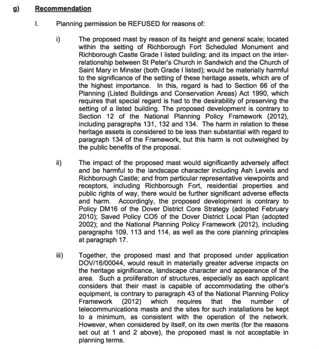

DDC 关于 NLN 风帆的官员

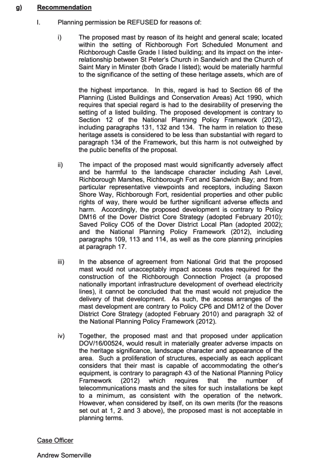

DCC 官员关于 Vigilant 风帆

我们将在一个小时内看到 DDC 議員的意见（他们可能会做出其他决定）。 唯一奇怪的是，警觉应用程序明显比 NLN 应用程序更好（我仍然认为 NLN 来 Richborough 只是为了让 Vigilant 感到恼火，以便不在“香蕉土地”上建起*任何一个大型支撑物*），而 Vigilant（与 NLN 不同）具有竞争优势：他们愿意与麦凯、潜在和其他第三方合作。 在今天晚些时候再讨论所有这些。

##### FROM RICHBOROUGH TO CHICAGO…

2016 年 5 月 18 日，麦凯兄弟公司首席执行官斯特凡•泰克在芝加哥 Terrapinn 交易展上发表了一次演讲，主题是 “交易所与网络：确定性与速度之间竞争日益加剧”（如果您对微波业务和光速感兴趣，可以在此观看视频[点击这里](http://www.mckay-brothers.com/exchanges-vs-networks/) – 顺便说一句，最有趣的部分是第二部分，不是关于微波的）。

某个时候，Stéphane 开始讨论 Vigilant 和 NLN 寻求在 Richborough 建立的“*新埃菲尔铁塔*”。 在解释 Oostduinkerke-Richborough 路径将是 100 公里（与从敦刻尔克到多佛的麦凯路径为 70 公里）之后，再经过 *两*秒的沉默（这对于微波供应商来说真的是很长的时间 ;)），他对于埃菲尔铁塔说：“*这当然是疯狂的…如果你问我*”。 当然这是疯狂的，好像 NLN （作为一家供应商）被允许在那里建立一个支撑物，他们应该比 Mckay 更快，这对麦凯的客户来说不是好事。 他补充说，他希望当地社区/政界人士迫使 Vigilant 和 NLN（以及他们的竞争对手，包括麦凯）一起寻找解决方案，并建立一个支撑物（现在我们知道这不会发生）。Stéphane 对蒙特利尔公司在 Richborough 管理他们的项目的方式表示：“*他们说，‘看，以前看起来像个狗屎一样’* [以前的 Richborough 电站区域] *…所以我们没有做坏事*” – 我不会用这些话，但这是一个很好的总结。 然后 Oostduinkerke 和这个博客出现在屏幕上：

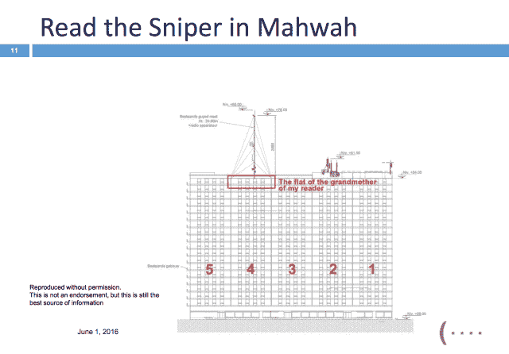

谢谢兄弟

当 Stéphane 在芝加哥讲话时，他不知道维杰拉特公司全球网络总监埃里克·贝勒里弗先生在房间里听着他说话，而埃里克很高兴看到一些与会者看着他，而 Stéphane 说 Vigilant 在 Richborough 项目中“*疯狂*”。 这是两个激烈（但公平）竞争对手之间的有趣时刻。

##### … 到 OOSTDUINERKE

上面的照片是 Oostduinkerke 的“21”大楼，Vigilant 和 NLN 都在争夺在屋顶安装天线的地方（再读一遍[第 3 集](https://sniperinmahwah.wordpress.com/2016/02/12/hft-in-the-banana-land-part-iii/)，我在那里解释了 Vigilant 在第四部分楼顶上安装小天线将会就在一个 Optiver 家庭成员所拥有的公寓的上方建起，这纯属巧合，Vigilant 不知道，他们可能在读到这篇博客时真的笑了）。NLN 正在与第一部分进行讨论，而 Vigilant 正在与第四部分进行讨论。Vigilant 和 NLN 都提交了规划申请；看起来第四部分仍在通过一家法律公司审查与 Vigilant 的合同，而 NLN 已获得当地政府批准在 2016 年 12 月 21 日（送给该部分居民的圣诞礼物）将 2 个微波天线安装在第一部分楼顶上：

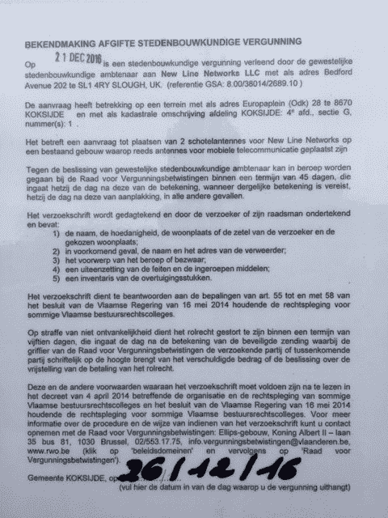

令人惊讶的是，当地电视台报道了 Richborough-Oostduinkerke 的故事（[video](http://www.focus-wtv.be/nieuws/beurzen-wisselen-gegevens-uit-antennemast-oostduinkerke) in Dutch），并对市长进行了采访，市长基本上表示，由于天线塔太高，第一次 Vigilant 申请被拒绝，因此 Vigilant 提出了一个更小的塔，并且市长还表示他不会对 HFT 天线征收比平常更多的税款-比利时人真酷。这里是市长站在“21”大楼前的照片：

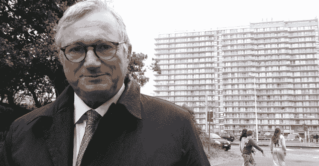

在 Oostduinkerke，更有趣的是，Section 4（警惕组织）于 2016 年 2 月接到一位拥有“*难以仿效的北欧口音*”的家伙的电话，他想了解那里的情况，不久后他发来这样的话：“*我知道你们已经与警觉公司签订了租赁选择协议，我想知道你和你的律师是否愿意与我们就租赁选择协议的条款以及我们可能为你们协会和建筑中的其他协会增加的价值进行交谈。让我直截了当地告诉你：我们对这栋建筑的展望是尝试从每个协会租用所有可用的地方。在接下来的两年里，我们不希望在建筑上安置任何设备，或者做出任何改变。我们只是想为这种租赁支付给你和其他协会一个适当的费用*。”。嗯。 2016 年 3 月，Section 4 接到另一通电话，一位比利时承包商说他代表一个为“*美国公司附属*”工作的波兰家伙打来的电话，他问这样的问题：“*你认为我们可以问加拿大公司，他们是否允许我们在他们的支柱上放置我们的碟子吗？*”，这有点奇怪（为什么他们不直接联系警觉公司呢？）。另一件奇怪的事是，Section 3（在这个时刻之前并未涉入到故事中）向 Section 4 发了一封挂号信，由一名律师签署，称 Section 3 希望阻止 Section 4 接受警觉公司的碟子。Oostduinkerke 的争吵开始像是《达拉斯*，现在看起来更像一部西部电影。

##### 警觉公司的计划 B？

惊人的是，在 DDC 官员于 2017 年 1 月 17 日建议拒绝 Vigilant 和 NLN 支柱后的第二天，一个新的规划[申请](https://planning.dover.gov.uk/online-applications/applicationDetails.do?activeTab=documents&keyVal=DCAPR_230862)被批准了，不在 Richborough，而是在 Tilmanstone，在 Swingate 和 Richborough 之间。该申请是由 Arquiva（一家在英国拥有多座塔，包括 Swingate 塔的电信公司）代表提交的。Arquiva 要求对“*现有格子塔进行 5 米延伸，并在扩展的塔上安装 2 个传输碟*”。

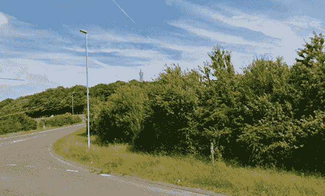

Tilmanstone 的塔

鉴于申请文件中记录的碟子的方向，这确实闻起来像 HFT，因为一个碟子正在看向 Dunkerque，另一个看向 Slough（在频道周围工作的唯一公司与此类路径有关的都是 HFT 相关的）。不幸的是，2016 年 11 月提交的文件中提到了“一个新客户”，没有公司名称 - 而大多数时候都可以找到寻求新碟子的 HFT 公司的名称。我想这家公司想保持低调-或者他们不想让像我这样的人发现 Tilmanstone 发生了什么。但是，2016 年 12 月 5 日，安全合规证书在 DDC 网站上下载，然后...

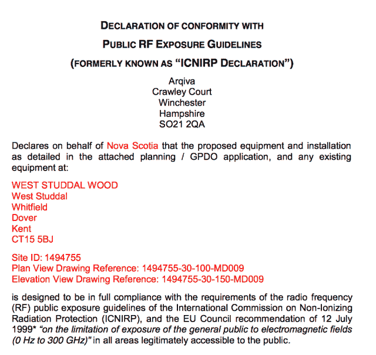

© 多佛区议会

… 出现了一个名字，新斯科舍，新斯科舍是 Vigilant 的别名。抓到你了;) 现在我可以在地图上加上一个新的位置，Tilmanstone。

点击放大

所以，看起来 Vigilant 在 Richborough 的塔被 DDC 议员拒绝的情况下，有一个跨越海峡的 B 计划。从技术上讲，用两个较小的塔穿越海峡肯定更困难（这也是 Vigilant 希望将塔延长 5 米的原因），与他们在 Richborough 希望的 322 米高塔相比，但至少他们可以确信居民不会抱怨，也不会有人问起*Lotus corniculatus*的看法。Tilmanstone 不像 Richborough 那样接近直线，但与 Vigilant 建立的 Dunkerque/Doudekerque-Swingate 路径相比，要好一点（他们节省了 1 微秒吗？还是半微秒？）。看起来如果 Richborough 的塔被拒绝，这是一个安慰奖。

##### NEW LINE NETWORKS 的最后一步动作

在今天的投票前两天，即 2017 年 1 月 24 日，New Line Networks 提交了最后两份文件。[其中一份](https://planning.dover.gov.uk/online-applications/applicationDetails.do?activeTab=documents&keyVal=DCAPR_228292)对 Vigilant 的申请提出了几点质疑：

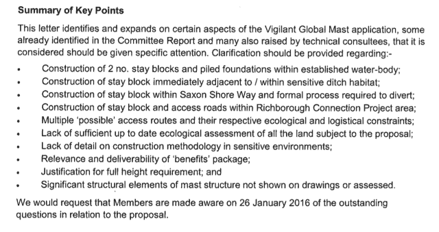

超出技术上的争论以及其他方面，最有趣的一部分是这个：

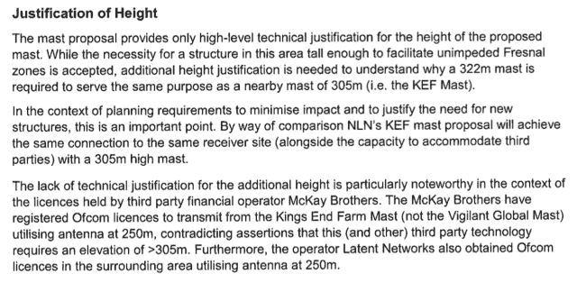

首先，这是对 Vigilant 去年声称 305 米高的塔太矮的回应。这是一个公平的观点，因为 305 米和 322 米之间并没有多大的差异，两座塔都应该能够容纳不同的天线（毕竟，大多数竞争对手都使用更矮的塔穿越海峡，除了 NLN 在 Houtem 拥有 243 米高的塔）；也就是说，NLN 也表示他们已经准备好扩建他们的塔，使其高度也能达到 325 米。然而，关于麦凯兄弟的论点有点牵强：1/ 如果麦凯需要的 Ofcom 许可确实是从 Kind Ends Farm 的 NLN 塔到 Oostduinkerke 的路径，那么许可可以轻易地更改以适应 Vigilant 的塔，2/ 麦凯和 Latent 都想在 250 米处放置他们的天线有点过分，因为当运营商申请 Ofcom 许可时，直到天线被安装，天线在塔上的确切位置大多数时候都是近似的。

The other last [file](https://planning.dover.gov.uk/online-applications/applicationDetails.do?activeTab=documents&keyVal=DCAPR_229267) NLN submitted to the DDC is a 40-page (!) document defending their mast in Kings End Farm and the way they would create a “Community Interest Company” (CIC), a is a limited company which is created for community benefit.

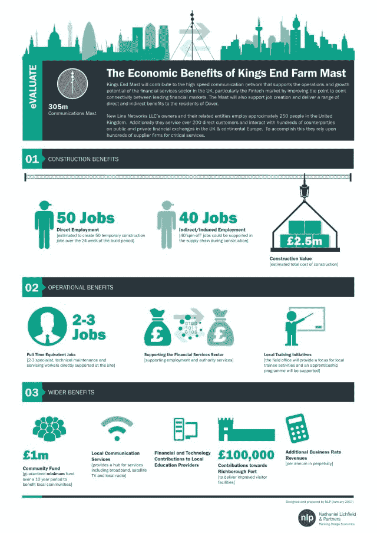

NLN “*propose that 50% of the net revenue generated from the lease will be made available to the local communities*”. “A*s a minimum, we would guarantee £100,000 per annum being made available through the CIC, to the benefit of local people*” and “*if, for example, two additional financial network providers were to take up space on the mast, we estimate that the fund would provide an annual sum of £244,534 to the local community*”. “*After a lengthy discussion*”, NLN “*agreed that the six parish councils* [impacted by the mast] *would each receive a fixed proportion of net revenue, with the remaining funds allocated according to parish population. Specifically: – 5% of the net revenue allocated as a fixed sum to each Town/Parish Council; – the remaining 70% divided amongst them according to population size*”, as shown in this slide:

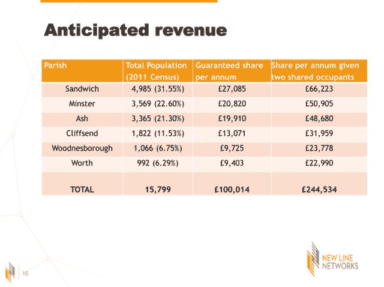

“*Should the application for the KEF Mast be successful, the Community Interest Company will enter into a collaboration agreement with the operator of the Mast* [NLN] *which will regulate the distribution of funds, embed the agreed commercial terms to provide income for the CIC, and distribute income for the benefit of the community*”. But that’s not sure money will be enough to convince people and the DDC councillors. NLN requests that a verbal update is made at the committee meeting today. We will see.

##### THE LAST TRIP

I came from Brussels to Dover first by car (so I visited for the last time the HFT towers in Flanders, including the Houtem tower where all this story started), then I took a ferry from Calais to Dover and I arrived at the Ramada hotel which is near the DDC offices where the meeting will start in 45 minutes. This is the only hotel in the surrounding area, so I guess other people involved in the HFT world are there too. Perhaps I’m surrounded by an army of HFTs, who knows? Now it’s time to walk to the DDC offices. I’ll try to live-tweet the meeting if I can.

HFT dishes in Houtem, Flanders, Belgium. 01.26.2017

##### POST-SCRIPTUM

The Dover District Council refused both the masts. Vigilant: nine councilors against, one for. New Line Networks: ten councillors against, ZERO for. Crazy end for the *HFT in the Banana Land* story. More in a last episode soon.
