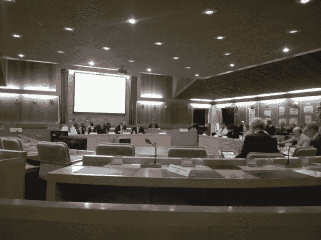
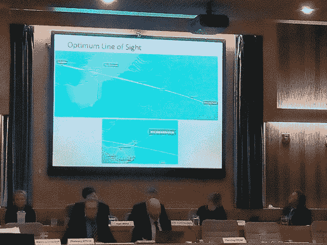
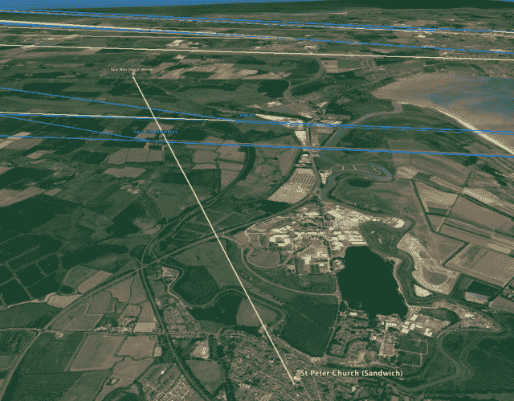
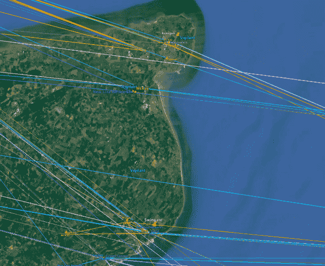

<!--yml

类别：未分类

日期：2024 年 5 月 18 日 14:09:29

-->

# 香蕉乡的 HFT | 第六部分–Mahwah 的狙击手和朋友们

> 来源：[`sniperinmahwah.wordpress.com/2017/01/30/hft-in-the-banana-land-part-6/#0001-01-01`](https://sniperinmahwah.wordpress.com/2017/01/30/hft-in-the-banana-land-part-6/#0001-01-01)

这是《在香蕉乡的高频交易》的最终篇章，或者说*小英国镇对抗两个大型 HFT 塔的案例*。对于寻求在里奇伯勒建立两座巨大支架以改善斯洛特-法兰克福微波路线的“高频交易”/网络供应商公司 Vigilant Global 和 New Line Networks，在这里并没有一个**快乐的结局**。上周四，多佛地区的议员们遵循规划官员的建议，拒绝了这两座支架。这是一个有意思的时刻（在我进行实况推特会议时打字出现了错误）。在这里重要的是要明白，关于支架的辩论*并不是* 关于市场结构、速度、军备竞赛、需要节省几微秒进行套利（或其他）等等。一个推特评论说“*如果 SEC 和国际监管机构在交易所希望出售速度时也做了多样的调查*”，但是在多佛的会议上只是关于规划申请：议员们必须决定是否要建立一道 2 米高的边界围栏，安装一个停车场收费机，建立一个门廊，形成一个“朱丽叶式”阳台，在所有这些之中，他们还必须决定里奇伯勒两个几乎相同的重型建设项目。我一直关注这些支架一年多的故事是正确的，因为这里最有趣的是 HFT 活动可能会对生活在香蕉乡附近的人们的日常生活产生影响。

主席（及其团队）站在场景的中心，而不同的议员则在周围。在左边，你可以看到一些为了发言“反对”申请而准备的座位，右边则是为那些想发言“支持”的人准备的（几乎没有）。对于每个申请，DCC 只允许一个人对项目发表意见，也只允许一个人支持。每个人只有 3 分钟来提出自己的看法（这很短）。毫不奇怪，当一个人为修建 2 米高的围墙辩护时，最近的邻居要求发言反对围墙。话虽如此，当两个女人在房间的右角开始争吵时，邻里之间的争吵是和平的。每个人都对每个申请有着明确的观点，大部分时间议员们都遵循官员的建议。会议在下午 6:00 开始，半小时后，议会决定在讨论 Vigilant 和 NLN 桅杆之前休息片刻。然后负责规划的官员带着两个大文件夹进了房间，里面装满了申请人提交的所有文件（这些文件我已经耐心阅读了一年）。

官员从 Vigilant 桅杆开始，这是在 2016 年 1 月首次申请的。房间里非常安静，Vigilant 团队、麦凯兄弟公司的人、New Line Networks 公司的人、我、Bass de Banaan 和其他邻居们都静静地听着官员的讲话。

DDC 官员描述了 Vigilant 应用程序（香蕉土地区域，需要光学视线在 Slough 和 Frankfurt 之间传输数据，322 米的铁塔，其他塔会偏离 Slough 和 Frankfurt 之间的直线等），并迅速提出了关于这样一个巨大铁塔后果的问题。简而言之，该官员总结了他在其[报告](http://moderngov.dover.gov.uk/documents/g2374/Public%20reports%20pack%2026th-Jan-2017%2018.00%20Planning%20Committee.pdf?T=10)中写的大部分内容：居住在那里的大多数人反对这个塔; 这将成为景观中的一道眼骗; 许多政府/机构对 Vigilant 关于生态问题、对罗马堡和曼斯顿机场可能重新开放、对新国家电网项目等的说法持不同意见。该官员还谈到了桑威奇圣彼得教堂。他没有详细说明，但圣彼得是个好故事：“*理事会的文物官员更详细地考虑了桑威奇圣彼得教堂的背景。多佛区文物战略将教堂定义为具有杰出意义，并指出这些建筑对历史风景和更广泛的乡村环境的美学的贡献具有价值； 它指出’农村教堂的尖塔经常可以看到很远的地方，是当地被认可和重视的地标*’。”在西方世界，很长时间以来最高的建筑物是教堂塔楼，它们需要一种视线网络。该官员：“*从圣彼得教堂的观景台上，可以遥望向北，看到敏斯特圣玛丽教堂。在这个景观中，拟议的建设将吸引人们的目光，打破圣彼得和圣玛丽之间的相互关系*。”这里有两条视线之间的冲突路径：一条是两座古老教堂之间的，另一条是两座电信塔之间的：“*这会对这些教堂的背景意义造成一些伤害，在不太重要的范围内*。”官员写道。不要触碰上帝的网络。

随后，官员在他的讲话中进一步深入：Vigilant 和 NLN 在一个桅杆上不能达成一致是一个不好的迹象，申请人承诺的所有利益“*与这样一个巨大桅杆所涉及的问题相比是微不足道的利益*”。这时对 Vigilant 来说听起来不太好。官员总结讲话，第一位发言者被邀请发言。据我了解，他是当地居民，一名退休工程师，他发表了一篇奇怪的 3 分钟反对 Vigilant 桅杆的讲话，称 HFT 只是“*计算机化的赌博*”，这种活动可能像次级抵押危机一样危害市场，他有时还引用了 2012 年的骑士资本公司的失败案例——这很讽刺：发言者说这样的桅杆会提高速度并产生不良后果（一个新的骑士之梦），但他似乎忽略了这里的 Vigilant 竞争对手，New Line Networks，是骑士-格克（现在被称为 KCG）和另一家交易公司 Jump Trading 的合资企业。不管怎样。之后，一名 Vigilant 代表进行了他的 3 分钟讲话，并支持了这个桅杆（简而言之：“*我们已经为这个项目努力了 18 个月*”，“我们提议 NLN 共享，但他们拒绝了，堡垒没有问题，这个桅杆将是临时的*[尽管是 20 年]”，“我们提供了很多贡献，我们选择了这个地区来减轻后果*”[确实]，“等等”。

官员的第一反应是：“*我不改变我的意见*”。然后，一位第一副议长说：“*认真的，那看起来怎么样？*”（*即*，这样的桅杆很丑），另一位议员谈到了塔楼对景观的重大影响，另一位谈到了对曼斯顿机场的影响，还有一位谈到了“*分层*”，总之，所有的议员都说他们没能领会这样的桅杆能为社区带来真正的地方（和全国）利益。“*全国利益微不足道，公共利益比私人[高频交易]利益更重要*” 地方发展委员会主席说。十位议员投票，铁锤落地：9 票反对桅杆，一票弃权。轰隆。 Vigilant 有最好的案例，他们努力解决了 DDC 提出的所有问题，但这还不够。故事结束。严酷。

然后来了 New Line Networks 的发射塔。我就不详细叙述了，因为官员几乎提出了相同的陈述。最好的部分是，当他说 NLN 声称“*Houtem 的塔不足以在斯劳和法兰克福之间实现完美路线*”时（听到这里我想了：“于是，Jump 为什么要花 500 万美元购买 Houtem 的塔，如果它不是那么完美呢？”）。此外（这是一个重要的法律问题），官员强调了 NLN 未能正确理解一个名为“[S106](http://www.pas.gov.uk/3-community-infrastructure-levy-cil/-/journal_content/56/332612/4090701/ARTICLE)”的晦涩事物的目的（Bass de Bannan 在那方面是 100%正确的），以及关于社会利益公司的法律问题（它会在从 NLN 收集资金后通过当地机构流动之前）。官员意图的是 NLN 没有做好工作（NLN 在会议前两天提交了一个最后的长达 40 页的[文件](https://planning.dover.gov.uk/online-applications/applicationDetails.do?activeTab=documents&keyVal=DCAPR_229267)，回答了过去数月中提出的问题，这证明了）。

接下来是会议中可能是最有趣的时刻，（至少对于议员来说）。猜猜谁要求发言反对 NLN 发射塔呢？当然是 Vigilant，议员们大笑了，因为 Vigilant 代表现在从左角（反对 NLN）发言，而刚几分钟前还在右角（支持自己的发射塔）。简而言之，Vigilant 代表用着（有时候）与 DDC 官员几分钟前反对 Vigilant 发射塔一样的论点批评 NLN 发射塔。怪异的时刻，哪怕 Vigilant 有些观点是正确的。然后来自芝加哥的 New Line Networks 运营总监发表了 3 分钟的演讲捍卫其发射塔。我不羡慕他的位置：DDC 刚刚坚决拒绝了 Vigilant 的发射塔，他正试图说服人相似的在 Richborough 的发射塔对于英国当地以及伦敦/金融技术社区在脱欧情境下是重要的。在 3 分钟内节省几微秒，面对一群愤怒的人，是挺难的。然后 DDC 主席说“*我们拒绝了 Vigilant 的申请，出于同样的理由，我们也应该拒绝这个*”，一个工党议员对于这两个申请不完全相同的事实发出了讽刺的话语（室内响起笑声），议员们投票，新的大锤落下：10 名议员反对 NLN，甚至没有一人弃权。零。

频道周围的情况，一月十七日

在某种程度上，Vigilant 取得了胜利：他们至少有一名议员没有投票反对他们的天线设备 - 这是对他们更好的工作的一点认可。但总体上，“HFT”公司受到了打击。 Vigilant Global 和 New Line Networks 希望在偏僻的地方建立两座巨大的天线，以节省微秒，多佛区议会则回答道“*再见*”（我喜欢官员微笑）。他们只是不希望这玩意出现在他们的后院。风景 *对抗* 金钱。这太离谱了。这就是“HFT 在香蕉地”衍生版的结局。我猜竞争对手麦凯兄弟公司（以及其他 HFT 公司）会很高兴。当然，公司可以提出上诉。我不知道他们会不会这样做，但根据上周四在多佛发生的事情，为 *两个天线* 提出上诉会很不得体，他们肯定会再挨一顿打击。Vigilant 现在正在 Tilmanstone 周围游荡，其他人正在其他地方改进他们的网络 - 延迟取决于很多因素。是时候让 *角果越橘* 自己呆会儿了。会议结束后，我和麦凯兄弟和 Vigilant 团队在一家麦当劳餐厅（DDC 办公室附近唯一的一家）碰面。他们是友善又聪明的人，我相信他们会找到除了在两座教堂之间竖立一座 300 米高的天线之外的解决方案。祝他们好运。  

寻找 HFT 公司
