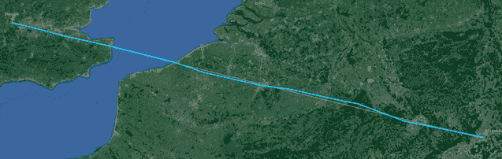
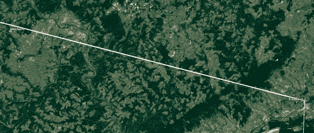
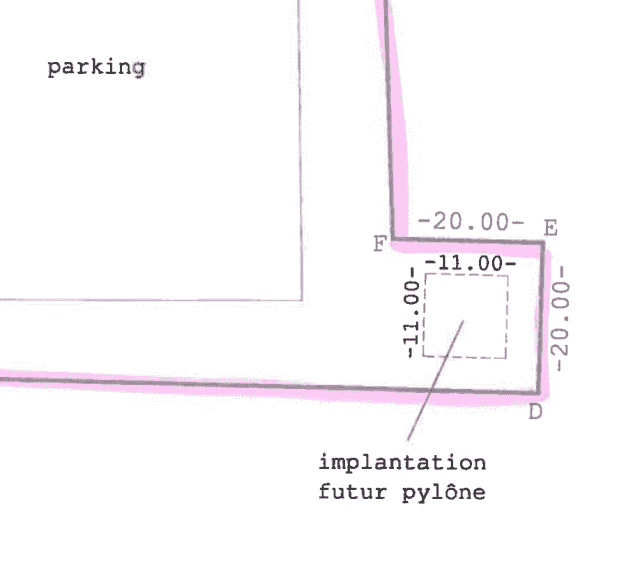

<!--yml

分类：未分类

date: 2024-05-18 14:09:17

-->

# 香蕉土地的高频交易 | 马歇尔的狙击手及其朋友

> 来源：[`sniperinmahwah.wordpress.com/2017/05/24/hft-in-the-banana-land-part-7/#0001-01-01`](https://sniperinmahwah.wordpress.com/2017/05/24/hft-in-the-banana-land-part-7/#0001-01-01)

这个“香蕉土地高频交易”系列的意外新篇章，也许可以称为“我家后院的高频交易 | 第 2 季第 1 集”，或者“第 22 季第 45 集”，更简单地说，就是“去接收信号，更快地获取信号”。这个博客已经静静了一段时间，因为我真的没有时间在这里写，但这并不意味着没有什么可说的（事实上，有很多要写的，但如我后来会解释的那样，我决定撤回“我家后院”的第 2 季，因为我会写一本关于所有我对高频交易所喜爱的无线网络的调查的整本书）。但我忍不住要添加这个“香蕉土地的高频交易”的新篇章，尽管它不是关于香蕉的 —— 而是发生在里奇伯勒的事故的后果，在那里两座巨型的“警觉”和“新线网络”信号塔在多佛地区议会（读前一篇[章节](https://sniperinmahwah.wordpress.com/2017/01/30/hft-in-the-banana-land-part-6/)）的严厉拒绝下，他们搁置了那里的计划。 

这是我对这个情况的理解的故事。让我们从法兰克福到斯劳开始。我按照加拿大公司“警觉”的路线，因为他们在里奇伯勒标出他们在法兰克福（FR2 数据中心）和斯劳（LD4 数据中心）之间几乎完美的直线之前竞标：

这是“警觉”塔的详情…

点击放大

… 从法兰克福开始逐一讲述：

从法兰克福的路径通向韦伯恩，在那里有一个高塔，完美地靠近 FR2 和 LD4 之间的直线（古老的德国工业）。然后从韦伯恩，信号到达边境的西默拉特，即比利时-德国边界：

看起来大部分微波公司（警觉，Optiver，麦凯兄弟等）在西默拉特放置天线。[维基百科](https://de.wikipedia.org/wiki/Fernsehsender_Monschau) 关于这座塔的页面很有趣。 它说：“*2013 年 9 月 6 日进行了对该发射塔的加高，对加高的确切原因和目前的总高度并不清楚。在此之前，总高度为 66 米*。” 简而言之：“*2013 年 9 月该塔加高*”，就像我在德国一份[报纸](http://www.aachener-nachrichten.de/lokales/eifel/eifeler-fernsehturm-wird-aufgestockt-1.651891)上找到的照片上显示的那样。

维基页面称“*扩建高塔的确切原因尚不清楚*”... 但是解释非常简单：不再有足够的空间容纳所有的 HFT 玩家，因此高塔被改建以容纳所有的天线，就像这个([维基](https://de.wikipedia.org/wiki/Fernsehsender_Monschau))图片所示，它是在高塔重建后拍摄的：

Simmerath 中的 HFT 天线共享

从 Simmerath，Vigilant 信号经 Welkenraedt 然后到 Tienen：

在[antennasite](http://theantennasite.com/locations/welkenraedt-chemin-du-moulin-vent/?a=gallery)上可以观看 Welkenraedt 上的 Vigilant 天线; 在 Tienen，它们可能在这个奇怪的水塔上：

从 Tienen 到 Merchtem 和 Egem 的路径如下:

由于 Merchtem 塔距离我在布鲁塞尔新家 6 公里远，我几个月前去参观了这座塔，它看起来像这样：

现在是 Egem 塔，它是比利时最高的建筑物（如果你想了解更多关于 Egem 的信息，请再次阅读这篇老[帖子](https://sniperinmahwah.wordpress.com/2015/02/03/hft-in-my-backyard-the-last-tower/)，它讲述了我去那里的旅程，我本想在一个似乎是一个严肃道德的咖啡馆里喝一杯咖啡（？！）。

从 Egem，理想的 Vigilant 路线将前往 Oostduinkerke 的一栋建筑物（理想情况下非常靠近 FR2 和 LD4 之间的直线），然后前往 Richborough（参见“香蕉地的 HFT”之前的篇章）...

…但 Richborough 的 Vigilant 支柱被拒绝了。 Egem-Oostduinkerke-Richborough 路径是一条死胡同（至少目前是）;). 这意味着，从 Egem 出发的 Vigilant 路径必须向南通往敦刻尔克（或库代克尔布朗奇，在那里 Vigilant 在塔上有天线），然后再向北通往英国（在[Tilmanstone](https://planning.dover.gov.uk/online-applications/applicationDetails.do?activeTab=summary&keyVal=DCAPR_230862)处，Vigilant 将扩建一个小塔以跨越海峡 - 来自敦刻尔克港口的[谷物仓](https://www.cartoradio.fr/cartoradio/web/#bbox/2.27778/51.04194/2.27778/51.04194)在那里麦凯有天线？):

这是高频交易者不喜欢的路径类型：不是一条直线而是一个三角形，这意味着它们必须绕道行驶，这对延迟来说不是好事。这里最重要的细节是高频交易者无法通过 Oostduinkerke-Richborough 附近的路径直接穿越海峡；他们必须从（左右）敦刻尔克（或豪滕，在那里 Jump 花了 500 万美元购买了现在非常有名的巨大塔）穿过。因此结果是：如果你想从 FR2 到 LD4 建立最佳/最快的网络，你需要从法兰克福到（附近的）敦刻尔克有一条直线路径（以下图片中的红色大路径）：

所有竞争者反而称之为“南路”，而不是“北路”。多佛区议会关于里奇伯勒的决定使得“北路”被消灭，因此经营者需要改进“南路”。 这是这一集的真正开端。如果要从法兰克福到敦刻尔克（即“南路”）建立最佳路径，那就忘记辛默拉特（它太靠北了）。你需要在上方红框所示的更南边找到另一个塔：

你知道吗？在那里有这样一座塔：著名的 Signal de Botrange。 Signal 看起来像这样：

在比利时，博特朗峰因许多原因而闻名。首先，它是该国海拔 694 米的最高点。其次，它是比利时为数不多的滑雪胜地之一。第三（在我看来），这是比利时最美丽的地方之一。我去那儿几次，探索了"[High Fens](https://en.wikipedia.org/wiki/High_Fens)"或法语中的“Hautes Fagnes”，这是一个非常不错的自然保护区。

有一个关于博特朗峰的令人惊讶的故事：很长一段时间以来，比利时的最高点（实际上，也是卢森堡和荷兰的最高点）上什么都没有，但 1923 年，当地州长赫尔曼·巴尔蒂亚决定建造一个 6 米高的桥梯：“*[显然](http://www.atlasobscura.com/places/signal-de-botrange)，这个国家最高点仅低于 700 米，太诱人了，所以在 1923 年，在山顶上建造了一座 6 米（18 英尺）高的石质楼梯。从这个高度，在看似毫无意义的楼梯最高台阶上，游客可以从海平面上准确观察到地面高 700 米的水平*。”这件可笑的事看起来像这样：

十一年后，1934 年，一座观景塔建成，海拔高达 718 米：博特朗峰。现在这里是围绕博特朗峰的 HFT 的故事。我不记得是谁在三年前对我说，关于 HFT 在博特朗峰的一个新项目，但去年 12 月，有一家公司要求我不要在这个博客上分享我找到的关于这个项目的公开文件，因为公司不知道有多少竞争对手会知道正在发生什么。我答应了，并立刻开始寻找关于我直到昨天才能说的故事的情报。当我发现这段由当地电视台进行的市长的[视频采访](https://www.televesdre.eu/www/video/info/waimes-une-nouvelle-tour-de-50-metres-pour-favoriser-les-operations-boursieres-entre-londres-et-francfort_82893_89.html)时，我感到惊讶：

请注意，这次采访是在 2013 年 11 月进行的，视频的标题是“一座新的 50 米高塔以支持伦敦和法兰克福之间的金融业务”，我认为这是比利时对微波网络的第一次新闻报道（真可惜我之前错过了）。简言之，市长表示当地社区已经被一家加拿大公司（闻起来像 Vigilant）、一家美国公司（闻起来像 Jump，现在是新的 New Line Networks）、以及包括法国、荷兰和德国公司的财团（法国公司可能是 McKay Brothers，荷兰公司很奇怪 - 可能是 Optiver 或 Flow Traders，但这两家荷兰公司都不与 McKay 合作...）联系。市长解释说，不同的竞争对手想在 Botrange 建立塔，因为光纤速度太慢，所以 HFT 使用微波等。至少当地人清楚一些公司为什么需要新的塔... 市长还表示，由于总预算为€M2-3，将发出一份建议书。不清楚市长是否表示所有这笔钱都将分配给当地社区，但他似乎对这个项目非常满意，因为新的 50 米高塔将比 Botrange 任何其他建筑都要高。刷新记录！

所以，回到 2012 年，一些 HFT 公司已经潜伏在 Botrange 信号塔周围。看来在发布招标文件之前已经过了很长时间... 在 2017 年 3 月 3 日才发布了公开文件，链接在[这里](http://ted.europa.eu/udl?uri=TED:NOTICE:138020-2017:TEXT:FR:HTML)。在通常的乏味行政文件中（但我们从中了解到最低投标金额为€50,000/年），有一张 Botrange 信号塔的地图，标有未来塔的位置：

我用 **Google 街景** 进行了快速模拟（当然，获胜者将不得不在新的塔上放置周围信号塔的不同电信天线）。

竞争对手在上周五（5 月 19 日）之前提交了报价，昨天，市政学院开始打开信封。我打电话到当地办公室想更多了解有关报价的情况，但办事员告诉我，他们现在无法透露情况，因为市政会议（另一个行政学院）还需要讨论报价等等。我甚至无法得知有多少报价送到了博让特。但当地政府应该很快就会决定下一步的截止日期。谁会是赢家？可以假设加拿大公司、美国公司和法国公司都提交了报价，但也许博让特周围还有其他高频交易公司潜伏着...我们拭目以待。无论如何，高频交易公司希望出现在 Signal 上以更快地获取信号，这很不可思议。多亏了高频交易，比利时的最高点将比以往任何时候都更高，对于这样一个小国家来说，这相当酷！

与此同时，网络的另一侧，在豪滕，[@Nuklearexperte](https://twitter.com/Nuklearexperte/status/866772491552923649)在 Jump 的地面上尿尿玩得很开心。这就是当一个人喝太多比利时啤酒的后果...

