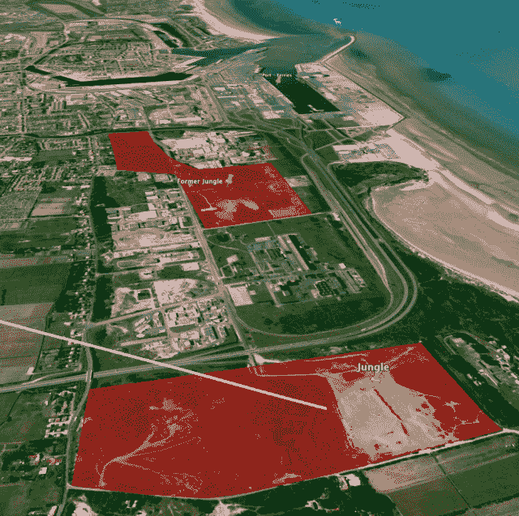
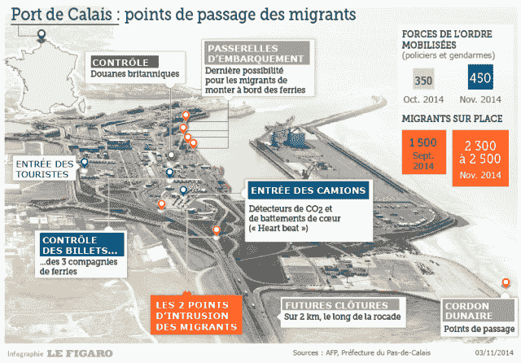
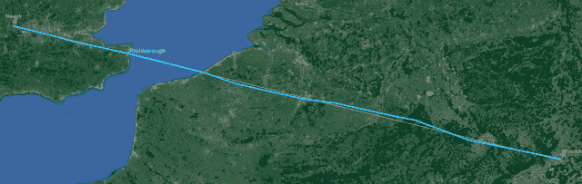
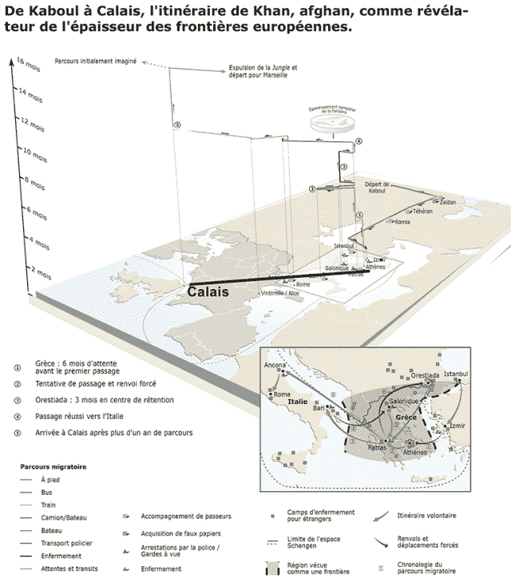

<!--yml

category: 未分类

date: 2024-05-18 14:11:50

-->

# 丛林中的高频交易 - Sniper In Mahwah 和朋友们

> 来源：[`sniperinmahwah.wordpress.com/2016/03/15/hft-in-the-jungle/#0001-01-01`](https://sniperinmahwah.wordpress.com/2016/03/15/hft-in-the-jungle/#0001-01-01)

*人们对地方的看法是怎样的？这个问题与人和地方一样古老，与人类对大地的依恋一样古老。也许，与家的概念一样古老，“我们的领土”与“他们的领土”，整个地区和当地风景都是人们投入感情的地方。[…]* 在人群流散和广泛的移民中，坚守地方并完全感知其中蕴含的美好变得日益困难，并且我预计，在未来的岁月里，这个问题可能在任何地方都被视为特权和礼物。* Keith Basso，《智慧坐落于地方》，1982

我不是僵尸的粉丝，但在失眠的情况下，看电视剧是一种放松的好方法。《行尸走肉》的第一集，第 6 季，一点也没有让人失望（对于那些不了解《行尸走肉》的人，这是关于人类幸存者的故事，他们试图在一个充满**行走者**的世界中活下去，**行走者**看起来像僵尸）。在这一集中，人类“难民”发现了一个被锁在一个旧采石场里的**僵尸**营地。

存在这样的危险：**僵尸**有可能从采石场逃脱，进入人类避难营地，这是自从第 5 季以来主人公们一直“生存”的地方，所以人类难民决定通过设置一条长途（有时还有围栏）为**行走者**方向引导的路径来释放**僵尸**。这个（在电视上变成了一个坏主意）想法是：疏散避难营地的区域内的**行走者**。

我们有这样的镜头，**僵尸**正沿着道路行走：

我脑海中首先想到的是：那真的看起来像在东欧用无人机拍摄的中东难民的视频，他们成群结队地走在田野中：

在*行尸走肉*中，其中一位英雄正在骑摩托车，把僵尸带过一条路……

…而在现实生活中，在马其顿，警察带着人类难民通过一条道路：

我不知道*行尸走肉*的编剧是否考虑到了移民，但我相当确定他们是考虑到了。毕竟，很多人认为逃离战争或独裁统治的人不是“像我们”的（因为他们主要是穆斯林，据说是贫穷等）。他们是“他者”侵入“我们的领土”。*行尸走肉*英雄们修筑栅栏和道路来抵御僵尸的方式，以及东欧一些国家修建栅栏来阻挡移民的方式是相似的。我不会分享我对欧盟（离我 2.5 公里外工作着的西装领带人）如何处理难民的政治看法（用三个词来说：这是可耻的）。我只想关注移民与高频交易（HFT）交错的领域：海峡。

###### 从香蕉乐园到丛林

在几微秒内，让我们退出[香蕉乐园](https://sniperinmahwah.wordpress.com/2016/01/26/hft-in-the-banana-land/)的 Richborough（第四部分将在本周晚些时候发布），来到海峡对岸的丛林。丛林是法国加莱的一个地区，数千名移民“居住”在这里。据说这是欧洲“最糟糕”的难民营地，3000 人（包括很多儿童）在泥泞中生存 - 两个月前曾达到 6000 人。

丛林现在看起来像一座城市（南部上周被拆毁）：

为什么这个棚户区位于加莱？因为移民想做高频交易商所做的事情：越过海峡。加来-多佛路径是大陆和英国之间最近的路径，这就是为什么世界上第一次微波传输测试发生在 1931 年加莱和多佛之间的原因，也是为什么难民在 2016 年在那里：因为它是最近的路径；因为那里有渡轮通往王国；因为欧洲之星停车场满是提供新世界的卡车（不值多少钱）。在丛林周围有许多越过海峡的路径-如果你很幸运，因为法国国家当局在关键地区设置了大量围栏，包括用来检查卡车是否携带人类的心跳传感器。

因为地理位置的原因，加来是中东一些移民去英格兰的结束点。这就是为什么丛林在那里的原因。现在让我们看一下难民的轨迹。在高频世界中，从一个交换到另一个交换携带信息的最佳技术（至少目前）被称为“微波网络”。根据我之前的详细描述，不同的竞争者（如 Optiver 或 Vigilant Global 等交易公司，或者 McKay Brothers 之类的微波提供商）都为了同样的目的而建立了自己的网络：成为两点之间时间最快的（这里，绕过我的后院，两点是：法兰克福，斯劳和巴西尔登）; 而速度更快意味着建立一个尽可能靠近两点直线的天线网络。这就是[香蕉土地](https://sniperinmahwah.wordpress.com/2016/01/26/hft-in-the-banana-land/)的故事，Vigilant Global 为什么要在里奇堡建立一座 320 米高的塔的原因：通过这个天线，公司将会得到一条非常接近法兰克福和斯劳之间直线的完整路径：

看起来难民有同样的问题：找到他们来自的地方到（比如说）加莱之间的最佳直线路径。这是一张描述来自阿富汗的年轻少年卡恩从喀布尔经由希腊到加莱的轨迹的图表。我添加了（在黑色）雅典和加莱之间的直线路径（这条直线穿过东欧国家，这就是围栏再次出现的原因）：

这里有另一个[图表](http://www.martingrandjean.ch/data-visualization-map-refugees/)显示了不同的难民路线。加莱是黑点，我们可以看到丛林似乎是许多线路的终点：

这里还有两张来自*[纽约时报](http://www.nytimes.com/interactive/2015/06/21/world/map-flow-desperate-migration-refugee-crisis.html?_r=1)*的图表；同样我添加了加莱，这是难民们认为是“黄金国度”之前的倒数第二步：

(关于这一点，我还加上了从大马士革到伦敦通过加莱之间的直线：)

微波网络和移民路线之间唯一的区别就是速度。汗从喀布尔到加莱花了整整一年的时间，而大多数从加莱丛林逃离的移民等待数月才有机会前往英国。经过漫长的等待之后，如果他们有机会闯进渡轮或卡车，他们将在*一个半小时*内越过英吉利海峡，而高频交易数据在*25* *微秒*内穿越大海。加莱（及其周边地区）现在是两个极端世界相遇的地方：难民的极端条件和高频交易者的极端速度。

###### 在丛林中的高频交易

2015 年 12 月初，我收到一位英国激进分子理查德的来信，他是[全球部落](http://theworldwidetribe.com)组织的志愿者。理查德还是一名博士研究生和自由经济学家，主攻频谱和电信。理查德和其他志愿者努力改善加莱丛林难民的生活，通过设置 WiFi 的方式。他们花了一个周末在丛林中竖起了一个小型天线，将其连接到 4G 移动网络。这个天线安装在一辆货车上（“*奇迹街拖车*”）。你可以在全球部落的[网站](http://theworldwidetribe.com)上阅读整个故事。

“*每个人都对互联网的前景感到非常兴奋。这不仅为他们提供了与家人沟通的方式，还能获取有关寻求庇护和与全球其他地区平等机会的信息。*” WiFi 很好，但理查德试图通过“*用微波链路将丛林连接到光纤网络*”来扩大其操作，以便难民们能获得更好的带宽。这就是我被联系的原因：因为我（被认为）对法国北部的微波连接有所了解。这一次，从事 HFT 工作将会实现真正的社会价值。

那时，理查德和他的朋友们有不同的选项来改善网络：与当地光纤运营商合作（加莱地区的工业区有很多这样的光纤运营商）；获取格拉夫林的商业光纤连接，并尝试通过微波中继到加来（格拉夫林是法国另一座沿海城市）；或者在城市西部的一座公共住房楼顶和丛林之间建立微波连接（“*这里的大多数塔楼都与丛林有良好的视线*”）。

他们想使用 Ubiquiti AirMax 设备，因为“*性能成本比非常优秀*”，“*5Ghz 是容量和性能的黄金点*”——相同的设备被一些 HFT 用于他们的网络。理查德提出了这些问题：“*怎样接近建筑管理员来安排使用屋顶空间？在法国共用塔架的流程是什么？是否有任何 HFT 公司愿意共享一些塔楼空间？*”考虑到我对 HFT 微波世界的探索，这些都是我可以回答的问题。我向我的“行业联系人”打了些电话，试图帮了一点忙（似乎 Ubiquiti AirMax 天线非常完美），但最终理查德和他的朋友们没有使用微波。他们与光纤运营商 Orange 达成了交易，提供 50Mbps 的固定线路，成本低廉，月费也低。那简直太完美了……直到活动人士发现“*为了遵守去年 11 月巴黎袭击后投票通过的法国反恐法*，*必须收集和存储每个用户的细节*”，因此他们不得不关闭网络，直到找到解决办法。他们最终找到了一种方法，通过使用廉价的云存储，网络重新恢复。这样大约 1500 名移民能够连接到互联网，获取来自家人的一些消息。非常出色的工作。

###### HFT 飞过丛林

“*HFT 公司中的任何一家愿意共享一些塔位吗？*” 即使“全球部落”行动人士们并不需要微波路径把互联网传送到丛林中，这个问题也很有意思，并且肯定是因为 HFT 公司在过去某个时候可能在丛林周围安装了天线。

如上图所示，您可以看到原来的加莱丛林（2009 年被摧毁）和现在的加莱丛林。在图片底部，离理查德所标识的建筑非常近的地方，我们有麦凯兄弟，以及在左边我们有 Jump Trading，New Line Networks 和再次出现的麦凯兄弟（图片右上方的大白线是从大马士革到伦敦的直线 – 我觉得有趣的是看到移民路线是如何与 HFT 的微波路径交汇的）。我在 2014 年通过探索[Cartoradio](http://www.cartoradio.fr/cartoradio/web/#bbox/1.80563602386458/50.9220905783711/1.93061293282567/50.9825870280941/7893)（法国无线电管理机构的公共网站）发现了这些名字，但现在大部分数据都不相关了（而且在 Cartoradio 上也找不到了），因为高频交易商有了更好的路径，我们稍后会看到。我非常确定麦凯兄弟本来会愿意共享空间，但他们现在已经不在加莱了。唯一可能在加莱的 HFT 微波提供商也许是 New Line Networks（通过对比 Cartoradio 数据和 Ofcom [数据](http://spectruminfo.ofcom.org.uk/spectrumInfo/licences?googloc=(50.95743491028871%2c+1.873244047164917)&code=301010&se=(50.95705978275052%2c+1.8736651539802551)&googoffset=0.0&nw=(50.957810034798605%2c+1.8728229403495789)&unit=GHz&ne=(50.957810034798605%2c+1.8736651539802551)&service=Fixed+Links&sw=(50.95705978275052%2c+1.8728229403495789)&submit=Submit+search&groupKey=2)），但很可能这些 HFT 微波路径在加莱现在已经是历史了。它们都搬到其他地方去了。因为，就像移民一样，它们也希望找到最完美的直线。最有意思的是，这些移民现在正向北移动，直到比利时，就像一些 HFT 微波网络曾经做过的一样 – 但原因并不相同。

这里有一张图片展示了多年来环绕英吉利海峡的 HFT 网络的发展情况：

在 2012 年至 2013 年，这些网络中的一些跨越了加莱到多佛/斯温盖特的英吉利海峡（这是老的历史悠久的微波路径）。在 2014 年至 2015 年，一些网络得到了更新，从顿开克（或格朗德-西恩特）到兰姆斯盖特（麦凯兄弟，Optiver），或者从霍特姆到兰姆斯盖特（Jump Trading/New Line Networks）：

而现在，2016 年，Vigilant Global、Jump Trading 和 New Line Networks（还有其他公司;)正努力跨越从 Oostduinkerke 到 Richborough 的槽道（香蕉土地的故事）。

他们搬到北方，因为他们（和/或仍然）必须找到最接近法兰克福和伦敦地区之间完美路线的最佳途径。

这真的很引人注目，因为这种从加来到敦刻尔克，然后到比利时（上方的白色箭头），从 2012 年到 2015 年的移动，正是一些移民在 2016 年在做的移动。一些移民，因为无法从加来（因为有警察检查站）通过槽道，正在试图到达其他可以藏身的地方。这就是在大辛斯自然保护区有另一个丛林的原因，即所谓的 Basroch 丛林，被视为比加来丛林“更糟”（我简直无法想象），距离 HFT 公司/微波供应商安装天线地点仅 5 公里。

这片丛林最近被砍伐，被一个[安置营地](http://www.ville-grande-synthe.fr/userfiles/file/campGS.pdf)取代。为什么会有大辛斯自然保护区的这片丛林？因为它靠近一座卡车停靠的加油站。但事情还没有结束。自从有些大辛斯自然保护区的移民没能闯过卡车的围栏，他们试图到达其他地方，不再是在法国而是在比利时（显然，比利时首相[写信](http://uk.reuters.com/article/us-europe-migrants-belgium-france-idUKKCN0V51DJ)给法国首相抱怨法国无法处理“他们”的难民—可怜的欧洲）。各种报纸文章证实，一些难民乘坐从法国-比利时边境到奥斯坦德的比利时电车，这意味着他们经过了 HFT 公司 Vigilant Global 和微波供应商 New Line Networks 计划安装天线的 Oostduinkerke 建筑。但其他移民似乎在乡间行走，到达[文尔纳](http://www.bbc.com/news/uk-england-31871532)（荷兰语名为 Furnes），那里有很多前往英格兰的卡车。

我熟悉 Grand-Scyne-Veurne 路径，因为这两个城市之间有一个名为 Houtem（属于 Veurne 城市）的小村庄，现在因为 Jump Trading 在 2013 年以 500 万美元购买了 243 米高的塔楼而变得出名，用于穿越海峡（该塔很靠近法国和比利时的边界）：

我非常了解这个地方，我可以确认，如果你想穿过法国和比利时的边界，这是完美而隐秘的方式。你只需走在宁静的田地里，那里没有篱笆，没有警察—只有比利时政府在 2013 年卖给 Jump 的这座巨大塔楼：

这就是移民们如何再次接触到高频交易世界的方式。很可能一些难民在这座塔周围越过了边界，显然他们从未想象过，这些塔上的天线指向英国，竟是为了一个高频交易公司在 25 微秒内穿越海峡。这里的巨大区别在于，通过向北走，难民们远离了大陆到王国之间的最短路径（加莱-多佛的路线），而 Jump 之所以选择比利时，是因为该公司可以实现最佳路径。难民和 HFT 天线在同一区域潜伏—同样的目的，但不同的时间; 两个极端的世界就在我家后面。我们生活在一个迷人的时代。
