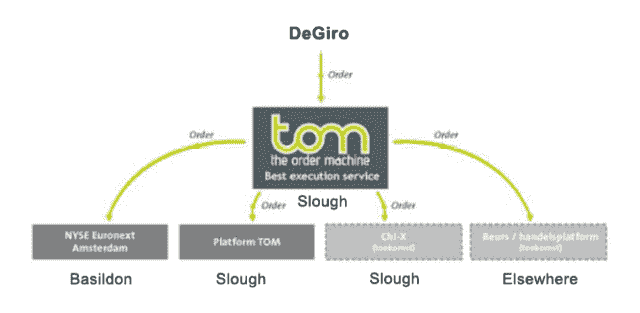
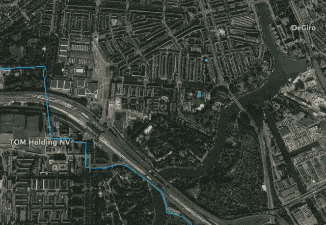
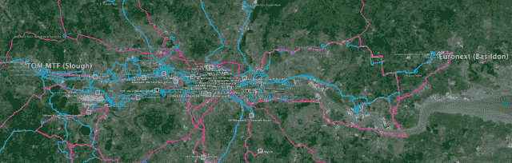

<!--yml

类别：未分类

日期：2024 年 05 月 18 日 14:14:30

-->

# HLT, as in “High Latency Trading” – Sniper In Mahwah & friends

> 来源：[`sniperinmahwah.wordpress.com/2015/06/01/hlt-as-in-high-latency-trading/#0001-01-01`](https://sniperinmahwah.wordpress.com/2015/06/01/hlt-as-in-high-latency-trading/#0001-01-01)

数周前，我接受了 VPRO 的两名荷兰记者关于高频交易的采访。他们想要谈谈伦敦和法兰克福之间的微波网络及他们所说的“延迟套利”。节目的第一部分在[这里](http://argos.vpro.nl/seizoenen/2015/afleveringen/09-05-2015)（仅限荷兰语），第二部分在[这里](https://www.youtube.com/watch?v=6QO9DFUsA7U)（有视频和英文字幕）。后者侧重于我之前从未听说过的“延迟套利”：一项由荷兰经纪商 DeGiro 进行的研究，讨论了一个名为 TOM 的荷兰智能订单路由系统，该系统据说可以提供“最佳执行”。

DeGiro 的研究结果发表在一份激烈的[报告](https://www.degiro.nl/data/pdf/DEGIRO_Research_TOM.pdf)中，TOM 的联合所有者之一 Binck（作为经纪商与 DeGiro 竞争对手）对报告进行了回应，然后 DeGiro 对 Binck 的回应进行了回应，随后这一事件被荷兰报纸报道，amsterdamtrader.com 撰写了“[DeGiro trashes TOM](http://www.amsterdamtrader.com/2014/12/degiro-trashes-tom.html)”文章，该案件可能在荷兰相关领域（阿姆斯特丹公司 Optiver 和 IMC 持有 TOM 的股份）中得到了广泛讨论，最后 VPRO 的记者们就这个案件问了我的看法。当他们来时，我没有时间安静地阅读它，但电台节目的第二部分大部分内容都是关于这个案件，荷兰学者 Albert Menkveld、Nanex 的 Eric Hunsader、IEX CEO Brad Katsuyama 及其他荷兰行业人士对此发表了评论。最后，我决定查看这些文件，随后我意识到 DeGiro 发布的时间戳存在一些奇怪之处。我不想参与这场争论，但地理和信息传输总是有趣的问题。

让我们保持简单：DeGiro 充当经纪人；经纪人向各个交易所发送订单（交易所可能是 Euronext，Chi-X 或 2007 年 MiFID 法规之后在欧洲出现的多边交易设施[MTF]之一），这些订单必须以最佳价格在一个（或多个）交易所中执行。交易所地理分布广泛，有时订单是针对不同交易所上相同产品的（DeGiro 研究中的 Solvay 股票），因此经纪人需要良好的联通性，以在正确位置以*正确时间*找到产品的最佳价格。在这里，DeGiro 决定将他们的订单发送到 TOM 智能订单路由器（SOR），这样他们就可以测试路由器如何在这里或那里找到最佳价格。智能订单路由器是一种旨在在多个交易场所上部署订单的系统，现在是市场微观结构技术的关键部分。在新的 HFT 生态系统中，订单簿（以及事务，*实际上*）是不同交易者的信息，这就是为什么 SOR 需要是“聪明的”——它必须是高效的，并且在尽可能快的情况下找到最佳价格而不泄露信息。下面是 DeGiro（我稍微简化和修改并添加了位置）的研究图表：

有了这张图表，我们可以看到 TOM 不仅是路由器，还是一个[MTF](http://www.tommtf.eu)——一个交易所。这意味着 TOM 路由器可能在将订单路由到其他地方之前尝试在 TOM MTF 中匹配订单。在讨论 DeGiro 的发现之前，让我们从地理位置开始。DeGiro 的研究表明，他们将他们的订单从阿姆斯特丹发送到 TOM 路由系统（两家荷兰报纸被邀请参观测试），很可能是从他们的办公室（阿姆斯特丹的 Rembrandt Tower，Amstelplein 1，1096 HA）发送的。请注意在下图中，DeGiro 是 TOM Holding 办公室的邻居。

但是如果 TOM 据说位于阿姆斯特丹，那么 MTF（以及可能的路由器）并不在阿姆斯特丹：2014 年发布的 TOM“[连接指南]

所以... DeGiro 从阿姆斯特丹发送订单到斯劳的 TOM 路由器;然后 TOM 路由器试图在 TOM MTF（在斯劳）或 Chi-X MTF（在斯劳，同一数据中心）或 Euronext 交易所（在贝辛登）等处填充它们，这取决于这里或那里的最优价格（和量）。DeGiro（在阿姆斯特丹）需要技术将订单发送到 TOM（在斯劳）。他们可能使用信鸽（但这是过时的），信使（但他们将不得不乘船穿越北海-太慢了）或最后可用的技术：微波。但据我所知，阿姆斯特丹和伦敦之间没有微波网络。从阿姆斯特丹发送消息到斯劳的唯一可用技术是光纤-老旧的电缆。我问过在这个行业工作的人关于阿姆斯特丹-伦敦路径上最快的光纤电缆，似乎穿越北海的最快的是[Circe North](http://www.submarinecablemap.com/#/submarine-cable/circe-north)电缆（由 VTLWavenet/Viatel 和 euNetworks 拥有）。这个电缆似乎被[Zayo](http://www.zayo.com/network/file-downloads)（一家提供“金融低延迟路由”的网络提供商）使用，并且 Zayo 建立了额外的专有电缆，以连接交易公司或交易所的不同场所。这是一个 Zayo 专有电缆在阿姆斯特丹（蓝色）连接其它公司租赁的电缆（红色）的地图- kmz 文件是[公开](http://www.zayo.com/network/file-downloads)可用的。Zayo 的一根光纤，在阿姆斯特丹，可能被 TOM，Optiver 和 IMC 使用：

在这里是另一张地图，显示 Zayo 如何建立了一条光纤（蓝色）从他们租赁的电缆（红色）到贝辛登，以打败另一条现有的（但更长的）光纤（粉色）：

当然，Zayo 在斯劳和贝辛登之间有很多不同的光纤连接（但现在好的 HFT 公司有一种新型的网络-通过毫米波之间的往返时间在这两个位置之间为 0.167 毫秒，远远小于 1 毫秒）：

我不知道 DeGiro 和/或 TOM 路由器是否是 Zayo 的客户，但是无论如何-我们可以看到有很多光纤可用，我想它们提供了很好的延迟。这里是案例的全局图：

现在让我们来看一下 DeGiro 的时间戳研究（阅读研究以了解更多关于他们所做的测试的细节，这里我不进行细节描述）：

由于 TOM 既是路由器又是 MTF，所以有时该研究会令人困惑 - 当报告称“订单在 978 ms 时发送到 TOM”时，我们应该理解为“订单由 TOM 路由器发送到 TOM MTF 的时间为 978 ms”。一开始我以为 TOM 路由器在阿姆斯特丹（就像[这里](http://www.marketswiki.com/mwiki/The_Order_Machine_(TOM)）所说的那样），所以我试图找到关于阿姆斯特丹-伦敦之间光纤和延迟的数据。但 TOM 路由器不能在阿姆斯特丹，因为最快的光纤来回时间为±5.4 毫秒-这就不可能在阿姆斯特丹和斯劳的间有 3 毫秒的来回时间（978 -> 981）。根据 DeGiro 的研究，“确切的时间戳由 TOM 的智能订单路由器提供”，这意味着 TOM 路由器肯定在斯劳（这是合乎逻辑的）。

在 974 时，所有的 DeGiro 订单都在斯劳，然后它们被分开； 在 978 时，TOM 路由器发送了一个订单到 TOM MTF，导致在 979.5 时进行交易，通知在 981 时。由于路由器和 MTF 都在斯劳的同一数据中心，它们可能是共存的（或者至少彼此相隔不远），所以 3 毫秒是相当长的，不是吗？（根据技术，订单可能匹配时间少于 1 毫秒）。然而，TOM（路由器）从斯劳发送订单到巴西尔登（Euronext）所需的时间最令人惊讶。在此，时间戳显示斯劳（974）和巴西尔登（991）之间的来回时间为 17 毫秒。这是一个玩笑吗？

两年前当我参观 Basildon 数据中心时，我带走了一份关于 Basildon 和伦敦市中心连接性的文件，其中包括一个名为 Interxion LON1 的数据中心（顺便说一句，这是 TOM MTF 的第二个站点，“作为备用站点，系统和流程可以升级为主站”）；根据我的文件，至少在 2013 年，Basildon 和 Interxion 之间的往返时间为 534 微秒；由于 Interxion 位于 Basildon-Slough 路径的中间，我们可以估计 Slough 和 Basildon 之间的往返时间会超过 1 毫秒。现在，借助毫米波技术，有可能实现 0.67 毫秒的往返时间——即 670 微秒。所以，TOM 路由器提供的 17 毫秒往返时间比可用的最佳延迟时间高出 25 倍，并且比伦敦和法兰克福之间的光纤往返时间多一倍。在这里我们不再讨论高频交易。“*为了能够保证客户订单的最佳执行，TOM 开发了一个搜索引擎【TOM 路由器】，能够比**眨眼**更快的速度在市场之间比较价格*” TOM 的[网站](http://tommtf.eu/about/news/tom-the-order-machine-has-moved-to-london/?page=2)说道。嗯，在伦敦周围两个地区之间的 17 毫秒往返时间比眨眼更快，但在现在每微秒都非常重要的世界里，TOM 路由器的连接性确实非常差。

那是因为这 17 毫秒如此之高，以至于我以为路由器 TOM 位于阿姆斯特丹 - 但我们看到路由器不可能位于阿姆斯特丹，因为在斯劳和阿姆斯特丹之间不可能有 3 毫秒的往返时间。DeGiro 发布了这项研究，以证明 TOM 路由器故意设计成为最快交易者的“延迟套利”可能性。这是下面图表的目的：根据 DeGiro，斯劳（TOM）979.5 的交易被一个快速交易者作为信息（通过 ITCH feeds）使用，该交易者在欧洲交易所（Basildon）发起了“闪电交易”，“窃取”了 TOM 路由器应该给 DeGiro 订单提供的最佳价格/执行（一些[推测](http://www.amsterdamtrader.com/2015/05/hft-on-tom-whodunnit.html)谁是这个坏的掠食性高频交易者）。这就是 IEX 闪电男孩的故事，他们在加拿大皇家银行工作时设计了一个名为 Thor 的路由器 - 这就是为什么布拉德卡特斯亚马在 VPRO 记者面前被问及 TOM 事件。假设现在大多数高频交易者都使用毫米波从斯劳到巴西尔登（反之亦然）传输数据，鉴于这里的最佳延迟是 0.335 微秒（单程），这意味着各种高频交易者有机会在 DeGiro 订单到达之前的 2.665 毫秒在巴西尔登的 979.835 价位“窃取”价格，这要归因于 TOM 路由器的差劲连通性。欢迎来到高延迟交易世界。
