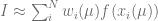
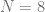

<!--yml

类别：未分类

日期：2024 年 05 月 17 日 23:43:36

-->

# HPC-QuantLib

> 来源：[`hpcquantlib.wordpress.com#0001-01-01`](https://hpcquantlib.wordpress.com#0001-01-01)

目标：开发一种指数适配的高斯-拉盖尔积分规则，用于在 Heston 模型下定价欧式期权，优于给定的 Gauss-Lobatto、Gauss-Laguerre 和 QuantLib 中的其他定价方法实现。

现状：Heston 模型的高效定价例程

基于 Gatheral 公式中标准化特征函数的积分

结合 Black-Scholes 控制变量，以改善对 Lewis 公式的数值稳定性[1][2][3]。 Black-Scholes 模型的标准化特征函数如下给出

然后可以基于下述进行计算普通看涨期权的价格

其中是相应的 Black-Scholes 价格。 文献中讨论了对控制变量的波动率不同的选择。 在以下示例中，波动率将由以下之一来定义

或

*第一个与总方差匹配，而后一个匹配积分起始点处的特征函数值。通常，后一种选择效果更好。从上面的被积函数中可以直接发现算法在深度入金/深度出金期权中存在一个缺点即被积函数由于术语*

**

*当使用高斯-拉盖尔（Gauss-Laguerre）求积法时，权重函数与特征函数的重叠在非常短的到期日或小的有效波动率时变得不太理想，就像在 Black-Scholes 特征函数中已经可以看到的那样。*

*第三，对于非常小的，被积函数容易受到减法抵消错误的影响。*

*最后一个问题很容易通过对小的使用标准化特征的二阶泰勒展开来克服。相关的 mathematica 脚本可以在[这里](https://github.com/klausspanderen/HestonExponentialFitting/blob/master/mathematica/heston_expansion.nb)看到。*

*通过重新缩放被积函数改善第二个问题，将积分重写为，其中*

*第一个问题，高度振荡的被积函数，可以用指数拟合的高斯-拉盖尔（Gauss-Laguerre）求积法[4]来解决。对两个平滑函数和进行数值积分，其中*

*通过形式为高斯-拉盖尔（Gauss-Laguerre）的求积规则近似*

。

*在这种使用情况下频率是*

**，

高斯-拉盖尔积分规则的权重  和节点  变为频率  的函数。[4] 中概述的算法在运行时太慢，而且在原始形式下仅能用于 。为了将其用于 Heston 模型，我们对一组定义的频率进行预计算权重和节点。对于给定的频率 ，使用最接近的预计算值  来评估积分。当然，最好使用  的权重和节点而不是 ，但这远比假设  好得多，就像传统的高斯-拉盖尔积分规则中所做的那样。

有两种技术对于预计算权重和节点的扩展至更大的 N 是关键的：

+   以  开始算法，以获取标准的高斯-拉盖尔权重/节点，然后逐渐增加 。使用前 20 步的旧权重和节点来生成基于拉格朗日插值多项式的牛顿求解器的下一个起始向量。

+   通过使用[boost 多精度](https://www.boost.org/doc/libs/1_73_0/libs/multiprecision/doc/html/index.html)包而不是双精度来增加“数值余地”。这只与预计算有关。生成的权重和节点存储为正常的双精度值。

生成指数拟合的高斯-拉盖尔积分规则的权重和节点的源代码在[这里](https://github.com/klausspanderen/HestonExponentialFitting/blob/master/exponential_fitting/ef_laguerre.cpp)。

与其他 Heston 定价方法进行比较的参考结果是使用* N=2000 *的高斯-拉盖尔定价算法的[boost 多精度版本](https://github.com/klausspanderen/HestonExponentialFitting/tree/master/ql/pricingengines/vanilla)生成的。与*N=1500*和*N=2500*的结果进行比较可以确保结果的正确性。指数拟合的高斯-拉盖尔积分规则始终使用*N=48*节点进行，对应于对特征函数的仅仅 48 次估值。第一个示例模型是

指数拟合在特征函数估值总数方面表现优异，特别是在深度虚值/实值期权方面。如预期的那样，此方法在一系列期权行权价位下，确保绝对定价误差保持在以下。下一轮，相同的模型但。

再次，指数拟合的定价误差在所有行权价位在-15 到 15 之间均保持在以下，远低于其他方法。下一个测试，相同的模型但到期日非常短，。 带特征函数调用 250 次的 COS 方法和*N=48*的指数拟合表现相近，且优于所有其他方法。

同样的图表展示了在文献中使用的各种不同 Heston 参数，详见下面的[文档](https://hpcquantlib.wordpress.com/wp-content/uploads/2020/05/heston_catalog-3.pdf)。仅使用 64 个节点的指数拟合牛顿-拉盖尔求积法几乎总是能解决问题，对于行权价位在-20 到 20 之间的期权和在一天到 10 年之间的到期日，，且在特征函数调用次数考虑时，性能优于其他方法。该方法还可扩展到更多节点。

该算法的 QuantLib 实现是[PR#812](https://github.com/lballabio/QuantLib/pull/812)的一部分。

[1] Lewis, A. [一种适用于一般跳跃扩散和其他指数 Lévy 过程的简单期权定价公式](https://papers.ssrn.com/sol3/papers.cfm?abstract_id=282110)

[2] F. Le Floc’h, [傅里叶积分与随机波动率校准](https://papers.ssrn.com/sol3/papers.cfm?abstract_id=2362968)

[3] L. Andersen, 和 V. Piterbarg, 2010,  利率建模, 第 I 卷: 基础与香草模型,  Atlantic Financial Press London.

[4] D. Conte, L. Ixaru, B. Paternoster, G. Santomauro, [用于无界区间上积分的指数拟合牛顿-拉盖尔求积法](https://www.sciencedirect.com/science/article/pii/S0377042713003385)
