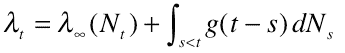

<!--yml

类别：未分类

日期：2024 年 05 月 18 日 下午 3:39:27

-->

# 霍克斯过程和策略 | Tr8dr

> 来源：[`tr8dr.wordpress.com/2009/10/29/hawkes-process-strategies/#0001-01-01`](https://tr8dr.wordpress.com/2009/10/29/hawkes-process-strategies/#0001-01-01)

2009 年 10 月 29 日 下午 10:33

你可以叫我孤陋寡闻，但在今天之前我还没有接触过霍克斯过程。霍克斯过程是一种“点过程”，用于建模事件强度并包括实证事件发生。

该过程的离散形式为:

其中 t[i]是在某个 t 时刻（t[i] < t）的第 i 次发生。该函数的形式通常是指数型的，但可以是任何模拟衰减的函数：

好吧，这很棒，但在策略研究中有什么应用？

日内随机波动率预测，最近文献中的主题是用以时间为基础的方法代替二次方差方法。在“基于持续时间的波动率估计”中，安德森、多布列夫和肖姆堡已经证明，某一时间间隔内的波动程度等同于产生某一波动所需的时间量，二者可以很容易地相互转换。

蔡、金和勒杜克在“一种日内波动模型”中，通过将自回归条件持续时间过程和霍克斯过程结合起来，以建模衰减，展示了：

然后等价地用强度表示（其中 N 代表大小为 dY 的事件的数量）：

与波动率度量相关的差异如下：

强度过程由 ACD 部分和霍克斯部分组成：

他们声称能够很好地模拟日内波动，并提出了一种做多/做空跨式套利策略，以利用其预测能力。

高频订单预测策略 文献建议使用霍克斯过程来模拟市场参与者的买卖过程。

约翰·卡尔森在“使用霍克斯自激过程对股票订单建模”中提出了一个策略，如果霍克斯预测的买入/卖出强度比例超过阈值（比如 5），则买入（卖出），并在 N 秒内平仓（他使用了 10 秒）。

这对强烈的自相关性（即非零衰减时间）起着作用，使强度回到平均水平。买入与卖出订单的倾斜比例肯定会影响市场朝着订单倾斜的方向发展。

可以增强该策略，包括有关成交量、交易规模等的信息。我们还可以查看高度相关资产的买入/卖出强度，并用于增强信号。
