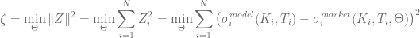
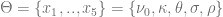
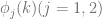
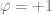
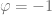
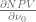
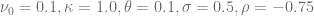

<!--yml

category: 未分类

date: 2024-05-17 23:30:30

-->

# 利用 Adjoint Algorithmic Differentiation 的 Heston 模型校准 - HPC-QuantLib

> 来源：[`hpcquantlib.wordpress.com/2015/04/01/heston-model-calibration-using-adjoint-algorithmic-differentiation/#0001-01-01`](https://hpcquantlib.wordpress.com/2015/04/01/heston-model-calibration-using-adjoint-algorithmic-differentiation/#0001-01-01)

自从[1]首次将此方法带到更广泛的受众面前以来，算法计算在金融工程领域变得越来越流行。其受欢迎的关键因素包括：

+   Adjoint Algorithmic Differentiation (AAD)：计算函数（或计算机程序）的所有一阶偏导数的计算成本大致是计算函数本身的三到六倍。 如果函数有大量一阶偏导数，这种方法显然比有限差分法更有效，有限差分法的计算成本与偏导数的数量成正比。

+   简单易用的 C++库，其中包括[CppAD](http://www.coin-or.org/CppAD/) 或 [ADOL-C](http://www.coin-or.org/projects/ADOL-C.xml) 等等。

+   准确度：偏导数直接是函数评估的结果，不依赖于任意扰动参数。

Adjoint Algorithmic Differentiation 首次在 2013 年用户组会议上与 QuantLib 一起被提及。这个话题随着 Peter 在[Adjoint Greeks](https://quantlib.wordpress.com/2014/12/20/adjoint-greeks/%20)的博客和 Alexander 的[通告](http://permalink.gmane.org/gmane.comp.finance.quantlib.devel/5438)以及[CompatibL](http://compatibl.com)对 QuantLib AAD 的移植工作而进一步获得推动。Alexander 将在今年的全球衍生品会议上 [分享](http://compatibl.com/research/events/global-derivatives-2015/) 移植 QuantLib 所涉及的技术

几乎所有用于模型校准的高效局部优化算法，比如 Levenberg-Marquardt 算法，都是基于梯度方法的，因此需要计算目标函数*Z*的 Jacobian 矩阵。Heston 模型校准的目标函数由拟合度量定义



对于模型参数



模型校准期权的模型价格是使用拉盖尔-高斯积分的特征函数  来进行评估：

可以以类似的方式进行移植，并且 AnalyticHestonADEngine::doCalculation 方法现在变为

将 Real 数据类型替换为 CppAD::AD<Real>

```

template <class F>
CppAD::AD<Real> GaussianADQuadrature::operator()(const F& f) 
    const {
    CppAD::AD<Real> sum = 0.0;
    for (Integer i = order()-1; i >= 0; --i) {
        sum += w_[i] * f(x_[i]);
    }
    return sum;
}

```

使用高斯-拉盖尔积分的 AAD 版本的方法

```

CppAD::AD<Real>; 
AnalyticHestonADEngine::Fj_Helper::operator()(Real phi) const;

```

具有二进制变量，对于看涨期权和看跌期权。为了使用 AAD 进行模型校准的第一步是基于 CppAD 库实现基于 Gauss-Laquerre 积分的方法。唯一需要更改的是在

```

std::vector<CppAD::AD<Real> > params;
params += spotPrice, v0, kappa, theta, sigma, rho;
CppAD::Independent(params);

std::vector<CppAD::AD<Real> > y(1);

// untouched code ...

const std::vector<Real> moreResults 
    = CppAD::ADFun<Real>(params, y)
          .Reverse(1, std::vector<Real>(1, 1.0));

results.value = CppAD::Value(y[0]);
results.additionalResults["v0"]    = moreResults[1];
results.additionalResults["kappa"] = moreResults[2];
results.additionalResults["theta"] = moreResults[3];
results.additionalResults["sigma"] = moreResults[4];
results.additionalResults["rho"]   = moreResults[5];

```

现在可以使用 AAD 计算校准仪器的所有一阶希腊字母。目标函数*Z*相对于一阶希腊字母的 Jacobi 矩阵如下

![\begin{array}{rcl} \displaystyle\frac{\partial Z_i}{\partial x_j} &=& \displaystyle \frac{\partial \sigma_i^{模型}(\Theta)}{\partial x_j} = \displaystyle \frac{1}{\frac{\partial NPV_i}{\partial \sigma_i}}\frac{\partial NPV_i}{\partial x_j} \\[0.9em] \nonumber &=& \displaystyle \frac{1}{\nu_{BS}}\frac{\partial NPV_i}{\partial x_j} \end{array}](img/fb96909fc18e9f123b4767200768a46c.png)

使用 AAD 对 Heston 模型的优势不在于计算速度，而在于精度。事实上，Heston 模型校准的 AAD 版本比有限差分方法慢，但 AAD 方法不需要任意的、精密调整的颠簸参数或任何高阶有限差分方案来得到高精度的一阶导数。下图显示了 AAD 值与数个有限差分近似之间的相对差异，对于到期两年的 ATM 期权



只有六点中心有限差分方案具有最佳振幅大小，可以获得在机器精度内/接近机器精度的 AAD 值。MINPACK 实现的 Levenberg-Marquardt 算法默认使用的两点前向方案只能重现前八位数字。前向方案的更详细分析可在[3]或[4]找到。特别是后者的论文计算出了不同方案的最佳振幅大小的值。请在这里找到 AAD 定价引擎的源码（http://hpc-quantlib.de/src/hestonad.zip）

通过使用[理查德逊外推](https://hpcquantlib.wordpress.com/2012/06/10/richardson-extrapolation-for-american-options)可以提高收敛速度。在下面的图表中，相同的分析被重复，包括理查德逊外推步骤。


[1] Giles, M. and Glasserman, P., (2006) [烟雾伴随: 快速蒙特卡洛希腊](http://people.maths.ox.ac.uk/gilesm/files/risk_gg06.pdf) 风险, 19:88–92\. 1

[2] Schlenkrich, S. and Riehme J., (2013) [用于算法微分的设计模式](http://quantlib.org/slides/qlws13/schlenkrich.pdf)

[3] Kopecky, K. (2007) [数值微分](http://www.karenkopecky.net/Teaching/eco613614/Notes_NumericalDifferentiation.pdf)，讲座笔记

[4] [积分中的数值微分](http://www.uio.no/studier/emner/matnat/math/MAT-INF1100/h08/kompendiet/diffint.pdf)，讲座笔记
