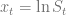

<!--yml

category: 未分类

日期：2024-05-13 00:12:10

-->

# Heston PDE Grid: How small can we make it? – HPC-QuantLib

> 源自：[`hpcquantlib.wordpress.com/2021/05/25/heston-pde-grid-how-small-can-we-make-it/#0001-01-01`](https://hpcquantlib.wordpress.com/2021/05/25/heston-pde-grid-how-small-can-we-make-it/#0001-01-01)

目标是将用在[任意数目的差分点](https://hpcquantlib.wordpress.com/2018/06/05/arbitrary-number-of-stencil-points/)的技巧应用到具有的 Heston 模型的偏微分方程（PDE）中。

为了在给定的精度下得到最小可能的网格。手头上的 Heston 模型参数是

,

基准期权的行权价为

而期权的到期日应该为一年。首先让我们在方向上使用五点差分。如预期的那样，收敛阶在从二阶到四阶递增。

接下来是同样的实验，但现在在方向也使用五点差分。由于收敛速度较快，即使是在相对较小的格点上，也已经出现了有限格效应。

时间方向上可以使用 Richardson 外推将收敛阶从二阶外推到三阶。

所以最终，对于这组参数，如果目标是使平均定价误差低于，那么网格大小为

似乎使用和方向的五点差分算子和时间方向的 Richardson 外推就足够了。不幸的是，对于给定的精度，这一技术比通常的技术要慢，如算子分裂，因为 Crank-Nicolson 格式的矩阵求逆必须由一个迭代求解器完成，也就是 BiCGstab。数值实验的代码可以在测试用例

[`NthOrderDerivativeOpTest::testHigerOrderHestonOptionPricing()`](https://github.com/lballabio/QuantLib/blob/master/test-suite/nthorderderivativeop.cpp)中找到。
