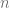

<!--yml

category: 未分类

date: 2024-05-13 00:10:52

-->

# 高性能美式期权定价 – HPC-QuantLib

> 来源：[`hpcquantlib.wordpress.com/2022/10/09/high-performance-american-option-pricing/#0001-01-01`](https://hpcquantlib.wordpress.com/2022/10/09/high-performance-american-option-pricing/#0001-01-01)

几年前，Andersen, Lake 和 Offengenden 推出了一种针对 Black-Scholes-Merton 模型定价美式期权的新型高性能算法[1][2]。这一算法的基础是对提前行权边界进行插值

对于一个时间反转边界函数，其中。知晓边界函数后，美式看跌期权的价值由以下公式给出

![\begin{array}{rcl}\displaystyle V(\tau, S)&=& \displaystyle e^{-r\tau}K\Phi\left(-d_-(\tau,S/K)\right)-Se^{-qt}\Phi\left(-d_+(\tau, S/K)\right) \\[5pt] &&\displaystyle + \int_0^\tau r K e^{-r(\tau - u)} \Phi(-d_-(\tau-u, S/B(u) )) du \\[11pt] &&\displaystyle - \int_0^\tau q S e^{-q(\tau - u)} \Phi(-d_+(\tau-u, S/B(u))) du \\[10pt] d_\pm(\tau, x) &=& \displaystyle \frac{\ln{x}+(r-q)\tau \pm\frac{1}{2}\sigma²\tau}{\sigma\sqrt{\tau}}\end{array}](img/3c84587f6f8fb858cb50cb743e7faa61.png)

一个美式看涨期权的价值可以通过看涨-看跌对称性[3]进行评估。该算法包括四个独立的任务，每个任务的精度由独立的参数和积分算法的选择控制。

1.  提前行权边界以个切比雪夫节点[4]进行插值。

1.  提前行权边界采用*m*次固定点迭代步骤进行近似。第一次迭代是部分 Jacobi-Newton 步骤，其余的*m*-1 步是普通的固定点迭代。

1.  固定点迭代过程中的积分可采用*λ*阶的高斯-勒让德积分或具有给定公差*ε*的双曲正弦积分。

1.  最后，沿着提前行权边界积分得到美式期权价值，可使用*ν*公差的双曲正弦积分或*ρ*阶高斯-勒让德积分。 

对于整体性能而言，确保所有子步骤都达到相似的精度至关重要。可以通过基准组合（例如[1]中的方法）来最好地探索参数空间

,

和不同参数配置的每个点在下图中对应于不同参数配置的均方根误差（RMSE）。RMSE 是针对基准组合中所有 6000 个期权价格计算的，并绘制为一个期权定价的运行时间。为了进行比较，添加了有限差分方法的结果，但偏微分方程无法与该算法竞争（QuantLib 中也无法与基于树的算法竞争）。

这个数据集可以用于定义高效参数边界，并从边界中取得最佳参数配置。步骤 3 和 4 中的快速配置是 Legendre 积分

,

精确的是在步骤 3 中使用 Legendre 积分和在步骤 4 中使用 tanh-sinh 积分

,

高精度通过 tanh-sinh 在步骤 3 和 4 中实现

这个算法的实施并不总是一帆风顺，部分实施在[PR#1495](https://github.com/lballabio/QuantLib/pull/1495)。

[1] L. Andersen, M. Lake and D. Offengenden: [高性能美式期权定价](https://papers.ssrn.com/sol3/papers.cfm?abstract_id=2547027)

[2] L. Andersen and M. Lake: [American Option Pricing(快速美式期权定价：双重边界情况)](https://onlinelibrary.wiley.com/doi/abs/10.1002/wilm.10969)

[3] R. McDonald and M. Schroder: [美式期权的奇偶结果](https://www.researchgate.net/publication/243657048_A_Parity_Result_for_American_Options)

[4]. S.A. Sarra: [Chebyshev 插值：交互式导览](https://www.maa.org/sites/default/files/images/upload_library/4/vol6/Sarra/Chebyshev.html)
