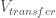
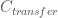
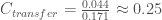
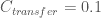
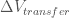
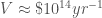
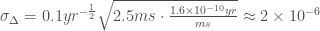
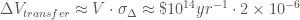
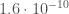

<!--yml

category: 未分类

date: 2024-05-18 06:39:56

-->

# 高速交易网络和社会价值 | 机械市场

> Source: [`mechanicalmarkets.wordpress.com/2016/10/04/high-speed-trading-networks-and-societal-value/#0001-01-01`](https://mechanicalmarkets.wordpress.com/2016/10/04/high-speed-trading-networks-and-societal-value/#0001-01-01)

浪漫化的交易者在一列大篷车上工作，冒着恶劣的天气在城市之间搬运财产和信息。几千年来，人类已经从用马车和船只交换实物商品，发展成了通过海底电缆和专用无线电网络交换符号合同。市场对于通信技术的应用无疑使社会受益匪浅。但它是否已经走得太远？更快的速度的好处是否能超过成本？很多人这样认为。并且高速网络并不便宜；一条新的连接东京和伦敦的电缆可能会[花费](http://spectrum.ieee.org/telecom/internet/arctic-fibre-project-to-link-japan-and-uk) 8.5 亿美元。但虽然我听到了很多关于改善网络基础设施成本的抱怨，但我没有看到任何关于这些投资带来的利益的估计。我将在这里试图提供一个。

# “军备竞赛”

Budish、Cramton 和 Shim [称](https://faculty.chicagobooth.edu/eric.budish/research/HFT-FrequentBatchAuctions.pdf) ，对速度的进一步投资是“对社会浪费的”。他们还描述了交易公司之间的动态为“囚徒困境”，即如果所有公司都避免昂贵的技术投资，它们就能增加利润。但如果一个公司“脱离”并提高速度，它就可以暂时增加利润，损害其竞争对手——直到他们自己进行类似的投资。结果是公司不断投资于速度，但这些支出并未增加行业收入。许多所谓的 HFT（高频交易公司）同意这个过程是一种浪费，比如[Mani Mahjouri](https://www.frbatlanta.org/podcasts/transcripts/economy-matters/160602-expert-explains-high-frequency-trading.aspx) 属于 Tradeworx 的：

> [W]我们从拼凑现有的光纤路线，到在全国打掘管敷设直线光纤，再到通过微波塔发送信号并铺设新的跨大西洋电缆，进行这些非常昂贵的技术投资……但如果你从社会的角度来看，这是巨额的资本投入……在我看来，也许将其投入到价格更具竞争力上会更好，而不是花费在速度上

现在，资本主义 **应该** 强迫竞争对手投资，以提供更好的服务。如果一个行业抱怨高昂的投资成本挤压了其利润，那就是竞争正如其应该地发挥作用的迹象。关注点通常是相反的，即竞争对手会串通一气，以避免投资“囚徒困境”中的“叛变”。问题是，交易网络是否存在使这些投资对社会毫无价值的独特因素。我不明白为何会存在这样的情况。

# 信息速度和社会福利

很明显，当市场之间的沟通速度足够缓慢时，社会福利将受到损害。一个有启发性的例子是地中海一位商人的经历（大约公元 1066 年），他需要在进行业务之前知道远处市场上的丝绸价格。他发送了以下[信函](https://books.google.com/books?id=_219BgAAQBAJ&lpg=PP1&ots=jgS3MaeRyY&dq=Letters%20of%20Medieval%20Jewish%20Traders&pg=PA47#v=onepage&q=%22When%20I%20arrived%20in%20Ramle%22&f=false)，在这封信中他报告说要等待这一信息的时间将是浪费：

> 由我带来的塞浦路斯丝绸在 Ramle 的价格为每磅 2 第纳尔。请告知我它的价格，并建议我是应该在这里出售它，还是带着它去 Fustat 的 Misr（开罗），以防在那里能取得好价。天呐，快点回答我，我在 Ramle 这里没有别的事情可做，除了等待我的信件的回复… 我不必再强调对丝绸价格的回复的迫切性

很显然，如果商人能更快地获取信息，则会产生经济效益。一般来说，我们如何估计这种效益的规模？当价格不同步时，财富就会在交易者之间随机转移 - 一些交易会因运气略获得更好的价格，而另一些交易会因运气略获得更差的价格。这些财富转移平均为零，因此说它们对社会的成本是它们的全部金额是错误的。但也不能说这种转移是完全无害的，因为它们是“零和游戏”。这意味着不同步市场的社会成本的一个合理估计是：财富转移的量 ()，乘以 0 到 1 之间的一个因子，代表每单位财富转移的经济成本 ()。

让我们首先估算 。以下是市场对与随机财富转移相关费用的价值做出的三个例子：

1.  保险：客户将坏运气的风险转移到保险公司，支付的费用远远超过预期的损失以摆脱风险。保险业的损失率通常在 80%左右。[1] 因此，保险市场的约为 0.2。[2]

1.  股权风险溢价：阿斯瓦斯·达莫达兰计算全球股票在短期政府债务之上的历史超额收益率为 4.4%，差异收益的标准偏差为 17.1% ([表 6](http://people.stern.nyu.edu/adamodar/pdfiles/papers/ERP2012.pdf))。这意味着，一般来说，投资者要求额外的 4.4%的回报来承担 17.1%的资本风险 —— 换算成。在美国以外，这个比率为 0.2，在一些国家甚至不到 0.1（比如比利时或挪威）。

1.  詹森对喀拉拉邦鱼市场之间的同步化的分析：渔民获得了手机之后，他们能够在水上的时候找到价格最高的附近市场。这些信息使得他们能够更容易地平衡供求的地方性波动（例如，见图 IV）。詹森估计手机增加了渔民的利润 8%，并降低了鱼的平均成本 4%。[3] 这些数据表明，喀拉拉邦鱼市场的至少为 0.1。[4]

令人惊奇的是，这些不同的方法都给出了大致相同的数值。在我们的计算中，我们将。

现在，我们只需要估计随机财富转移的减少量，，一个著名的 HFT 网络 - 纽约-芝加哥微波路线似乎是一个很好的例子。 我们只需做一个简单的数量级估计。 可以合理地用连接该路线的具有多个重要交易中心的产品的总成交量 () 乘以减少市场间延迟的典型价格离散度 () 来近似。 2015 年，芝加哥商品交易所的名义价值超过一千万亿美元。 其中一部分交易量“膨胀”于高名义价值的合同（例如期权，欧元美元汇率期货），或者可能与周边市场紧密耦合 - 因此让我们将其削减 90％，并说 是与纽约或欧洲重要市场高度相关的芝加哥交易量。 [5][6] 我们可以通过做出价格运动是布朗运动的通常假设来估计，因此波动性随时间的平方根成比例。 让我们粗略地假设相关的芝加哥商品交易所合同每年的波动率为[10%](http://www.cmegroup.com/tools-information/quikstrike/volatility-term-structure-metals.html)。 这使得我们可以轻松计算无线网络在距离光纤节约的约 2.5 毫秒内它们的价格通常会移动多少： [7]

所以我们有。 换句话说，将芝加哥-NY 路线从光纤升级到微波每年可以防止约 2 亿美元的任意转移财富。 将这个数字乘以我们估计的每单位转移的经济成本，，就得到了这条微波路线的社会价值：约每年 2000 万美元。

# 将网络价值与其成本进行比较

Laughlin, Aguirre 和 Grundfest [估计](https://arxiv.org/pdf/1302.5966.pdf)芝加哥-纽约微波网络的资本支出约为 1.4 亿美元，运营费用每年为 2 千万美元。我们对该路线价值的估计非常粗略，但仍然令人惊讶地接近他们（也是粗略的）数字。我想这些成本的一部分，包括薪水和无线电许可费之类的费用，并不全对经济造成损失。因此，这些微波网络对社会来说“是值得的”是非常合理的。

此外，为高频交易开发的网络技术可能有利于其他许多延迟敏感的行业。金融业一直在资助重要的创新。根据[Rocky Kolb](https://books.google.com/books?id=t9HzRdUvHD8C&lpg=PA83&dq=galileo%20telescope%20trading%20ships&pg=PA83#v=snippet&q=%22with%20the%20aid%20of%20a%20telescope,%20one%20could%20get%20the%20first%20glimpse%20of%20the%20ships%20and%20cargo%20coming%20into%20port,%20and%20obtain%20a%20crucial%20hour%20or%20so%20jump%20on%20the%20trading%20markets%22&f=false)，望远镜的第一个应用是发现货船，并利用这些信息进行交易。**伽利略**本人[描述](https://books.google.com/books?id=OwOlRPbrZeQC&lpg=PA141&ots=Z2CU2YKB8_&dq=%22vessels%20so%20far%20away%20that%2C%20coming%20under%20full%20sail%20to%20port%2C%20two%20hours%20and%20more%20were%20required%20before%20they%20could%20be%20seen%20without%20my%20spyglass.%22&pg=PA141#v=onepage&q=%22vessels%20so%20far%20away%20that,%20coming%20under%20full%20sail%20to%20port,%20two%20hours%20and%20more%20were%20required%20before%20they%20could%20be%20seen%20without%20my%20spyglass.%22&f=false**威尼斯**领导人对这种应用印象深刻，并奖赏了他。

> **威尼斯** 窃听到我制造了一个【望远镜】的消息后，距今已有六天，我被市政署召见，我不得不和整个参议院一起展示给所有人看，并令所有人无限惊讶；曾有许多绅士和参议员并非年轻的人多次攀登威尼斯最高钟楼的楼梯，以远眺海上远航的帆船和船只，远到即使它们全帆而回港，也需要两个多小时才能在没有我的望远镜的情况下被看到。

如果我在我的扶手椅里负责经济，有人拿着 2 亿美元的项目来减少市场之间的延迟 3 毫秒，我真的不知道这是否是个好主意。当然，我可以做比我们一开始做的更仔细的计算。但我敢打赌，对经济最好的决定会基于人们是否实际支付使用该网络。这就是电信公司已经在做的事情。资本市场有时会投资于死胡同项目，但提前识别这些错误很少有容易的。

将延迟从 2 周缩短到 1 秒对社会有明显的好处。而从 7ms 到 4ms 则更为微妙。[8] 但仅仅因为进步是渐进的，并不意味着我们应该轻视它的价值。经济规模庞大，我们的市场处理着庞大的交易量。价格发现的微小改善可能产生重大差异。

[1] 2015 年财产保险和意外伤害保险的典型损失率分别为约 69%（[表 1](http://www.naic.org/documents/topic_insurance_industry_snapshots_2015_prop_cas_title_ins_ind_report.pdf)）。对于意外伤害保险，损失率约为 80%（[图 10 和 11](http://www.naic.org/documents/topic_insurance_industry_snapshots_2015_life_ah_fraternal_industry_analysis_report.pdf)）。

[2] 当然，购买保险的人可能特别风险厌恶，并愿意支付高额保费以避免灾难。但希望竞争和监管可以将利用最小化。

[3] Jensen 估计，消费者剩余（鱼买家的福利收益）增加了 6%，略高于鱼价下降。

[4] 还要记住，在移动电话推出后，价格仍未完全同步。也许，如果渔船实现自动化、低延迟路由，利润会增加，价格会进一步降低。如果新技术使船只更快，则几乎可以肯定会这样。

[5] 与芝加哥的标普 500 期货市场高度相关的不仅仅是纽约和欧洲的市场。您可以明显地将外汇和[固定收益](http://libertystreeteconomics.newyorkfed.org/2015/08/high-frequency-cross-market-trading-in-us-treasury-markets.html)期货纳入此类别。能源定价对多种资产市场至关重要。农产品和金属也在世界各地交易，并且对某些股票提供重要的交易信号。

[6] 我不知道当前芝加哥和欧洲之间的最低延迟路径是否经过纽约。这可能取决于[Hibernia](http://www.hibernianetworks.com/hibernia_express_/)是否允许客户在他们的哈利法克斯着陆站连接，并使用他们自己的微波网络在哈利法克斯和芝加哥之间传输数据。我对这类事情了解有限，但 Alexandre Laumonier [建议](https://sniperinmahwah.wordpress.com/2015/01/14/hft-in-my-backyard-v/) Hibernia 可能已限制在另一个着陆站的连接：

> 这个行业的不同消息来源（还有一名记者）告诉我，Hibernia 现在（至少目前）不会允许在 Brean 着陆站设置接收器。我试图了解更多情况，但得到的只是“既不否认也不确认”的答复。咦！人们知道但不愿意说。我给 Hibernia 写了封邮件，但得到了零回复（显而易见）。然后其他消息来源告诉我，Hibernia 可能最终会允许设置接收器…

如果 Hibernia 让客户在哈利法克斯而不是纽约或芝加哥连接，然后收取额外费用，这会挺有趣的（就像[航空公司](http://www.bloomberg.com/news/articles/2015-05-01/judge-tosses-united-airlines-lawsuit-over-hidden-city-tickets)一样做）。

无论如何，即使芝加哥到哈利法克斯有专有的无线网络，它们可能与芝加哥到纽约的路线共用一些塔。所以也许公平将芝加哥到欧洲的交通量包括在我们对芝加哥到纽约微波网络经济价值的估计中。

[7] 假设一年有约 250 个交易日，每个交易日为约 7 个小时 —— 因此每毫秒大约有的交易年。

[8] Matt Levine [描述](https://www.bloomberg.com/view/articles/2016-08-24/are-index-funds-communist)（和许多人一样）“市场如同一个巨大的分布式计算机，用于平衡供需；每个人的偏好都是数据，它们的互动就是创造价格和数量的算法”。这个类比或许有助于理解高速交易。超级计算机的性能可能会[严重依赖于](http://www.hpcadvisorycouncil.com/pdf/WRF_Analysis_and_Profiling_Intel_E5-2697.pdf)它的互连。如果市场就是一个巨大的超级计算机，将其互连延迟从 7ms 减少到 4ms 可能会大幅增加其处理能力 — 对于某些任务来说，可能增加 40%。对于这样的任务，我们预计当延迟改善时会出现节点间通信的大幅增加。也许我们正在看到这种增加在现代金融市场中的体现，这些市场比过去拥有更高的交易和消息量。
