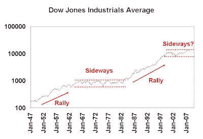

<!--yml

类别：未分类

日期：2024-05-18 01:10:14

-->

# 谦卑的市场学生：股票市场是否将面临长达十年的低回报环境？

> 来源：[`humblestudentofthemarkets.blogspot.com/2008/05/decade-long-low-return-environment-for.html#0001-01-01`](https://humblestudentofthemarkets.blogspot.com/2008/05/decade-long-low-return-environment-for.html#0001-01-01)

下图展示了道琼斯工业平均指数从 1947 年至今的情况。道琼斯的这段简短历史以两个看涨市场的时代为标志，随后是长期的横盘市场。我们可能正进入另一个长达十年的横盘市场时期。

的恐慌故事）[点击查看](https://blogger.googleusercontent.com/img/b/R29vZ2xl/AVvXsEgo36-OTP3Ahehslp1P-NG31uJBtw57PSPcfPo8wOhrhPO3BSC4pK2ww-fbHnT-VzIthR8mcf-DQfDm8oyYrEOzrUShJoiOUE25FFVGjtPdPte62mlXduNS53c9wFVH0EtfEEtbbRCnxuYV/s1600-h/DJIA.JPG)**宏观经济背景**

这些横盘市场有合理的根本原因。上一个横盘模式以不断上升的通货膨胀预期为标志，这种预期始于越南战争时期 LBJ 的“枪支和黄油”政策。宏观经济背景与 20 世纪 60 年代后期和 70 年代相似。美国卷入了一场看不到尽头的战争，财政赤字失控，美元贬值。

**过度的股票估值**

一些投资者，比如约翰· Hussman，认为市场定价过高。在最近

[评论](http://www.hussmanfunds.com/wmc/wmc080505.htm)

他写道：“标普 500 指数在未来十年内预计每年的总回报率大约为 2-4%”。使用

[方法论](http://www.hussmanfunds.com/wmc/wmc050222.htm)

描述中，Hussman 指出，基于峰值收益的市场的周期性调整市盈率非常高。当前周期的利润率处于高位，市场没有为利润率均值回归留出空间（阅读分析）。

[这里](http://hussmanfunds.com/rsi/profitmargins.htm)

）。

**养老金资产组合可能更青睐债券**

企业财务主管可能会在定义利益计划中转向资产和负债匹配的框架，鉴于会计政策的变化，如

[FASB 158](http://www.fasb.org/pdf/fas158.pdf)

以及

[IAS 19](http://www.iasplus.com/standard/ias19.htm)

。在欧洲，已有建议延长

[偿付能力 II 标准](http://pensions.practicallaw.com/8-368-6956)

对于企业养老金计划，这将进一步加速这一趋势（并已经制造了类似

[这个](http://www.reuters.com/article/privateEquity/idUSL0616178620080506?pageNumber=1&virtualBrandChannel=0)

）。

我们在几年前英国的公司向资产负债匹配框架转变时看到了这种效应。投资者为了延长投资组合的久期，将长期国债收益率压至难以置信的低位。这种资产转换是以牺牲养老金投资组合中的股票权重和其他资产为代价的。
