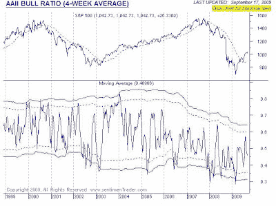

<!--yml

类别：未分类

日期：2024-05-18 00:46:17

-->

# 谦卑的市场学生：可能的股市崩盘——但尚未到来

> 来源：[`humblestudentofthemarkets.blogspot.com/2009/09/possible-market-crash-but-not-yet.html#0001-01-01`](https://humblestudentofthemarkets.blogspot.com/2009/09/possible-market-crash-but-not-yet.html#0001-01-01)

定期读者知道，我一直对这次股市反弹持怀疑态度（见示例

[这里](http://humblestudentofthemarkets.blogspot.com/2009/08/v-shaped-recovery-with-4-8-gdp-growth.html)

和

[这里](http://humblestudentofthemarkets.blogspot.com/2009/08/v-shaped-recovery-with-4-8-gdp-growth.html)

）。我的观点得到了我尊敬的许多评论员的支持。

GMO 的 Jeremy Grantham 在他的文章中写道

[二季度信件](http://www.gmo.com/websitecontent/JGLetter_ALL_2Q09.pdf)

他们的标普 500 公允价值估计略低于 880，该指数可能会涨到 1000 到 1100 之间。此外，还有报告指出

[内部人士大量抛售](http://money.cnn.com/2009/09/10/news/economy/insider.sales/index.htm?postversion=2009091107)

对于多头来说这并不是一个安慰。

在 9 月 9 日，长期的技术分析师 Richard Russell 指出，他看到了一个罕见的“双重非确认”[强调我的]：

> 我们可能见证了一个罕见的“双重非确认”。8 月 27 日，道琼斯工业平均指数以 9580.63 点收盘，是此次反弹的新高。同一天，运输指数以 3714.63 点收盘，并未创出新高——这样做，运输指数未能确认道琼斯指数。今天，运输指数以 3806.75 点收盘，是运输指数的新高。但今天，道琼斯指数以 9547.22 点收盘，低于 8 月 27 日的收盘价——这样做，工业指数未能确认运输指数。这就是我所说的罕见“双重非确认”。首先，运输指数表现疲弱，无法确认工业指数。今天，工业指数也表现疲弱，无法确认运输指数。在过去，这些罕见的“双重非确认”往往预示着顶部***。

[Bespoke](http://bespokeinvest.typepad.com/bespoke/2009/09/sp-500-more-than-20-above-its-200dma-first-time-since-583.html)

还指出标普 500 指数现在比其 200 日移动平均线高出 20%，这是自 1983 年以来的首次。这表明市场过度买入，可能会出现回调。

Art Cashin 最近表示

[这个市场让他想起了 1987 年](http://www.cnbc.com/id/32796678)

：

> 这其中有某些令人不安的相似之处——这让人想起了 1987 年春天和夏天，当时没有人相信反弹会持续，尽管怀疑，人们仍然在不断做空，结果被市场吞噬。直到突然间市场转向。

**市场会崩溃吗？**

我们是否将重蹈 1987 年股市崩盘的覆辙？

可能是这样。我听说对冲基金的杠杆率现在已经回到了雷曼兄弟破产前的水平，这表明系统风险很高。彭博社的 William Pasek

[写道](http://www.bloomberg.com/apps/news?pid=newsarchive&sid=apUH.Ybqzwh8)

美元现在是套利交易的首选融资来源，这使风险水平有了实际的考量。[重点是我的]：

> 现在想象一下，如果世界储备货币变成了最被做空的货币会怎样。毕竟，套利交易就是在赌融资货币将进一步贬值或长时间保持低位。这也是在赌中央银行被迫无限期保持低借贷成本…
> 
> 三个月期伦敦银行同业拆借利率（Libor）对于美元贷款已降至历史新低，并在 8 月 24 日 16 年来首次跌破日元拆借利率。
> 
> ***想象一下，如果美元突然上涨 5%或 10%，全球范围内无数交易者将处于亏损状态，那将引发怎样的动荡。它可能使得“雷曼冲击”看起来可控。***

**关注看跌触发点**

请记住，1987 年，股市并非突然在一天之内自行决定崩溃。在 10 月崩盘之前，市场在 8 月达到顶峰，并在最终暴跌之前稳定下降。

今天我们面临的是过度估值和高度风险行为的组合，但市场通常在这些问题变得重要之前并不关心它们。我尊重

[Barry Ritholz 的评论](http://finance.yahoo.com/tech-ticker/article/yftt_330576/Rally-May-Only-Be-in-6th-or-7th-Inning,-Ritholtz-Says)

当前集会可能已经进行到第六或第七局。

调整任何潜在下跌时机的关键在于关注看跌触发点。

**情绪触发点**

这是我正在关注的情况。

一个是投资者情绪。通常可以期待不仅看跌，甚至悲观的 James Grant，

[已经变成了多头](http://online.wsj.com/article/SB10001424052970204518504574420811475582956.html)

。尽管这一看跌情绪的投降迹象，但下图显示的公众情绪（由 AAII 调查衡量）却

[AAII 调查](http://www.sentimentrader.com/subscriber/charts/WEEKLY/SURVEY_AAII_BULLRATIO_4WK.htm)

的情绪并非过度乐观。

**关注风险交易**

正如我在之前的帖子中指出的那样

[风险开启](http://humblestudentofthemarkets.blogspot.com/2009/09/risk-on.html)

，风险偏好仍在上升。为了使熊市真正走出冬眠，投资者必须显示出他们对风险的口味正在变得满足。下面欧元/日元交叉货币对的图表，作为风险交易的衡量，仍在上升趋势中。

**欧元/日元**

如果美元现在成为了套息交易的首选货币，那么让我们看看一些新兴市场货币对美元的走势。下面这张匈牙利福林对美元的图表仍处于健康的上升趋势中。

**匈牙利福林/美元**

土耳其里拉对美元也处于上升趋势。

**土耳其里拉/美元**

商品价格——这反映了再通胀交易和风险交易的进展——也处于上升趋势。

在这些看跌的触发因素被触动之前，股市的最小阻力路径仍然是上涨。我的交易直觉告诉我，现在就变得过于看跌还为时过早。标普 500 的 50%斐波那契回撤水平大约是 1120——在当前情况下，这可能是一个现实的短期目标。

另一方面，1987 年下跌的导火索是美联储 8 月份决定提高利率。尽管我对美联储有效实施退出策略的意愿或能力表示过[怀疑](http://humblestudentofthemarkets.blogspot.com/2009/09/recession-over-what-now-ben.html)，但周三的 FOMC 声明仍值得关注。
