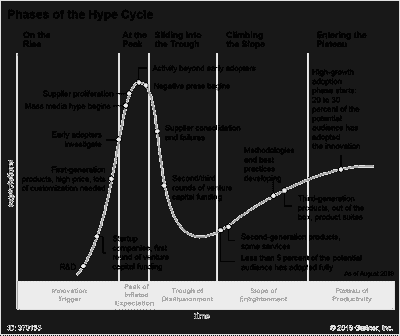

<!--yml

分类：未分类

date: 2024-05-18 01:18:28

-->

# Humble Student of the Markets: 对格兰瑟姆 AI 警告的回应

> 来源：[`humblestudentofthemarkets.blogspot.com/2024/03/a-reply-to-granthams-ai-warning.html#0001-01-01`](https://humblestudentofthemarkets.blogspot.com/2024/03/a-reply-to-granthams-ai-warning.html#0001-01-01)

知名的价值投资者杰里米·格兰瑟姆最近撰写了一篇文章

[文章](https://www.gmo.com/globalassets/articles/viewpoints/2024/gmo_the-great-paradox-of-the-us-market_3-24.pdf)

标题为“美国市场的巨大悖论”的文章，他在其中警告说，“价格反映了近乎完美，然而今天的世界特别不完美且危险”。

特别是，他对 AI 股票的泡沫发出了警报，并引用了

[Gartner 炒作周期](https://www.gartner.com/en/documents/3887767)

作为谨慎的主要理由：

> 但是每一次像这样的技术革命——从互联网到电话、铁路，甚至是运河——都伴随着早期的巨大炒作和股市泡沫，因为投资者关注的是技术的最终可能性，将大部分非常长期潜力立即定价到当前市场价格中。许多这样的革命最终往往和早期投资者所能预见的一样具有变革性，有时甚至更加如此——但在最初的泡沫破裂后，需要经历一段令人失望的实质性时期。因此，作为科技泡沫最显著的例子，亚马逊在 1998 年初至 1999 年高峰期间引领了投机市场，股价飙升了 21 倍，但随后在 2000 年至 2002 年间下跌了几乎难以置信的 92%，在继承了半个零售世界之前！

尽管我尊重格兰瑟姆的投资洞察力，但他犯了价值投资者过早和过于依赖估值的问题。我重申我的观点，对于 AI 股票而言，目前仍处于牛市周期的早期阶段（参见

[走向极度繁荣之路](https://humblestudentofthemarkets.com/2024/02/24/the-path-to-magnificent-exuberance/)

). 这就是原因。

完整的帖子可以在

[这里](https://humblestudentofthemarkets.com/?p=88773)

.
