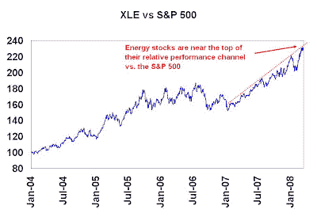

<!--yml

类别：未分类

日期：2024-05-18 01:12:22

-->

# 谦卑的市场学生：对美国美元空头和商品多头的短期警告

> 来源：[`humblestudentofthemarkets.blogspot.com/2008/03/short-term-warning-for-us-dollar-bears.html#0001-01-01`](https://humblestudentofthemarkets.blogspot.com/2008/03/short-term-warning-for-us-dollar-bears.html#0001-01-01)

当越来越多的声音呼吁美元末日（相应地，商品价格上涨）达到高潮时（例如

[这里](http://www.bloomberg.com/avp/avp.htm?clipSRC=mms://media2.bloomberg.com/cache/v5g.9Aykh2hA.asf)

）当黄金突破每盎司 1000 美元，石油突破每桶 110 美元时，我想

[重申](http://humblestudentofthemarkets.blogspot.com/2008/02/channeling-my-inner-contrarian.html)

我对美元空头和商品多头的短期警告。投机性冲高的迹象无处不在。

情绪变得过于极端，短期内这一交易难以继续推进。最近，321gold.com 的 Bob Moriarty

[发出警告的声音](http://www.321gold.com/editorials/moriarty/moriarty030708.html)

（斜体是我加的）：

> 没有什么是直线上升，也没有什么是直线下降。看到白银和黄金几乎每天都在上涨确实令人振奋，但所有市场偶尔都需要喘息。
> 
> ***我运营一个黄金网站，提出商品修正的观点被视为异端，但它们确实会。*** 即使是卑微的美元有时也会走向相反的方向。

十天后，他

[对冲](http://www.321gold.com/editorials/moriarty/moriarty031708.html)

他之前的评论，并承认基于对美国经济和美元的末日情景的黄金看涨情况：

> 现在是谨慎的时候了。基于情绪和政府干预，我们本应经历黄金、白银和美元的剧烈修正，但我们也可能在短短一周内看到黄金达到 3000 美元，或者是华盛顿的愚人团带给我们的噩梦的开始。没有人知道。

对我来说，那是

***首先***

美元和商品投机性冲高的迹象。大型投机者在黄金的

***第二***

迹象：能源和黄金股票都处于或接近相对于标普 500 的上升趋势通道的顶部。它们还能上涨吗？是的。然而，短期内相对下行风险似乎超过了上行收益。

这

***第三***

过度乐观的迹象：交易者承诺图表来自

[CFTC 数据](http://www.cftc.gov/marketreports/commitmentsoftraders/index.htm)

显示他们处于拥挤的多头仓位，这是逆向看跌的：

我内心的交易员认为我们正处于商品投机泡沫的最后阶段，有可能会剧烈修正。然而，我内心的投资者同意普遍观点，即我们正处于美元多年的长期下跌和商品多年的上涨之中。
