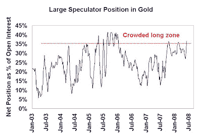

<!--yml

类别：未分类

日期：2024-05-18 01:09:21

-->

# 谦卑的市场学生：对黄金投资者的短期警告

> 来源：[`humblestudentofthemarkets.blogspot.com/2008/06/short-term-warning-for-gold-bugs.html#0001-01-01`](https://humblestudentofthemarkets.blogspot.com/2008/06/short-term-warning-for-gold-bugs.html#0001-01-01)

情绪模型再次对黄金发出谨慎信号。该

[交易者承诺报告](http://www.cftc.gov/marketreports/commitmentsoftraders/index.htm)

下面的数据图表显示了大型投机者（对冲基金）在黄金现货的净头寸，尽管黄金价格近期走弱，但读数正在进入拥挤的多头区域。这是一个逆向看跌的信号。

（图片链接）

类似的担忧也由一些人提出

[Mark Hulbert](http://www.marketwatch.com/news/story/gold-newsletters-remain-too-bullish/story.aspx?guid=%7B724D7DD6%2D76CB%2D4739%2DADEC%2D1EE15F9CF395%7D)

，他提到尽管黄金价格下跌，黄金计时员对这种黄色金属变得更加看涨。其他

[情绪调查](http://www.sentimentrader.com/subscriber/charts/WEEKLY/SURVEY_GOLD.htm)

也显示出同样的看涨情绪上升。

在中期和长期，我通常同意 Aden 姐妹的观点，

[在四月底写道](http://www.321gold.com/editorials/aden/aden043008.html)

（斜体部分为我所加）：

> 黄金的 C 阶段上涨终于结束了。在当前七年牛市的最佳中期上涨之一中，九个月内上涨了 55%，它预示着几件事。最重要的是牛市背后的力量，因为新高持续被刷新。*黄金的下一步很可能是良好的向下修正，可能需要几个月的时间来发展*。

他们总结道：

> *有人担心三月的峰值就是黄金的顶峰。考虑到当今的世界形势和经济失衡，这种情况非常不可能发生*。
