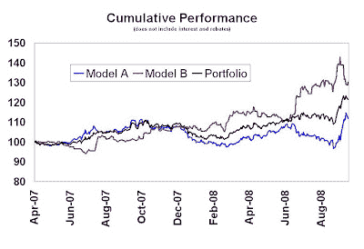
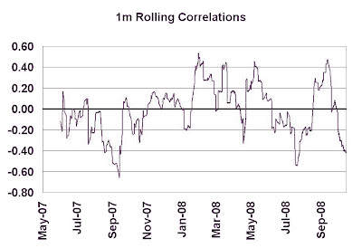
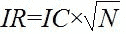
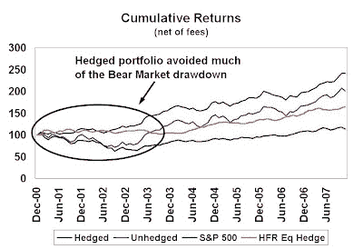

<!--yml

类别：未分类

日期：2024-05-18 01:03:56

-->

# 市场谦卑的学生：给受伤行走中的对冲基金经理的建议

> 来源：[`humblestudentofthemarkets.blogspot.com/2008/10/advice-for-hedgie-walking-wounded.html#0001-01-01`](https://humblestudentofthemarkets.blogspot.com/2008/10/advice-for-hedgie-walking-wounded.html#0001-01-01)

当列表在

[对冲基金崩溃计](http://hf-implode.com/)

增长时，我的消息来源显示，平均多元化的对冲基金年初至今（截至 10 月初）下跌了大约 16%，并且显示出大约 17%的当前回撤。可转债套利、股票多空和事件驱动策略是表现最差的策略，平均当前回撤超过 20%。此外，也有传言称，甚至一些大型知名对冲基金年初至今下跌了 10-15%。

**留得青山在，不怕没柴烧**

如果你是在困难中幸存下来的行走受伤对冲基金经理之一，恭喜你！负面回报期有助于反思和分析你的投资过程。如果你正在进行这样的审查，以下是一些关于如何构建策略和投资组合的免费简单建议：

+   **分散、分散、分散你的因子！** 任何初出茅庐的量化分析师都知道，将不相关的因子结合起来构建策略会产生更稳定的结果。

+   **精简你的赌注，专注于你擅长的事情。** 换句话说，不要忘记风险控制。

下面我展示了这两个原则的两个例子。

**因子分散化**

我之前写过关于因子分散化[的好处](http://humblestudentofthemarkets.blogspot.com/2008/09/factor-diversification-living-to-fight.html)。下面是另一个例子。这是我积极参与开发的一个股票市场中性投资组合的策略。下图表显示了两个股票选择模型的样本外回报。

模型 A 是一个自下而上推导的多因素模型，平均持股期为 1-2 个月。尽管这个过程是自下而上的，但它获得了决定性的自上而下趋势跟踪的特点（在回测期间非常有效）。我的解决方案是将模型 A 与模型 B 相结合，模型 B 是一个短期价格反转模型，平均持股期为 4-5 天。由 67%的权重在模型 A 和 33%在模型 B 组成的投资组合回报，波动性较小。

下图表显示了两个模型的滚动相关性。直观地说，人们会期望趋势跟踪/动量模型 A 和价格反转模型 B 的相关性接近-1。实际上，在样本外期间，它们的滚动相关性在零线上下波动。

**底线：**

模型 A 和 B 的结合使得股票选择模型更加稳定，正如在对冲基金困难的时期，其回报虽然有些波动但仍然为正所显示的那样。结果更新至 2008 年 10 月 14 日。在上周的恐慌性市场抛售和周一的随后的反弹中，投资组合回报保持稳定。

**精简你的赌注**

我对 Grinold 方法的盲目应用持保留态度。

[积极管理的根本法则](http://humblestudentofthemarkets.blogspot.com/2008/02/examining-your-assumptions-fundamental.html)

然而，他原则背后的想法依然是正确的：

Grinold 的话简单来说，就是根据你的技能来决定你的赌注大小。如果你没有技能，解决方案就是消除或最小化那个赌注。

拿一个例子来说，大约一年前，我参与了一个多空股票经理的风险控制项目。他多年来表现非常好，但结果波动性较大。

经理采用了一种自上而下的多样化投资流程。在任一时间，他可能会锁定一个或多个有趣的投资主题，例如生物科技、新兴市场等，并在这些主题上重注。结果是形成了一个明显偏向多头的多空股票组合。

不幸的是，该投资组合承担了过多和不必要的市场风险。尽管长期回报很好，但在熊市中，基金遭受了巨大的回撤。我们的解决方案是大幅减少投资组合中的市场和共同因子风险，因为经理自己也承认没有市场时机判断能力。我们使用了来自 Barra 和 Northfield 的标准风险模型来估计投资组合的因子敞口，以形成对实际投资组合的套保和叠加。下面的图表显示了原始投资组合和使用 ETF 进行对冲的投资组合的回报，例如标普 500、罗素 2000 以及国家和行业 ETF。

下表展示了模拟的回报情况。在模拟期间，对冲投资组合的回报比原始未对冲投资组合高出 3%。该对冲投资组合避免了未对冲投资组合经历的大部分跌幅，并且表现优于标普 500 指数和 HFR 股票对冲指数。此外，在对 2000 年科技泡沫顶峰后熊市的跌幅规避方面，对冲投资组合展现了卓越的风险特性。

****这个故事寓意是：找出你擅长什么，坚持它，并消除/最小化投资组合中的其他投注。**
