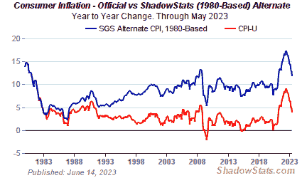

<!--yml

类别：未分类

日期：2024-05-18 00:12:50

-->

# 市场的谦逊学生：再次审视通胀-通缩辩论

> 来源：[`humblestudentofthemarkets.blogspot.com/2010/05/another-look-at-inflation-deflation.html#0001-01-01`](https://humblestudentofthemarkets.blogspot.com/2010/05/another-look-at-inflation-deflation.html#0001-01-01)

上周五，

[CNBC](http://www.cnbc.com/id/15840232?play=1&video=1506788618)

邀请了两名辩论通胀与通缩故事的嘉宾。我认为 CNBC 的参与者没有抓住重点。如果你知道去哪里寻找，系统中既有通胀也有通缩。

当然，当你现在观察时，你会看到通缩的有力证据：无论是在美国还是欧洲，消费者都显得疲弱，失业率上升，

[过剩产能](http://oilprice.com/Finance/the-markets/U.S.-Canada-Germany-and-Japan-Back-to-Pre-2003-Industrial-Production-Levels.html)

各地都有债务问题（其中一个主张通缩的例子可以在这里找到

[这里](http://www.creditwritedowns.com/2010/05/ray-dalio-inflation-is-not-just-around-the-corner-yet.html)

）。

这是否意味着通胀已经消失？并非如此。Shadowstats’

[CPI 数据](http://www.shadowstats.com:80/alternate_data/inflation-charts)

显示他们的替代消费者价格指数（CPI）超过了 9%：

 **这是什么类型的通胀？**

问题不应该是通胀还是通缩，而是在通缩背景下，哪种类型的通胀。Scott Grannis 在

[Calafia Beach Pundit](http://scottgrannis.blogspot.com/2010/05/deflation-and-inflation-are-alive-and.html)

显示服务业有通胀，但耐用品存在通缩：

在此分析中，我会补充“原材料通胀”。正如我所写

[之前](http://humblestudentofthemarkets.blogspot.com/2009/10/what-kind-of-inflation_26.html)

：

> 在这样的情况下，依赖商品和商品相关股票的投资组合将是一个有效的通胀对冲工具。然而，依赖固定收益解决方案的投资组合，例如通胀指数债券（如 TIPS）甚至收益率陡峭交易，可能效果不佳，因为这些通胀信号在这些市场中可能不会表现得那么明显。

**通胀/通缩交易的时机**

我认为许多市场参与者对通胀与通缩辩论感到困惑的另一个原因是，我们目前观察到的宏观经济波动程度。确实，经济前景存在很大的波动性，但投资者可以利用定时系统，例如

[通胀-通缩定时模型](http://www.qwestfunds.com/publications/newsletters_pdf/newsletter_november_2009.pdf)

，目前显示的是中性读数。
