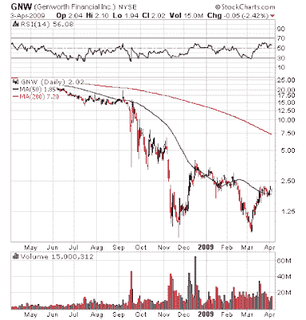

<!--yml

类别：未分类

日期：2024-05-18 00:56:02

-->

# 谦卑的市场学生：四月凤凰更新

> 来源：[`humblestudentofthemarkets.blogspot.com/2009/04/april-phoenix-update.html#0001-01-01`](https://humblestudentofthemarkets.blogspot.com/2009/04/april-phoenix-update.html#0001-01-01)

应大众要求，以下是最新名单

[凤凰](http://humblestudentofthemarkets.blogspot.com/2008/05/waiting-for-ride-on-phoenix.html)

候选股：

> 品牌葡萄酒房地产信托（BDN），CapitalSource 公司（CSE），CBL & Associates 房地产公司（CBL），世纪铝业公司（CENX），市民共和国银行公司（CRBC），殖民地产信托（CLP），完整生产服务公司（CPX），Conseco 公司（CNO），Delta 石油公司（DPTR），Developers Diversified 房地产公司（DDR），Domtar 公司（UFS），第一工业房地产信托（FR），第一大理石公司/ The（FMD），家具品牌国际公司（FBN），甘尼特公司（GCI），Genworth 金融公司（GNW），Hercules 海上公司（HERO），Hovnanian 企业公司（HOV），亨斯迈公司（HUN），ION 地球物理公司（IO），iStar 金融公司（SFI），Liz Claiborne 公司（LIZ），Manitowoc 公司/ The（MTW），MCG 资本公司（MCGC），MGIC 投资公司（MTG），MGM 米高梅（MGM），加州太平洋太阳服装（PSUN），爱国者煤炭公司（PCX），宾夕法尼亚房地产投资信托（PEI），Petroquest 能源公司（PQ），Popular 公司（BPOP），Quiksilver 公司（ZQK），雷克斯能源公司（REXX），Saks 公司（SKS），斯特灵金融公司/WA（STSA），Sunstone 酒店投资者公司（SHO），THQ 公司（THQI），Webster 金融公司（WBS）以及 Zale 公司（ZLC）。

名单上有 39 只股票，相比之下 3 月有 58 只股票。

[3 月 11 日的最后更新](http://humblestudentofthemarkets.blogspot.com/2009/03/phoenix-strategy-update.html)

。作为提醒，凤凰股票名单包括符合以下标准的股票：

+   股价在$1 到$5 之间（低价股）

+   比起一年前至少下跌了 80%（被打击的）

+   市值达到 1 亿美元或以上（曾经是“真正”的公司）

+   过去六个月内的净内部购买（内部活动提供一定程度的下行保护）

在名单上的 39 只股票中，18 只股票，即 46%，显示出底部技术形态，这是我作为整体市场技术状况指标所关注的[迹象](http://humblestudentofthemarkets.blogspot.com/2009/03/how-to-spot-bottom.html)。显示双重底部的 Genworth Financial（GNW）就是一个很好的例子：

显示底部形态的部分与我的

[最后更新](http://humblestudentofthemarkets.blogspot.com/2009/03/how-to-spot-bottom.html)

，其中 43%的股票显示出这种形态。

**现在买入凤凰还为时尚早**

考虑到这些指标，以及主要股指似乎已经

[超买](http://bespokeinvest.typepad.com/bespoke/2009/04/sp-500-near-overbought-levels.html)的情况。

根据我的最佳推测，我们现在看到的可能是熊市反弹的最后一波。在短期内，我会对投入资金进行凤凰策略非常谨慎。
