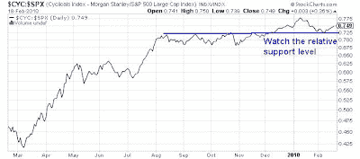
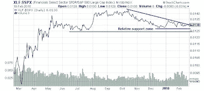

<!--yml

分类：未分类

日期：2024-05-18 00:37:59

-->

# 市场的谦卑学生：熊市的触发因素

> 来源：[`humblestudentofthemarkets.blogspot.com/2010/02/bearish-tripwires.html#0001-01-01`](https://humblestudentofthemarkets.blogspot.com/2010/02/bearish-tripwires.html#0001-01-01)

在我写下这些文字的时候，标普 500 期货在美联储意外举动的影响下下跌了约 1%。

[贴现率上升](http://www.federalreserve.gov/newsevents/press/monetary/20100218a.htm)

。

尽管有负面消息，但重要的是要深呼吸，后退一步，从一些角度分析市场。在我帖子中概述的框架中

[多头正在失去控制](http://humblestudentofthemarkets.blogspot.com/2010/02/bulls-are-losing-control.html)

，以下是我正在关注的几个重要的相对表现图表，作为熊市可能已经控制市场的迹象。

**周期性股票仍在坚守**

下图显示了摩根士丹利周期指数（CYC）相对于标普 500 的相对表现。CYC 在 12 月初进行了相对突破，并继续引领市场。如果它跌破相对支撑线，这将是一个信号，表明熊市已经占据上风。

**金融板块正处于突破边缘**

下图显示了金融板块相对于标普 500 的相对表现。在本轮周期中，金融板块有两个独特特点。首先，它们是系统中压力显现的地方，因此作为市场健康状况的金丝雀是一个很好的指标。

该行业正处于相对下跌趋势中，正处于突破边缘，我预计它会在开盘时进一步下跌。如果它跌破相对支撑区域，这是另一个信号，表明一个

[短暂的熊市休眠期](http://humblestudentofthemarkets.blogspot.com/2010/02/too-bearish-too-quickly.html)

已经到来。

请保持关注！
