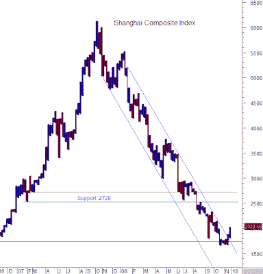

<!--yml

类别：未分类

日期：2024-05-18 01:02:41

-->

# 谦卑的市场学生：中国是下一个爆点？还是最后的投降？

> 来源：[`humblestudentofthemarkets.blogspot.com/2008/11/china-next-shoe-or-final-capitulation.html#0001-01-01`](https://humblestudentofthemarkets.blogspot.com/2008/11/china-next-shoe-or-final-capitulation.html#0001-01-01)

中国，凭借其庞大的储备，长期以来被许多投资者视为抵御全球金融火灾蔓延的最后堡垒。现在出现了这个情况。

[故事](http://www.theglobeandmail.com/servlet/story/LAC.20081113.RCHINA13/TPStory/Business)

指出中国本身可能成为通缩的源头：

> 在最近访问中国后，日本投资银行三菱日联证券的首席经济学家兼股票策略师 Nobuyuki Saji 发布了一份报告，警告中国可能即将把世界推向通缩漩涡。问题何在？膨胀的工业产能过剩，这威胁到中国出口商品的价格以及原材料进口的价格。
> 
> 他估计中国的生产运行能力可能比实际产能低 50%，因为许多曾经快速扩张的行业现在正受到国内外需求放缓的影响。根据他的估计，仅中国就占全球供需缺口的 7%。

****中国过剩产能将导致资本投资崩溃**

中国经济放缓的消息并不新鲜。新鲜的是国内过剩的制造业产能。（还记得 2000 年纳斯达克崩盘后那些关于大量暗光纤网络的故事吗？）

我有

[称为](http://humblestudentofthemarkets.blogspot.com/2008/10/does-market-bottom-in-1q2q-2009.html)

对于年底的反弹以及在股市中的另一轮下跌。如果中国产能过剩的故事变得普遍，它可能成为下一轮下跌的催化剂。它将导致美国和欧洲股票进一步下跌。对于所有类型的商品来说，这也会极为负面，因为未来中国基础设施投资对商品需求的希望将化为泡影。

**中国放缓：最后的投降？**

然而，一线希望来自于 Marty Chenard 的分析

[股票时机](http://www.stocktiming.com/shanghai_stock_market/Shanghai_Index_Effect_Nov.htm)

. 他最近撰写了一篇文章，指出中国股市可能正在形成底部。他强调上证综合指数的点数图作为一个例子。上海市场最近突破了一个下降趋势，表明它正处于筑底过程。

**点数图：上证综合指数**

如果我们将对中国产能过剩的分析与这一技术形态相结合，它表明市场已经对这一消息进行了折现。毕竟，当这个消息登上了加拿大报纸的时候，我们在交易中已经落后了多少？(我邀请在亚洲的读者们发表评论)。

或许当中国产能过剩的故事在美国广泛传播并登上美国报纸的时候，美国股市的最后一跌将会发生。这将促使最后的投降，将持有股票的最后一批弱者和绝望者清洗出局，从而为新一轮牛市奠定基础。

**附言*：Stocktiming.com 好心为我提供了一个链接，以便上海分析不会失效。因此，本文中的链接已经相应更改。*****
