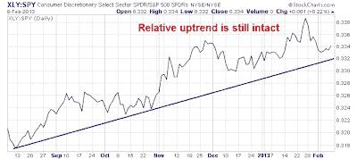

<!--yml

类别：未分类

日期：2024-05-18 03:56:32

-->

# 谦卑的市场学生：调整？关注周期性股票！

> 来源：[`humblestudentofthemarkets.blogspot.com/2013/02/correction-watch-cyclicals.html#0001-01-01`](https://humblestudentofthemarkets.blogspot.com/2013/02/correction-watch-cyclicals.html#0001-01-01)

定期读者知道我最近对股票持谨慎态度。上周的市场表现最好描述为波动性和杂乱无章。SPY 在周五达到的新高是在成交量低和 OBV 未确认的情况下实现的，

[平衡交易量](http://stockcharts.com/school/doku.php?id=chart_school:technical_indicators:on_balance_volume)

.

在这一点上，对调整的任何预测充其量只是猜测。我正在观察周期性股票的相对表现，以判断是否真的开始了调整。下面是摩根士丹利周期指数（CYC）相对于市场的回报率的图表，说明了我的观点。CYC 仍然处于相对上升趋势中，并且已经回撤到测试相对上升趋势线——但我不能称之为技术性突破。

同样，将消费者可选股票相对于市场的表现作为风险开启交易的衡量标准，表明这个板块仍然处于坚实的相对上升趋势中。如果市场进行调整，相对上升趋势线很可能会被打破。

从全球来看，韩国经济被认为是高度周期性的，KOSPI 被用作衡量周期性的指标。目前，KOSPI 显示出与 CYC 相对于 SPX 的回报率类似的模式——回撤到测试上升趋势线。然而，可以说，由于韩国与日本在向中国出口资本商品方面的竞争，最近的日元贬值给韩国股票带来了逆风，回撤可能反映了这些情况。

总之，尽管我对股票和风险交易保持谨慎，但技术图形显示上升趋势仍然完好，现在应该仍然给予多头以优势。然而，我的内心交易者正在密切观察这些周期性指标，并且保持多头仓位，同时设有非常紧密的止损。

 *Cam Hui 是[Qwest 投资基金管理有限公司](http://www.qwestfunds.com/)（"Qwest"）的投资组合经理。本文是由 Hui 先生在进行外部商业活动时准备的。因此，Qwest 不审查或批准此处呈现的材料。博客中表达的意见和任何建议都是作者本人的，并不反映 Qwest 的意见或建议。*

本博客中表达的信息或观点，不构成任何证券或其他工具的买卖招揽。本文中的任何内容都不构成投资建议，且可能包含的任何推荐并未基于对任何特定接收者的投资目标、财务状况或个别需求的考虑。任何证券或其他工具的购买或销售活动应基于您自己的分析和结论。过往表现并不预示未来结果。Qwest 或 Hui 先生可能持有或控制文中提到的证券或工具的长期或短期头寸。*
