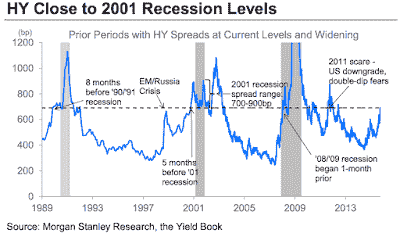

<!--yml

类别：未分类

日期：2024-05-18 03:14:46

-->

# 市场谦卑的学生：HY 困境可能是个幌子吗？

> 来源：[`humblestudentofthemarkets.blogspot.com/2015/10/could-hy-distress-be-red-herring.html#0001-01-01`](https://humblestudentofthemarkets.blogspot.com/2015/10/could-hy-distress-be-red-herring.html#0001-01-01)

我上一篇文章收到了很多质疑的反馈，可能是因为标题比较挑衅（见

[“我的 VISA 卡信用额度是多少”买入信号](http://humblestudentofthemarkets.blogspot.com/2015/10/a-whats-credit-limit-on-my-visa-card.html)

）。反对意见可以分为两类。许多图表分析师仍然看跌。同时，信贷市场也出现了令人担忧的迹象。我想解决后者的问题，因为跨资产或市场间分析信号是我特别关注的。

**HY 利差正在扩大**

一些读者指出了像这篇文章一样的文章，

[商业内幕](http://www.businessinsider.com/ubs-lowest-of-low-quality-issuers-signal-downside-growth-risk-2015-10)

其中，UBS 和摩根士丹利因信用利差扩大而强调经济衰退风险：

> 市场观察人士指出，近期高收益债券利差激增，这种走势通常出现在经济走向衰退时。
> 
> 高收益债券市场对经济周期尤为敏感。这些被称为垃圾债券的债务证券，通常是由信用质量较低的公司发行的。由于向这类公司放贷的风险较高，它们必须提供比投资级同行更高的收益率。当利差增加时，这些垃圾公司借款的成本就更高了。
> 
> “美国高收益信用债一直面临着一个又一个的逆风——从能源领域的重要困境，到全球经济增速放缓的风险，再到美联储加息的不确定性，”摩根士丹利的 Adam Richmond 在周五表示。“因此，HY 刚刚经历了自 2008 年底以来最疲软的四个月（6 月至 9 月），总回报率为-7.03%。这次抛售引发了非常消极的情绪，因为没有什么比低价更能让熊市出没了，这加剧了市场的恐慌性价格波动。”
> 
> “简单来说——这并不经常发生——只有在经济衰退前夕或主要增长恐慌期间，”里士满说。

关于经济衰退风险的讨论引起了我的注意，因为经济衰退是牛市杀手。此外，信用利差扩大对股市多头来说也是坏消息，因为它们预示着风险偏好的下降。以下是 FRED 的一张 HY 利差图表（蓝色，左侧为反转刻度）和 SPX（红色，右侧刻度）：

我们应该对信用利差有多担心？这是在雷曼危机时期左右的同一张图表。我们可以看到在 2009 年 3 月的低点出现了正向分歧，因为当时高收益债券的利差比第一次高峰时要窄。但随后，由于财政和货币当局正在采取措施进行救助，这种效应在一定程度上是可以预见的，因此你会预计信用利差开始收窄。

这里是 2011 年同一张图表，我们注意到在股市最终低点时，高收益债券（HY）利差扩大至新高（由于图表是倒置的，所以实际上是新低）。换句话说，在股市底部时，高收益债券显示出负向分歧。

高收益债券利差是股市价格的领先、滞后还是同步指标？证据尚不明确。似乎信用市场的变动与股市价格大致保持一致。信用市场是一个有用的跨资产风险偏好指标，它可以预警或确认牛熊趋势。正负分歧都需要其他指标来确认。单凭信用利差上升是一个误导，它并不能告诉我们股市价格将何去何从。

**为什么新兴市场（EM）的表现优于美国高收益（US HY）？**

还是不相信？考虑这张图表，它展示了美国高收益债券与其等久期美国国债代理之间的相对价格表现，以及新兴市场债券与其等久期美国国债代理之间的相对价格表现。你会记得，当前下跌潮的大部分焦虑源于中国经济的放缓以及对新兴市场经济体的担忧。如果是这样，为什么新兴市场债券的表现优于美国高收益债券？

这个故事的寓意是，要警惕单一变量分析，其结果没有得到其他模型的确认。
