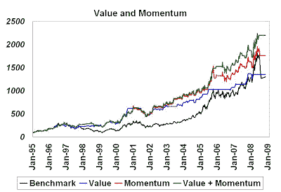

<!--yml

分类：未分类

日期：2024-05-18 01:05:23

-->

# 谦卑的市场学生：因子多元化 = 留得青山在，不怕没柴烧

> 来源：[`humblestudentofthemarkets.blogspot.com/2008/09/factor-diversification-living-to-fight.html#0001-01-01`](https://humblestudentofthemarkets.blogspot.com/2008/09/factor-diversification-living-to-fight.html#0001-01-01)

过去，我遇到过一些量化分析师，他们忘记了多元化的价值。这种态度在那些恰好在当时表现出色回报的基金工作的分析师中尤其普遍。[Ospraie](http://www.bloomberg.com/apps/news?pid=20601087&sid=ac8G.pB.5TCI&refer=home)的爆炸性事件说明了在模型构建中因子多元化的重要性（更不用说风险控制和头寸规模了）。

**定时商品股票 - 一个例子**

由于 Ospraie 在商品股票领域进行投资，下面我展示了一个应用于商品股票指数的长仓定时模型组成部分的例子。黑线显示了从 1995 年开始的指数累积回报。

**价值有效 - 但并非始终如此** 蓝线显示了一个主要基于价值原则的定时模型的回报。底层模型不是一个经典的价值模型，而是由市场信号修改过的模型。经典价值的问题在于它往往太早——过早买入和过早卖出。缓解这个问题的一种方法是将它与一些前瞻性信号结合，例如估计修订或相对强度，这样模型就不会仅仅因为它便宜就买入，而是在它便宜且基本面停止下滑时买入。

这个修改后的价值模型在 1995-2008 年期间的回报与指数大致持平，但波动性较低。它避免了 1997-99 期间的大部分负面回报，但在基准在 2004 年开始上升时表现滞后。

**动量有效但具有波动性**

动量和趋势跟踪模型可以解决在基准中出现重大上升趋势时错过的问题。红线显示了应用于商品股票指数的动量模型的累积回报。

动量模型也避免了 1997-99 年间价值模型遭遇的大部分回撤。它还能够在 2003 年开始的指数上涨中参与其中。总体而言，它可能因为所考虑的测试期主要是牛市而优于价值模型。然而，其回报的波动性大于价值模型。此外，在当前的低迷时期，动量模型遭受了回撤，而在此期间价值模型表现平稳。

**如何多元化以及如何不多元化**

两个模型超额收益的相关性为 0.69。即使相关系数相对较高，我们仍可以观察到分散投资的效果。绿色线条显示了改进的价值和动量模型的累积收益，该模型的表现优于指数以及单独的价值或动量模型。波动性低于动量模型，表明其风险调整后的收益更优。

**你应该何时追随趋势，何时逆向操作？**

这个分散投资的练习假设价值模型和动量模型之间的权重是固定且相等的。如果投资者是短期导向，并根据最近的表现分配权重呢？这在一个拥有价值经理和动量经理的对冲基金中很容易发生：“我们根据策略的回报来管理风险和分配资本”。下方的图表显示了一个根据两种投资方法的近期回报调整权重的收益方案。尽管自适应权重确实超过了基准，但它并没有超过固定权重方案。

在这一切中，量化投资者可以学到一些教训：

+   分散投资，以便有朝一日能再次战斗。

+   如果你无法预测哪个模型表现最好，那就不要预测，保持中性的（固定）权重。
