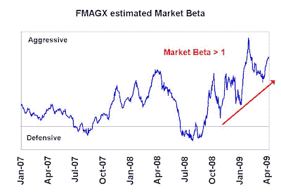
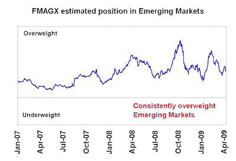
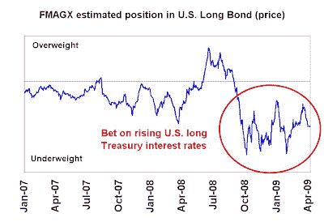

<!--yml

分类：未分类

日期：2024-05-18 00:55:29

-->

# 市场谦逊的学生：富达麦哲伦基金在 2009 年恢复

> 来源：[`humblestudentofthemarkets.blogspot.com/2009/04/fidelity-magellan-recovers-in-200

还记得 Peter Lynch 吗？他在 1977-1990 年期间管理富达麦哲伦基金（FMAGX），将这个默默无闻的基金推向了名望。在那 13 年里，该基金有 11 年跑赢了标普 500。他离开后，FMAGX 经历了多位经理人的管理。

基金最近的负责人是 Harry Lange，自 2005 年底以来一直负责。FMAGX 在其业绩中确实有过波折，表现为

[斑驳的记录`](http://quicktake.morningstar.com/FundNet/TotalReturns.aspx?Country=USA&Symbol=FMAGX)

在过去几年里。Morningstar 只给这只大型成长股基金评了两颗星。

然而，在 2009 年，我们看到了一个惊人的转机。截至 4 月 9 日，该基金年初至今上涨了 6.6%，比标普 500 指数高出 11%。 Lange 似乎是通过在新兴市场、利率和选股上的综合下注实现了这些回报。

**市场时机成为业绩逆风**

当我逆向工程 FMAGX 的宏观敞口时，业绩的转机令人惊讶，因为投资组合经理 Lange 在他的市场贝塔（即市场时机）上非常积极。如下图所示，2008 年夏末，FMAGX 采取了积极的市场立场，并在市场暴跌时加大了这一敞口。

[查看原图](https://blogger.googleusercontent.com/img/b/R29vZ2xl/AVvXsEg9Hx67OqMzoxZhfsh88Tw803fHQ78zz9MC4tw8chYjNcq5_WGJHXMzYhOfb4HGmZ2lkVhQu-8K3g4AAdMoCHPkzN4kT9WaXZ8ukTSerxG4LRXuxBggvoAsprSbGS7zlqqpQpT-osHGoNUJ/s1600-h/Beta.JPG)**The right kind of market exposure?**

Morningstar 报告指出，FMAGX 有 21%的资金投资于外国股票。幸运的是，这似乎是正确的投资类型。FMAGX 一直对新兴市场股票保持超配。看看 iShares MSCI 新兴市场 ETF (EEM)的表现，年初至今它领先标普 500 指数 18%。（请注意，该基金可能实际上并未持有大量新兴市场头寸，但持有的股票与新兴市场高度相关——这是一个细微的差别。）

[查看原图](https://blogger.googleusercontent.com/img/b/R29vZ2xl/AVvXsEhOd2ag-pYWRUTWjJjvYnunK-3EvKS2n3r3Xhl5BBYS47igzFOaD-oNHJ0uaG7i61n6FgX748TdSaCz5Aef6ZmpNtJFwuZ3Ihv2gc_7KHKrX2wUDQIvAy5_oxdG2C4AddXrFbEXNdagglkC/s1600-h/EM.JPG)

FMAGX 对美国长期债券的负向敞口也导致了其年初至今业绩落后标普 500 指数 14%：

[查看原图](https://blogger.googleusercontent.com/img/b/R29vZ2xl/AVvXsEiEUL7FmN5_-SKuSDNW7ftHQXgx7aSsbFsdgiSpMIEo_rAvXnQzAf3oCv7Np5RM3iwJ7ERXr1gGWRdsvUtILiQHXyRBFa2STx-ycL2HbAMS9anRed6WV__2LxUB5gHCt5GszDiBH3O68F_S/s1600-h/Long+Bond.JPG)

**选股表现突出**

股票选择也十分突出。查看一下

[最大持仓](http://quicktake.morningstar.com/FundNet/Holdings.aspx?Country=USA&Symbol=FMAGX)

对 FMAGX 的分析显示，最大持仓为康宁公司（GLW），其占据了组合的 7.6%，并且年内涨幅惊人，达到了 59%。实际上，在前 25 大持仓中，只有 5 个显示年内回报为负。

鉴于该投资组合中持有的资产数量众多（218 个），基金似乎在进行大规模的股票投注，这一点从最大持仓（占比 7.6%）中可以看出。这样的配置表明，股票选择将主导基金的回报，超过其宏观定位。

我们将拭目以待，看这一转变是否会持续。
