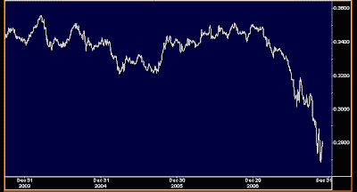
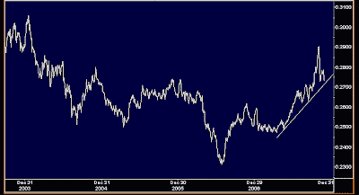

<!--yml

类别：未分类

日期：2024-05-18 01:15:55

-->

# 市场的谦逊学生：金融行业还是科技行业：你更喜欢哪一个？

> 来源：[`humblestudentofthemarkets.blogspot.com/2007/12/financials-or-tech-which-would-you.html#0001-01-01`](https://humblestudentofthemarkets.blogspot.com/2007/12/financials-or-tech-which-would-you.html#0001-01-01)

**标普 500 金融指数与标普 500****金融行业没有投降**

上图显示了标普 500 金融指数与标普 500 的相对表现。鉴于次贷问题的广泛宣传，该行业超卖并不令人意外。

使用侧边栏（标题为）展示的技术，我推断了 22 只美国大型股混合型股互惠基金的平均金融行业敞口。这 22 只基金可以被视为来自最大互惠基金集团的类似标普 500 指数基金的组合。如您从图表中看到的，互惠基金超配了该行业，并且似乎在增加其权重。

***逆向工程管理者的宏观敞口***

）我推断出这些 22 只基金可以被视为一个标普 500 型指数基金的组合。正如图表所示，互惠基金一直在超配该行业，并且似乎在增加权重。

大型股混合型互惠基金经理作为一个整体，在金融行业发现了价值，并且在他们行为中没有出现对次贷危机的恐慌迹象。

**标普 500 科技指数与标普 500****科技行业看起来具有建设性**

相比之下，这张图表显示了标普 500 科技指数相对于标普 500 的相对回报。科技行业在 2006 年夏天反弹，并且自 2007 年夏天以来一直处于相对上升趋势。该行业有所回调，但相对上升趋势保持完好。

相同的互惠基金分析显示，美国大型股混合型互惠基金平均大约在市场权重该行业。从情绪分析的角度来看，这为科技行业留出了恢复几个月前开始的领导趋势的空间。
