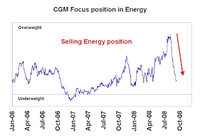
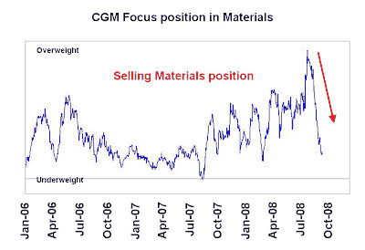
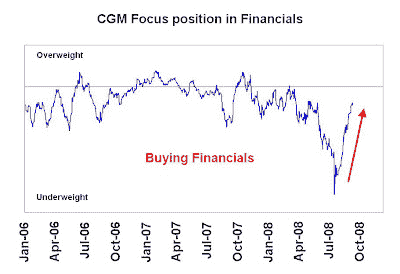
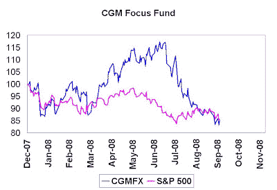

<!--yml

category: 未分类

date: 2024-05-18 01:05:09

-->

# 市场的谦卑学生：希布纳剔出了他的持仓

> 来源：[`humblestudentofthemarkets.blogspot.com/2008/09/heebner-pukes-his-positions.html#0001-01-01`](https://humblestudentofthemarkets.blogspot.com/2008/09/heebner-pukes-his-positions.html#0001-01-01)
> 
> *对于不熟悉的人，术语**剔出**指的是清空持仓，通常是止损的结果。*

我已经写过关于肯·希布纳

[before](http://humblestudentofthemarkets.blogspot.com/2008/06/bill-miller-ken-heebner-study-in.html)

– 他是一个以高换手率、高集中度组合运作并且具有良好长期业绩的基金经理。希布纳在管理 CGM 焦点基金（CGMFX）上半年有出色表现。该基金的 2008 年的定义特点是其多商品-空金融部门投资——直到现在。

使用侧栏中标有反向工程经理宏观风险暴露的技术，我更新了我对**肯·希布纳**的行业押注的估计。

惊喜！惊喜！

希布纳正在削减他在商品部门（能源、材料）的持仓。

他还在平衡他在金融部门的持仓低位：

**这是风控流程的一部分吗？**

也许他是在证明他有风控流程，特别是与

[news](http://www.bloomberg.com/apps/news?pid=20601103&sid=aQUQLBdxD_u0)

希布纳即将启动一个对冲基金。下图显示了 CGM 焦点基金和标准普尔 500 的当年累计表现。2008 年上半年表现出色后，CGM 焦点基金于 2008 年 6 月起跌幅约为 29%，与标准普尔 500 表现大致持平。

或者可能不只是止损，关于此点我会在以后的文章中详细说明…

**附言：**

附带一提，我所谓的“智能基金”样本持有超出商品部门并持有金融部门的低位（见

[这个](http://humblestudentofthemarkets.blogspot.com/2008/09/smart-funds-still-early-in-inflation.html)

和

[这个](http://humblestudentofthemarkets.blogspot.com/2008/09/watch-smart-funds-on-their-long-bond.html)

).
